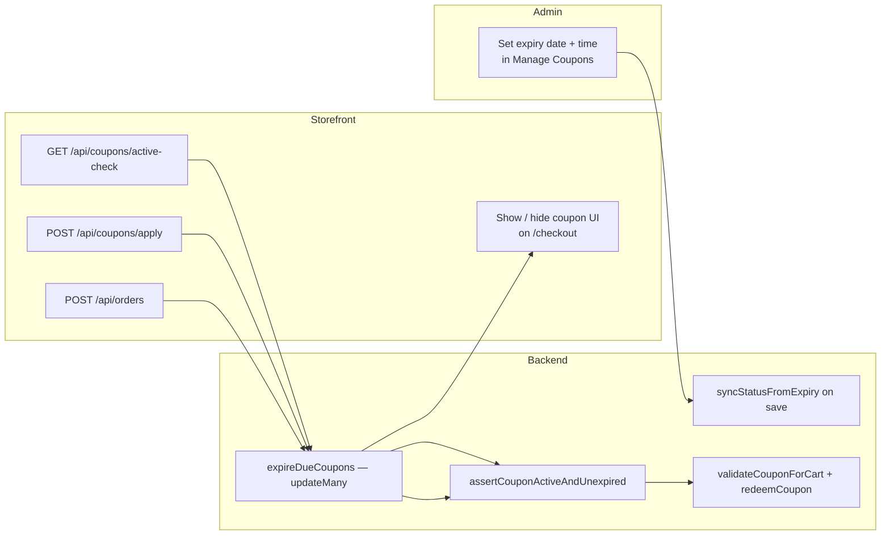
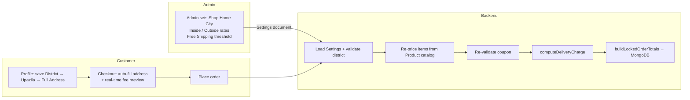

<div align="center">

# 🛒 EOnlineBazar

### A Full-Stack, Security-Hardened E-Commerce Platform

*A complete MERN-style online marketplace featuring JWT authentication, a multi-layered admin security suite (Email / Google Authenticator / SMS 2FA + Geo-Fencing), real-time device & session tracking, an enterprise catalog engine (Categories, Brands, Attributes, **time-sensitive Coupons**), **dynamic delivery charge & layered Bangladesh address management**, custom store branding, and a finance analytics dashboard.*


</div>

---

## 📑 Table of Contents

- [Overview](#-overview)
- [What's New — v3.2.0](#-whats-new--v320-time-sensitive-coupon-automation)
- [Time-Sensitive Coupon Automation](#-time-sensitive-coupon-automation-system)
- [What's New — v3.1.0](#-whats-new--v310-dynamic-delivery--address-management)
- [Dynamic Delivery & Address Management](#-dynamic-delivery-charge--address-management-system)
- [What's New — v3.0.0](#-whats-new--v300-the-fortified-security--branding-release)
- [Feature Roadmap (Past & Present)](#-feature-roadmap-past--present)
- [Tech Stack](#-tech-stack)
- [Project Architecture & File Structure](#-project-architecture--file-structure)
- [Environment Variables (.env)](#-environment-variables-env)
- [Installation & Production Readiness](#-installation--production-readiness)
- [API Documentation](#-api-documentation)
- [Security Architecture](#-security-architecture)
- [Buying Price & Profit Model](#-buying-price--profit-model)
- [Changelog](#-changelog)
- [Author](#-author)

---

## 📖 Overview

**EOnlineBazar** is a production-ready, full-stack e-commerce platform built on **Node.js / Express 5** with a **MongoDB (Atlas)** database and a lightweight **Vanilla JavaScript** frontend served directly by Express. It follows a clean **MVC architecture** (`Models → Controllers → Routes`) and ships with everything a modern online store needs: secure customer authentication, a shopping cart, a persistent **My Wishlist**, order placement & live tracking, product reviews with image uploads, a loyalty wallet, an enterprise catalog engine, a dedicated **Super Admin Panel**, and a **Finance & Analytics** dashboard.

Three things set it apart:

1. **A database-backed session security layer** — every login (customer *and* admin) generates a unique session embedded inside the JWT, so users and admins can view all their **active devices** (IP, geo-location, browser & device) and **remotely log out** any device in real time.
2. **A Fortified Admin Security Suite** — multi-option Two-Factor Authentication (**Email OTP**, **Google Authenticator / TOTP**, and **SMS OTP**), **Geo-Fencing (Region Lock)**, brute-force **auto IP-blacklisting**, rate-limiting, and a full login-history / security-audit trail.
3. **Dynamic Delivery Charge & Address Management** — admin-configurable shipping rules, Bangladesh **District → Upazila/Thana** cascading address fields, checkout auto-fill, real-time fee preview, and **server-side price re-validation** before orders are persisted.
4. **Time-Sensitive Coupon Automation** — precise hour/minute expiry scheduling, a server-side **ACTIVE / EXPIRED** status engine with bulk auto-expiry, checkout visibility synced to live availability, and hardened order-time coupon validation.

---

## 🆕 What's New — v3.2.0 (Time-Sensitive Coupon Automation)

This release upgrades the enterprise coupon engine with **precise datetime expiry**, **automated status transitions**, and **checkout-aware availability** — eliminating stale promo UI and closing client-side discount bypass vectors.

| Capability | Highlights |
|------------|------------|
| **⏱️ Precise Expiry Scheduling** | Admin panel uses paired **date + time** inputs (`<input type="date">` + `<input type="time">`) to compose an exact ISO expiry timestamp — ideal for flash sales and time-bound campaigns. |
| **🔄 Dynamic Status Engine** | Server evaluates `expiryDate` against system time and auto-flips `status` from `ACTIVE` → `EXPIRED` via Mongoose hooks, per-document saves, and bulk `updateMany` sweeps. |
| **👁️ Intelligent Checkout Visibility** | `/checkout` calls `GET /api/coupons/active-check` on load and before payment; the coupon input container **hides automatically** when no eligible coupons remain. |
| **🔒 Bulletproof Order Security** | `orderController.createOrder` re-validates coupon `status` and exact `expiryDate` on the backend — client-supplied discounts are never trusted. |

> 📌 See the dedicated [Time-Sensitive Coupon Automation](#-time-sensitive-coupon-automation-system) section below for schema fields, workflow diagrams, and API specifications.

---

## ⏱️ Time-Sensitive Coupon Automation System

A production-grade, time-aware discount pipeline that keeps coupon lifecycle state authoritative on the server and the storefront UI in sync with real availability.

### Feature Overview

#### Precise Expiry Integration
- The **Manage Coupons** admin form (`/admin` → Manage Coupons) captures expiry as **date + time** — not date-only.
- On submit, `admin.js` merges the fields into the platform timezone (`Admin.timezone`, same zone as the header clock) and persists a UTC ISO **`expiryDate`** in MongoDB.
- Admins can schedule campaigns down to the minute (e.g. a flash sale ending at 6:30 PM Dhaka time).

#### Dynamic Status Engine (`ACTIVE` vs `EXPIRED`)
- Every coupon document carries a string `status` enum: **`ACTIVE`** or **`EXPIRED`**.
- **On save:** a Mongoose `pre('save')` hook calls `syncStatusFromExpiry()` to derive status from `expiryDate` vs **`getApplicationNow()`** (server clock).
- **On read / availability checks:** `Coupon.expireDueCoupons(now)` runs a bulk `updateMany` using the same server `now` to mark all overdue `ACTIVE` coupons as `EXPIRED`.
- **On apply / order:** individual documents are re-checked; if past expiry but still marked `ACTIVE`, they are corrected before validation proceeds.

#### Intelligent Checkout Visibility
- `client/js/checkout.js` queries **`GET /api/coupons/active-check`** when the checkout page loads and again immediately before redirecting to payment.
- If `hasActiveCoupon` is `false`, the `#checkout-coupon-container` is hidden, any locally stored applied coupon is cleared, and apply/remove handlers are disabled.
- Prevents customers from seeing a coupon field when no valid promotions exist — reducing confusion and failed apply attempts.

#### Bulletproof Order Security
- `POST /api/orders` never trusts client discount amounts. The order controller:
  1. Runs the global expiry sweep (`runCouponAutoExpiry`).
  2. Loads the coupon by code and corrects stale `ACTIVE` records past `expiryDate`.
  3. Calls `assertCouponActiveAndUnexpired()` — enforcing both **string status** and **timestamp** gates.
  4. Re-runs full `validateCouponForCart()` (usage limits, min order, per-user caps).
  5. Atomically redeems via `redeemCoupon()` with a query filter that requires `status: 'ACTIVE'` and `expiryDate: { $gt: now }`.

Any expired or inactive coupon submitted from a tampered client payload is rejected with a clear error; totals are recalculated without the discount.

#### Centralized Server-Time Synchronization

Coupon expiration is **never** evaluated against a customer's local device clock. All automated invalidations (`ACTIVE` → `EXPIRED`), availability probes, apply validations, and order placements share one authoritative reference: the **application server time** exposed through `utils/applicationTime.js`.

| Concern | Implementation |
|---------|----------------|
| **Authoritative clock** | `getApplicationNow()` / `getApplicationTimeContext()` — Node.js system time (UTC epoch), the same instant rendered in the admin header live clock. |
| **Platform timezone** | Loaded from admin **Platform Settings** (`Admin.timezone`, default `Asia/Dhaka`) via `getStoreSettings()`. Admins schedule expiry in this zone; the header clock and coupon form use matching formatting. |
| **Expiry comparison** | `isExpiryReached(expiryDate, now)` — compares stored UTC `expiryDate` against the unified server `now`; used by model hooks, bulk sweeps, apply, and order controllers. |
| **Single tick per request** | Order placement captures one `now` instance and passes it through `runCouponAutoExpiry`, `assertCouponActiveAndUnexpired`, `validateCouponForCart`, and `redeemCoupon` — preventing race drift within a single checkout. |
| **Checkout isolation** | Storefront `/checkout` never reads `Date.now()` for coupon eligibility; it delegates to **`GET /api/coupons/active-check`**, which returns `{ hasActiveCoupon, serverTime, timezone }`. |

```javascript
// utils/applicationTime.js — single source of truth for coupon time gates
async function getApplicationTimeContext() {
    const now = new Date();                              // server clock (UTC instant)
    const timezone = (await getStoreSettings()).timezone; // e.g. Asia/Dhaka — admin header zone
    return { now, nowMs: now.getTime(), timezone, iso: now.toISOString() };
}
```

> **Why this matters:** A customer in a different timezone (e.g. local `01:51 PM` while the admin dashboard shows `04:51 PM` in `Asia/Dhaka`) cannot extend or revive an expired coupon by manipulating browser time. Expiry decisions are always made on the server using the same clock that powers the admin panel header.

#### Global "Sync Data" Integration

The admin header **Sync Data** button (`POST /api/admin/sync-data`) runs the coupon auto-expiry engine **before** any other dashboard refresh completes:

```javascript
// controllers/adminController.js — first step of every global sync
await Coupon.updateMany(
    { status: 'ACTIVE', expiryDate: { $lte: now } },
    { $set: { status: 'EXPIRED', isActive: false } }
);
const coupons = await Coupon.find().sort({ createdAt: -1 }).lean();
```

The response includes the **fresh coupon list** in `data.coupons`. The frontend (`runAdminDataSync()` in `admin.js`) immediately updates `globalCoupons` and re-renders the Manage Coupons table — no full browser reload required. Sync then continues in parallel for dashboard metrics, live orders, products, and catalog modules.

#### Admin Time Input Validation (12-Hour + AM/PM)

The coupon expiry row uses a **12-hour clock** with three side-by-side controls: date picker, manual `hh:mm` text input, and an **AM/PM** `<select>` dropdown. Live JavaScript validation runs before ISO conversion:

| Rule | Enforcement |
|------|-------------|
| **Format** | Manual entry must resolve to `hh:mm` (e.g. `05:50`) plus `AM` or `PM` |
| **Hours** | `01`–`12` — invalid hour values are blocked instantly |
| **Minutes** | `00`–`59` — values like `5:60` or `5:75` are rejected with inline feedback |
| **On save** | `convert12hTimeTo24h()` merges time + AM/PM (e.g. `05:50 PM` → `17:50`) before platform-local UTC conversion |

This ensures admin-entered expiry times align with the platform timezone clock and produce valid UTC `expiryDate` values in MongoDB.

#### Premium Coupon Form UI

The **Manage Coupons** onboarding panel uses a **sequential grid structure** optimized for clarity and responsiveness:

| UI goal | Implementation |
|---------|----------------|
| **Sequential grid layout** | **Row 1:** Code · Discount Type · Value · Min Order · **Row 2:** Max Discount · Global Usage Limit · Per-User Limit · **Row 3 (full width):** Expiry Date & Time |
| **12-hour expiry row** | Dedicated bottom row with calendar date picker, clock time input, and styled **AM/PM** dropdown — all sharing `42px` height and matching borders |
| **Unified field sizing** | All inputs share consistent padding, border-radius, and focus rings across the admin form |
| **Icon-enhanced inputs** | Calendar (`fa-calendar`) and clock (`fa-clock`) icons inside date/time wrappers for quick visual scanning |
| **Responsive collapse** | Graceful 2-column (tablet) and single-column (mobile) reflow with stacked expiry controls on small screens |
| **Inline time feedback** | `#couponExpiryTimeHint` shows live validation status; invalid minutes are blocked with a clear message |

---

### Database Schema — `Coupon` Model (`models/coupon.js`)

| Field | Type | Description |
|-------|------|-------------|
| `code` | `String` (unique, uppercase) | Promo code entered at checkout |
| `discountType` | `Enum: ['percentage', 'flat']` | Discount calculation mode |
| `discountValue` | `Number` | Percentage or flat amount |
| `minOrderAmount` | `Number` | Minimum cart subtotal required |
| `maxDiscountAmount` | `Number \| null` | Optional cap for percentage discounts |
| **`expiryDate`** | **`Date` (ISO Date-Time)** | **Exact expiration timestamp — hour & minute precision** |
| **`status`** | **`Enum: ['ACTIVE', 'EXPIRED']`** | **Authoritative lifecycle flag; auto-derived from `expiryDate`** |
| `usageLimit` | `Number` | Global redemption cap |
| `usedCount` | `Number` | Atomic usage counter (claimed on order placement) |
| `perUserLimit` | `Number` | Max redemptions per customer |
| `usedBy` | `[ObjectId]` | Per-user redemption audit trail |
| `isActive` | `Boolean` (deprecated) | Synced from `status` for legacy compatibility |

```javascript
{
  expiryDate: {
    type: Date,
    required: true
  },
  status: {
    type: String,
    enum: ['ACTIVE', 'EXPIRED'],
    default: 'ACTIVE'
  }
}
```

**Status derivation helpers** (via `utils/applicationTime.js`):

```javascript
// Instance method — called on every save (server clock)
couponSchema.methods.syncStatusFromExpiry = function (now = getApplicationNow()) {
    const expired = isExpiryReached(this.expiryDate, now);
    this.status = expired ? 'EXPIRED' : 'ACTIVE';
    this.isActive = this.status === 'ACTIVE';
};

// Static bulk sweep — idempotent, uses unified server time
couponSchema.statics.expireDueCoupons = async function (now = getApplicationNow()) {
    return this.updateMany(
        { expiryDate: { $lte: now }, status: 'ACTIVE' },
        { $set: { status: 'EXPIRED', isActive: false } }
    );
};
```

---

### Architectural Workflow



**End-to-end pipeline:**

1. **Admin schedules expiry** — Date + time fields compose `expiryDate`; status is set automatically on save.
2. **Storefront probes availability** — Checkout calls `active-check`; expired coupons are bulk-updated before the response.
3. **Customer applies coupon** — Apply endpoint sweeps, validates status + timestamp, returns server-computed discount breakdown.
4. **Order placement locks discount** — Order controller re-validates everything and atomically claims a usage slot only if the coupon is still `ACTIVE` and unexpired.

---

### Related API Endpoints

| Method | Endpoint | Description | Auth |
|--------|----------|-------------|------|
| **`GET`** | **`/api/coupons/active-check`** | **Runs bulk expiry sweep against server time; returns `{ hasActiveCoupon, serverTime, timezone }`** | **Public** |
| `POST` | `/api/coupons/apply` | Validate coupon & return price breakdown (runs expiry sweep first) | Public/User² |
| `GET` | `/api/coupons` | List coupons (auto-expires overdue records before response) | Admin |
| `POST` | `/api/coupons` | Create coupon with precise `expiryDate` | Admin |
| `PUT` | `/api/coupons/:id` | Update coupon (status re-derived on save) | Admin |
| `PATCH` | `/api/coupons/:id/toggle` | Toggle `ACTIVE` ↔ `EXPIRED` (blocked if past `expiryDate`) | Admin |
| `DELETE` | `/api/coupons/:id` | Delete coupon | Admin |
| **`POST`** | **`/api/admin/sync-data`** | **Global Sync Data — flush expired coupons, return fresh `data.coupons` list** | **Admin** |
| `POST` | `/api/orders` | Place order — **re-validates coupon status + expiry server-side** | User |

**`GET /api/coupons/active-check` — handler validation flow:**

```javascript
const checkActiveCoupons = async (req, res) => {
    const { now, timezone, iso } = await getApplicationTimeContext();

    // 1. Bulk-expire all overdue ACTIVE coupons (server clock)
    await Coupon.expireDueCoupons(now);

    // 2. Verify at least one truly active, unexpired coupon exists
    const activeCoupon = await Coupon.findOne({
        status: 'ACTIVE',
        expiryDate: { $gt: now }
    }).select('_id');

    res.status(200).json({
        hasActiveCoupon: Boolean(activeCoupon),
        serverTime: iso,
        timezone
    });
};
```

**Sample response:**

```json
{
  "hasActiveCoupon": true,
  "serverTime": "2026-07-20T10:51:00.000Z",
  "timezone": "Asia/Dhaka"
}
```

---

## 🆕 What's New — v3.1.0 (Dynamic Delivery & Address Management)

This release introduces a fully automated, tamper-resistant shipping and address pipeline — no manual shipping-option pickers for customers.

| Capability | Highlights |
|------------|------------|
| **🚚 Automated Shipping Fees** | Delivery charge is computed from the customer's **district** vs. the admin's **Shop Home City** — inside-city vs. outside-city rates apply automatically. |
| **📍 Layered Profile Address** | Customers save **District → Upazila/Thana → Full Address** in their profile; checkout forms **auto-populate** from saved data. |
| **⚙️ Admin Delivery Control Panel** | Configure **Shop Home City**, **Inside/Outside City** rates, and a **Free Shipping** order threshold from the Super Admin panel. |
| **🔒 Server-Side Price Locking** | Subtotals, discounts, delivery fees, and grand totals are **re-calculated on the backend** from catalog prices + `Settings` before MongoDB write — client-supplied totals are never trusted. |

> 📌 See the dedicated [Dynamic Delivery & Address Management](#-dynamic-delivery-charge--address-management-system) section below for schema details, workflow diagrams, and API endpoints.

---

## 🚚 Dynamic Delivery Charge & Address Management System

A comprehensive, highly automated shipping and address pipeline built for Bangladesh e-commerce. Customers never pick a shipping tier manually — the platform derives the correct fee from structured location data and admin-defined rules, then **locks verified totals on the server** at order placement.

### Feature Overview

#### Automated Shipping Fee Calculation
- Shipping fees are **calculated dynamically** — there is no manual "Inside City / Outside City" selector for customers.
- The system compares the customer's **shipping district** against the admin-configured **Shop Home City**.
- **Inside-city rate** applies when districts match; **outside-city rate** applies otherwise.
- If the merchandise **subtotal meets or exceeds** the admin's **Free Shipping Minimum Amount**, delivery charge is **৳0** (set threshold to `0` to always offer free shipping).

#### Profile Address Auto-Fill
- Customers save a **layered address** on their profile:
  - **District** (64 Bangladesh districts)
  - **Upazila / Thana** (cascading dropdown, populated from `bd-upazilas.js`)
  - **Full Address** (street, house, landmark, etc.)
- On checkout, saved profile fields **automatically pre-populate** the shipping form — reducing friction and input errors.
- District selection drives **real-time delivery charge preview** in the order summary.

#### Dynamic Admin Control Panel
From **Admin Panel → Settings**, admins configure delivery rules without code changes:

| Setting | Purpose | Default |
|---------|---------|---------|
| `shopHomeCity` | The shop's home district (reference for inside/outside matching) | `Dhaka` |
| `deliveryInsideCity` | Shipping fee when customer district matches shop home city | `৳60` |
| `deliveryOutsideCity` | Shipping fee for all other districts | `৳120` |
| `freeShippingMinAmount` | Merchandise subtotal threshold for free delivery | `৳1000` |

Changes are persisted in the singleton `Settings` document and exposed to the storefront via a public API.

#### Server-Side Security Validation
Client-side checkout previews are for UX only. On `POST /api/orders`, the backend:

1. **Re-fetches catalog prices** from MongoDB (never trusts client line-item prices).
2. **Re-validates coupons** — checks `status`, exact `expiryDate`, usage limits, and per-user caps — then applies discounts server-side.
3. **Re-computes delivery charge** via `utils/deliveryChargeService.js` using live `Settings`.
4. **Builds locked totals** (`subTotal`, `deliveryCharge`, `grandTotal`) and persists them on the order document.

Any tampered client payload (inflated discounts, zeroed shipping fees, etc.) is overwritten with verified server values before the order is written.

---

### Database Schema Extensions

#### `Settings` Model (`models/Settings.js`)

Singleton document (`key: 'global'`) storing platform-wide delivery rules:

```javascript
{
  key: { type: String, default: 'global', unique: true },  // Singleton guard

  shopHomeCity: {
    type: String,
    default: 'Dhaka',
    trim: true
  },
  deliveryInsideCity: {
    type: Number,
    default: 60,
    min: 0
  },
  deliveryOutsideCity: {
    type: Number,
    default: 120,
    min: 0
  },
  freeShippingMinAmount: {
    type: Number,
    default: 1000,
    min: 0
  }
}
```

#### `User` Model Updates (`models/user.js`)

Layered profile address fields for auto-fill at checkout:

```javascript
{
  district:   { type: String, trim: true, default: '' },  // Bangladesh district
  upazila:    { type: String, trim: true, default: '' },  // Upazila name
  thana:      { type: String, trim: true, default: '' },  // Thana (synced with upazila)
  fullAddress:{ type: String, trim: true, default: '' }   // Street / house / landmark
}
```

> **Note:** `thana` mirrors `upazila` when only one is supplied — preserving compatibility with both naming conventions used across Bangladesh.

#### `Order` Model Updates (`models/order.js`)

Locked financial and shipping fields written at checkout (server-authoritative):

```javascript
{
  subTotal:             { type: Number, required: true, default: 0, min: 0 },
  deliveryCharge:       { type: Number, required: true, default: 0, min: 0 },
  grandTotal:           { type: Number, required: true, default: 0, min: 0 },
  shippingDistrict:     { type: String, default: '', trim: true },
  shippingLocationType: { type: String, enum: ['Inside City', 'Outside City'], default: 'Inside City' }
}
```

Legacy fields (`subtotal`, `shippingFee`, `deliveryLocationType`, `totalAmount`) remain for backwards compatibility with older orders.

---

### Architectural Workflow



**End-to-end pipeline:**

1. **Admin sets rules** — Shop Home City, inside/outside rates, and free-shipping threshold saved via `PUT /api/admin/settings`.
2. **User saves profile address** — Cascading **District → Upazila/Thana** dropdowns on `/profile`; data stored on the `User` document.
3. **Checkout auto-fills & evaluates pricing** — `checkout.js` loads public delivery settings, pre-fills from profile, and recalculates shipping on every district/subtotal change.
4. **Backend interceptor locks records** — `orderController.createOrder` ignores client totals, recomputes everything, and writes immutable `subTotal`, `deliveryCharge`, `grandTotal`, and `shippingDistrict` to MongoDB.

#### Shared Delivery Logic (`utils/deliveryChargeService.js`)

Both checkout preview and order placement use the same helpers:

```javascript
resolveDeliveryZone(settings, customerDistrict)   // 'inside' | 'outside'
computeDeliveryCharge(settings, { customerDistrict, subtotal })
buildLockedOrderTotals({ itemSubtotal, discountAmount, deliveryCharge })
```

District normalization and validation live in `utils/bangladeshDistricts.js`; upazila/thana data is served to the frontend via `client/js/bd-districts.js` and `client/js/bd-upazilas.js`.

---

### Related API Endpoints

| Method | Endpoint | Description | Auth |
|--------|----------|-------------|------|
| `GET` | `/api/store/delivery-settings` | Public delivery rules for checkout preview | Public |
| `GET` | `/api/store/districts` | List of valid Bangladesh districts | Public |
| `GET` | `/api/admin/settings` | Admin: read delivery settings | Admin |
| `PUT` | `/api/admin/settings` | Admin: update delivery settings | Admin |
| `POST` | `/api/orders` | Place order (server re-validates all totals) | User |

> **Profile update:** `PUT /api/customer/update-profile` accepts `district`, `upazila`, `thana`, and `fullAddress` for the layered address system.

---

## 🆕 What's New — v3.0.0 (The Fortified Security & Branding Release)

This release transforms the admin surface into an **enterprise IAM-grade** control plane and introduces full store personalization.

### 🔐 Multi-Layered Two-Factor Authentication (2FA)
| Method | How it works | Powered by |
|--------|--------------|------------|
| **📧 Email OTP** | Hashed 6-digit code emailed on login (5-min expiry) | `nodemailer` (SMTP) |
| **📱 Google Authenticator (TOTP)** | Scan a QR code once, then use time-based codes with ±30s drift tolerance | `speakeasy` + `qrcode` |
| **✉️ SMS OTP** | 6-digit code delivered through a pluggable SMS gateway (console fallback in dev) | `utils/smsSender.js` |

Admins pick and switch their preferred method from the settings panel; self-service **setup + verify** flows exist for both TOTP and SMS.

### 🌍 Admin Login Region Lock (Geo-Fencing)
- Resolves the login IP → ISO country code **offline** via `geoip-lite`.
- Rejects logins (**HTTP 403**) *before any credential check* if the origin country is not in the `ALLOWED_COUNTRIES` allow-list (e.g. `BD`, `SA`).
- Developer-friendly `GEO_ALLOW_PRIVATE` bypass for localhost / LAN.

### 🎨 Custom Store Branding & Platform Settings
- **Live server-side upload** of **Store Logo** and **Favicon** to Cloudinary with **instant dynamic previews** (old assets auto-purged).
- **Custom currency formatting** — configure a Currency **Code** (e.g. `BDT`) and **Symbol** (e.g. `৳`) applied across all admin price displays.
- **Timezone Synchronization** — the admin dashboard header's **live digital clock** re-renders in the selected timezone in real time.

### 🔒 Session & Audit Hardening
- Full admin **session/device tracking** with "This Device" highlighting and remote logout.
- Secure **cookie handling** on logout (`adminToken` / `token` cleared server-side).
- Complete **login history**, **failed-attempt**, and **security event** audit feeds.

> 📌 See the full [Changelog](#-changelog) for a versioned breakdown.

---

## 🗺️ Feature Roadmap (Past & Present)

### 🛍️ Core E-Commerce Modules

#### Catalog Management Engine
- **📂 Categories** — Full CRUD; renaming a category **syncs all linked products** automatically.
- **🏷️ Brands** — Full CRUD with a clean grid layout, automatic **slug generation** (Unicode/Bengali-aware), and strict product-to-brand **database references**.
- **🎛️ Attributes (Variants)** — Professional variation system (**Size**, **Color**, **Material**…) with per-variant **SKU, price & separate stock tracking**.
- **🎟️ Coupons & Discounts** — Enterprise promo engine (Shopify/Daraz-style):
  - Percentage **or** flat discounts, optional **max-discount cap**.
  - **Min order amount**, **global usage limit**, **per-user limit**, and **precise expiry date-time** (hour & minute scheduling).
  - **Automated `ACTIVE` / `EXPIRED` status** — server-side bulk expiry sweeps and Mongoose save hooks keep lifecycle state authoritative.
  - **Checkout-aware visibility** — coupon UI on `/checkout` auto-hides when `GET /api/coupons/active-check` reports no eligible promotions.
  - Race-safe **atomic redemption** (`usedCount`) — usage is claimed on successful order placement, released on failure.
  - Storefront **apply / validate** endpoint with optional customer auth for per-user enforcement; order placement re-validates status + expiry on the backend.

#### Product & Order Systems
- **🛍️ Product Catalog** — Up to 10 images, categories, brand, variations, highlights, stock levels, **selling price + buying price** (live profit preview), and detailed descriptions.
- **📦 Order Management & Tracking** — Place orders, view history, public order tracking, and per-item **buying-price snapshots** at checkout for accurate profit reporting.
- **🚚 Dynamic Delivery Charges** — Automated inside/outside-city fee calculation from admin `Settings`, free-shipping threshold, **locked server-side totals** on every order, and district-aware invoices.
- **📍 Layered Address Management** — Profile-level **District → Upazila/Thana → Full Address** with checkout auto-fill and cascading Bangladesh location dropdowns.
- **🛒 Shopping Cart** — Server-synced cart with quantity updates, selection toggles, guest-cart merge, and post-order cleanup.
- **⭐ Reviews & Ratings** — Star ratings and reviews with optional photo upload; averages update automatically.
- **📍 Address Book** — Manage multiple delivery addresses with default-address sync.
- **💰 Wallet & Loyalty Points** — Convert points to wallet balance (100 points = ৳10) with transaction history.

#### ❤️ My Wishlist

A fully implemented customer favourites system with MongoDB-backed persistence and seamless AJAX interactions across the storefront and profile dashboard.

- **Persistent Storage** — Wishlist items are saved persistently in MongoDB as an embedded array on the user's account (`User.wishlist`), linked to their profile. Favourites remain intact after placing orders, logging out, or starting a new session — items are only removed when the customer explicitly deletes them.
- **AJAX-powered Toggle** — Storefront product grids (home, search, etc.) use a sleek client-side **Fetch API** integration: clicking the heart icon calls `POST /api/wishlist/toggle` to add or remove items dynamically, with instant visual feedback and custom Toast notifications — no hard page refreshes required.
- **Unified Profile Integration** — The **My Wishlist** panel is fully integrated into the Customer Profile dashboard (`/profile` → **My Cart** tab). Each item ships with a functional **blue Cart button** (adds straight to the active cart summary via `/api/cart/add`) and a **red Delete button** that removes the item instantly from the DOM after a successful toggle, backed by custom Toast success/error feedback.
- **Optimized Mini-Card UI** — Wishlist items render in a compact, scaled-down **premium mini-card grid** (`wishlist-grid` / `wishlist-card`) with responsive breakpoints, designed for high visual consistency with the rest of the customer dashboard styling.

### 🛡️ Advanced Security Suite (Recent Updates)
- **Multi-layered Two-Factor Authentication** — Email OTP, Google Authenticator / TOTP, and SMS OTP (console gateway with Twilio/custom hooks ready).
- **Admin Login Region Lock (Geo-Fencing)** — permitted-country allow-list (`BD`, `SA`, …) enforced offline before credentials are checked.
- **Brute-Force Protection & Auto IP-Blacklisting** — `express-rate-limit` throttle + an Intrusion-Detection engine that bans an IP for 24h after 5 failed attempts in 15 minutes.
- **Manual IP Blacklist Manager** — list / block / unblock IPs (auto vs manual source, TTL-expiring).
- **Active Devices & Sessions** — IP, geo-location, OS/Browser/Device tracking with remote termination and **secure session/cookie logs**.
- **Security & Audit Dashboard** — login history, failed/blocked attempts, and a full security event trail.

### ⚙️ Admin & Platform Settings
- **Custom Store Branding** — live server-side Logo & Favicon upload with instant dynamic previews (Cloudinary).
- **Custom Currency Formatting** — Currency Code (`BDT`) & Symbol (`৳`) applied to every admin price column.
- **Timezone Synchronization** — dynamically updates the admin dashboard header's **live digital clock**.
- **Delivery Charge Control** — configure Shop Home City, inside/outside rates, and free-shipping threshold from the admin settings panel.
- **Account & Profile** — username/password change (current-password gated), display name, store name, and admin avatar upload.

### 🖥️ Super Admin Panel (`/admin`)
- **📊 Dashboard Overview** — Live metrics (total/verified/pending/blocked users) and a **6-month registration growth chart** (Chart.js).
- **👥 Customer Management** — View, edit, block, suspend, reactivate; order-count badges; per-customer order history modal.
- **📦 Live Orders** — Real-time table with status updates, invoice view/print, search, filter, and pagination.
- **🛍️ Product CRUD** — Add/edit with images, buying/selling price, live profit preview, bulk delete, CSV export, and print-ready tables.
- **🔔 Professional UX** — SweetAlert2 toasts + modal confirmations, asynchronous DOM re-rendering (instant UI sync, no manual refresh).

### 💹 Finance & Analytics (`/finance-analytics`)
- Secure password gate (`ADMIN_DASHBOARD_PASSWORD`) with a dedicated finance token (also accepts an admin JWT).
- KPIs: Total Revenue, Net Profit, Daily/Monthly Profit, Avg. Order Value, Profit Margin.
- Charts: 12-month Revenue vs Profit (line) and Top Selling Categories (pie).

### 🌐 Platform
- **Clean URLs** — Automatic `.html` stripping and 301 redirects for SEO-friendly routes.
- **Server-side page guards** for the finance dashboard and 2FA handoff page.

---

## 🧰 Tech Stack

| Layer | Technologies |
|-------|--------------|
| **Frontend** | HTML5, CSS3, Vanilla JavaScript, Chart.js, Toastr, SweetAlert2 |
| **Backend** | Node.js, Express.js 5 |
| **Database** | MongoDB (Atlas) via Mongoose ODM |
| **Authentication** | JSON Web Tokens (`jsonwebtoken`), `bcryptjs` |
| **2FA** | `speakeasy` (TOTP), `qrcode` (QR generation), `nodemailer` (Email OTP), SMS gateway abstraction |
| **Security & Intelligence** | `express-rate-limit`, `geoip-lite` (geo-fencing + geo-location), `request-ip`, `ua-parser-js` |
| **File / Media** | `multer`, `sharp`, `cloudinary`, `streamifier` |
| **Config** | `dotenv` |

### Core Dependencies

```json
"bcryptjs"           "cloudinary"        "dotenv"        "express"
"express-rate-limit" "geoip-lite"        "jsonwebtoken"  "mongoose"
"multer"             "nodemailer"        "qrcode"        "request-ip"
"sharp"              "speakeasy"         "streamifier"   "ua-parser-js"
```

---

## 📁 Project Architecture & File Structure

A clean **MVC** backend paired with a static, Express-served frontend:

```
eonlinebazar-fullstack/
│
├── config/
│   └── db.js                          # MongoDB (Atlas) connection
│
├── models/                            # Mongoose schemas (data layer)
│   ├── user.js                        # Customer + layered address (district/upazila/thana), wishlist[], wallet
│   ├── wishlist.js                    # Wishlist item subdocument schema (productId, name, price, image…)
│   ├── userSession.js                 # Active customer device / login sessions
│   ├── admin.js                       # Admin account, 2FA config & platform settings (currency, timezone, branding)
│   ├── Settings.js                    # Singleton delivery charge & free-shipping settings
│   ├── adminSession.js                # Active admin device / login sessions
│   ├── loginAttempt.js                # Login history & failed/blocked attempt audit
│   ├── blacklistedIp.js               # Auto + manual IP bans (TTL-expiring)
│   ├── securityLog.js                 # Admin/customer security & auth event log
│   ├── product.js                     # Products (images, buyingPrice, variations, reviews)
│   ├── category.js                    # Product categories
│   ├── brand.js                       # Product brands (slug + product references)
│   ├── attribute.js                   # Product attributes / variants (Size, Color…)
│   ├── coupon.js                      # Coupons & discounts (status ACTIVE/EXPIRED, precise expiryDate, usage limits)
│   ├── order.js                       # Orders with locked subTotal/deliveryCharge/grandTotal + buyingPrice snapshots
│   ├── cart.js                        # Shopping cart
│   └── review.js                      # Product reviews & ratings
│
├── controllers/                       # Business logic (controller layer)
│   ├── authController.js              # Customer session list / revoke / logout-others
│   ├── userController.js              # Customer auth, profile, wishlist CRUD, addresses, wallet
│   ├── wishlistController.js          # Wishlist toggle (add/remove) with product snapshot enrichment
│   ├── adminController.js             # Admin customers, platform branding, logs, profile
│   ├── settingsController.js          # Delivery charge & free-shipping settings (admin API)
│   ├── storeController.js             # Public storefront branding + delivery settings + districts
│   ├── adminSecurityController.js     # 2-step login, admin sessions, IP blacklist, login history
│   ├── twoFactorController.js         # Self-service 2FA manager (Email / TOTP / SMS)
│   ├── productController.js           # Product CRUD + reviews
│   ├── brandController.js             # Brand CRUD + slug generation
│   ├── attributeController.js         # Attribute / variant CRUD
│   ├── couponController.js            # Coupon CRUD + active-check + apply/validate/redeem + auto-expiry sweeps
│   ├── orderController.js             # Orders, tracking, server-side price locking & buyingPrice snapshots
│   ├── cartController.js              # Cart operations
│   ├── reviewController.js            # Review system
│   └── financeController.js           # Revenue, profit & chart analytics
│
├── routes/                            # Express route definitions (routing layer)
│   ├── authRoutes.js                  # /api/auth
│   ├── userRoutes.js                  # /api/customer (+ wishlist GET/POST/DELETE)
│   ├── wishlistRoutes.js              # /api/wishlist (toggle endpoint)
│   ├── adminRoutes.js                 # /api/admin (+ 2FA, sessions, blacklist, delivery settings)
│   ├── storeRoutes.js                 # /api/store (public branding, delivery settings, districts)
│   ├── productRoutes.js               # /api/products
│   ├── categoryRoutes.js              # /api/categories (handler logic inline)
│   ├── brandRoutes.js                 # /api/brands
│   ├── attributeRoutes.js            # /api/attributes
│   ├── couponRoutes.js                # /api/coupons
│   ├── orderRoutes.js                 # /api/orders
│   ├── cartRoutes.js                  # /api/cart
│   ├── reviewRoutes.js                # /api/reviews
│   └── financeRoutes.js              # /api/finance
│
├── middlewares/                       # Cross-cutting request pipeline
│   ├── authMiddleware.js              # verifyUser (session-aware) & verifyAdmin (role JWT)
│   ├── adminSecurity.js               # checkBlacklist gate, rate limiter, intrusion detection
│   ├── geoFencing.js                  # Admin login Region Lock (geoip-lite)
│   └── uploadMiddleware.js            # Multer + Cloudinary stream upload (5 MB images)
│
├── utils/                             # Shared helpers
│   ├── deviceParser.js                # Client IP + geo-location + User-Agent fingerprinting
│   ├── mailer.js                      # SMTP transport + branded 2FA OTP email template
│   ├── smsSender.js                   # SMS 2FA delivery abstraction (console/Twilio/custom)
│   ├── deliveryChargeService.js       # Shared delivery zone + fee + locked-total computation
│   ├── applicationTime.js             # Centralized server clock + platform timezone for coupon expiry
│   ├── bangladeshDistricts.js         # District list, normalization & inside/outside matching
│   └── securityLogger.js             # Fire-and-forget security event writer
│
├── client/                            # Static frontend (served by Express)
│   ├── index.html                     # Storefront home
│   ├── login.html / register.html     # Customer auth
│   ├── forgot-password.html           # OTP password reset
│   ├── product-details.html           # Product detail + reviews
│   ├── search.html                    # Search results (?q=)
│   ├── cart.html / checkout.html      # Cart & checkout flow
│   ├── payment.html                   # Payment page
│   ├── profile.html                   # Customer dashboard (cart, wishlist, wallet, addresses, sessions)
│   ├── order-track.html / order-details.html
│   ├── about.html / contact.html / footer.html
│   ├── admin-login.html               # Admin authentication
│   ├── verify-otp.html                # 2-Step Verification (Email / TOTP / SMS)
│   ├── admin.html                     # Super Admin panel (SPA)
│   ├── finance-login.html             # Finance password gate
│   ├── finance-analytics.html         # Finance & analytics dashboard
│   ├── css/                           # Page-scoped stylesheets (admin.css, verify-otp.css…)
│   ├── js/                            # Page scripts (admin.js, checkout.js, profile.js, bd-districts.js…)
│   └── images/                        # Static assets (favicon.png…)
│
├── server.js                          # App entry: middleware, routes, clean URLs, page guards
├── seed.js                            # Database seeding
├── products.json                      # Sample product data
├── package.json
└── README.md
```

---

## 🔑 Environment Variables (.env)

Create a `.env` file in the project root. **Never commit this file** — add it to `.gitignore`.

```env
# ===============================================================
# 🌐 SERVER
# ===============================================================
PORT=3000

# ===============================================================
# 🗄️ DATABASE (MongoDB Atlas)
# ===============================================================
MONGO_URI=mongodb+srv://<user>:<pass>@<cluster>.mongodb.net/eonlinebazar?retryWrites=true&w=majority

# ===============================================================
# 🔐 AUTHENTICATION & ADMIN BOOTSTRAP
# ===============================================================
JWT_SECRET=your_strong_random_secret_key
# First login with username "admin" + this password auto-creates the admin account
ADMIN_PASSWORD=your_admin_password
# Password gate for the Finance & Analytics dashboard
ADMIN_DASHBOARD_PASSWORD=your_finance_dashboard_password
# Optional finance tuning:
# FINANCE_TOKEN_TTL=8h
# FINANCE_DEFAULT_COST_RATIO=0.70

# ===============================================================
# 🌍 GEO-FENCING (Admin Login Region Lock)
# Comma-separated ISO 3166-1 alpha-2 codes allowed to log in.
# BD = Bangladesh, SA = Saudi Arabia. Leave EMPTY to disable geo-fencing.
# ===============================================================
ALLOWED_COUNTRIES=BD,SA
# Allow logins from local/private IPs (dev machines) even when geo-fenced.
GEO_ALLOW_PRIVATE=true

# ===============================================================
# 📱 SMS 2FA GATEWAY
# SMS_PROVIDER = console | twilio | custom
#   console → OTP printed to the server terminal (default, dev-safe)
#   twilio  → uncomment creds below and enable in utils/smsSender.js
#   custom  → wire your local HTTP gateway in utils/smsSender.js
# ===============================================================
SMS_PROVIDER=console
SMS_SENDER_ID=EOBAZAR
# TWILIO_ACCOUNT_SID=
# TWILIO_AUTH_TOKEN=
# TWILIO_FROM_NUMBER=
# SMS_API_URL=
# SMS_API_KEY=

# ===============================================================
# 🔑 GOOGLE AUTHENTICATOR (TOTP)
# Issuer label shown inside the authenticator app
# ===============================================================
TOTP_ISSUER=EonlineBazar Admin

# ===============================================================
# 📧 EMAIL / SMTP (Email OTP + password reset)
# Use a Gmail App Password (not your normal password).
# SMTP_* takes priority; EMAIL_* is a backward-compatible fallback.
# Port 465 → implicit TLS · Port 587 → STARTTLS
# ===============================================================
SMTP_HOST=smtp.gmail.com
SMTP_PORT=465
SMTP_USER=your_email@gmail.com
SMTP_PASS=your_gmail_app_password
EMAIL_USER=your_email@gmail.com
EMAIL_PASS=your_gmail_app_password

# ===============================================================
# ☁️ CLOUDINARY (image / branding uploads)
# ===============================================================
CLOUDINARY_CLOUD_NAME=your_cloud_name
CLOUDINARY_API_KEY=your_api_key
CLOUDINARY_API_SECRET=your_api_secret
```

### Variable Reference

| Variable | Required | Purpose |
|----------|:--------:|---------|
| `PORT` | ⛔ | Server port (defaults to `3000`) |
| `MONGO_URI` | ✅ | MongoDB Atlas connection string |
| `JWT_SECRET` | ✅ | Secret used to sign/verify all JWTs |
| `ADMIN_PASSWORD` | ✅ | Bootstraps the first `admin` account |
| `ADMIN_DASHBOARD_PASSWORD` | ✅ | Finance dashboard password gate |
| `ALLOWED_COUNTRIES` | ⛔ | Geo-fence allow-list (empty = disabled) |
| `GEO_ALLOW_PRIVATE` | ⛔ | Permit localhost/LAN through geo-fence (dev) |
| `SMS_PROVIDER` | ⛔ | `console` (default) / `twilio` / `custom` |
| `SMS_SENDER_ID` | ⛔ | Sender label prepended to SMS body |
| `TOTP_ISSUER` | ⛔ | Label shown in Google Authenticator |
| `SMTP_HOST/PORT/USER/PASS` | ✅* | Email OTP & password-reset delivery |
| `EMAIL_USER/EMAIL_PASS` | ⛔ | Legacy SMTP fallback |
| `CLOUDINARY_*` | ✅ | Image, avatar & branding uploads |

> \* Without SMTP configured, Email OTPs are printed to the server terminal so login is never blocked.

---

## 🚀 Installation & Production Readiness

### Prerequisites
- **Node.js** v18+ and npm
- **MongoDB** (Atlas recommended)
- **Cloudinary** account (image + branding uploads)
- **Gmail** with an App Password (email OTP / password reset)

### 1. Clone & install dependencies

```bash
git clone https://github.com/<your-username>/eonlinebazar-fullstack.git
cd eonlinebazar-fullstack
npm install
```

`npm install` pulls the full stack, including the security-suite packages:

```bash
# Installed automatically via package.json — listed here for clarity:
npm install express mongoose dotenv jsonwebtoken bcryptjs \
  geoip-lite speakeasy qrcode nodemailer express-rate-limit \
  request-ip ua-parser-js cloudinary multer sharp streamifier
```

### 2. Configure environment variables

Create your `.env` file using the [template above](#-environment-variables-env).

### 3. (Optional) Seed the database

```bash
node seed.js
```

### 4. Run the development server

```bash
node server.js
```

The app runs at **http://localhost:3000**.

> 💡 For auto-reload during development:
> ```bash
> npm i -D nodemon
> npx nodemon server.js
> ```

### 5. Production deployment checklist

- [ ] Set a strong, unique `JWT_SECRET` and rotate default admin passwords.
- [ ] Restrict `ALLOWED_COUNTRIES` and set `GEO_ALLOW_PRIVATE=false`.
- [ ] Configure a real SMS provider (`SMS_PROVIDER=twilio` or `custom`) if using SMS 2FA.
- [ ] Configure production SMTP credentials for reliable email OTP delivery.
- [ ] Ensure `trust proxy` works behind your CDN/reverse proxy (already enabled in `server.js`).
- [ ] Serve over **HTTPS** so secure cookies and 2FA flows behave correctly.
- [ ] Harden the currently-open order routes with `verifyAdmin` (see API notes).
- [ ] Use a process manager (e.g. **PM2**) or containerize for zero-downtime restarts:
  ```bash
  npm i -g pm2
  pm2 start server.js --name eonlinebazar
  ```

| Page | URL |
|------|-----|
| Storefront | `/` |
| Customer login | `/login` |
| Admin login | `/admin-login` (alias `/admin/login`) |
| 2-Step Verification | `/admin/verify-otp` |
| Admin panel | `/admin` (alias `/admin/dashboard`) |
| Finance dashboard | `/finance-analytics` (alias `/admin/finance`) |

---

## 🔌 API Documentation

Base URL: `http://localhost:3000`

> **Auth legend:** `Public` · `User` = customer Bearer JWT (`verifyUser`) · `Admin` = admin Bearer JWT (`verifyAdmin`) · `Finance` = finance session token

### 🔑 Authentication & Sessions

| Method | Endpoint | Description | Auth |
|--------|----------|-------------|------|
| `POST` | `/api/customer/register` | Register & send verification email | Public |
| `POST` | `/api/customer/login` | Log in, create session & issue JWT | Public |
| `POST` | `/api/customer/forgot-password` | Send password-reset OTP | Public |
| `POST` | `/api/customer/reset-password` | Reset password with OTP | Public |
| `GET`  | `/api/auth/sessions` | List active devices (flags current) | User |
| `DELETE` | `/api/auth/sessions/:id` | Remotely log out a device | User |
| `POST` | `/api/auth/sessions/logout-others` | Log out all other devices | User |

### 👤 Profile, Wishlist & Addresses

| Method | Endpoint | Description | Auth |
|--------|----------|-------------|------|
| `GET`  | `/api/customer/profile` | Get profile | User |
| `PUT`  | `/api/customer/update-profile` | Update name / phone / **district / upazila / thana / fullAddress** | User |
| `PUT`  | `/api/customer/change-password` | Change password | User |
| `POST` | `/api/customer/update-avatar` | Upload avatar (Cloudinary) | User |
| `POST` | `/api/customer/convert-points` | Convert loyalty points to wallet | User |
| `GET`  | `/api/customer/wishlist` | List saved wishlist items | User |
| `POST` | `/api/customer/wishlist` | Add item to wishlist | User |
| `DELETE` | `/api/customer/wishlist/:productId` | Remove item from wishlist | User |
| `POST` | `/api/wishlist/toggle` | AJAX heart-icon toggle (add/remove with product snapshot) | User |
| `GET/POST/PUT/DELETE` | `/api/customer/addresses` | Address book CRUD | User |

### 🛍️ Products & Reviews

| Method | Endpoint | Description | Auth |
|--------|----------|-------------|------|
| `GET`  | `/api/products` | List all products | Public |
| `GET`  | `/api/products/:id` | Get single product | Public |
| `POST` | `/api/products` | Create product (up to 10 images) | Admin |
| `PUT`  | `/api/products/:id` | Update product | Admin |
| `DELETE` | `/api/products/:id` | Delete product | Admin |
| `GET`  | `/api/reviews/:productId` | Get product reviews | Public |
| `POST` | `/api/reviews` | Add/update review (with photo) | User |

### 🛒 Cart & 📦 Orders

| Method | Endpoint | Description | Auth |
|--------|----------|-------------|------|
| `GET`  | `/api/cart` | Get cart | User |
| `POST` | `/api/cart/add` | Add item | User |
| `PUT`  | `/api/cart/update-quantity` | Update quantity | User |
| `PUT`  | `/api/cart/toggle-selection` | Select / unselect item | User |
| `DELETE` | `/api/cart/remove/:productId` | Remove item | User |
| `POST` | `/api/cart/merge` | Merge guest cart | User |
| `DELETE` | `/api/cart/clear-ordered` | Clear checked-out items | User |
| `POST` | `/api/orders` | Place order (server re-prices items, re-validates coupon, **locks delivery charge & totals**) | User |
| `GET`  | `/api/orders/my-orders` | User's order history | User |
| `GET`  | `/api/orders/track` | Public order tracking | Public |
| `GET`  | `/api/orders/:id` | Single order details | User |
| `GET`  | `/api/orders` | All orders (admin panel) | Public¹ |
| `PUT`  | `/api/orders/:id` | Update order status | Public¹ |
| `DELETE` | `/api/orders/:id` | Delete order | Public¹ |

### 🗂️ Catalog — Categories, Brands, Attributes

| Method | Endpoint | Description | Auth |
|--------|----------|-------------|------|
| `GET`  | `/api/categories` | List categories | Public |
| `POST` | `/api/categories` | Create category | Admin |
| `PUT`  | `/api/categories/:id` | Rename (syncs linked products) | Admin |
| `DELETE` | `/api/categories/:id` | Delete category | Admin |
| `GET`  | `/api/brands` | List brands | Public |
| `POST` | `/api/brands` | Create brand (auto slug) | Admin |
| `PUT`  | `/api/brands/:id` | Update brand | Admin |
| `DELETE` | `/api/brands/:id` | Delete brand | Admin |
| `GET`  | `/api/attributes` | List attributes | Public |
| `POST` | `/api/attributes` | Create attribute | Admin |
| `PUT`  | `/api/attributes/:id` | Update attribute | Admin |
| `DELETE` | `/api/attributes/:id` | Delete attribute | Admin |

### 🎟️ Coupons

| Method | Endpoint | Description | Auth |
|--------|----------|-------------|------|
| **`GET`** | **`/api/coupons/active-check`** | **Bulk-expire overdue coupons (server time); return `{ hasActiveCoupon, serverTime, timezone }`** | **Public** |
| `POST` | `/api/coupons/apply` | Validate coupon & return price breakdown (runs expiry sweep first) | Public/User² |
| `GET`  | `/api/coupons` | List coupons (auto-expires overdue records) | Admin |
| `GET`  | `/api/coupons/:id` | Get single coupon | Admin |
| `POST` | `/api/coupons` | Create coupon (precise `expiryDate` required) | Admin |
| `PUT`  | `/api/coupons/:id` | Update coupon (status re-derived on save) | Admin |
| `PATCH` | `/api/coupons/:id/toggle` | Toggle `ACTIVE` / `EXPIRED` (blocked if past expiry) | Admin |
| `DELETE` | `/api/coupons/:id` | Delete coupon | Admin |

### 🔐 Admin Authentication & 2FA

| Method | Endpoint | Description | Auth |
|--------|----------|-------------|------|
| `POST` | `/api/admin/login` | **Step 1** — verify credentials behind blacklist → geo-fence → rate-limit, then dispatch the selected 2FA challenge | Public |
| `POST` | `/api/admin/verify-otp` | **Step 2** — verify Email/SMS OTP or TOTP, issue 24h JWT + create `AdminSession` | Public |
| `GET`  | `/api/admin/verify-token` | Validate admin JWT on panel load | Admin |
| **`POST`** | **`/api/admin/sync-data`** | **Global Sync Data — auto-expire overdue coupons & return fresh coupon list** | **Admin** |
| `GET`  | `/api/admin/2fa/status` | Current 2FA config (method, masked email/phone) | Admin |
| `POST` | `/api/admin/2fa/totp/setup` | Generate TOTP secret + QR code | Admin |
| `POST` | `/api/admin/2fa/totp/verify` | Confirm scan & activate Google Authenticator | Admin |
| `POST` | `/api/admin/2fa/totp/disable` | Remove TOTP (revert to Email OTP) | Admin |
| `POST` | `/api/admin/2fa/sms/send` | Save phone & send SMS setup code | Admin |
| `POST` | `/api/admin/2fa/sms/verify` | Confirm SMS code & activate SMS 2FA | Admin |
| `PUT`  | `/api/admin/2fa/method` | Choose active method (`email`/`totp`/`sms`) | Admin |
| `POST` | `/api/admin/logout` | Revoke current session + clear cookies | Admin |

### 🖥️ Admin Sessions, Blacklist & Audit

| Method | Endpoint | Description | Auth |
|--------|----------|-------------|------|
| `GET`  | `/api/admin/sessions` | List active admin devices (flags "This Device") | Admin |
| `POST` | `/api/admin/sessions/logout/:id` | Remotely terminate a device session | Admin |
| `POST` | `/api/admin/sessions/logout-others` | Log out all other admin devices | Admin |
| `GET`  | `/api/admin/blacklist` | List blocked IPs (auto + manual) | Admin |
| `POST` | `/api/admin/blacklist` | Manually blacklist an IP (`{ ip, reason, hours }`) | Admin |
| `DELETE` | `/api/admin/blacklist/:id` | Unblock an IP (by id or address) | Admin |
| `GET`  | `/api/admin/login-history` | Login history & failed/blocked attempts feed | Admin |
| `GET`  | `/api/admin/logs` | Security & auth event logs | Admin |

### 🛠️ Admin — Customers & Platform Settings

| Method | Endpoint | Description | Auth |
|--------|----------|-------------|------|
| `GET`  | `/api/admin/customers` | List customers (includes `orderCount`) | Admin |
| `GET`  | `/api/admin/customers/:id` | Customer profile | Admin |
| `PUT`  | `/api/admin/customers/:id` | Edit customer | Admin |
| `PATCH` | `/api/admin/customers/:id/status` | Block / suspend / activate | Admin |
| `GET`  | `/api/admin/customers/:id/orders` | Customer order history | Admin |
| `GET`  | `/api/admin/settings` | Delivery charge settings (shop home city, rates, free-shipping threshold) | Admin |
| `PUT`  | `/api/admin/settings` | Save delivery charge settings | Admin |
| `GET`  | `/api/admin/platform-settings` | Platform & profile settings (currency, timezone, branding…) | Admin |
| `PUT`  | `/api/admin/platform-settings` | Save platform settings (current-password gated) | Admin |
| `POST` | `/api/admin/upload-branding` | Upload store logo or favicon (`assetType`) | Admin |
| `GET`  | `/api/admin/profile` | Admin profile image URL | Admin |
| `POST` | `/api/admin/update-profile-pic` | Upload admin avatar | Admin |

### 🏪 Storefront — Public Settings

| Method | Endpoint | Description | Auth |
|--------|----------|-------------|------|
| `GET`  | `/api/store/branding` | Store name, logo & favicon URLs | Public |
| `GET`  | `/api/store/delivery-settings` | Delivery rules for checkout (rates, home city, free-shipping threshold) | Public |
| `GET`  | `/api/store/districts` | Valid Bangladesh district list | Public |

### 📊 Finance & Analytics

| Method | Endpoint | Description | Auth |
|--------|----------|-------------|------|
| `POST` | `/api/finance/admin-login` | Issue finance session token | Public |
| `GET`  | `/api/finance/overview` | Revenue, profit, margin KPIs | Finance |
| `GET`  | `/api/finance/chart-data` | 12-month charts & category breakdown | Finance |

> ¹ Order list/update/delete routes are currently unauthenticated at the route layer — harden with `verifyAdmin` for production.
> ² `/api/coupons/apply` uses optional customer auth: a valid Bearer token enables per-user limit enforcement; guests can still preview.
> **Customer account status:** `active` · `suspended` · `blocked` — suspended/blocked users cannot log in.

---

## 🛡️ Security Architecture

### Customer sessions (stateful JWT)
1. Login verifies password → creates `UserSession` (IP, geo, device, browser) → JWT embeds `id` + `sid` (7 days).
2. `verifyUser` checks JWT signature **and** session existence; revoked sessions return **401**.
3. Remote logout deletes the session record — instant invalidation on the next request.

### Admin authentication pipeline (defense-in-depth)

The admin login route runs a layered gate **before** the controller executes:

```
POST /api/admin/login
   → checkBlacklist   (403 if IP is banned)
   → geoFence         (403 if origin country ∉ ALLOWED_COUNTRIES)
   → adminLoginLimiter (429 if rate-limited)
   → controller       (verify credentials → dispatch 2FA challenge)
```

1. **Step 1** — credentials verified, then a 2FA challenge is dispatched for the admin's chosen method:
   - **Email** → hashed 6-digit OTP emailed (5-min epoch-ms expiry).
   - **SMS** → 6-digit OTP sent via the configured gateway (console fallback in dev).
   - **TOTP** → no code sent; admin reads the current code from Google Authenticator.
   A short-lived signed `otpToken` carries the chosen method into Step 2.
2. **Step 2** — `POST /api/admin/verify-otp` validates the code (`speakeasy.totp.verify` for TOTP, timezone-safe epoch-ms compare for Email/SMS), issues a **24h JWT** embedding a session id (`sid`), and creates an `AdminSession`.
3. `verifyAdmin` rejects customer tokens **and** validates the `AdminSession` (remote logout ⇒ instant 401 on the device's next request).

### 🌍 Geo-Fencing (Region Lock)
- `geoip-lite` resolves the login IP → alpha-2 country code **offline** (no external API call).
- Origin countries outside `ALLOWED_COUNTRIES` are blocked with **403** and recorded in the audit feed.
- Private/localhost IPs bypass the fence when `GEO_ALLOW_PRIVATE=true`; the middleware **fails open** on geoip errors so a glitch never locks admins out.

### 🔐 Multi-Option 2FA
- **Email OTP** — via `utils/mailer.js` (branded HTML template; console fallback if SMTP is down).
- **Google Authenticator (TOTP)** — `speakeasy` secret with a "scan QR → verify once" activation flow; pending secrets are never active until proven.
- **SMS OTP** — `utils/smsSender.js` abstraction: `console` (dev), `twilio`, or `custom` HTTP gateway — swappable via a single function.
- Secrets (`totpSecret`, `otp`, `smsSetupOtp`) are stored with `select: false` and never returned in normal queries.

### 🚨 Brute-Force Protection & Auto IP-Blacklisting
- `express-rate-limit` throttles the auth routes per-IP.
- The Intrusion-Detection engine bans an IP for **24h** after **5 failed attempts in 15 minutes** (`BlacklistedIP`, TTL-expiring).
- `checkBlacklist` returns **403** before any controller runs. Admins can also **manually** block/unblock IPs.

### 📋 Security logging & audit
Events written to `SecurityLog` (via `utils/securityLogger.js`) and `LoginAttempt` include:
- Admin login success/failure, OTP requested/failed, geo-blocks, and 2FA method/config changes.
- Customer login success/failure/blocked/suspended attempts.
- Admin customer edits & status changes; settings & branding updates; IP auto/manual bans.

Viewable in the admin panel under **Security & Audit** (Login History + IP Blacklist Manager) and **Security Logs**.

### Additional hardening
- Passwords: `bcryptjs` hashing. Trust-proxy enabled for accurate client IPs behind CDNs.
- Upload safety: images only, max 5 MB, memory storage → Cloudinary stream.
- Sensitive pages: `Cache-Control: no-store`; secure cookies cleared on logout.
- **Order pricing integrity:** `POST /api/orders` re-fetches catalog prices, re-validates coupons (**`status` + exact `expiryDate`**), and recomputes delivery charges from `Settings` — client-supplied totals are discarded before persistence.

---

## 💰 Buying Price & Profit Model

| Layer | Field | Purpose |
|-------|-------|---------|
| Product catalog | `buyingPrice` | Cost basis set by admin when creating/editing products |
| Order line item | `buyingPrice` (snapshot) | Frozen at checkout — profit stays accurate even if catalog price changes |
| Order document | `totalBuyingPrice` | Sum of line-item buying costs |
| Finance module | Computed profit | `(sellingPrice − buyingPrice) × qty` with fallbacks |
| Admin UI | Profit preview | Live margin badge on Manage Products & edit modal |
| Admin UI | Edit Product modal | Wide responsive grid layout for desktop data entry (expanded variations & image preview) |

> **Net Profit logic:** `(sellingPrice − buyingPrice) × quantity` using the **buying-price snapshot** on each order line at checkout. Falls back to catalog `buyingPrice`, then `costPrice`, then `FINANCE_DEFAULT_COST_RATIO` (default `0.70`).

---

## 📜 Changelog

### Admin UX — Wide Edit Product Modal
**🖥️ Desktop-first product editing**
- The **Manage Products → Edit Product Details** modal now uses a wide responsive grid layout (`~896px` max width on desktop) so core fields, variation rows, and image previews breathe on laptop and monitor screens.
- Side-by-side field pairing (ID/emoji, selling/buying price, category/brand), expanded variation matrix columns, and cleaned thumbnail spacing improve data-entry ergonomics and UI density.

### `v3.2.0` — Time-Sensitive Coupon Automation
**⏱️ Precise Expiry Scheduling**
- Admin **Manage Coupons** form upgraded with paired **date + time** inputs for exact ISO `expiryDate` timestamps.
- Flash-sale and time-bound campaigns can be scheduled down to the minute.

**🔄 Dynamic Status Engine**
- New `status` enum field: **`ACTIVE`** | **`EXPIRED`**, auto-derived from `expiryDate` via `syncStatusFromExpiry()`.
- Bulk `Coupon.expireDueCoupons()` (`updateMany`) runs before availability checks, admin reads, apply, and order placement.

**👁️ Intelligent Checkout Visibility**
- New public endpoint **`GET /api/coupons/active-check`** — sweeps expired coupons, returns `{ hasActiveCoupon }`.
- `/checkout` hides the coupon input container when no eligible promotions exist; stale localStorage coupons are cleared.

**🔒 Bulletproof Order Security**
- `orderController.createOrder` enforces `assertCouponActiveAndUnexpired()` — validates string `status` and exact `expiryDate` before discount application.
- Atomic `redeemCoupon()` query requires `status: 'ACTIVE'` and `expiryDate: { $gt: now }`.
- Single `getApplicationNow()` instance per order request — shared across sweep, validation, and redemption (no client timezone influence).

**🕐 Centralized Server-Time Synchronization**
- New `utils/applicationTime.js` — `getApplicationNow()`, `getApplicationTimeContext()`, and `isExpiryReached()` unify coupon expiry against the application server clock (same instant as the admin header live clock).
- Admin coupon form interprets date/time in the configured platform timezone (`Admin.timezone`); checkout and orders never trust customer device time.
- `GET /api/coupons/active-check` now returns `serverTime` and `timezone` alongside `hasActiveCoupon`.

**🔄 Global Sync Data + Time Input Guards**
- New **`POST /api/admin/sync-data`** — runs coupon bulk expiry at the start of every admin Sync Data action and returns a fresh `data.coupons` array for instant table re-render.
- Admin expiry controls use a **12-hour clock** with validated `hh:mm` text input, dedicated **AM/PM** dropdown, and `convert12hTimeTo24h()` before ISO persistence (minutes strictly `00–59`).
- **Premium coupon form UI** — sequential 3-row grid (limits grouped on row 2, full-width expiry row 3), unified input sizing, calendar/clock icon wrappers, and inline validation hints.

### `v3.1.0` — Dynamic Delivery & Address Management
**🚚 Automated Shipping**
- New singleton `Settings` model for **Shop Home City**, **Inside/Outside City** rates, and **Free Shipping** threshold.
- Shared `deliveryChargeService.js` powers both checkout preview and order placement.
- Public `/api/store/delivery-settings` and `/api/store/districts` endpoints for the storefront.

**📍 Layered Address System**
- User profile fields: `district`, `upazila`, `thana`, `fullAddress` with cascading Bangladesh dropdowns.
- Checkout auto-fill from saved profile; real-time delivery charge preview on district/subtotal change.

**🔒 Server-Side Price Locking**
- Orders persist locked `subTotal`, `deliveryCharge`, `grandTotal`, and `shippingDistrict`.
- Backend ignores client-supplied prices/totals — re-prices from catalog, re-validates coupons, recomputes shipping.

**🛠️ Admin Panel**
- Delivery settings UI in Super Admin panel with district picker and rate/threshold inputs.
- Security audit log entry on delivery settings updates.

### `v3.0.0` — The Fortified Security & Branding Release
**🔐 Multi-Layered 2FA**
- Added **Google Authenticator / TOTP** (`speakeasy` + `qrcode`) with a scan-QR → verify activation flow.
- Added **SMS OTP** delivery via a pluggable gateway abstraction (`console` / Twilio / custom).
- Self-service 2FA manager: choose and switch between Email, TOTP, and SMS.

**🌍 Access Control & Hardening**
- **Geo-Fencing (Admin Region Lock)** via `geoip-lite` with an `ALLOWED_COUNTRIES` allow-list.
- **Auto IP-blacklisting** (intrusion detection) + manual IP blacklist manager.
- Full admin **session/device tracking**, remote logout, and secure cookie handling.
- **Login history**, failed-attempt, and security-audit dashboards.

**🎨 Branding & Platform Settings**
- Live **Store Logo & Favicon** upload with instant previews (Cloudinary).
- **Custom currency** (code + symbol) applied across the admin panel.
- **Timezone synchronization** driving the header's live digital clock.

**🎟️ Catalog**
- Enterprise **Coupon & Discount** engine with usage limits, per-user tracking, race-safe redemption, and **time-sensitive ACTIVE / EXPIRED automation** (v3.2.0).

### `v2.0.0` — Admin Panel Enterprise Release
- Fixed the Finance panel infinite-loading loop; added asynchronous state/DOM re-rendering for instant UI updates.
- Integrated SweetAlert2 toasts & confirmations across all admin actions.
- New modules: **Manage Brands** (CRUD + slug + references) and **Manage Attributes/Variants** (per-variant SKU/price/stock).
- Add/Edit Product upgrades: brand dropdown + dynamic variation arrays.

### `v1.0.0` — Initial Release
- Full-stack storefront with JWT auth, session/device tracking, cart, orders, reviews, wallet, and profile dashboard.
- Super Admin Panel with dashboard metrics, customer management, live orders, product CRUD, and security logs.
- Finance & Analytics dashboard with revenue/profit KPIs and charts.

---

## 👤 Author

**Abdul Karim Sheikh**

---

<div align="center">

*Built with ❤️ using Node.js, Express & MongoDB.*

</div>


