<div align="center">

# 🛒 EOnlineBazar

### A Fully Dynamic, Production-Ready Full-Stack E-Commerce Platform

*A complete MERN-style online marketplace featuring JWT authentication, a multi-layered admin security suite (Email / Google Authenticator / SMS 2FA + Geo-Fencing), **Role-Based Access Control (RBAC) with dynamic Staff Management**, real-time device & session tracking, an enterprise catalog engine (Categories, Brands, Attributes, **time-sensitive Coupons**), **smart checkout address integration**, **checkout experience & cart enhancements** (dynamic shipping quotes, delivery estimates, instant promo recalculation, guest-cart merge, **real-time wallet balance deduction**), **enterprise-grade dynamic payment methods architecture** (manual wallets + automated gateways with encrypted credentials, processing fees, and IPN readiness), **advanced order management with customer cancel/return workflows**, **1-click multi-provider courier dispatch (Steadfast / Pathao / RedX) with Smart Hybrid Mode from the admin panel**, **dual-WhatsApp routing with background UltraMsg/Green API order alerts**, **staff manual POS / phone order entry**, **profile security with OTP-gated contact updates & PDF invoice downloads**, **performance & engagement tooling** (visual order status timeline, low-stock FOMO badges, global toast notifications), **admin refund controls with safe undo**, **unified master store settings engine** (announcements, free-shipping threshold, cashback, loyalty points, refund windows, **VIP segmentation thresholds**, **Flash Sale scheduling**), **dynamic free-shipping waiver & live dashboard announcements**, **category-specific dynamic rewards**, **dynamic delivery charge & layered Bangladesh address management**, **admin-configurable SMS gateway & automated order confirmation emails**, custom store branding, and an **advanced Finance & P/L analytics dashboard** with itemized profit formulas, dynamic date-range filtering, and a dark/light theme engine.*


</div>

---

## 📑 Table of Contents

- [Overview](#-overview)
- [What's New — v4.5.0](#-whats-new--v450-information-pages-footer--customer-inquiries)
- [What's New — v4.4.1](#-whats-new--v441-admin-live-orders-table--checkout-polish)
- [What's New — v4.4.0](#-whats-new--v440-dynamic-payment-methods--gateway-architecture)
- [What's New — v4.3.3](#-whats-new--v433-coupon-management--marketing-controls)
- [What's New — v4.3.2](#-whats-new--v432-enterprise-staff--role-management-redesign)
- [What's New — v4.3.1](#-whats-new--v431-clean-admin-routing--url-optimization)
- [What's New — v4.3.0](#-whats-new--v430-super-admin-uiux-overhaul)
- [What's New — v4.2.0](#-whats-new--v420-super-admin-table--variant-management-engine)
- [What's New — v4.1.0](#-whats-new--v410-wallet-checkout-vip-segmentation--flash-sale-engine)
- [What's New — v4.0.0](#-whats-new--v400-automated-background-whatsapp-alerts--staff-manual-order-engine)
- [What's New — v3.9.0](#-whats-new--v390-multi-attribute-variant-matrix--dynamic-stock-engine)
- [What's New — v3.8.0](#-whats-new--v380-advanced-finance-analytics--theme-engine)
- [What's New — v3.7.0](#-whats-new--v370-courier-logistics--multi-provider-dispatch-engine)
- [What's New — v3.6.0](#-whats-new--v360-dynamic-sms-gateway--order-email-notifications)
- [What's New — v3.5.0](#-whats-new--v350-super-admin-rbac--staff-management)
- [What's New — v3.4.0](#-whats-new--v340-unified-store-settings-free-shipping--orders-ux)
- [What's New — v3.3.0](#-whats-new--v330-checkout-orders-rewards--admin-controls)
- [Dynamic Store Settings & Admin Engine](#-dynamic-store-settings--admin-engine)
- [WhatsApp Infrastructure & Order Alert Engine](#-whatsapp-infrastructure--order-alert-engine)
- [Dynamic Free Shipping Threshold & Announcements](#-dynamic-free-shipping-threshold--dynamic-announcements)
- [UI/UX & Responsive Orders List Refactoring](#-uiux--responsive-orders-list-refactoring)
- [Smart Checkout Address Integration](#-smart-checkout-address-integration)
- [Advanced Order Management & Tracking](#-advanced-order-management--tracking)
- [Smart Tab Navigation & Contextual Routing (User Profile)](#-smart-tab-navigation--contextual-routing-user-profile)
- [User Account & Shopping Cart](#-user-account--shopping-cart)
- [Mobile & Desktop UI/UX Polish (Cart & Wishlist)](#-mobile--desktop-uiux-polish-cart--wishlist)
- [Checkout Experience & Cart Enhancements](#-checkout-experience--cart-enhancements)
- [Profile Security & Order Invoice Enhancements](#-profile-security--order-invoice-enhancements)
- [Performance & Engagement Enhancements](#-performance--engagement-enhancements)
- [Database Indexing Optimization](#️-database-indexing-optimization)
- [Stock Out & Low Stock Automated Alert Engine](#️-stock-out--low-stock-automated-alert-engine)
- [Multi-Attribute Combination Matrix & Dynamic Stock Engine](#-multi-attribute-combination-matrix--dynamic-stock-engine)
- [Admin Panel — Order Security & Refund Controls](#-admin-panel--order-security--refund-controls)
- [Store Wallet, Dynamic Checkout Deduction & Refund Engine](#-store-wallet-dynamic-checkout-deduction--refund-engine)
- [Dynamic Payment Methods & Gateway Integration](#-dynamic-payment-methods--gateway-integration)
- [Dynamic Footer, CMS Pages & Customer Inquiries](#-dynamic-footer-cms-pages--customer-inquiries)
- [VIP Customer Segmentation & Retention Logic](#-vip-customer-segmentation--retention-logic)
- [Flash Sale & Bulk Coupon Engine](#-flash-sale--bulk-coupon-engine)
- [Catalog & Marketing Features](#-catalog--marketing-features)
- [Admin Analytics & Inventory Management Controls](#-admin-analytics--inventory-management-controls)
- [Super Admin RBAC & Staff Management Architecture](#-super-admin-rbac--staff-management-architecture) — includes [Admin Security & Staff Management](#-admin-security--staff-management)
- [Master Settings & Dynamic Rewards](#-master-settings--dynamic-rewards)
- [Dynamic SMS Gateway & Email Notification System](#-dynamic-sms-gateway--email-notification-system)
- [Courier Logistics & Multi-Provider Dispatch Engine](#-courier-logistics--multi-provider-dispatch-engine)
- [Advanced Sales, Profit/Loss Analytics & Theme Engine](#-advanced-sales-profitloss-analytics--theme-engine)
- [What's New — v3.2.0](#-whats-new--v320-time-sensitive-coupon-automation)
- [Time-Sensitive Coupon Automation](#-time-sensitive-coupon-automation-system)
- [What's New — v3.1.0](#-whats-new--v310-dynamic-delivery--address-management)
- [Dynamic Delivery & Address Management](#-dynamic-delivery-charge--address-management-system)
- [What's New — v3.0.0](#-whats-new--v300-the-fortified-security--branding-release)
- [Feature Roadmap (Past & Present)](#-feature-roadmap-past--present)
- [Tech Stack](#-tech-stack)
- [Project Architecture & File Structure](#-project-architecture--file-structure)
- [Environment Variables (.env)](#-environment-variables-env)
- [Installation & Production Readiness](#-installation--production-readiness)
- [API Documentation](#-api-documentation)
- [Security Architecture](#-security-architecture)
- [Buying Price & Profit Model](#-buying-price--profit-model)
- [Changelog](#-changelog)
- [Author](#-author)

---

## 📖 Overview

**EOnlineBazar** is a **fully dynamic, production-ready**, full-stack e-commerce platform built on **Node.js / Express 5** with a **MongoDB (Atlas)** database and a lightweight **Vanilla JavaScript** frontend served directly by Express. It follows a clean **MVC architecture** (`Models → Controllers → Routes`) and ships with everything a modern online store needs: secure customer authentication, a shopping cart with **guest-to-auth merge**, a persistent **My Wishlist**, smart checkout with profile-aware address selection, **dynamic shipping quotes & delivery estimates**, **AJAX promo-code recalculation**, order placement & live tracking with customer cancel/return workflows, **database-driven payment methods** (manual wallets + automated gateways with encrypted credentials and processing fees), **OTP-gated profile security & 1-click PDF invoices**, product reviews with image uploads, a loyalty wallet with admin-controlled reward economics, an enterprise catalog engine, a dedicated **Super Admin Panel** with **sales analytics, inventory alerts**, refund reversal safeguards, and an **Advanced Finance & P/L Analytics** dashboard with itemized profit formulas, dynamic date-range filtering, Chart.js visualizations, and persistent dark/light theming.

Eight things set it apart:

1. **A database-backed session security layer** — every login (customer *and* admin) generates a unique session embedded inside the JWT, so users and admins can view all their **active devices** (IP, geo-location, browser & device) and **remotely log out** any device in real time.
2. **A Fortified Admin Security Suite** — multi-option Two-Factor Authentication (**Email OTP**, **Google Authenticator / TOTP**, and **SMS OTP**), **Geo-Fencing (Region Lock)**, brute-force **auto IP-blacklisting**, rate-limiting, and a full login-history / security-audit trail.
3. **Smart Checkout & Order Lifecycle** — profile-first address pre-fill, **default-address auto-select**, toggleable saved-address cards, **location-based shipping & delivery date previews**, **AJAX promo-code recalculation**, **interactive wallet balance deduction on checkout/payment** (full or partial coverage with atomic ledger debits), guest-to-auth **cart merge**, customer cancellation/return reason modals, **1-click PDF invoice downloads**, admin return approval with wallet refunds, and a configurable **Safe Undo Refund** window with spent-funds safety checks.
4. **Dynamic Delivery Charge & Address Management** — admin-configurable shipping rules, Bangladesh **District → Upazila/Thana** cascading address fields, checkout auto-fill, real-time fee preview, and **server-side price re-validation** before orders are persisted.
5. **Unified Master Store Settings Engine** — one admin form controls announcement copy, **free-shipping threshold**, global cashback, points earning ratio, points-to-taka conversion, refund-undo window, **VIP segmentation thresholds**, and **Flash Sale scheduling**; values sync to checkout, cart, order placement, customer dashboard, and storefront in real time.
6. **Time-Sensitive Coupon Automation** — precise hour/minute expiry scheduling, a server-side **ACTIVE / EXPIRED** status engine with bulk auto-expiry, **tri-state admin display status** (Active · Expired · Exhausted), **filter tabs for full coupon history**, checkout visibility synced to live availability, and hardened order-time coupon validation.
7. **Super Admin RBAC & Staff Management** — an **Enterprise Role & Staff Management** dashboard with dual-column credentials/permissions layout, interactive toggle switches, one-click role presets, and polished staff KPI widgets; unified `/admin/login` detects `superadmin` vs `staff`, the sidebar and API both enforce the same permission matrix, and suspended accounts lose access on the very next request.
8. **Isolated Multi-Provider Courier Dispatch** — one-click **`Send to Courier`** from **Live Orders** (Steadfast, Pathao, RedX) with **Smart Hybrid Mode**: live API booking when credentials are configured, mock tracking IDs (`SF-PENDING-XXXXX`) when absent; customer-facing courier badges on **Order Details** and **Track Your Order** without disturbing status timelines.
9. **Dual-WhatsApp Routing & Background Order Alerts** — isolated public customer chat line vs private admin alert number; **non-blocking server-side POST** dispatch on every checkout (UltraMsg, Green API, CallMeBot, or direct webhook) with structured payload formatting — no admin panel session required.
10. **Staff Manual Order Creation (POS Engine)** — admin modal for phone/chat orders with searchable product picker, **multi-variant stock validation**, automated inventory deduction, and instant **Finance & Analytics** ledger integration.
11. **Customer Retention & Promotions Layer** — **store wallet checkout deduction**, automated refund credits, **VIP / Frequent Buyer segmentation** with admin filter tabs, and a **Flash Sale engine** with homepage countdown and dynamic discounted pricing.
12. **Enterprise Dynamic Payment Methods Architecture** — database-driven **Manual** (bKash, Nagad, Rocket, Bank Transfer) and **Automated** (SSLCommerz, Aamarpay) gateway catalog with **AES-256-GCM encrypted credentials**, configurable **flat/percentage processing fees**, admin logo upload, checkout display ordering, and **IPN callback readiness** for aggregator webhooks.

---

## 🆕 What's New — v4.5.0 (Information Pages, Footer & Customer Inquiries)

This release delivers a **premium information-page experience**, a **database-backed contact inbox** for the admin panel, and a **compact, admin-managed footer** with CMS-driven legal/company pages — all configurable from **System Settings** without code changes.

| Feature | Description |
|---------|-------------|
| **📄 Information Pages Redesign** | Re-architected **`/contact`** into a high-converting **2-column grid** (`max-w-6xl`) — floating-label form (Name, Email, Phone, Subject, Message), glowing **Send Message** CTA, store info cards, and embedded **Google Maps** iframe. Applied consistent **hero headers**, premium typography, and **`max-w-5xl`** card constraints across **About Us**, **Privacy Policy**, **Terms**, and **Careers**. |
| **✉️ Admin Customer Messages Inbox** | **`ContactMessage`** MongoDB schema with full inquiry lifecycle (`status`: unread/read/replied, `replyMessage`, `repliedAt`). **`POST /api/contact`** (rate-limited) persists storefront submissions. **Direct Email Reply** via **`POST /api/inquiries/:id/reply`** — Nodemailer SMTP dispatches branded HTML replies; admin **Outlook-style 2-column split inbox** at **`/admin/messages`** (35% list · 65% reading pane) with search, All/Unread/Replied tabs, 1-click copy, and inline reply with loading spinners + toasts. |
| **🦶 Dynamic Footer & Page Manager** | Singleton **`FooterSettings`** model powers columns, social links, copyright text, and payment badges via **`client/js/footerRenderer.js`** (shared storefront + admin live preview). **Page Content Manager** edits Markdown CMS pages; **publish toggle OFF** (`isActive: false`) hides footer links and blocks public page access (404 unavailable). **Desktop:** app-style **`bg-slate-900`** theme with **`border-t border-slate-800`** micro-border; uniform **4-column grid** (`md:grid-cols-4`) for **Company**, **Support**, **Quick Links**, and **Follow Us**; payment gateway badges (bKash, Nagad, Visa, Mastercard, COD) relocated to the **bottom copyright bar** (left copyright · right badges). **Mobile:** ultra-compact **≤ 3-line** strip (see below). |
| **📱 Ultra-Compact Mobile Footer** | On viewports **&lt; 768px**, bulky vertical columns and accordions are **eliminated** — replaced by a **≤ 3-line** zero-margin strip strictly under 3 compact lines: **Line 1** bulletless inline quick links (`About Us`, `Contact Us`, `Track Order`, `Privacy Policy`) with **`flex-wrap justify-center gap-x-2.5`** to eliminate text clipping; **Line 2** centered active social icons with smooth tap/hover states; **Line 3** minimalist **10px** copyright with **zero trailing bottom padding/margin** (`mb-0`, `pb-1` cleanup) plus **right-side safe-area buffer** for the fixed WhatsApp icon. **Payment badges hidden on mobile** (`hidden md:flex` / `.footer-copyright-payments { display: none }`). Full **4-column dynamic footer** preserved on desktop via responsive CSS isolation (`footer-mobile-compact` / `footer-desktop`). |
| **🧹 Page Manager Polish** | Removed redundant **Live Preview** from Page Content Manager to reclaim vertical space; clarified publish toggle copy — unpublished pages are excluded from **`GET /api/store/footer-settings`** link filtering via **`utils/pagePublishService.js`**. |

> 📌 See [Dynamic Footer, CMS Pages & Customer Inquiries](#-dynamic-footer-cms-pages--customer-inquiries) for schemas, admin workflows, API tables, and key files.

---

## 🆕 What's New — v4.4.1 (Admin Live Orders Table & Checkout Polish)

This patch refines the **Super Admin Live Orders** data table with dedicated courier and action columns, balanced alignment and column widths, and premium courier/action styling — while streamlining the **cart & checkout free-shipping progress bar** for slim single-line mobile fit and relaxing **Name / Delivery Address** form validation (minimum one word) without weakening **11-digit mobile** enforcement.

| Feature | Description |
|---------|-------------|
| **📋 Dedicated Courier & Actions Columns** | Live Orders table now exposes distinct **Courier Status** and **Actions** columns — courier booking badges/buttons isolated from edit/view/delete icon controls for faster triage. |
| **↔️ Text Alignment Optimization** | **`text-left`** on multi-line columns (**Address**, **Products**); all other data columns (**Order ID**, **Date & Time**, **Customer**, **Total**, **Status**, **Courier Status**, **Actions**) remain strictly **center-aligned**. |
| **📐 Responsive Column Balancing** | Expanded **Status** column (`min-width: 130px`) for full dropdown visibility; tightened **Order ID** (`max-width: 100px`) and **Date & Time** (`max-width: 120px`); **Courier Status** badges/buttons set to **100% full-width** within their cell — no horizontal overflow. |
| **🚚 Courier Action Styling** | **Send to Courier** button redesigned with a light soft-green background (`#d1fae5`), crisp emerald text, and a mini truck icon 🚚 for a modern, eye-pleasing theme. |
| **🎯 Action Icons Polish** | Edit, view, and delete action icons wrapped in soft gray rounded overlays (`bg-slate-100` / `#f1f5f9` pill chips) with hover elevation. |
| **📊 Free Shipping Progress Bar Slimming** | Shortened dynamic message — *"Add ৳{remainingAmount} more for FREE shipping"* — with reduced font weight (`font-weight: 400`) for a slimmer cart/checkout summary line. |
| **📱 Mobile Single-Line Guarantee** | Progress text uses `white-space: nowrap` and responsive font scaling (`11px` mobile → `14px` desktop) — verified single-line fit at **360px, 390px, 460px, 568px**, and **668px+** breakpoints on `/cart` and `/checkout`. |
| **✅ Relaxed Checkout & Profile Validation** | **Name** and **Delivery Address** fields now require a minimum of **one word** (non-empty trimmed input); **11-digit Bangladeshi mobile** validation (`01[3-9]…`) remains strict on checkout and profile saves. |

> 📌 See [Premium Live Orders Data-Table UI](#premium-live-orders-data-table-ui) under [Courier Logistics & Multi-Provider Dispatch Engine](#-courier-logistics--multi-provider-dispatch-engine), [Dynamic Free Shipping Threshold & Dynamic Announcements](#-dynamic-free-shipping-threshold--dynamic-announcements), [Checkout Experience & Cart Enhancements](#-checkout-experience--cart-enhancements), and [Smart Checkout Address Integration](#-smart-checkout-address-integration) for implementation details and key files.

---

## 🆕 What's New — v4.4.0 (Dynamic Payment Methods & Gateway Architecture)

This release introduces an **enterprise-grade, database-backed payment methods engine** — replacing hardcoded checkout options with a fully dynamic catalog managed from the admin panel, with encrypted gateway credentials, live processing-fee math, and storefront rendering sorted by display order.

| Feature | Description |
|---------|-------------|
| **💳 Dynamic PaymentMethod Schema** | Dedicated `models/PaymentMethod.js` Mongoose model supporting **Manual** wallets (bKash, Nagad, Rocket, Bank Transfer) and **Automated** gateways (SSLCommerz, Aamarpay, ShurjoPay, Stripe, Custom) — single source of truth for checkout, accounting, and IPN routing. |
| **🔐 Encrypted API Credential Vault** | Gateway secrets (`storePassword`, `apiKey`, `storeId`, `isSandbox`) sealed at rest via **AES-256-GCM** (`utils/cryptoVault.js`); `sealApiCredentials` pre-save middleware refactored to strict **async/await** patterns without callback conflicts. |
| **💰 Processing Fee Engine** | Per-method **Flat (৳)** or **Percentage (%)** surcharges with `computeFee()` applied at checkout; client-side live total recalculation on method selection. |
| **🎨 Admin Payment Methods UI** | Redesigned **Accepted Payment Methods** section — high-contrast Tailwind grid, dynamic modal forms with **Manual vs. Automated** conditional inputs, **multi-format logo upload** (PNG, JPG, JPEG, WEBP, SVG) via Multer with FileReader previews, active/inactive toggle switch, and accessible top-right modal close. |
| **🛒 Dynamic Checkout Rendering** | Refactored `client/payment.html` + `client/js/payment.js` — zero hardcoded payment options; active methods, logos, instructions, and fees render from **`GET /api/payments/methods`** sorted by `sortOrder`. |
| **📡 IPN Callback Readiness** | `POST\|GET /api/payments/ipn/:code` endpoint and `paymentGatewayAdapters.js` prepared for SSLCommerz / Aamarpay aggregator webhooks; `POST /api/payments/initiate` for hosted-checkout session bootstrap. |

> 📌 See [Dynamic Payment Methods & Gateway Integration](#-dynamic-payment-methods--gateway-integration) for schema fields, admin workflow, API tables, and key files.

---

## 🆕 What's New — v4.3.3 (Coupon Management & Marketing Controls)

This release hardens the **Manage Coupons** admin pipeline — resilient API fetching, restored historical coupon visibility, tri-state status badges, and dynamic filter tabs — while reaffirming the **Enterprise Staff & System Settings** shell from v4.3.0–v4.3.2.

| Feature | Description |
|---------|-------------|
| **🔧 Coupon Fetch Resilience** | Hardened **`GET /api/coupons`** and **`GET /api/coupons/:id`** with structured `try/catch` error responses; auto-expiry sweep runs before every admin read. |
| **🏷️ Tri-State Display Status** | Each coupon response includes computed **`displayStatus`**: **ACTIVE** · **EXPIRED** · **EXHAUSTED** (usage limit met) — derived via `Coupon.deriveDisplayStatus()` without altering the persisted `ACTIVE \| EXPIRED` DB enum. |
| **📋 Admin Filter Tabs** | ARIA-compliant **All Coupons · Active · Expired** tabs (`#couponStatusTabs`) with client-side `filterCouponsByStatus()` and empty-state copy when no rows match. |
| **📅 Standardized Date Formatting** | Created and Expiry columns use platform-timezone-aware `formatCouponDateTime()` — e.g. **`26 Jul 2026, 5:50 PM`** — aligned with the admin header live clock. |
| **👥 Staff & Settings Polish** *(v4.3.2)* | Dual-column **Enterprise Role & Staff Access** console with toggle-switch permission matrix; pristine **`/admin`** routing and modular **Admin Settings** / **System Settings** tabbed interfaces. |

> 📌 See [Catalog & Marketing Features](#-catalog--marketing-features) for workflow details, API tables, and key files. Coupon expiry scheduling and checkout validation remain documented under [Time-Sensitive Coupon Automation](#-time-sensitive-coupon-automation-system).

---

## 🆕 What's New — v4.3.2 (Enterprise Staff & Role Management Redesign)

This release elevates **Staff Management** into a premium **Enterprise Role & Staff Access** console — dual-column provisioning, interactive permission toggles, one-click role presets, and a polished staff directory — while preserving the clean `/admin` routing and tabbed settings shell finalized in v4.3.0–v4.3.1.

| Feature | Description |
|---------|-------------|
| **🏢 Dual-Column Staff Architecture** | Split **Create / Edit Staff Account** into a responsive **12-column grid** — **Staff Account Credentials** (5 cols) on the left; **Granular Role & Permissions Matrix** (7 cols) on the right. |
| **🎚️ Permission Toggle Switches** | Replaced basic checkboxes with emerald **ON** / slate **OFF** toggle switches (`.toggle-switch`) and row-level `.is-on` feedback; permissions grouped under category cards — **Insights** 📊 · **Operations** 🛒 · **Administration** ⚙️. |
| **⚡ One-Click Quick Role Presets** | Preset bar above the matrix — **Full Admin**, **Inventory Manager**, **Customer Support**, **Reset / Clear** — wired through `applyRolePreset()` in `client/js/admin-staff.js`. |
| **📊 Staff Overview KPI Widgets** | Refreshed **Total Staff**, **Active**, and **Suspended** metric cards with `rounded-xl` borders, subtle elevation, and live summary counters. |
| **📋 Staff Directory Table** | Scrollable `.staff-table-card` with **sticky header**, compact **Active / Suspended** status pills, permission chips, and row actions. |
| **🧭 Routing & Settings** *(v4.3.1)* | Pristine **`/admin`** URL across refresh cycles; F5 defaults to **Dashboard Overview**; modular **Admin Settings** (tabbed) and **System Settings** (card grid) with isolated per-section saves. |

> 📌 See [Admin Security & Staff Management](#-admin-security--staff-management) under [Super Admin RBAC & Staff Management Architecture](#-super-admin-rbac--staff-management-architecture) for UI surfaces, preset maps, and key files.

---

## 🆕 What's New — v4.3.1 (Clean Admin Routing & URL Optimization)

This patch cleans up **Super Admin SPA routing** — the browser address bar stays pristine at `/admin`, reloads default to **Dashboard Overview**, and **Manage Products** pagination survives edit/save cycles via **in-memory + `sessionStorage`** (no query-string pollution).

| Capability | Highlights |
|------------|------------|
| **🧭 Clean Admin URL Routing** | Retired `?section=manage-products`, `?page=X`, and filter query params from the address bar; `ensureCleanAdminUrl()` strips legacy bookmarks on boot via `history.replaceState()` — URL locked to `/admin` (mirrors the `/profile` clean-URL pattern). |
| **📊 Default Reload → Overview** | F5 / hard refresh on `/admin` always lands on the **Dashboard Overview** tab; removed deep-link section boot logic from `DOMContentLoaded`. |
| **📄 Session-Based Pagination Preservation** | `saveProductPaginationState()` / `readProductListSessionState()` / `persistProductListSessionState()` in `client/js/admin.js` preserve active page, filters, and sort in **`sessionStorage`** (`eob_admin_products_pagination`) + in-memory `savedProductPageBeforeAction` — edit → save → AJAX re-render cycles stay on the current catalog page without mutating the URL. |
| **🗂️ Tabbed Admin Settings & Variant Matrix** *(v4.3.0)* | Modular **Admin Settings** tab shell (Profile & Security · Store & Shipping · Store Branding) and **System Settings** card grid with isolated per-section saves; **Manage Products** + Variant Matrix modals use **fully opaque sticky `<th>` headers** (`position: sticky; top: 0; z-index: 20`) inside scroll containers. |

> 📌 Implemented in **`client/js/admin.js`** (`ensureCleanAdminUrl`, `persistProductListSessionState`, `readProductListSessionState`). See [Clean Admin Routing & Navigation Architecture](#-clean-admin-routing--navigation-architecture-v431) under the Super Admin Panel and the [Changelog](#-changelog) entry for `v4.3.1`.

---

## 🆕 What's New — v4.3.0 (Super Admin UI/UX Overhaul)

This release completes the **Super Admin operational UX layer** — a responsive **Admin Settings tabbed SaaS shell** (Profile & Security, Store & Shipping, Store Branding), modular **System Settings** cards with isolated saves, premium form styling with balanced card layouts, and finalized **Manage Products** table matrix standards (fully opaque sticky headers + session-based pagination retention across edit workflows). **v4.3.1** adds pristine `/admin` URL routing with Overview-first reload behavior.

| Capability | Highlights |
|------------|------------|
| **🗂️ Admin Settings Tabbed SaaS Architecture** | Replaced the monolithic settings view with a **responsive tabbed navigation system** — **Profile & Security**, **Store & Shipping Preferences**, and **Store Branding** — each panel uses uniform `.saas-settings-card` padding, `rounded-xl` borders, and **isolated section save buttons** (Save Profile, Save Store Info, Save Delivery Rules, Save Store Branding); Store & Branding tabs RBAC-gated via `manage_settings`. |
| **🔐 Compact 2FA Status Badges** | Two-Factor Authentication controls redesigned into a **horizontal 3-column method grid** (Email OTP · Google Authenticator · SMS OTP) with compact row cards and inline **status badges** (`Ready`, `Not set up`, active-state checkmarks) — eliminates prior vertical layout imbalance across security cards. |
| **⚙️ System Settings Re-architecture** | Rebranded **Master Settings → System Settings** (Shopify/SaaS-aligned); global configs split into **7 independent UI cards** — Announcement & Shipping, SMS Gateway, Courier Booking, WhatsApp, Flash Sale, VIP Segmentation, and Rewards & Refunds — each with a dedicated **Save [Section]** button and targeted AJAX `POST /api/admin/master-settings/update` partial payload (no full-page reload). |
| **🎨 Premium Settings Card UI** | Elevated white cards (`rounded-xl`, subtle shadow, slate borders), **color-coded accent icon headers** (blue / teal / amber / green / orange / indigo / purple), crisp input typography with **focus-ring states**, per-section loading spinners, and **section-specific toast notifications** (e.g. *"SMS gateway settings updated successfully!"*). |
| **📌 Table & Matrix Standards — Sticky Headers** | **Manage Products** catalog table lockdown complete — every `<th>` (including **Actions**) uses **`position: sticky; top: 0; z-index: 20`** with solid **`#ffffff`** opaque backdrops inside the bounded `.products-table-scroll` container; variant matrix modal tables retain sticky combination headers — no header bleed-through during deep vertical scroll. |
| **📄 Table & Matrix Standards — Page Index Persistence** | Active list index preserved across product **edit → save → AJAX re-render** cycles via **`sessionStorage`** + in-memory state (`saveProductPaginationState()` / `persistProductListSessionState()`) — admins never snap back to page 1 after updating a row mid-catalog; URL stays clean at `/admin` *(v4.3.1)*. |

> 📌 Admin UI ships in **`client/admin.html`**, **`client/js/admin.js`**, and **`client/css/admin.css`** (static Express-served SPA). See [Admin & Platform Settings](#-admin--platform-settings) and the [Changelog](#-changelog) entry for `v4.3.0`.

---

## 🆕 What's New — v4.2.0 (Super Admin Table & Variant Management Engine)

This release finalizes the **Super Admin catalog operations layer** — a master **Product Attribute Library**, a dynamic **Variant Matrix** with per-row multi-pricing, **Weighted Average Cost (WAC)** accounting alignment, and production-grade **Manage Products** table UX (persistent pagination + fully opaque sticky headers).

| Capability | Highlights |
|------------|------------|
| **🎛️ Product Attribute Library & Auto-Fill** | Master attribute management for **`Color`**, **`Size`**, and custom types; duplicate name validation warnings on the attributes page; saved global attribute values auto-populate product create/edit forms on attribute selection. |
| **🧩 Dynamic Variant Matrix System** | Per-variant **Selling Price** and **Buying Price** inputs; dynamic SKU auto-generation (`[ID]-[COLOR]-[SIZE]`); smart product **image URL auto-fill** across generated rows; Edit Product modal re-hydration without matrix reset. |
| **🖥️ Responsive Matrix Grid UI** | Strictly aligned, bordered combination table with full text visibility for long labels (`Color: Navy Blue \| Size: XL`); centered headers and numeric fields; sticky matrix headers inside scrollable modal panels. |
| **💰 Multi-Pricing & WAC Accounting** | **Manage Products** list shows starting **minimum Sell Price** and **Buy Price** for variant products; backend **Weighted Average Cost (WAC)** retained for Finance dashboard profit margin analytics and inventory valuation. |
| **📄 Pagination State Preservation** | Active page number and filter state persist across edit/save/delete cycles — AJAX updates re-render the table without resetting to page 1; state held in **`sessionStorage`** + in-memory helpers *(v4.3.1 — no URL query params)*. |
| **📌 Opaque Sticky Table Headers** | Manage Products main table uses `position: sticky; top: 0; z-index: 20` on **every `<th>`** — including **Actions** — with solid `#ffffff` backgrounds inside a height-constrained `overflow-y: auto` scroll container. |

> 📌 See [Multi-Attribute Combination Matrix & Dynamic Stock Engine](#-multi-attribute-combination-matrix--dynamic-stock-engine) and [Buying Price & Profit Model](#-buying-price--profit-model) for schema fields, admin workflow, WAC logic, pagination helpers, and key files. Admin UI is implemented in **`client/admin.html`**, **`client/js/admin.js`**, and **`client/css/admin.css`** (static Express-served SPA — not EJS views).

---

## 🆕 What's New — v4.1.0 (Wallet Checkout, VIP Segmentation & Flash Sale Engine)

This release completes the **Customer Retention, Wallet Engine, VIP Segmentation, and Flash Sale** systems — wiring checkout, admin, and storefront surfaces through shared backend utilities.

| Capability | Highlights |
|------------|------------|
| **💳 Checkout Wallet Deduction** | Live wallet balance on `/checkout` and `/payment`; **Apply Wallet Balance** checkbox; dynamic **Amount to Pay** recalculation; auto **Paid via Wallet** when fully covered; atomic **`DEBIT`** ledger entries via `utils/walletService.js`. |
| **🔄 Admin Refund Workflow** | Return approval credits wallet with **`CREDIT`** transactions (`referenceOrder`, descriptive notes); refund amount includes **`walletApplied + grandTotal`**; rollback-safe undo via shared reversal helper. |
| **👑 VIP Customer Segmentation** | Master Settings thresholds (`vipMinTotalSpent`, `vipMinOrderCount`, `frequentBuyerMinOrders`); admin tabs **[All] \| [👑 VIP / Top Buyers] \| [Frequent Buyers]**; spent + segment badges in customer table. |
| **⚡ Flash Sale Engine** | Master Settings panel — enable/title/end date-time/discount %/featured product IDs; public **`GET /api/store/flash-sale`**; homepage **HH : MM : SS** countdown; server-side flash pricing on catalog + order placement. |

> 📌 See dedicated sections: [Store Wallet Engine](#-store-wallet-dynamic-checkout-deduction--refund-engine) · [VIP Segmentation](#-vip-customer-segmentation--retention-logic) · [Flash Sale Engine](#-flash-sale--bulk-coupon-engine).

---

## 🆕 What's New — v4.0.0 (Automated Background WhatsApp Alerts & Staff Manual Order Engine)

This release delivers a **production-grade WhatsApp operations layer** and a **staff POS / phone-order entry workflow** — both wired into checkout, inventory, and the Finance analytics engine without blocking order placement.

| Capability | Highlights |
|------------|------------|
| **📱 Dual-WhatsApp Routing** | Separate **public customer chat number** (storefront `wa.me` floating button) and **private admin alert line** — both managed from **Master Settings → WhatsApp Configuration** in MongoDB (`models/Settings.js`). |
| **🔔 Background WhatsApp Order Alerts** | `notifyAdminOrderPlaced()` fires on **`setImmediate`** after every online checkout and manual order save — HTTP **POST** to **UltraMsg**, **Green API**, **CallMeBot**, generic webhook, or direct webhook fallback; **15 s timeout**; failures never roll back orders. |
| **🧾 Structured Alert Payload** | Instant message includes **Order ID**, **Customer name & phone**, **delivery address**, **item list with variants**, **total (৳)**, and **payment method**. |
| **➕ Staff Manual Order (POS)** | **Create Manual Order** modal in **Live Orders** — customer info, Inside/Outside Dhaka area, searchable product + variant picker, manual discount/shipping, COD/Paid status; **`POST /api/admin/orders/manual`**. |
| **📦 Variant-Aware Inventory** | Manual and online orders deduct **exact combination-row stock** via shared `findVariantIndex()`; pre-save validation rejects insufficient variant inventory. |
| **📈 Finance Ledger Sync** | Manual orders persist `buyingPrice` snapshots and locked totals — immediately counted by **`computeFinanceMetricsJs`** / **`GET /api/admin/analytics`**. |

> 📌 See the dedicated [WhatsApp Infrastructure & Order Alert Engine](#-whatsapp-infrastructure--order-alert-engine) section below for dual-number routing, provider chain, message templates, API routes, and key files.

---

## 🆕 What's New — v3.9.0 (Multi-Attribute Variant Matrix & Dynamic Stock Engine)

This release introduces an **Amazon/Shopify-standard SKU combination engine** — multi-attribute variant matrices (Size × Color × Weight), per-combination pricing and inventory, and a smart storefront selector that filters options and updates price, stock, and SKU in real time.

| Capability | Highlights |
|------------|------------|
| **🧩 Combination Matrix (Admin)** | Define attribute types + values; auto-generate every SKU row with individual **Price (৳)**, **Stock**, **SKU**, and optional **variant image URL**; toggle **Simple Product** vs **Variant Matrix** modes. |
| **📦 Flexible Stock Control** | Simple products use direct **`stockQuantity`** editing; matrix products auto-aggregate **total stock** from all combination rows on save. |
| **🎯 Smart Storefront Selector** | Interactive pills on **`/product-details`** dynamically disable unavailable combinations, flag out-of-stock options, and live-update **price**, **stock badge**, **SKU**, and **variant image** on full match. |
| **🛒 Exact-Variant Cart & Orders** | Add-to-cart passes `selectedVariant` metadata; checkout decrements the **exact combination row** (not flat product stock) via shared `findVariantIndex()` matching. |

> 📌 See the dedicated [Multi-Attribute Combination Matrix & Dynamic Stock Engine](#-multi-attribute-combination-matrix--dynamic-stock-engine) section below for schema fields, admin UI workflow, selector logic, and key files.

---

## 🆕 What's New — v3.8.0 (Advanced Finance Analytics & Theme Engine)

This release delivers a **production-grade Profit/Loss analytics engine** on the Finance dashboard — itemized COGS-aware formulas, MongoDB aggregation with dynamic date-range filtering, and a premium UI overhaul with persistent dark/light theming and Chart.js-linked KPI cards.

| Capability | Highlights |
|------------|------------|
| **📈 Itemized Profit Calculation Engine** | Dynamic P&L formula: **`Net Profit = Gross Revenue − COGS − Item Discounts − Coupon Savings − Loyalty Point Redemptions`**; resilient JS + MongoDB aggregation pipelines with per-line `buyingPrice` snapshots. |
| **📅 Dynamic Date-Range Filtering** | Real-time analytics across **`Today`**, **`Yesterday`**, **`Last 7 Days`**, **`This Month`**, **`All Time`**, and **Custom Calendar Dates** — query via `period` preset or `startDate`/`endDate` (YYYY-MM-DD). |
| **🎨 Interactive Financial Dashboard UI** | Persistent **`🌙 Dark / ☀️ Light`** theme toggle (`localStorage` key `financeTheme`); high-`z-index` date-range dropdown layering; KPI cards (Gross Sales, Net Profit, Total Orders, Profit Margin %, Discounts Total) wired to live Chart.js datasets. |

> 📌 See the dedicated [Advanced Sales, Profit/Loss Analytics & Theme Engine](#-advanced-sales-profitloss-analytics--theme-engine) section below for formulas, API routes, data-flow diagrams, and key files.

---

## 🆕 What's New — v3.7.0 (Courier Logistics & Multi-Provider Dispatch Engine)

This release adds an **isolated, future-ready courier dispatch engine** (Steadfast, Pathao, RedX) inside the admin order workflow — with **Smart Hybrid Mode** for live API vs mock testing, customer-facing tracking badges, and a **premium Live Orders data-table redesign** for faster triage during deep scrolling.

| Capability | Highlights |
|------------|------------|
| **🚚 Multi-Provider Dispatch Engine** | One-click **`Send to Courier`** from **Live Orders** with automated provider selection (`Steadfast`, `Pathao`, `RedX`); credentials saved in **Master Settings** → MongoDB overrides `.env`. |
| **🔀 Smart Hybrid Mode** | **Live API booking** when `courierApiKey` + `courierSecretKey` are configured; **mock tracking IDs** (`SF-PENDING-XXXXX`, `PT-PENDING-XXXXX`, `RX-PENDING-XXXXX`) when keys are absent — order still saves tracking data and moves to **`Shipped`** for safe end-to-end testing. |
| **📦 Tracking & Status Automation** | Persists `courierTrackingId`, `courierConsignmentId`, and `courierStatus` on the order; sets status to **`Shipped`**; fires customer SMS status notification when enabled; logs a security audit event. |
| **🛍️ Isolated Customer Displays** | Dynamically embeds **Courier Provider + Tracking ID** badges on **Order Details** and **Track Your Order** — progress timelines remain strictly driven by internal MongoDB order states. |
| **📌 Premium Live Orders Table** | Sticky `<thead>` inside a bounded scroll container; compact `12px 16px` cell padding; green accent **Total** column; `#f8fafc` row hover transitions. **v4.4.1** adds dedicated **Courier Status** + **Actions** columns, left-aligned Address/Products, and soft-green **Send to Courier** styling. |
| **🎯 Re-architected Actions Column** | Horizontal toolbar — primary **`🚚 Send to Courier`** / green **`Sent`** tracking badge, sleek **Invoice** icon button, and danger-styled **Delete** icon — without breaking status updates, return approval, or refund undo. |

> 📌 See the dedicated [Courier Logistics & Multi-Provider Dispatch Engine](#-courier-logistics--multi-provider-dispatch-engine) section below for schema fields, hybrid-mode workflow, API routes, and key files.

---

## 🆕 What's New — v3.6.0 (Dynamic SMS Gateway & Order Email Notifications)

This release delivers a **fully admin-configurable customer notification engine** — SMS gateway credentials live in MongoDB (no redeploy to switch providers), and every successful checkout triggers a branded order confirmation email with fail-safe async dispatch.

| Capability | Highlights |
|------------|------------|
| **📩 Admin-Configurable SMS Gateway** | Master Settings card for **Greenweb BD**, **BulkSMS BD**, **AlphaSMS**, and **Generic API** — API key & sender ID saved to `models/Settings.js`, overriding `.env` at runtime. |
| **📱 Automated SMS Dispatch** | Order placement + admin status-update texts with background `setImmediate` processing; toggle via `enableSmsNotifications`; errors never roll back orders. |
| **📧 Order Confirmation Emails** | Nodemailer hook in `createOrder` sends responsive HTML emails (Order ID, items, ৳ totals, shipping address) via Gmail/SMTP with 465→587 failover. |
| **🛡️ Fail-Safe Checkout** | Both notification channels log `SUCCESS:` / `EMAIL ERROR:` / `[SMS]` messages and resolve asynchronously — checkout always completes regardless of gateway status. |

> 📌 See the dedicated [Dynamic SMS Gateway & Email Notification System](#-dynamic-sms-gateway--email-notification-system) section below for schema fields, provider routing, templates, and workflow diagrams.

---

## 🆕 What's New — v3.5.0 (Super Admin RBAC & Staff Management)

This release introduces a **production-grade Role-Based Access Control (RBAC) engine** — the Super Admin can delegate day-to-day operations to staff without sharing the owner password, while every protected route and sidebar item is guarded server-side.

| Capability | Highlights |
|------------|------------|
| **👥 Dynamic Staff Account Creation** | Super Admin creates staff with name, username, email, and **bcrypt-hashed** password; optional email 2FA per account; full lifecycle — edit permissions, **Active ⇄ Blocked** (instant session revocation), reset password, permanent delete. |
| **🔑 Granular Permission Engine** | Nine operational permissions assigned per staff member via a dynamic permission matrix (`view_analytics`, `manage_orders`, `manage_inventory`, `manage_catalog`, `manage_coupons`, `manage_customers`, `manage_settings`, `manage_security`, `manage_staff`); **v4.3.2** upgrades the UI to interactive toggle switches with Quick Role Presets. |
| **🔐 Unified Login & Middleware Security** | Single **`/admin/login`** endpoint for owner and staff; JWT + `AdminSession` unchanged; `checkPermission('…')` middleware blocks unauthorized API calls with **403**; `/admin/access-denied` page for browser navigations. |
| **🎯 Permission-Aware Admin UI** | Sidebar sections, Finance shortcut, and platform settings cards hide automatically for staff lacking the required permission; Super Admin sees the full panel including **Staff Management**. |
| **🛡️ Hardened Admin Order Routes** | Previously public `GET/PUT/DELETE /api/orders` admin operations now require **`verifyAdmin` + `manage_orders`** — closing a critical security gap. |

> 📌 See the dedicated [Super Admin RBAC & Staff Management Architecture](#-super-admin-rbac--staff-management-architecture) section below for schema fields, permission matrix, API specifications, and workflow diagrams.

---

## 🆕 What's New — v3.4.0 (Unified Store Settings, Free Shipping & Orders UX)

This release delivers a **single source of truth** for store-wide economics and messaging — fixing missing admin API routes, unifying fragmented settings forms, and wiring the free-shipping threshold through cart, checkout, and the customer dashboard.

| Capability | Highlights |
|------------|------------|
| **⚙️ Unified Master Settings Engine** | One **Save Master Settings** action persists announcement text, free-shipping threshold, cashback %, points ratio, conversion rate, and refund-undo window together; legacy field aliases (`orderCashbackPercent`, `pointsPerTaka`, `freeShippingThreshold`, …) accepted on read/write. |
| **🔌 Fixed & Extended Admin APIs** | New canonical endpoint **`POST /api/admin/master-settings/update`** plus legacy aliases (`/announcement-settings`, `/settings/announcement`); public **`GET /api/store/announcement`** for live storefront messaging. |
| **🚚 Automated Free Shipping Waiver** | Admin-defined **`freeShippingThreshold`** (e.g. ৳2000) drives cart, checkout, and server-side order totals; subtotal ≥ threshold ⇒ **`shippingFee = 0`** and **`🎉 Free Shipping Unlocked!`** badge; below threshold shows a progress bar and *"Add ৳X more…"* hint. |
| **📣 Dynamic Customer Dashboard Announcements** | **Latest Announcement** card on `/profile` pulls live DB settings — custom text or auto-generated copy from threshold + reward rates; live highlight chips for free shipping, cashback, and loyalty points. |
| **📱 Ultra-Compact Order History UX** | **My Orders** refactored for maximum readability: Order ID + Date inline (`#EOB… • Date`); entire row/card is clickable; Invoice / Cancel / View Details actions moved to **Order Details** only. |

> 📌 See the dedicated sections below for schema fields, API specifications, and workflow diagrams.

---

## ⚙️ Dynamic Store Settings & Admin Engine

A centralized, admin-controlled **Store Settings Engine** that replaces fragmented announcement and rewards forms with one cohesive configuration surface — backed by a unified MongoDB singleton and field-level partial saves that preserve existing store configs.

### Feature Overview

#### Unified Master Settings Panel
From **Admin Panel → Master Settings** (`/admin` → **Master Settings**), admins manage the singleton `Setting` document (`models/Setting.js`, `key: 'master'`) through **one form** and **one save button**:

| Setting | Schema Field | Aliases (API) | Default | Purpose |
|---------|--------------|---------------|---------|---------|
| Announcement Message | `announcementText` | — | `''` | Custom dashboard banner copy; blank ⇒ auto-generated from live threshold + reward rates |
| Free Shipping Threshold | `freeShippingThreshold` | `freeShippingMinAmount`, `freeShippingLimit` | falls back to delivery `Settings` | Merchandise subtotal at/above this value waives delivery fees store-wide |
| Show Announcement | `isAnnouncementActive` | — | `true` | Toggle **Latest Announcement** visibility on every customer profile |
| Order Cashback % | `cashbackPercentage` | `orderCashbackPercent` | `1` | Global wallet cashback credited after delivery |
| Points per Taka Spent | `takaToPointsRatio` | `pointsPerTaka` | `100` | Taka spent to earn 1 loyalty point (e.g. ৳100 → 1 pt) |
| Points Conversion Rate | `pointsToTakaConversionRate` | `pointsConversionRate` | `10` | Taka credited when converting 100 loyalty points |
| Refund Undo Window | `refundUndoWindowHours` | `refundUndoWindow` | `72` | Hours admins may reverse an accidental wallet refund |
| SMS Notifications | `enableSmsNotifications` | — | `false` | Master toggle for customer order/status SMS dispatch |
| SMS Gateway Provider | `smsGatewayProvider` *(in `Settings`)* | — | `''` | Greenweb BD, BulkSMS BD, AlphaSMS, or Generic API |
| SMS API Key | `smsApiKey` *(in `Settings`)* | — | `''` | Gateway token saved to MongoDB — overrides `.env` |
| SMS Sender ID | `smsSenderId` *(in `Settings`)* | — | `''` | Approved sender label — overrides `.env` |
| Default Courier Provider | `defaultCourierProvider` *(in `Settings`)* | — | `''` | `Steadfast`, `Pathao`, or `RedX` — automated booking live for **Steadfast** |
| Courier API Key | `courierApiKey` *(in `Settings`)* | — | `''` | Steadfast `Api-Key` header — overrides `.env` |
| Courier Secret Key | `courierSecretKey` *(in `Settings`)* | — | `''` | Steadfast `Secret-Key` header — overrides `.env` |
| Public Customer WhatsApp | `publicSupportWhatsApp` *(in `Settings`)* | — | `''` | Storefront floating chat button — live `wa.me` links without redeploy |
| Private Admin Alert WhatsApp | `privateAdminAlertWhatsApp` *(in `Settings`)* | — | `''` | Hidden internal line for background order notifications |
| Enable WhatsApp Order Alerts | `enableWhatsAppOrderAlerts` *(in `Settings`)* | — | `false` | Master toggle for automated admin WhatsApp dispatch |
| WhatsApp Alert Provider | `whatsAppAlertProvider` *(in `Settings`)* | — | `''` | `UltraMsg` · `Green API` · `CallMeBot` · `Generic` |
| WhatsApp Alert API Key | `whatsAppAlertApiKey` *(in `Settings`)* | — | `''` | Gateway token — overrides `WHATSAPP_ALERT_API_KEY` |
| WhatsApp Alert Instance ID | `whatsAppAlertInstanceId` *(in `Settings`)* | — | `''` | UltraMsg / Green API instance identifier |
| WhatsApp Alert Webhook URL | `whatsAppAlertWebhookUrl` *(in `Settings`)* | — | `''` | Direct HTTP POST fallback when primary API is unavailable |

> **Backward compatibility:** The legacy delivery document (`models/Settings.js`, `key: 'global'`) retains `freeShippingMinAmount`, **SMS gateway credentials**, **courier API credentials**, and **WhatsApp alert credentials**. Saving **Master Settings** mirrors the threshold into both documents and persists SMS/courier/WhatsApp provider fields to the global `Settings` singleton so checkout notifications, parcel booking, and admin alerts never depend on redeploys.

#### Fixed Backend API Endpoints
Previously missing routes that caused `"API endpoint not found!"` on stale server instances are now registered and aliased:

| Method | Endpoint | Description | Auth |
|--------|----------|-------------|------|
| `GET` | `/api/admin/master-settings` | Read unified settings payload (rewards + announcement + threshold) | Admin |
| `POST` | `/api/admin/master-settings/update` | **Canonical unified save** — announcement, threshold, rewards & refund window | Admin |
| `PUT` / `POST` | `/api/admin/master-settings` | Legacy save (rewards fields only; partial writes preserved) | Admin |
| `GET` / `POST` | `/api/admin/announcement-settings` | Legacy announcement-only read/save | Admin |
| `GET` / `POST` | `/api/admin/settings/announcement` | Legacy alias for announcement settings | Admin |

All writes are **field-level partial updates** — sending only announcement fields does not wipe reward rates, and vice versa.

#### Live Admin Previews
- **Customer sees:** auto-generated announcement sentence mirroring the exact copy customers receive on `/profile`.
- **Live preview:** sample order economics (*"৳1,000 order → X% cashback + ~Y pts · Refund undo: Nh · free-shipping note"*) updated as inputs change.

### Architectural Workflow

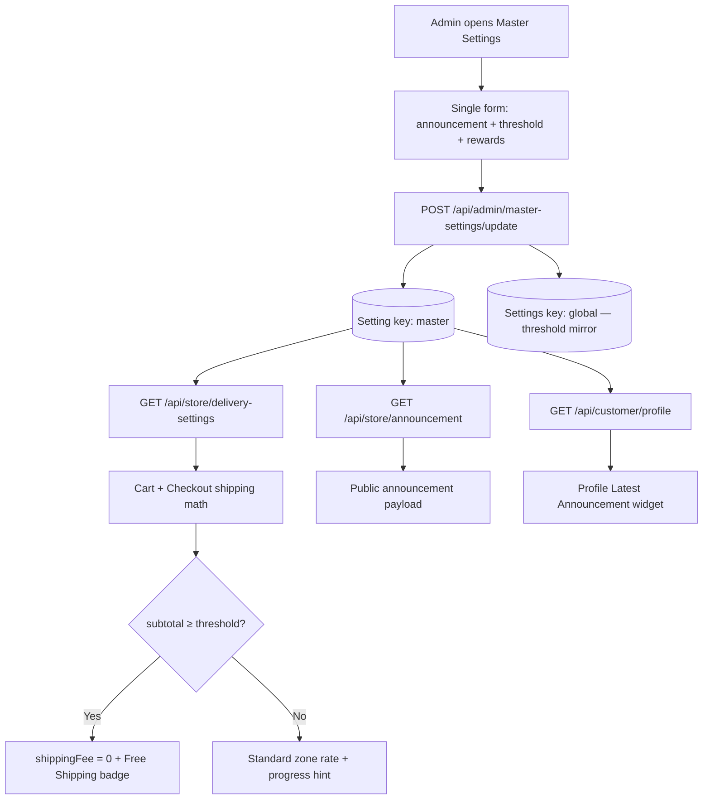
```mermaid
flowchart TD
    A[Admin opens Master Settings] --> B[Single form: announcement + threshold + rewards]
    B --> C[POST /api/admin/master-settings/update]
    C --> D[(Setting key: master)]
    C --> E[(Settings key: global — threshold mirror)]
    D --> F[GET /api/store/delivery-settings]
    D --> G[GET /api/store/announcement]
    D --> H[GET /api/customer/profile]
    F --> I[Cart + Checkout shipping math]
    G --> J[Public announcement payload]
    H --> K[Profile Latest Announcement widget]
    I --> L{subtotal ≥ threshold?}
    L -->|Yes| M[shippingFee = 0 + Free Shipping badge]
    L -->|No| N[Standard zone rate + progress hint]
```

### Key Files

| File | Role |
|------|------|
| `controllers/masterSettingsController.js` | Unified read/save, alias parsing, delivery threshold mirror |
| `models/Setting.js` | Master singleton schema (`freeShippingThreshold`, announcement fields, reward rates) |
| `utils/announcementSettings.js` | Announcement normalization, display-text builder, highlight chips |
| `utils/rewardSettings.js` | Cashback/points math, delivery reward credit, refund undo window |
| `client/admin.html` | Unified Master Settings form (single **Save Master Settings** button) |
| `client/js/admin.js` | Form wiring, live previews, `POST /master-settings/update` save handler |

---

## 📱 WhatsApp Infrastructure & Order Alert Engine

A **dual-number WhatsApp architecture** paired with a **fully server-side background alert pipeline** — customer-facing chat links update live from Master Settings, while operational order notifications fire automatically on every checkout **without requiring the admin panel to be open**.

### Feature Overview

#### Dual-WhatsApp Routing

| Line | Schema Field | Visibility | Purpose |
|------|--------------|------------|---------|
| **Public Customer Chat** | `Settings.publicSupportWhatsApp` | Storefront (`wa.me` floating button on `index.html`, `search.html`) | Customer inquiries & pre-sales chat |
| **Private Admin Alerts** | `Settings.privateAdminAlertWhatsApp` | **Never exposed** on public APIs | Internal operational notifications only |

- Public number is injected via `storeSettingsMiddleware` → `window.__STORE_SETTINGS__` and **`GET /api/store/branding`** — updates apply instantly after **Save Master Settings** (no server restart).
- Private number is readable only through authenticated **`GET /api/admin/master-settings`** responses.

#### Background WhatsApp Order Alerts (UltraMsg / Green API Integration)

From **Admin Panel → Master Settings → WhatsApp Configuration** (`client/admin.html`), operators configure the full alert stack through the unified **Save Master Settings** action:

| Setting | Schema Field | Type | Purpose |
|---------|--------------|------|---------|
| Enable Order Alerts | `enableWhatsAppOrderAlerts` | Boolean | Master toggle — both conditions below must pass before dispatch |
| Private Admin Number | `privateAdminAlertWhatsApp` | String | Recipient for structured order alerts (normalized to `8801XXXXXXXXX`) |
| Alert Provider | `whatsAppAlertProvider` | `UltraMsg` · `Green API` · `CallMeBot` · `Generic` | Selects primary HTTP integration driver |
| API Key / Token | `whatsAppAlertApiKey` | String | Gateway credential — overrides `WHATSAPP_ALERT_API_KEY` |
| Instance ID | `whatsAppAlertInstanceId` | String | Required for **UltraMsg** and **Green API** |
| Webhook URL | `whatsAppAlertWebhookUrl` | String | Direct JSON **POST** fallback when primary API is unavailable |

**Background delivery chain** (`utils/whatsappService.js`) — runs on `setImmediate` after MongoDB order save:

```
1. UltraMsg / Green API  (when provider + credentials configured in Master Settings)
2. Direct HTTP webhook POST  (Master Settings or WHATSAPP_ALERT_WEBHOOK_URL)
3. CallMeBot  (when only an API key is present)
4. In-memory wa.me fallback queue  (admin header badge — optional manual send)
```

| Provider | Transport | Endpoint |
|----------|-----------|----------|
| **UltraMsg** | POST JSON | `https://api.ultramsg.com/{instanceId}/messages/chat` |
| **Green API** | POST JSON | `https://api.green-api.com/waInstance{instanceId}/sendMessage/{apiToken}` |
| **CallMeBot** | GET | `https://api.callmebot.com/whatsapp.php` |
| **Generic / Webhook** | POST JSON | Custom URL — body includes `{ to, phone, message, text }` |

**Automated dispatch triggers:**
- **Website checkout** — `orderController.createOrder` → `dispatchAdminWhatsAppAlertSafely()` immediately after order + stock save.
- **Staff manual order** — `orderController.createManualOrder` → same background hook.
- **Fail-safe processing** — wrapped in non-blocking `try…catch`; API timeouts (default **15 s**) log errors only — **customer order placement is never interrupted**.

#### Structured Alert Message Template

```
📦 *New Order Alert - EOnlineBazar*

• Order ID: #ORD-12345
• Customer: Karim (8801316345101)
• Address: House 12, Road 5, Dhaka
• Total: ৳1,250
• Payment: COD
• Items:
  - Premium Shirt (M / Blue) x2
  - Sneakers x1
```

Phone numbers are auto-normalized — `+880 1316-345101` → `8801316345101`.

#### Staff Manual Order Creation (POS Engine)

From **Admin Panel → Live Orders → Create Manual Order** (`#manualOrderModal` in `client/admin.html`):

| Field | Description |
|-------|-------------|
| **Customer Info** | Name, phone, full delivery address |
| **Delivery Area** | Inside Dhaka / Outside Dhaka → sets `shippingLocationType` |
| **Product Picker** | Searchable catalog dropdown + **Size/Color variant** selector with live price & stock hint |
| **Line Items** | Multi-row cart with quantity; validates aggregate stock before add |
| **Pricing Override** | Manual discount (৳), shipping fee (৳), payment status (**COD** / **Paid**) |
| **Inventory** | Exact variant-row stock deduction via `deductOrderStock()` + `findVariantIndex()` |
| **Finance Integration** | Persists `subTotal`, `discountAmount`, `deliveryCharge`, `grandTotal`, per-line `buyingPrice` → feeds P/L analytics instantly |
| **WhatsApp Hook** | Same background admin alert fires on successful manual save |

Orders are tagged `orderSource: 'manual'` with `createdByAdmin` audit metadata.

### Architectural Workflow

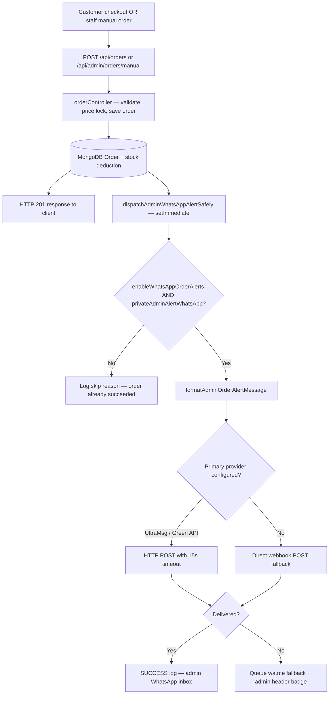
```mermaid
flowchart TD
    A[Customer checkout OR staff manual order] --> B[POST /api/orders or /api/admin/orders/manual]
    B --> C[orderController — validate, price lock, save order]
    C --> D[(MongoDB Order + stock deduction)]
    D --> E[HTTP 201 response to client]
    D --> F[dispatchAdminWhatsAppAlertSafely — setImmediate]
    F --> G{enableWhatsAppOrderAlerts AND privateAdminAlertWhatsApp?}
    G -->|No| H[Log skip reason — order already succeeded]
    G -->|Yes| I[formatAdminOrderAlertMessage]
    I --> J{Primary provider configured?}
    J -->|UltraMsg / Green API| K[HTTP POST with 15s timeout]
    J -->|No| L[Direct webhook POST fallback]
    K --> M{Delivered?}
    L --> M
    M -->|Yes| N[SUCCESS log — admin WhatsApp inbox]
    M -->|No| O[Queue wa.me fallback + admin header badge]
```

### Related API Endpoints

| Method | Endpoint | Description | Auth |
|--------|----------|-------------|------|
| **`POST`** | **`/api/admin/orders/manual`** | **Staff POS / phone order entry with variant stock validation** | **Admin + `manage_orders`** |
| **`GET`** | **`/api/admin/whatsapp-alerts/pending`** | **Pending wa.me fallback alerts (undelivered gateway attempts)** | **Admin + `manage_orders`** |
| **`DELETE`** | **`/api/admin/whatsapp-alerts/:id`** | **Dismiss a queued fallback alert** | **Admin + `manage_orders`** |
| `GET` | `/api/store/branding` | Public store branding + `publicSupportWhatsApp` | Public |

### Configuration Priority

```
MongoDB (Master Settings → WhatsApp Configuration)  →  .env fallbacks  →  wa.me admin badge fallback
```

| Variable | Required | Purpose |
|----------|:--------:|---------|
| `Settings.enableWhatsAppOrderAlerts` | ✅ | Must be `true` in Master Settings |
| `Settings.privateAdminAlertWhatsApp` | ✅ | Admin recipient (e.g. `8801XXXXXXXXX`) |
| `Settings.whatsAppAlertProvider` | ⛔ | `UltraMsg`, `Green API`, `CallMeBot`, or `Generic` |
| `Settings.whatsAppAlertApiKey` | ⛔ | API token (preferred over `WHATSAPP_ALERT_API_KEY`) |
| `Settings.whatsAppAlertInstanceId` | ⛔ | UltraMsg / Green API instance ID |
| `WHATSAPP_ALERT_WEBHOOK_URL` | ⛔ | Direct JSON POST fallback URL |
| `WHATSAPP_ALERT_TIMEOUT_MS` | ⛔ | HTTP timeout (default `15000`) |
| `PUBLIC_SUPPORT_WHATSAPP` | ⛔ | Storefront chat fallback when DB field is empty |

### Key Files

| File | Role |
|------|------|
| `models/Settings.js` | Global singleton — dual WhatsApp numbers, alert toggle, gateway credentials |
| `utils/whatsappService.js` | Background dispatch, provider chain, message formatter, phone sanitizer, pending alert queue |
| `controllers/orderController.js` | `createOrder`, `createManualOrder`, `dispatchAdminWhatsAppAlertSafely()` |
| `controllers/masterSettingsController.js` | Unified read/save for WhatsApp fields + other Master Settings |
| `controllers/whatsappAlertsController.js` | Pending fallback alert API |
| `middlewares/storeSettingsMiddleware.js` | Injects `publicSupportWhatsApp` into every HTML response |
| `utils/brandingHtml.js` | Embeds public WhatsApp in `window.__STORE_SETTINGS__` |
| `client/admin.html` | Master Settings → **WhatsApp Configuration** card + **Create Manual Order** modal |
| `client/js/admin.js` | WhatsApp settings form, manual order POS UI, pending alert badge |
| `client/js/whatsapp.js` | Dynamic storefront `wa.me` link builder |

---

## 🚚 Dynamic Free Shipping Threshold & Dynamic Announcements

Store-wide free-shipping rules and customer-facing announcements are now driven by the same admin-configured threshold — eliminating the previous split between a text-only "discount/offer" field and the delivery charge document.

### Automated Free Shipping Waiver

#### Server-Side Authority (`utils/deliveryChargeService.js`)
- `getFreeShippingProgress(settings, subtotal)` is the **single rule** for waiver eligibility — used by order placement, shipping quotes, and all storefront calculators.
- `computeDeliveryCharge()` returns **`0`** when progress reports `unlocked: true` (threshold `0` = free shipping on every order).
- Public **`GET /api/store/shipping-quote?district=&subtotal=`** now includes a `freeShipping` object: `{ threshold, subtotal, unlocked, remaining, progressPercent }`.

#### Cart & Checkout Integration
| Surface | Behavior |
|---------|----------|
| **`/cart`** | Live progress bar — *"Add ৳{remaining} more for FREE shipping"* (slim `font-weight: 400` styling) or **`🎉 Free Shipping Unlocked!`**; `white-space: nowrap` ensures single-line fit on all smartphone widths *(v4.4.1)* |
| **`/checkout`** | Delivery charge hidden when waived; success badge **`🎉 Free Shipping Unlocked!`**; progress track turns green at threshold; same shortened message and mobile-responsive typography as cart *(v4.4.1)* |
| **Order placement** | Backend re-computes delivery from live `Settings` + master threshold — client-supplied `shippingFee` never trusted |

Threshold resolution order: **`Setting.freeShippingThreshold`** → legacy **`Settings.freeShippingMinAmount`** → legacy **`announcementDiscount`** numeric fallback → platform default.

### Dynamic Customer Dashboard Announcements

The **Latest Announcement** card on the customer profile dashboard (`client/profile.html`, served at `/profile`) renders live values from MongoDB — not hardcoded placeholder copy.

#### Display Logic (`utils/announcementSettings.js`)
1. If `isAnnouncementActive === false` → card hidden (`displayText: null`).
2. If `announcementText` is set → show custom admin copy verbatim.
3. Otherwise → auto-generate: *"Enjoy Free Shipping on orders over ৳[threshold]!"* plus live cashback/points clauses when those rates are > 0.

#### Live Highlight Chips
Below the announcement sentence, the profile widget renders compact chips sourced from admin settings:

| Chip Key | Example Value |
|----------|----------------|
| `freeShipping` | `Orders over ৳2,000` |
| `cashback` | `3% per delivered order` |
| `points` | `1 point per ৳50` |

Data arrives via **`GET /api/customer/profile`** (`profile.announcement`) and the public **`GET /api/store/announcement`** endpoint.

### Related API Endpoints

| Method | Endpoint | Description | Auth |
|--------|----------|-------------|------|
| `GET` | `/api/store/delivery-settings` | Rates, home city, resolved `freeShippingThreshold` | Public |
| `GET` | `/api/store/shipping-quote` | Zone, fee, delivery estimate, `freeShipping` progress | Public |
| `GET` | `/api/store/announcement` | Live announcement text, highlights, reward snapshot | Public |
| `GET` | `/api/store/flash-sale` | Active flash sale config, countdown end time & featured product IDs | Public |
| `GET` | `/api/customer/profile` | Profile payload includes `announcement` + `deliverySettings` | User |

### Key Files

| File | Role |
|------|------|
| `utils/deliveryChargeService.js` | Threshold resolution, `getFreeShippingProgress`, locked order totals |
| `utils/announcementSettings.js` | Display text builder, highlight chips, public payload |
| `client/js/checkout.js` | Badge rendering, progress bar, `calculateDeliveryCharge()` |
| `client/js/cart.js` | Cart summary free-shipping progress hint |
| `client/js/shipping-estimator.js` | Shared client-side progress + quote helper; `formatFreeShippingRemainingMessage()` *(v4.4.1)* |
| `client/js/profile.js` | `applyAnnouncementUI()` — text + highlight chips |

---

## 📱 UI/UX & Responsive Orders List Refactoring

A focused refactor of the customer **My Orders** experience — trading cluttered per-row action buttons for a cleaner, tap-friendly list that routes all deep actions through **Order Details**.

### Ultra-Compact Order History View

#### Inline Order ID & Date
- Order rows/cards now show **`#EOB… • Date`** on a single line in the ID column (`order-card-header-meta`), eliminating redundant vertical whitespace on mobile.
- Desktop retains a dedicated Date column; mobile collapses date into the ID cell for a tighter card layout.

#### Clickable Rows — Actions Moved to Order Details
- Every order row uses **`clickable-order-row order-card-row`** with `tabindex="0"`, `role="link"`, and keyboard Enter/Space support.
- **Removed from list view:** inline Invoice download, Cancel, and View Details buttons (`buildOrderActionsHtml()` returns empty; actions column is visually blank).
- **Retained in Order Details** (`/order-details`): PDF invoice download, order cancellation (Pending/Processing), return request (delivered window), visual status timeline, and contextual smart back navigation.

#### Responsive Layout
- `orders-table--responsive` CSS transforms the desktop table into stacked mobile cards with `data-label` attributes for accessible field labels.
- Product preview thumbnails, quantity meta, and total amount blocks are tightened for high information density without sacrificing readability.

### Navigation Workflow

```mermaid
flowchart LR
    A[My Orders list] -->|Click entire row| B[/order-details?id=…&from=orders]
    B --> C[Download Invoice]
    B --> D[Cancel / Return actions]
    B --> E[Status timeline]
    B -->|Back| F[/profile?tab=orders]
```

### Key Files

| File | Role |
|------|------|
| `client/js/profile.js` | `buildOrderRowHtml()`, clickable-row delegation, empty list actions |
| `client/js/order-details.js` | Invoice, cancel/return controls, status timeline, smart back button |
| `client/css/profile.css` | Inline ID/date meta, compact card rows, responsive table transforms |
| `client/css/order-details.css` | Order detail action bar, invoice button, timeline layout |

---

## 🆕 What's New — v3.3.0 (Checkout, Orders, Rewards & Admin Controls)

This release delivers a professional-grade **checkout ↔ profile address pipeline**, **customer-driven order lifecycle management**, **admin refund governance**, and a **centralized rewards economics engine** — all wired through shared server utilities so storefront and admin surfaces stay in sync.

| Capability | Highlights |
|------------|------------|
| **📍 Smart Checkout Address Integration** | Profile Settings address loads first on `/checkout`; saved-address radio cards support **select → unselect → revert to profile**; manual edits clear the selection; optional **Save this address to my profile** sync after order placement. |
| **📦 Advanced Order Management** | Mobile-responsive order **card views** in the profile dashboard; compact desktop table layouts; customer **Cancel** and **Return Request** flows with reason modals; **3–7-day post-delivery return window** validation; `cancelledBy` tracking (`Customer` vs `Admin`). |
| **🛡️ Admin Refund & Return Controls** | Distinct cancellation badges (customer vs admin); return approval auto-credits the **exact paid amount** to wallet with transaction history; **Safe Undo Refund** within a configurable hour window with spent-funds verification. |
| **⚙️ Master Settings & Dynamic Rewards** | Global panel for cashback %, points ratio, conversion rate, and refund-undo hours; **category-specific cashback overrides** with global fallback; setting any rate to **0** instantly disables that reward type platform-wide. |
| **🔄 Smart Tab Navigation & Contextual Routing** | Query-param tab activation (`/profile?tab=orders`) for seamless **order-details ↔ profile** transitions; contextual **Back to Dashboard / My Orders** links; sub-tabs show **← Back to Dashboard** instead of ejecting to home; `history.replaceState()` for clean F5 reload. |
| **📱 Cart & Wishlist UI/UX Polish** | Full-width profile **My Cart** list (no right-hand Order Summary / Promo blocks); **non-destructive wishlist heart** on cart rows; **icon-only Cart/Delete** controls on wishlist mini-cards; header **slide-over mini cart drawer**; clean `/profile` URL routing. *(See [User Account & Shopping Cart](#-user-account--shopping-cart).)* |
| **🛒 Checkout Experience & Cart Enhancements** | Checkout-only **district selection** and **promo codes** for a cleaner `/cart`; real-time **inside/outside Dhaka** shipping + **business-day delivery estimates**; shared **`CouponUI`** module for flat/percentage discounts with live subtotal/grand-total updates; automatic **guest → auth cart merge** on login/OAuth. |
| **🔒 Profile Security & Order Invoice Enhancements** | **`bcrypt`** password change with current-password gate; **6-digit OTP** verification for email/phone updates; single **Primary / Default** address flag with checkout auto-select & pre-fill; **1-click PDF invoice** download from **My Orders** and **Order Details** (`Invoice-ORDER_ID.pdf`). |
| **⚡ Performance & Engagement Enhancements** | Interactive **order status timeline** on Order Details (`Placed → Processing → Shipped → Out for Delivery → Delivered`); **real-time low-stock FOMO badges** on Cart & Wishlist; lightweight **global toast notifications** for cart, wishlist, and stock feedback — no full-page reloads. |
| **🗄️ Database Indexing Optimization** | Mongoose **schema-level indexes** on `User`, `Order`, and `Product` collections — faster auth lookups, admin order filtering/sorting, and weighted full-text product search; indexes auto-built on startup via `schema.index()`. *(See [Database Indexing Optimization](#️-database-indexing-optimization).)* |
| **📊 Admin Analytics & Inventory Management** | Interactive **Sales & Business Analytics Dashboard** with live revenue/order KPIs and Chart.js trend charts; **Automated Low-Stock & Inventory Alert System** with color-coded badges and inline **Update Stock** quick actions on the admin Overview tab. *(See [Stock Out & Low Stock Automated Alert Engine](#️-stock-out--low-stock-automated-alert-engine).)* |

> 📌 See the dedicated sections below for workflow diagrams, schema fields, and API specifications.

---

## 🛒 Smart Checkout Address Integration

A profile-aware checkout address system that prioritizes the customer's **primary Profile Settings address** on first load, while still supporting a multi-address address book with intuitive toggle behavior.

### Feature Overview

#### Profile-First Initial Load
- On `/checkout` load, `initializeCheckoutPage()` fetches the customer profile and saved addresses in parallel.
- **Profile Settings address always wins on first paint** — `applyProfileToCheckoutForm()` pre-fills name, phone, district, upazila/thana, and street from the profile before any saved-address card is selected.
- If the user is not logged in, the form falls back to cached `localStorage` values from a prior session.

#### Toggleable Saved Delivery Address Cards
- Logged-in customers with saved addresses see a **radio-card picker** (`#savedAddressCards`) above the manual form.
- **First click** on a card selects it and applies that address to all shipping fields (including real-time delivery charge recalculation).
- **Second click on the same card** unchecks the radio, clears the selection, and **reverts the form to Profile Settings** — no page reload required.
- Manual edits to any shipping field automatically clear the saved-address selection and revert to profile values, preventing stale mismatches.

#### Manual Override & Profile Sync
- Customers can type a one-off address without selecting a saved card.
- The **"Save this address to my profile"** checkbox (`#saveAddressToProfile`) is enabled only when no saved card is selected.
- On order placement, `syncCheckoutAddressToProfile()` (via `utils/savedAddress.js`) persists the entered address to the user's address book when requested, with duplicate detection and default-address promotion.

#### Relaxed Form Validation *(v4.4.1)*
- **Full Name** and **Delivery Address** fields require a minimum of **one word** (non-empty trimmed input) — reducing friction for short names and concise street/house details while still blocking spam-pattern abuse via `detectSpamPattern()`.
- **Mobile Number** validation remains **strict 11-digit Bangladeshi format** (`/^01[3-9]\d{8}$/`) on checkout proceed and profile address saves — digits-only input enforced live.
- Live validation engine (`initLiveValidationEngine()` in `client/js/checkout.js`) updates field UI state in real time; profile settings form mirrors the same name/address leniency on save.

### Architectural Workflow

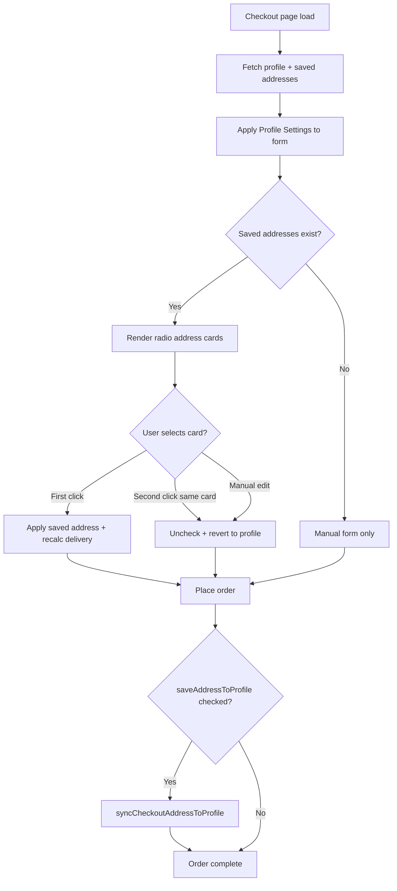
```mermaid
flowchart TD
    A[Checkout page load] --> B[Fetch profile + saved addresses]
    B --> C[Apply Profile Settings to form]
    C --> D{Saved addresses exist?}
    D -->|Yes| E[Render radio address cards]
    D -->|No| F[Manual form only]
    E --> G{User selects card?}
    G -->|First click| H[Apply saved address + recalc delivery]
    G -->|Second click same card| I[Uncheck + revert to profile]
    G -->|Manual edit| I
    H --> J[Place order]
    F --> J
    I --> J
    J --> K{saveAddressToProfile checked?}
    K -->|Yes| L[syncCheckoutAddressToProfile]
    K -->|No| M[Order complete]
    L --> M
```

### Key Files

| File | Role |
|------|------|
| `client/js/checkout.js` | Profile-first init, saved-address card UI, toggle logic, save-to-profile flag |
| `client/checkout.html` | Saved-address section markup and save checkbox |
| `utils/savedAddress.js` | Address parsing, duplicate check, checkout → profile sync |
| `controllers/orderController.js` | Calls sync after successful order creation |
| `controllers/userController.js` | Address book CRUD API |

---

## 📦 Advanced Order Management & Tracking

End-to-end order lifecycle management for customers and admins — from responsive history views through structured cancel/return workflows with auditable reason capture.

### Feature Overview

#### Mobile-Responsive Order Views
- The customer profile **My Orders** table uses `orders-table--responsive` CSS (`client/css/profile.css`) to transform rows into **stacked mobile cards** with `data-label` attributes for accessible field labels.
- **v3.4.0:** Order ID and date render **inline** (`#EOB… • Date`) to save vertical space; the **entire row is clickable** and navigates to Order Details — list-level Invoice / Cancel / View Details buttons removed for a cleaner interface (actions live on `/order-details` only).
- Desktop layouts retain a **compact, information-dense table** with product preview thumbnails, status badges, and an intentionally empty actions column.
- Admin **Live Orders** (`client/js/admin.js`) renders a **premium sticky-header data table** with dedicated **Courier Status** and **Actions** columns, left-aligned address/product cells, a horizontal icon toolbar (edit, view invoice, delete), one-click courier booking in the courier column, **Create Manual Order** POS modal (v4.0.0), compact column spacing, and contextual status badges. Background **WhatsApp order alerts** fire server-side on every new order — no admin session required.

#### Customer Order Cancellation
- Customers can cancel orders in **Pending** or **Processing** status from the profile dashboard.
- A dedicated **reason modal** (`#order-action-modal`) presents predefined dropdown options:
  - Changed my mind · Ordered by mistake · Delivery taking too long · Defective product · **Other**
- Selecting **Other** dynamically reveals a required free-text textarea; `resolveSubmittedReason()` merges dropdown + custom input on both client and server.
- The order document stores `cancelReason`, `actionReason`, and **`cancelledBy: 'Customer'`** for admin audit visibility.

#### Return Request Workflow
- Delivered orders within the **3–7-day post-delivery window** expose a **Return Order** action in the customer profile.
- Server-side validation (`isOrderWithinReturnWindow()` in `orderController.js`) ensures: order ownership, **Delivered** status only, delivery timestamp present, and the request falls within the eligible period after delivery (`RETURN_WINDOW_MS` = 7 days from `deliveredAt`).
- The same reason modal collects structured return justification; successful submission sets status to **`Return Requested`** and persists `returnReason`.
- Client-side button visibility in `profile.js` mirrors the same window logic — preventing UI actions the API would reject.

#### Admin Cancellation Tracking
- When an admin cancels via status update, the backend sets **`cancelledBy: 'Admin'`** and captures the admin-provided reason.
- Admin panel badges distinguish **`Cancelled (Customer)`** (red) vs **`Cancelled (Admin)`** (slate) for instant visual triage.

### Order Schema — Lifecycle Fields (`models/order.js`)

| Field | Type | Description |
|-------|------|-------------|
| `cancelReason` | `String` | Customer or admin cancellation reason text |
| `cancelledBy` | `Enum: ['Customer', 'Admin', '']` | Who initiated the cancellation |
| `returnReason` | `String` | Customer return request justification |
| `actionReason` | `String` | Legacy mirror of cancel/return reason |
| `deliveredAt` | `Date` | Delivery timestamp — anchors return window validation |
| `refundedAt` | `Date` | When wallet refund was processed |
| `refundAmount` | `Number` | Exact amount credited to wallet |
| `walletApplied` | `Number` | Wallet balance used at checkout (deducted atomically on placement) |
| `statusBeforeRefund` | `String` | Status restored on refund undo |
| `courierProvider` | `String` | Courier used for booking (e.g. `Steadfast`) |
| `courierTrackingId` | `String` | Public tracking code returned by the courier API |
| `courierConsignmentId` | `String` | Internal consignment ID from the courier API |
| `courierStatus` | `String` | Booking lifecycle (`unbooked`, `booking`, `in_review`, `failed`, …) |
| `courierBookedAt` | `Date` | Timestamp when the parcel was successfully booked |

#### Schema Indexes

| Index | Purpose |
|-------|---------|
| `{ orderId: 1 }` | Track-order & IPN lookup |
| `{ user: 1 }` | Customer order history |
| `{ status: 1 }` | Admin Live Orders filtering |
| `{ createdAt: -1 }` | Recent-first sorting |
| `{ 'payment.transactionId': 1 }` | Payment callback reconciliation |
| `{ 'payment.methodId': 1, createdAt: -1 }` | Accounting reports by payment method |

> 📌 See [Database Indexing Optimization](#️-database-indexing-optimization) for User and Product indexes.

### Related API Endpoints

| Method | Endpoint | Description | Auth |
|--------|----------|-------------|------|
| `POST` | `/api/orders/:id/cancel` | Customer cancel with reason payload (`selectedReason`, `customReason`) | User |
| `POST` | `/api/orders/:id/return` | Customer return request with reason payload | User |
| `PUT` | `/api/admin/orders/:id/approve-return` | Admin approve return → wallet refund | Admin + `manage_orders` |
| `POST` | `/api/admin/orders/:id/undo-refund` | Admin safe refund reversal | Admin + `manage_orders` |
| **`POST`** | **`/api/admin/orders/:id/send-courier`** | **Book parcel via Steadfast API — saves tracking IDs & sets status to `Shipped`** | **Admin + `manage_orders`** |
| **`POST`** | **`/api/admin/orders/manual`** | **Staff POS / phone order entry — variant stock validation & finance snapshots** | **Admin + `manage_orders`** |
| **`GET`** | **`/api/admin/whatsapp-alerts/pending`** | **Pending wa.me fallback alerts when gateway delivery fails** | **Admin + `manage_orders`** |
| **`GET`** | **`/api/admin/courier/status`** | **Read courier config readiness (provider + credentials configured)** | **Admin** |
| `GET` | `/api/orders/my-orders` | Customer order history with lifecycle fields | User |

---

## 🔄 Smart Tab Navigation & Contextual Routing (User Profile)

Profile dashboard navigation that preserves user context across **order-details** and **profile** sub-views — with intelligent back links, URL-driven tab activation, and reload-safe state cleanup.

### Feature Overview

#### Persistent State Management
- Deep links such as `/profile?tab=orders` activate the correct profile sub-tab on load via `applyInitialProfileTabFromUrl()` in `client/js/profile.js`.
- `resolveProfileTabKey()` normalizes aliases (`orders`, `my-orders`, `dashboard`, etc.) to the canonical tab IDs used in the DOM (`my-orders`, `dashboard-overview`, …).
- Order rows opened from the profile pass a **`from`** query parameter (`dashboard` or `orders`) to `/order-details`, so the detail page knows which parent view to return to.

#### Dynamic Contextual Back Button
- **Dashboard Recent Activity → Order Details** — renders `← Back to Dashboard` linking to `/profile?tab=dashboard`, returning the user to the main overview.
- **My Orders → Order Details** — renders `← Back to My Orders` linking to `/profile?tab=orders`, keeping the user within the active orders tab.
- **Profile sub-tabs** (Wallet, Addresses, Security, etc.) dynamically adjust the top navigation to show **`← Back to Dashboard`** (via in-page tab switch + `pushState`) instead of abruptly sending the user back to the home page.
- On the Dashboard overview itself, the back control remains **`← Back to Home`** (`/`).

#### Clean Reload Behavior
- After tab state is initialized from the URL, `window.history.replaceState({}, document.title, window.location.pathname)` strips temporary `?tab=` query parameters **and legacy `#hash` fragment artifacts**.
- Sidebar tab clicks and the profile header cart shortcut also call `replaceState` to **`/profile`** — keeping the address bar pristine during in-dashboard navigation.
- Pressing reload (**F5**) on a deep-linked profile view gracefully defaults back to the **Dashboard overview** on a clean `/profile` URL — preventing stale tab state from persisting across refreshes.

### Navigation Workflow

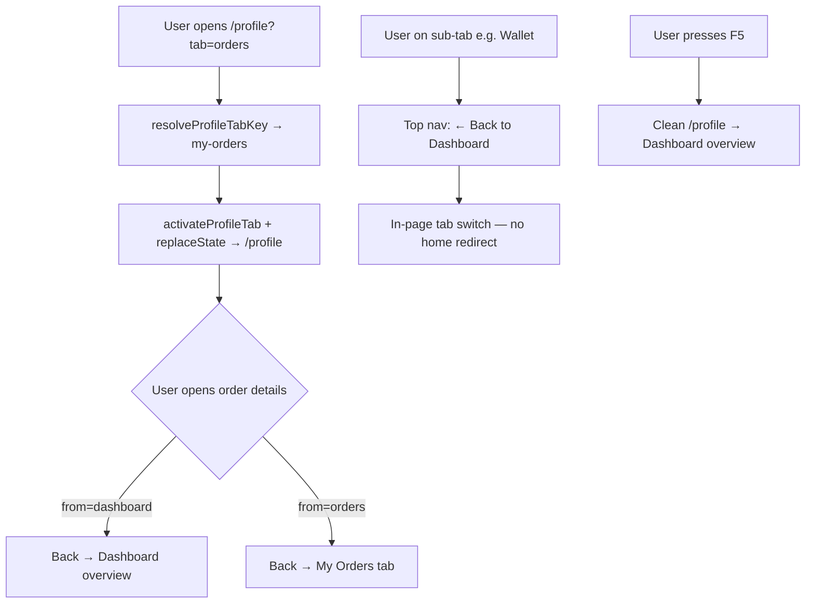
```mermaid
flowchart TD
    A[User opens /profile?tab=orders] --> B[resolveProfileTabKey → my-orders]
    B --> C[activateProfileTab + replaceState → /profile]
    C --> D{User opens order details}
    D -->|from=dashboard| E[Back → Dashboard overview]
    D -->|from=orders| F[Back → My Orders tab]
    G[User on sub-tab e.g. Wallet] --> H[Top nav: ← Back to Dashboard]
    H --> I[In-page tab switch — no home redirect]
    J[User presses F5] --> K[Clean /profile → Dashboard overview]
```

### Key Files

| File | Role |
|------|------|
| `client/js/profile.js` | URL tab activation, alias resolution, `replaceState` cleanup, `updateTopBackButton()` |
| `client/js/order-details.js` | Contextual smart back button (`from=dashboard` / `from=orders` + referrer fallback) |
| `client/profile.html` | Sidebar menu links with `?tab=orders` deep links and `data-tab` attributes |

> 📌 Cart layout, wishlist actions, and header mini-cart integration are documented in [User Account & Shopping Cart](#-user-account--shopping-cart).

---

## 👤 User Account & Shopping Cart

The customer profile dashboard (`/profile`) combines account management with an integrated **My Cart & Wishlist** workspace — streamlined for a clutter-free, full-width experience with quick inline actions, clean URL routing, and a site-wide header mini-cart drawer.

### User Dashboard Layout Streamlining

#### Full-Width My Cart View
- Simplified the profile **My Cart** tab by removing the right-hand **Order Summary** sidebar and **Promo Code** blocks — cart line items now span the full content width via `.profile-cart-full-width` for a cleaner, distraction-free list.
- Retained a compact inline **Proceed to Order** summary bar at the bottom of the cart list (selected-item count + subtotal only); shipping quotes, district selection, and promo validation remain exclusively on `/checkout` and `/cart` as documented in [Checkout Experience & Cart Enhancements](#-checkout-experience--cart-enhancements).
- Cart rows use the existing divider-line preview layout (`.cart-preview-item`) — transparent backgrounds, light `border-bottom` separators, and no heavy per-item card wrappers.

#### Streamlined Cart Action Buttons
- Added a **non-destructive Wishlist heart toggle** (`.cart-wishlist-heart-btn`) on each profile cart row — calls `POST /api/wishlist/toggle` to save favourites **without removing the item from the cart**.
- Heart icon reflects live wishlist state (`fa-regular` → `fa-solid`, `.is-saved` class) synced against `window.__profileWishlistProductIds`; successful saves trigger the global toast engine.
- Standard quantity controls, line-total display, checkbox selection, and trash removal remain on each row.

#### Compact Wishlist Mini-Cards
- Restored **icon-only action buttons** on wishlist product cards for a minimal dashboard footprint:
  - **Cart** (`.wishlist-cart-btn`) — adds the saved item straight to the active cart via `/api/cart/add` with stock guardrails.
  - **Delete** (`.wishlist-remove-btn`) — removes the favourite via `/api/wishlist/toggle` and updates the DOM instantly with toast feedback.
- Buttons use compact circular styling with `title` tooltips instead of text labels — preserving touch targets on mobile while reducing visual noise.

### Header & Routing Enhancements

#### Clean `/profile` URL Routing
- Sidebar tab switches and the profile header cart shortcut call `history.replaceState({}, document.title, '/profile')` — the address bar stays on a **pristine `/profile` path** with no `#hash` fragment artifacts or lingering `?tab=` query strings after navigation.
- Deep links such as `/profile?tab=orders` (or legacy `#my-orders` hash aliases) still activate the correct sub-tab on initial load via `applyInitialProfileTabFromUrl()`, then query/hash params are stripped so **F5 reload gracefully defaults to Dashboard overview** on a clean URL.
- `resolveProfileTabKey()` normalizes aliases (`orders`, `my-orders`, `cart`, `my-cart`, …) to canonical DOM tab IDs before activation.

#### Optimized Header Slide-over Mini Cart Drawer
- Site-wide **`MiniCartDrawer`** module (`client/js/mini-cart-drawer.js` + `client/css/mini-cart-drawer.css`) — opens from header **`[data-mini-cart-trigger]`** / `.nav-cart-box` icons across storefront pages.
- Slide-over panel includes scrollable item list, selected-item count, live subtotal, **Proceed to Checkout** CTA, and a **View My Cart** link — shared rendering via `renderCartDrawerItems()` in `client/js/cart.js`.
- Drawer state stays in sync when cart quantities change on `/cart`, in the profile preview, or after wishlist **Add to Cart** actions; Escape key and backdrop click close the panel (`body.mini-cart-open` scroll lock).
- Profile dashboard header cart badge (`.cart-badge-container[data-tab="my-cart"]`) navigates directly to the **My Cart & Wishlist** tab with the same clean `/profile` URL convention.

### Profile Cart & Wishlist Workflow

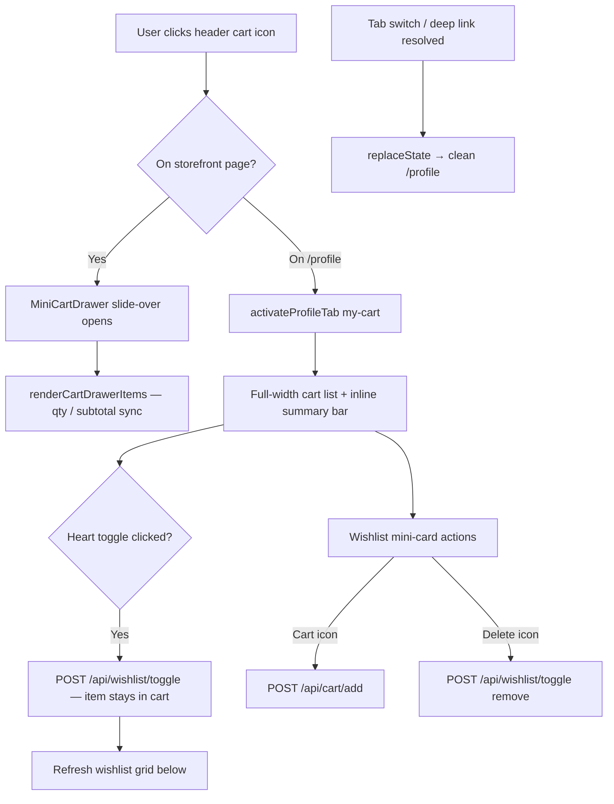
```mermaid
flowchart TD
    A[User clicks header cart icon] --> B{On storefront page?}
    B -->|Yes| C[MiniCartDrawer slide-over opens]
    B -->|On /profile| D[activateProfileTab my-cart]
    C --> E[renderCartDrawerItems — qty / subtotal sync]
    D --> F[Full-width cart list + inline summary bar]
    F --> G{Heart toggle clicked?}
    G -->|Yes| H[POST /api/wishlist/toggle — item stays in cart]
    H --> I[Refresh wishlist grid below]
    F --> J[Wishlist mini-card actions]
    J -->|Cart icon| K[POST /api/cart/add]
    J -->|Delete icon| L[POST /api/wishlist/toggle remove]
    M[Tab switch / deep link resolved] --> N[replaceState → clean /profile]
```

### Key Files

| File | Role |
|------|------|
| `client/profile.html` | **My Cart & Wishlist** tab markup — full-width cart card + wishlist grid |
| `client/js/profile.js` | Tab activation, clean URL `replaceState`, wishlist render, heart/delete/cart handlers |
| `client/js/cart.js` | Shared cart renderer — profile preview rows, wishlist heart injection, inline summary bar |
| `client/css/cart.css` | `.profile-cart-full-width`, `.cart-wishlist-heart-btn`, divider-line preview rows |
| `client/css/profile.css` | Compact `.wishlist-cart-btn` / `.wishlist-remove-btn` icon buttons, wishlist grid density |
| `client/js/mini-cart-drawer.js` | Header slide-over drawer — open/close, trigger binding, checkout link |
| `client/css/mini-cart-drawer.css` | Drawer backdrop, panel animation, footer subtotal & CTA styling |

---

## 📱 Mobile & Desktop UI/UX Polish (Cart & Wishlist)

Space-efficient layout refinements for the customer profile **My Cart** tab — reducing visual clutter and unnecessary scrolling on mobile while maintaining a polished desktop experience. *(See also [User Account & Shopping Cart](#-user-account--shopping-cart) for the full-width layout, wishlist toggle, and mini-cart drawer integration.)*

### Feature Overview

#### Compact Divider Layout (Cart Summary)
- Replaced heavy individual **card wrappers** around cart preview rows with a streamlined container using light **`border-bottom`** dividers (`#cart-items-preview-list .cart-preview-item` in `client/css/cart.css`).
- Rows use transparent backgrounds, zero box-shadow, and subtle hover states — creating a clean, list-style presentation that reads faster on small screens.

#### Whitespace Elimination (Cart & Wishlist)
- Optimized vertical padding, row gaps, and section spacing in both **My Cart Summary** and **My Wishlist** views (`client/css/profile.css` + `client/css/cart.css`).
- Wishlist mini-cards use tighter grid gaps, **icon-only Cart/Delete controls**, and scaled-down typography at mobile breakpoints (`wishlist-grid`, `wishlist-card`).
- Profile cart drops the right-hand Order Summary / Promo column in favour of a **full-width item list** with a slim inline checkout bar — minimizing vertical scrolling without sacrificing touch targets or readability.

### Key Files

| File | Role |
|------|------|
| `client/css/cart.css` | Flat divider-line cart preview rows; reduced padding and hover treatment |
| `client/css/profile.css` | Compact wishlist grid, tightened section headers, mobile breakpoint density |
| `client/js/profile.js` | Cart/wishlist fetch and render on **My Cart** tab activation; wishlist heart toggle handler |
| `client/js/mini-cart-drawer.js` | Header slide-over mini cart — trigger binding and drawer lifecycle |
| `client/css/mini-cart-drawer.css` | Mini cart drawer panel, backdrop, and footer CTA styling |

---

## 🛒 Checkout Experience & Cart Enhancements

A unified checkout-first flow for shipping, promotions, and cart persistence — keeping `/cart` focused on item review while `/checkout` owns district selection, promo codes, delivery estimates, and final totals.

### Feature Overview

#### Dynamic Shipping & Delivery Calculation (Checkout)
- Integrated **location-based shipping charges** (Inside/Outside Dhaka rates from admin `Settings`) and **real-time estimated delivery date ranges** directly into the Checkout workflow.
- **`client/js/shipping-estimator.js`** mirrors server-side `deliveryChargeService.js` + `deliveryEstimateService.js` — computing zone (`inside` / `outside`), fee, **`getFreeShippingProgress()`** eligibility, and **business-day windows** (2–3 days inside city · 4–6 days outside; Friday/Saturday excluded for Bangladesh).
- District changes on `/checkout` instantly recalculate delivery charge, grand total, the **`#checkoutDeliveryDateRange`** badge, and the **free-shipping progress bar** — no full-page reload.
- Public **`GET /api/store/shipping-quote?district=&subtotal=`** returns a server-authoritative quote (zone, `deliveryCharge`, `estimatedDelivery`) for optional AJAX previews; order placement still re-validates on the backend.
- Streamlined the **Cart view UI** by keeping **district selection** and **promo codes exclusively on the Checkout page** for a cleaner, faster cart experience.

#### Instant Coupon & Promo Code Engine
- Enhanced promo code validation to support both **flat amount** and **percentage-based** discounts (with optional max-discount cap enforced server-side in `couponController.js`).
- Extracted shared **`client/js/coupon-ui.js`** (`CouponUI` module) — binds apply/remove handlers, persists `appliedCoupon` in `localStorage`, and calls **`POST /api/coupons/apply`** via Fetch.
- Implemented **dynamic subtotal and grand total recalculations** via client-side AJAX/Fetch without requiring full-page reloads — `updateCheckoutTotals()` and `CouponUI.syncCouponPanel()` refresh merchandise payable, discount row, delivery charge, and grand total on every cart or coupon change.
- Stale coupons are auto-cleared when the cart subtotal drifts from the validated amount; checkout still probes **`GET /api/coupons/active-check`** before showing the promo input.

#### Seamless Cart Persistence & Merge System (Guest to Auth)
- Built an automatic **cart merge algorithm** during user authentication (login / OAuth) via `utils/cartMergeService.js` and **`client/js/cart-merge.js`** (`CartMerge.syncCartAfterLogin`).
- Preserves items added by guest users in **temporary `localStorage` cart state** and seamlessly merges them into the user's permanent **MongoDB cart** upon logging in.
- **Variant-aware deduplication** — matching `productId` + `variantId` lines increment quantity; new lines are appended; merged cart is returned in the login response or via **`POST /api/cart/merge`**.
- `/cart` page load performs the same merge when an authenticated user still has local guest items, then clears `localStorage` and fetches the live DB cart.

#### Free Shipping Progress Bar — Mobile Optimization *(v4.4.1)*
- Shared **`formatFreeShippingRemainingMessage()`** in `client/js/shipping-estimator.js` renders the shortened copy: *"Add ৳{remainingAmount} more for FREE shipping"*.
- Cart and checkout CSS (`.free-shipping-progress-text`) use **`font-weight: 400`** (slim styling), **`white-space: nowrap`**, and responsive font sizes (`11px` on narrow phones, `14px` from `640px+`) so the hint never wraps on **360px, 390px, 460px, 568px**, or **668px+** viewports.
- Unlocked state retains **`🎉 Free Shipping Unlocked!`** with a slightly bolder green accent (`font-weight: 500`).

#### Dynamic Payment Step (`/payment`) *(v4.4.0)*
- The payment step loads **active methods from the database** via **`GET /api/payments/methods`** — no hardcoded bKash/COD/gateway cards.
- Each method card renders logo, description, fee badge, and type-specific detail (manual instructions or automated gateway notice).
- **Real-time processing fee recalculation** adjusts **Amount to Pay** when the customer switches methods; wallet deductions from the checkout session are respected.
- Order submission maps `paymentMethodId` to **`POST /api/orders`** for accurate invoice, ledger, and IPN correlation.

> 📌 Full architecture, admin CRUD, encryption model, and API tables: [Dynamic Payment Methods & Gateway Integration](#-dynamic-payment-methods--gateway-integration).

### Architectural Workflow

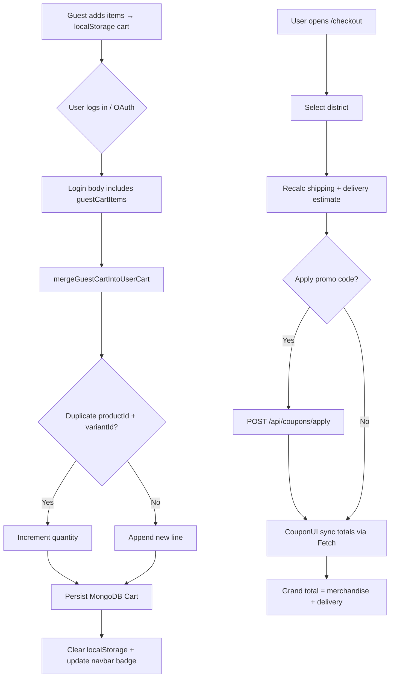
```mermaid
flowchart TD
    A[Guest adds items → localStorage cart] --> B{User logs in / OAuth}
    B --> C[Login body includes guestCartItems]
    C --> D[mergeGuestCartIntoUserCart]
    D --> E{Duplicate productId + variantId?}
    E -->|Yes| F[Increment quantity]
    E -->|No| G[Append new line]
    F --> H[Persist MongoDB Cart]
    G --> H
    H --> I[Clear localStorage + update navbar badge]

    J[User opens /checkout] --> K[Select district]
    K --> L[Recalc shipping + delivery estimate]
    L --> M{Apply promo code?}
    M -->|Yes| N[POST /api/coupons/apply]
    N --> O[CouponUI sync totals via Fetch]
    M -->|No| O
    O --> P[Grand total = merchandise + delivery]
```

### Related API Endpoints

| Method | Endpoint | Description | Auth |
|--------|----------|-------------|------|
| `GET` | `/api/store/shipping-quote` | District + subtotal → zone, delivery charge, estimated delivery window | Public |
| `POST` | `/api/coupons/apply` | Validate & compute flat/percentage discount for current subtotal | Optional User |
| `POST` | `/api/cart/merge` | Merge guest `cartItems` into authenticated user's DB cart | User |
| `POST` | `/api/customer/login` | Accepts `guestCartItems`; returns merged cart in response | Public |

### Key Files

| File | Role |
|------|------|
| `client/js/shipping-estimator.js` | Client-side zone, fee, free-shipping, and business-day delivery estimate |
| `client/js/coupon-ui.js` | Shared promo apply/remove UI, Fetch validation, live total sync |
| `client/js/cart-merge.js` | Guest cart read/clear, post-login merge orchestration, `cart:merged` event |
| `client/js/checkout.js` | Checkout-only district + coupon wiring, `updateCheckoutTotals()` |
| `client/js/cart.js` | Lean cart page (no district/promo); hybrid guest/DB sync + merge on load |
| `utils/deliveryEstimateService.js` | Server-side business-day delivery window by zone |
| `utils/cartMergeService.js` | Variant-aware guest → user cart merge (login + API) |
| `controllers/storeController.js` | `getPublicShippingQuote` endpoint |
| `controllers/userController.js` | Login-time guest cart merge |
| `controllers/couponController.js` | Flat/percentage discount computation & validation |
| `client/js/payment.js` | Dynamic payment method fetch, processing-fee totals, order submission |
| `controllers/paymentIpnController.js` | Public payment methods API & gateway IPN handler |

---

## 🔒 Profile Security & Order Invoice Enhancements

Customer profile hardening and order receipt tooling — secure credential management, OTP-gated contact updates, single primary address enforcement, and one-click branded PDF invoice downloads from the profile dashboard and order detail views.

### Feature Overview

#### Multi-Factor OTP Verification & Security
- Implemented secure **password change** functionality using **`bcrypt`** password hashing and validation — current password is verified before a new hash is persisted; mismatched confirm fields and reuse of the current password are rejected server-side.
- Added a **6-digit OTP (One Time Password)** verification flow for updating sensitive account information (**Email** and **Phone Number**) to prevent unauthorized profile modifications.
- OTP requests are issued via **`POST /api/customer/profile/request-contact-otp`** (email delivery through SMTP; SMS via the shared gateway abstraction) and confirmed through a modal **6-cell OTP input** on the **Security** tab (`client/profile.html`).
- Successful verification commits `pendingEmail` / `pendingMobile` to the live profile fields; failed attempts, duplicate contacts, and expired codes are logged to the **Security & Audit** trail.

#### Primary / Default Address Management
- Refined **multi-address management** logic allowing users to flag a single **"Primary / Default"** shipping address (`isDefault` on the address subdocument in `models/user.js`).
- Promoting an address to default atomically clears the flag on all other saved addresses — both in the address book CRUD API and in checkout **Save to profile** sync (`utils/savedAddress.js`).
- Ensured default addresses **automatically sync and pre-fill during the Checkout flow** for a faster purchase experience — `autoSelectDefaultSavedAddress()` in `client/js/checkout.js` selects the default card on load; default addresses display a **Default** badge in both checkout picker cards and the profile address list.

#### 1-Click PDF Invoice Generation & Download
- Integrated **dynamic PDF invoice creation** accessible from the **`Order Details`** view (reachable by clicking any order row in **My Orders**) — no separate print modal required for customers.
- Generates branded, professional PDF receipts (**`Invoice-ORDER_ID.pdf`**) featuring itemized billing, customer shipping info, shipping fees, discounts, and **payment status** ready for instant download or printing.
- Server-side generation uses **`pdfkit`** (`utils/invoicePdf.js`) with an EOnlineBazar branded header, line-item table (product, qty, unit price, line total), subtotal/discount/delivery/grand-total summary, and zone-aware payment status labels.
- **`GET /api/orders/:id/invoice`** enforces order ownership via `verifyUser`; the client helper **`client/js/invoiceDownload.js`** streams the blob and triggers a browser download with loading/disabled state on the action button.

### Security & Invoice Workflow

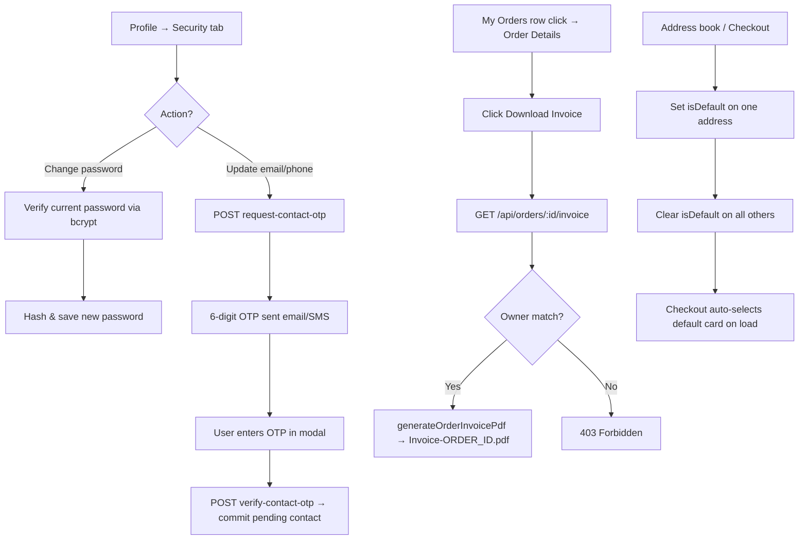
```mermaid
flowchart TD
    A[Profile → Security tab] --> B{Action?}
    B -->|Change password| C[Verify current password via bcrypt]
    C --> D[Hash & save new password]
    B -->|Update email/phone| E[POST request-contact-otp]
    E --> F[6-digit OTP sent email/SMS]
    F --> G[User enters OTP in modal]
    G --> H[POST verify-contact-otp → commit pending contact]

    I[My Orders row click → Order Details] --> J[Click Download Invoice]
    J --> K[GET /api/orders/:id/invoice]
    K --> L{Owner match?}
    L -->|Yes| M[generateOrderInvoicePdf → Invoice-ORDER_ID.pdf]
    L -->|No| N[403 Forbidden]

    O[Address book / Checkout] --> P[Set isDefault on one address]
    P --> Q[Clear isDefault on all others]
    Q --> R[Checkout auto-selects default card on load]
```

### Related API Endpoints

| Method | Endpoint | Description | Auth |
|--------|----------|-------------|------|
| `PUT` | `/api/customer/change-password` | Change password (current + new + confirm); `bcrypt` hash | User |
| `PUT` | `/api/customer/profile/change-password` | Alias for password change from Security tab | User |
| `POST` | `/api/customer/profile/request-contact-otp` | Request 6-digit OTP for email or mobile update (`type`, `value`) | User |
| `POST` | `/api/customer/profile/verify-contact-otp` | Verify OTP and commit pending email/phone | User |
| `GET/POST/PUT/DELETE` | `/api/customer/addresses` | Address book CRUD with **`isDefault`** single-primary enforcement | User |
| **`GET`** | **`/api/orders/:id/invoice`** | **Download branded PDF invoice (`Invoice-ORDER_ID.pdf`) — owner-only** | **User** |

### Key Files

| File | Role |
|------|------|
| `client/profile.html` | Security tab (password form, email/phone OTP triggers, OTP modal) |
| `client/js/profile.js` | Password change, OTP request/verify UI, address default toggle, My Orders invoice button |
| `client/order-details.html` | Order detail page with **Download Invoice** action |
| `client/js/order-details.js` | Wires invoice download button to shared helper |
| `client/js/invoiceDownload.js` | 1-click PDF fetch, blob download, button loading state |
| `client/js/checkout.js` | `autoSelectDefaultSavedAddress()`, default badge on saved-address cards |
| `controllers/userController.js` | `changePassword`, `requestContactUpdateOtp`, `verifyContactUpdateOtp`, address default logic |
| `controllers/orderController.js` | `downloadOrderInvoice` — ownership check + PDF response headers |
| `utils/invoicePdf.js` | Branded PDF layout, itemized table, financials & payment status |
| `utils/savedAddress.js` | Checkout → profile sync with default-address promotion |
| `routes/userRoutes.js` | Profile security & OTP routes |
| `routes/orderRoutes.js` | `GET /:id/invoice` invoice download route |

---

## ⚡ Performance & Engagement Enhancements

Storefront UX upgrades that improve order transparency, inventory urgency, and real-time feedback — keeping customers informed and engaged without blocking page interactions or triggering full reloads.

### Feature Overview

#### Visual Order Status Timeline Tracker
- Integrated an interactive, step-based order tracking timeline (**Placed ➔ Processing ➔ Shipped ➔ Out for Delivery ➔ Delivered**) in the **Order Details** view (`/order-details`).
- The shared `OrderStatusTimeline` module (`client/js/orderStatusTimeline.js`) dynamically highlights current order progress based on live order status from the database — completed steps, active step, and full delivery completion states.
- Responsive horizontal timeline layout with mobile-friendly stacking (`client/css/order-details.css`, `client/css/profile.css`) and accessible `role="list"` semantics.
- Displays a dedicated **Order Cancelled** alert banner when status is `Cancelled`; the timeline enters a muted cancelled visual state. **Return Requested** and **Returned** orders retain their dedicated status badges on the order header for clear at-a-glance triage.

#### Real-time Inventory & Low Stock Alerts (FOMO Engine)
- Storefront urgency badges powered by the shared **`StockAlert`** helper (`client/js/stockAlert.js`) on **Cart**, **Wishlist**, and **Product Details** pages.
- Dynamically flags items with low stock (**`🔥 Only X left in stock - order soon!`**) when inventory is **≤ 3** to encourage faster checkout decisions.
- Automatically restricts quantity **+** expansion (`isIncreaseDisabled`) and renders **`Out of Stock`** indicators when inventory hits zero — variant-aware stock resolution matches `productId` + `variantId` / SKU against the live catalog.

> 📌 See the dedicated [Stock Out & Low Stock Automated Alert Engine](#️-stock-out--low-stock-automated-alert-engine) section for the full admin dashboard widget, Manage Products badges, and storefront urgency architecture.

#### Global Non-Blocking Toast Notification System
- Integrated a lightweight, responsive **Toast Notification** engine (`client/js/toast.js` + `client/css/toast.css`) for real-time user feedback across the customer storefront.
- Displays sleek, auto-dismissing toast popups (default **3s**, max **4** visible, hover-to-pause) for **cart additions**, **wishlist updates**, and **stock errors** without triggering full-page reloads.
- Pre-built helpers: `showCartAddedToast()`, `showWishlistAddedToast()`, `showStockExceededToast()`, `showOutOfStockToast()` — wired into `cart.js`, `profile.js`, `product-details.js`, and storefront pages that include `toast.js`.

### Key Files

| File | Role |
|------|------|
| `client/js/orderStatusTimeline.js` | Shared timeline renderer — step mapping, cancelled banner, progress highlighting |
| `client/js/order-details.js` | Fetches order data and invokes `OrderStatusTimeline.renderOrderStatusUI()` |
| `client/order-details.html` | Order Progress card markup (`#order-status-timeline`, `#order-cancelled-banner`) |
| `client/css/order-details.css` | Timeline track, step markers, cancelled/return status badge styling |
| `client/js/stockAlert.js` | Variant-aware stock lookup, low-stock / out-of-stock badge HTML, qty-cap logic |
| `client/js/cart.js` | Cart row stock badges, quantity guardrails, stock-exceeded toast feedback |
| `client/js/profile.js` | Wishlist mini-card stock badges, out-of-stock cart guard, global toast delegation |
| `client/css/cart.css` | `.stock-alert-badge`, `.stock-low`, `.stock-out` badge styles |
| `client/js/toast.js` | Global `#global-toast-stack` engine, typed icons, auto-dismiss & manual close |
| `client/css/toast.css` | Responsive toast stack positioning and type-specific color themes |

---

## 🗄️ Database Indexing Optimization

Mongoose **schema-level indexes** on the core `User`, `Order`, and `Product` collections to accelerate authentication lookups, admin order management, status filtering, and catalog search — without requiring manual DBA intervention on every deploy.

Indexes are declared directly on each schema via `schema.index(...)` and are **automatically built when the application connects to MongoDB** (Mongoose default `autoIndex` behavior on model initialization).

### Feature Overview

#### User Indexing (`models/user.js`)
- **`{ email: 1 }`** — instant authentication and profile lookups (`User.findOne({ email })`, duplicate-email guards on profile updates).
- **`{ mobile: 1 }`** — fast phone-number lookup for registration and profile queries (primary phone field; complements the existing unique index on `email`).

#### Order Indexing (`models/order.js`)
- **`{ orderId: 1 }`** — high-speed order tracking, IPN/callback resolution, and guest track-order lookups.
- **`{ user: 1 }`** — efficient per-customer order history (`Order.find({ user })` on profile and admin customer views).
- **`{ status: 1 }`** — fast admin Live Orders filtering by lifecycle state (`Pending`, `Processing`, `Shipped`, `Delivered`, etc.).
- **`{ createdAt: -1 }`** — recent-first sorting for admin dashboards and customer **My Orders** lists.
- Existing payment indexes retained: `{ 'payment.transactionId': 1 }` and `{ 'payment.methodId': 1, createdAt: -1 }` for IPN reconciliation and accounting reports.

#### Product Indexing (`models/product.js`)
- **`{ slug: 1 }`** *(sparse)* — fast slug-based product resolution when slug documents are present.
- **`{ category: 1 }`** — efficient category filtering on storefront browse and admin catalog views.
- **`ProductTextIndex`** — weighted composite **text index** on `name`, `description`, `detailedDescription`, `tags`, `brandName`, `category`, and `highlights` for lightning-fast full-text search queries (name and description weighted highest for relevance).

### Index Reference

| Model | Index | Purpose |
|-------|-------|---------|
| `User` | `{ email: 1 }` | Login, registration, profile email updates |
| `User` | `{ mobile: 1 }` | Phone-number authentication & lookup |
| `Order` | `{ orderId: 1 }` | Track order, IPN routing |
| `Order` | `{ user: 1 }` | Customer order history |
| `Order` | `{ status: 1 }` | Admin status filtering |
| `Order` | `{ createdAt: -1 }` | Recent-first sort |
| `Product` | `{ category: 1 }` | Category browse & admin filters |
| `Product` | `{ slug: 1 }` *(sparse)* | Slug URL lookup |
| `Product` | `{ name: 'text', description: 'text', … }` | Weighted full-text search (`ProductTextIndex`) |

### Implementation Notes

- Indexes are defined **inside each Mongoose schema file** — no separate migration script required for development.
- On first connection after a schema change, Mongoose synchronizes index definitions with MongoDB Atlas.
- In production, consider setting `autoIndex: false` and running a one-time `Model.createIndexes()` during deploy if index builds should be decoupled from app startup traffic.

### Key Files

| File | Role |
|------|------|
| `models/user.js` | `email` + `mobile` lookup indexes |
| `models/order.js` | `orderId`, `user`, `status`, `createdAt` indexes (+ payment indexes) |
| `models/product.js` | `ProductTextIndex`, `category`, and sparse `slug` indexes |
| `config/db.js` | MongoDB Atlas connection — triggers index sync on startup |

---

## 🛍️ Multi-Attribute Combination Matrix & Dynamic Stock Engine

Enterprise-grade variant inventory for the catalog admin and product detail storefront — supports **Simple Products** (single stock count) and **Combination Variant Products** (multi-attribute SKU matrices) without forcing flat, single-attribute variation rows. **v4.2.0** delivers a master **Attribute Library**, automated matrix generation with dynamic SKUs, per-variant multi-pricing, a responsive bordered matrix grid, **persistent Manage Products pagination**, and **fully opaque sticky table headers**.

> **Implementation note:** Super Admin catalog UI lives in **`client/admin.html`**, **`client/js/admin.js`**, and **`client/css/admin.css`**. The customer-facing selector is in **`client/product-details.html`** with logic in **`client/js/product-details.js`** (this project serves static HTML/JS via Express rather than EJS views).

### Feature Overview

#### Product Attribute Library & Auto-Fill (v4.2.0)
- **Master attribute management** — reusable global definitions for **`Color`**, **`Size`**, **`Material`**, and custom attribute types stored in `models/attribute.js` and managed from **Manage Attributes** in the Super Admin panel.
- **Duplicate name validation** — inline warnings on the attributes page when an admin attempts to create or rename an attribute to a name that already exists in the library.
- **Auto-fill on product forms** — selecting an attribute type in the Add/Edit Product form pulls saved global values from the attribute library and pre-populates the value field, reducing manual entry and keeping catalog terminology consistent across products.

#### Amazon/Shopify-Standard Combination Matrix
- **Multi-attribute SKU combinations** — define attribute types (e.g. **Size**, **Color**, **Weight**) with comma-separated values; the admin engine generates the full Cartesian product (e.g. `M / Pink`, `L / Navy Blue`).
- **Per-combination row fields** on every generated matrix row:
  - **`attributes`** — Map of key-value pairs (e.g. `{ Size: "M", Color: "Pink" }`)
  - **`sku`** — unique sellable identifier
  - **`price`** — individual selling price (৳)
  - **`buyingPrice`** — per-variant cost basis (৳) for COGS / WAC calculations *(v4.2.0)*
  - **`stock`** — independent inventory count for that exact combination
  - **`image`** — optional variant-specific image URL
- **`hasVariants`** boolean cleanly distinguishes **Simple Products** from **Combination Variant Products** in MongoDB.

#### Automated Variant Matrix System (v4.2.0)
- **Dynamic SKU auto-generation** — on matrix creation, each combination row receives a structured SKU in the format **`[PRODUCT_ID]-[COLOR]-[SIZE]`** (attribute tokens normalized from the selected values).
- **Automatic image URL population** — when a base product image is set, newly generated variant rows inherit the product image URL across the matrix, with per-row overrides still editable.
- **Edit Product re-hydration fix** — opening **Manage Products → Edit** now correctly restores saved matrix combinations, per-row stock, selling/buying prices, SKUs, and images without clearing or resetting the table.

#### Multi-Pricing & Weighted Average Accounting (v4.2.0)
- **Per-variant Sell & Buy Price** — each matrix row exposes independent **Selling Price (৳)** and **Buying Price (৳)** inputs in the admin form.
- **Dashboard min-price display** — the **Manage Products** list table shows the **starting minimum Sell Price** and **Buy Price** for variant products (derived from the lowest priced combination row), giving admins an at-a-glance catalog view without exposing raw WAC math in the grid.
- **Backend WAC alignment** — **Weighted Average Cost** calculations remain server-side in the Finance analytics engine for precise profit margin tracking and inventory valuation; checkout still snapshots per-line `buyingPrice` so historical COGS stays accurate even when variant costs change later.

#### Super Admin Variant Matrix UI/UX (v4.2.0)
- **Strictly aligned bordered grid** — the Variant Matrix table uses a professional grid layout with consistent column borders and cell alignment.
- **Full combination label visibility** — long attribute labels such as **`Color: Navy Blue | Size: XL`** render in full without text truncation or ellipsis clipping.
- **Centered headers & numeric inputs** — table headers and price/stock/SKU fields are center-aligned for improved scanability during bulk data entry.
- **Sticky matrix headers** — combination tables inside Add/Edit Product modals use `position: sticky; top: 0; z-index: 10` with solid `#f9fafb` backgrounds inside scrollable `.variant-matrix-wrap` panels.
- **Automatic total stock aggregation** — when `hasVariants === true`, product-level **`stock`** and **`stockQuantity`** are computed as the **sum of all combination stocks** on create/update (admin Stock Qty field becomes read-only with live total).

#### Super Admin Manage Products Table UX (v4.2.0 · routing refined v4.3.1)
- **Persistent pagination state** — `saveProductPaginationState()` / `restoreProductPaginationState()` in `client/js/admin.js` capture the active page before edit/save; post-AJAX table refresh calls `filterAndRenderProducts(false)` so admins stay on page 2 (or current page) instead of resetting to page 1.
- **Session-based state sync** — `readProductListSessionState()` / `persistProductListSessionState()` mirror active pagination and filter state in **`sessionStorage`** (`eob_admin_products_pagination`) for sidebar navigation recovery within the same browser session — the address bar remains `/admin` with no query pollution *(v4.3.1)*.
- **Scrollable product table container** — `.products-table-scroll` wraps `#productsDataTable` with `max-height: min(68vh, 720px)`, `overflow-y: auto`, and `overflow-x: auto` for reliable vertical scrolling.
- **Fully opaque sticky headers** — every `<th>` (checkbox, sortable columns, **Actions**) uses `position: sticky; top: 0; z-index: 20` with solid `#ffffff` background and bottom box-shadow; `display: flex` is scoped to `td.col-actions` only so the Actions header remains a proper table cell.

#### Flexible Stock Control (Admin)
- **Simple Products** (`hasVariants: false`) — admins edit **`stockQuantity`** directly; no variant rows are persisted.
- **Variant Matrix Products** (`hasVariants: true`) — stock is managed **per combination row** in the matrix table; saving recalculates aggregate inventory automatically.
- **Manage Products → Edit** reconstructs attribute types and combination rows from stored variants for safe re-editing.

#### Smart Dynamic Variant Selector (Storefront)
- Reads the product's **`variants`** combination array from **`GET /api/products/:id`** JSON.
- Renders **attribute selection groups** as interactive pills (Size, Color, etc.).
- **Vanilla JS matrix listener** (event delegation on `#variantSelectorWrap`):
  - When a user selects **Size: M**, the engine re-evaluates every other attribute pill against live combination data.
  - **In-stock combinations** remain clickable and highlighted.
  - **Existing but out-of-stock combinations** render dimmed with an **Out of Stock** tag.
  - **Impossible combinations** (no matching row) are disabled and visually struck through.
  - Invalid cross-attribute selections are **auto-cleared** when a parent attribute changes.
- On a **full combination match**, the UI live-updates:
  - **Price (৳)** — from the matched row (falls back to base product price when row price is zero)
  - **Stock status badge** — **In Stock** (with low-count hint) or **Out of Stock**
  - **SKU & combination label** — shown in `#selectedVariantMeta`
  - **Variant image** — uses row `image` URL or color-gallery fallback

#### Add-to-Cart with Exact Variant Combination
- **Add to Cart / Buy Now** attaches precise variant metadata to each cart line:
  - `variantId`, `variantSku`, `variantLabel`, `variantAttribute`
  - **`selectedVariant`** object — `{ attributes, sku, price, stock, image, variantId }`
- **`utils/cartMergeService.js`** normalizes `selectedVariant` for DB cart persistence and guest → auth merge.
- **`controllers/orderController.js`** resolves the exact matrix row via **`utils/variantHelpers.js`** → `findVariantIndex()` (SKU-first, then full attribute map) and decrements **that row's `stock`**, not flat product inventory.
- Cart quantity guardrails (`cart.js`, `stockAlert.js`) resolve stock against the **matched combination row** using the same helper surface.

### Data Model (`models/product.js`)

| Field | Type | Purpose |
|-------|------|---------|
| `hasVariants` | `Boolean` | `false` = Simple Product; `true` = Combination Matrix Product |
| `stockQuantity` | `Number` | Primary stock for simple products; mirrors aggregate total for variant products |
| `stock` | `Number` | Total sellable units (direct count or sum of variant stocks) |
| `variants[]` | `Array` | Combination rows — each with `attributes`, `sku`, `price`, `buyingPrice`, `stock`, `image` |

Legacy flat `attribute` / `value` sub-fields are retained on variant rows for backward compatibility with older catalog documents.

#### Schema Indexes

| Index | Type | Purpose |
|-------|------|---------|
| `{ category: 1 }` | Single-field | Category browse & admin catalog filtering |
| `{ slug: 1 }` | Sparse single-field | Slug-based product lookup |
| `ProductTextIndex` | Weighted text (`name`, `description`, …) | Full-text storefront & admin search |

> 📌 See [Database Indexing Optimization](#️-database-indexing-optimization) for the complete cross-model indexing strategy.

### Admin Workflow (Add / Edit Product)

1. Choose **Simple Product** or **Variant Matrix** in the product form (`client/admin.html`).
2. For matrix products: select attribute types from the **Attribute Library** (values auto-fill) or enter custom types + values → **Regenerate Matrix**.
3. Review auto-generated **SKU** (`[ID]-[COLOR]-[SIZE]`) and inherited **Image URL** per row; adjust **Sell Price**, **Buy Price**, **Stock**, and overrides as needed.
4. Save — backend parses variants, sets `hasVariants`, aggregates total stock, and persists per-variant buying prices for WAC.

### Selector Data Flow

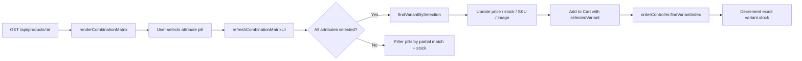
```mermaid
flowchart LR
    A[GET /api/products/:id] --> B[renderCombinationMatrix]
    B --> C[User selects attribute pill]
    C --> D[refreshCombinationMatrixUI]
    D --> E{All attributes selected?}
    E -->|Yes| F[findVariantBySelection]
    F --> G[Update price / stock / SKU / image]
    E -->|No| H[Filter pills by partial match + stock]
    G --> I[Add to Cart with selectedVariant]
    I --> J[orderController.findVariantIndex]
    J --> K[Decrement exact variant.stock]
```

### Key Files

| File | Role |
|------|------|
| `models/attribute.js` | Master attribute library schema (name, values[]) — feeds product form auto-fill *(v4.2.0)* |
| `controllers/attributeController.js` | Attribute CRUD + duplicate name validation *(v4.2.0)* |
| `models/product.js` | `hasVariants`, `stockQuantity`, combination `variants[]` schema (incl. per-row `buyingPrice`) |
| `utils/variantHelpers.js` | Server-side variant parse/normalize, stock aggregation, order-line matching |
| `controllers/productController.js` | Create/update product — matrix parse, `applyProductStockFields()` |
| `controllers/orderController.js` | Exact combination stock decrement on order placement |
| `utils/cartMergeService.js` | `selectedVariant`-aware cart line normalization |
| `client/admin.html` | Manage Products scroll wrapper, variant matrix tables, Edit Product modal shell |
| `client/js/admin.js` | Matrix generator, dynamic SKU, image auto-fill, edit re-hydration, clean-URL admin routing, session-based pagination (`saveProductPaginationState`, `persistProductListSessionState`) |
| `client/css/admin.css` | Bordered variant matrix grid, Manage Products sticky headers (`z-index: 20`), scroll container styles |
| `client/product-details.html` | Variant selector shell, SKU meta bar, Add to Cart actions |
| `client/js/product-details.js` | Smart matrix listener, live price/stock/SKU sync, cart item builder |
| `client/js/variantUtils.js` | Client helpers — `getOptionState`, `findVariantBySelection`, `buildVariantCartMeta` |
| `client/css/product-details.css` | Pill states (`.is-oos`, `.is-unavailable`), selected-variant meta bar |
| `client/js/cart.js` / `client/js/stockAlert.js` | Combination-aware stock resolution in cart & wishlist |

---

## 🛡️ Admin Panel — Order Security & Refund Controls

Enterprise-grade refund governance for the Super Admin panel — full visibility into cancellation and return reasons, wallet-integrated return approval, and a safety-checked refund reversal mechanism.

### Feature Overview

#### Enhanced Live Order Tracking
- Status cells render **context-aware badges**: `Cancelled (Customer)`, `Cancelled (Admin)`, `Return Requested`, `Returned`, `Refunded`.
- A **View Reason** control exposes cancellation/return details in a modal via `getOrderReasonDetails()` — including `initiatedBy` and full reason text.
- Return-requested orders surface an **Approve Return** action; returned/refunded orders within the undo window show **Undo Refund**.
- **Premium sticky-header table** (v3.7.0) with compact columns, green accent totals, and a horizontal **Actions** toolbar.
- **One-click multi-provider courier dispatch** — **`🚚 Send to Courier`** with **Smart Hybrid Mode** (live Steadfast API when credentials are configured; mock `SF/PT/RX-PENDING-XXXXX` IDs when absent); saves tracking IDs, marks the order **Shipped**, and shows a clickable **`🚚 Sent`** tracking badge on booked rows.

#### Return Approval & Wallet Integration
- `approveOrderReturn()` atomically transitions status **`Return Requested` → `Returned`**, records `refundedAt` and `refundAmount` (full order value: **`grandTotal + walletApplied`**), and credits the customer's **wallet balance**.
- A **`walletHistory`** entry of type **`CREDIT`** is prepended with `referenceOrder`, amount, and note (`Refund for returned items`).
- If wallet credit fails, the order status is **rolled back** to `Return Requested` — no orphaned refunds.

> 📌 Checkout-time wallet debits, payment-step UX, and the full ledger model are documented in [Store Wallet, Dynamic Checkout Deduction & Refund Engine](#-store-wallet-dynamic-checkout-deduction--refund-engine).

#### Safe Refund Reversal ("Undo Refund")
- Admins can reverse an accidental refund within **`refundUndoWindowHours`** (default **72h**, configurable in Master Settings).
- `undoOrderRefund()` performs layered safety checks:
  1. Order status must be **`Returned`** or **`Refunded`**
  2. Refund undo window must not have expired (`isWithinRefundUndoWindow()`)
  3. Customer **wallet balance must be ≥ refund amount** — blocks undo if funds were already spent
- On success: wallet debited, `walletHistory` reversal entry logged, order status restored to `statusBeforeRefund`.
- On wallet debit failure: order refund metadata is **restored** to prevent inconsistent state.

### Refund Undo Workflow

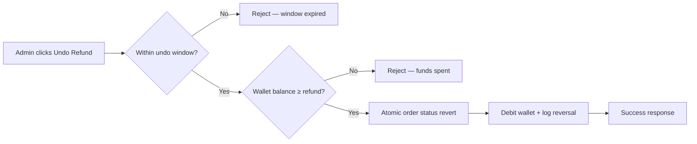
```mermaid
flowchart LR
    A[Admin clicks Undo Refund] --> B{Within undo window?}
    B -->|No| C[Reject — window expired]
    B -->|Yes| D{Wallet balance ≥ refund?}
    D -->|No| E[Reject — funds spent]
    D -->|Yes| F[Atomic order status revert]
    F --> G[Debit wallet + log reversal]
    G --> H[Success response]
```

---

## 💳 Store Wallet, Dynamic Checkout Deduction & Refund Engine

A production-ready **store wallet** layer that connects checkout, payment, order persistence, and admin refund governance through atomic balance operations and a full transaction ledger.

### Checkout Wallet Deduction

- **Real-time interactive deduction** on the **Checkout** summary and **Payment** step for logged-in customers with a positive `walletBalance`.
- Prominent **Your Wallet Balance** display with an **Apply Wallet Balance (Available: ৳XXX)** checkbox.
- **Dynamic Grand Total adjustment** — JavaScript recalculates payable amount instantly:
  - **Full coverage** — when wallet ≥ order total, payable becomes **৳0** and **Paid via Wallet** is auto-selected on the payment step.
  - **Partial coverage** — wallet amount is deducted from the grand total; the remaining balance is collected via **COD** or the selected payment gateway.
- Summary rows surface **Wallet Applied** and **Amount to Pay** before proceeding to payment.

### Backend Order & Ledger Logic

- `POST /api/orders` accepts `applyWallet: true` — the server never trusts client wallet amounts; it computes `walletApplied = min(user.walletBalance, grandTotal)` after coupon and delivery totals are locked.
- **`walletApplied`** is persisted on `models/order.js`; `paymentMethod` becomes **`Wallet`** when the order is fully covered.
- **`utils/walletService.js`** performs atomic debits via `findOneAndUpdate` with a balance guard; on failure the order (and coupon slot, if any) is rolled back.
- Each debit appends a ledger record:

  `{ type: 'DEBIT', amount, referenceOrder: orderId, note: 'Used for Order placement' }`

- Wallet history lives on `User.walletHistory[]` with optional **`referenceOrder`** for traceability.

### Admin Refund Workflow

- When an admin approves a **Return Requested** order, **`creditWalletForUser()`** automatically credits the approved refund amount back to `user.walletBalance`.
- Refund totals include any wallet used at checkout: **`grandTotal + walletApplied`** — ensuring the customer receives the full value they paid.
- Each credit appends a ledger record:

  `{ type: 'CREDIT', amount, referenceOrder: orderId, note: 'Refund for returned items' }`

- **Safe Undo Refund** debits the wallet with a **`DEBIT`** reversal entry when balance permits, restoring the prior order status within `refundUndoWindowHours`.

### Wallet Transaction Ledger

| Type | Trigger | Fields recorded |
|------|---------|-----------------|
| `DEBIT` | Checkout wallet application | `amount`, `referenceOrder`, `note`, `date` |
| `CREDIT` | Admin return/refund approval | `amount`, `referenceOrder`, `note`, `date` |
| `DEBIT` | Refund undo (admin) | `amount`, `note`, `date` |
| `credit` / `conversion` / `cashback` | Points conversion, delivery rewards | Legacy-compatible types preserved |

Customers view the ledger on **Profile → Wallet & Points**; credits and debits render with signed amounts and descriptive notes.

### Key Files

| File | Role |
|------|------|
| `utils/walletService.js` | Atomic debit/credit/reversal helpers + ledger entry builder |
| `controllers/orderController.js` | Wallet application on `createOrder`, refund credit on `approveOrderReturn` |
| `models/user.js` | `walletBalance`, `walletHistory[]` (with `referenceOrder`) |
| `models/order.js` | `walletApplied` snapshot per order |
| `client/js/checkout.js` | Wallet UI, checkbox, live total recalculation |
| `client/js/payment.js` | Wallet summary, auto-select **Paid via Wallet**, dynamic method catalog & processing-fee totals |
| `client/js/profile.js` | Wallet balance display + transaction history rendering |

---

## 💳 Dynamic Payment Methods & Gateway Integration

An **enterprise-grade, database-driven payment catalog** that unifies manual Bangladeshi mobile wallets, bank transfers, and automated payment aggregators under a single `PaymentMethod` schema — with encrypted credential storage, admin CRUD, dynamic checkout rendering, and IPN callback infrastructure ready for production gateway webhooks.

### Feature Overview

#### Dynamic & Enterprise Payment Gateway Architecture

- **Dedicated `PaymentMethod` Mongoose schema** (`models/PaymentMethod.js`) — every accepted method (Manual or Automated) is one document; orders, IPN URLs, and ledger exports reference the stable `code` slug.
- **Dual payment types:**
  - **Manual** — bKash, Nagad, Rocket, Bank Transfer, and custom wallet labels; surfaces merchant `accountNumber` and customer-facing `instructions` on checkout.
  - **Automated** — SSLCommerz, Aamarpay, ShurjoPay, Stripe, and extensible **Custom** providers; credentials stored in nested `apiConfig`.
- **Encrypted API configuration storage** — sensitive fields (`storePassword`, `apiKey`, `storeId`, `isSandbox`) sealed at rest with **AES-256-GCM** via `utils/cryptoVault.js`; admin reads return **masked** secrets; server-side initiate/IPN paths decrypt on demand.
- **Dynamic processing fee calculations** — per-method **Flat (৳)** or **Percentage (%)** surcharges via `computeFee(amount)`; percentage fees capped at 100% at schema validation.
- **Customizable checkout display ordering** — `sortOrder` index drives public method lists; admin **`PATCH /api/admin/payment-methods/reorder`** for drag-free batch reorder.
- **IPN (Instant Payment Notification) callback readiness** — `POST|GET /api/payments/ipn/:code` resolves the method by `code` and delegates to provider adapters in `utils/paymentGatewayAdapters.js` for future aggregator webhook verification.

| Schema Field | Type | Purpose |
|--------------|------|---------|
| `name` | String | Display label on checkout and admin grid |
| `code` | String (unique) | Stable machine key for orders, IPN URLs, and exports |
| `type` | `manual` \| `automated` | Determines visible fields and credential handling |
| `provider` | Enum | Gateway adapter key (`sslcommerz`, `aamarpay`, …) |
| `logoUrl` | String | Public logo path (uploaded or default brand asset) |
| `instructions` | String | Manual payment steps shown on checkout |
| `accountNumber` | String | Merchant wallet / bank account (manual only) |
| `processingFee` + `feeType` | Number + `flat` \| `percentage` | Surcharge applied to order payable |
| `sortOrder` | Number | Checkout display sequence (ascending) |
| `apiConfig` | Subdocument | `storeId`, encrypted `storePassword` / `apiKey`, `isSandbox`, `webhookUrl` |
| `isActive` | Boolean | Soft toggle without deleting configuration |

#### Admin Management Panel UI/UX Enhancements

From **Admin Panel → System Settings → Accepted Payment Methods** (`client/admin.html`):

- **Modern high-contrast Tailwind grid** — responsive `grid-cols-1 md:grid-cols-2 lg:grid-cols-3` card layout (`.pm-methods-grid`) with logo, name, type badge, fee summary, and action controls.
- **Dynamic modal forms** — `#paymentMethodModal` renders **Manual** fields (instructions, account number) or **Automated** fields (provider dropdown, sandbox toggle, API credentials) based on selected `type`.
- **Multi-format logo upload** — Multer `paymentMethodLogoUpload` accepts **PNG, JPG, JPEG, WEBP, and SVG**; files land in `public/uploads/payments/` with real-time **FileReader** client-side image previews before save.
- **High-contrast active/inactive toggle** — `PATCH /api/admin/payment-methods/:id/toggle` flips `isActive` with immediate grid refresh; inactive methods are excluded from storefront APIs.
- **Accessible modal UX** — top-right close button, overlay click-to-dismiss, `role="dialog"` / `aria-modal="true"`, and streamlined action buttons (no duplicate save/delete controls).

#### Storefront & Checkout Dynamic Rendering

- **Eliminated hardcoded payment options** — `client/payment.html` and `client/js/payment.js` load the live catalog from **`GET /api/payments/methods`** (alias: **`GET /api/store/payment-methods`**) on page init.
- **Sorted active methods** — only `isActive: true` entries render, ordered by `sortOrder` then `name`; each card shows logo, description, fee badge, and type-specific detail panel.
- **Manual method instructions** — selected manual wallets reveal merchant account number and step-by-step payment instructions inline.
- **Real-time frontend fee calculations** — `updatePaymentTotals()` adjusts **Processing Fee** and **Amount to Pay** rows instantly when the customer switches methods; base payable respects wallet deductions from the checkout session.
- **Order placement mapping** — `handleFinalOrderSubmission()` sends `paymentMethodId` and resolved method name to **`POST /api/orders`** for accurate ledger, invoice, and IPN correlation.

#### Database & System Stability Fixes

- **`sealApiCredentials` pre-save middleware** — refactored in `models/PaymentMethod.js` to follow modern **async/await-compatible** synchronous sealing logic; manual methods automatically purge stale `apiConfig` / `provider` fields on every save.
- **Duplicate-free admin interface** — payment method action buttons consolidated in the grid and modal footer; loading skeleton (`#paymentMethodsLoading`) prevents flash of empty state during fetch.
- **Default method seeding** — `seedDefaultPaymentMethods()` in `utils/paymentMethodService.js` bootstraps common Bangladeshi methods on server start when the catalog is empty.

### Architectural Workflow

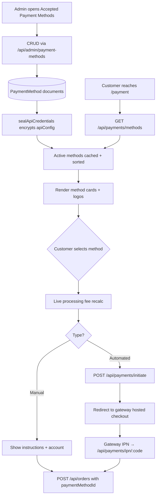
```mermaid
flowchart TD
    A[Admin opens Accepted Payment Methods] --> B[CRUD via /api/admin/payment-methods]
    B --> C[(PaymentMethod documents)]
    C --> D[sealApiCredentials encrypts apiConfig]
    D --> E[Active methods cached + sorted]

    F[Customer reaches /payment] --> G[GET /api/payments/methods]
    G --> E
    E --> H[Render method cards + logos]
    H --> I{Customer selects method}
    I --> J[Live processing fee recalc]
    J --> K{Type?}
    K -->|Manual| L[Show instructions + account]
    K -->|Automated| M[POST /api/payments/initiate]
    M --> N[Redirect to gateway hosted checkout]
    N --> O[Gateway IPN → /api/payments/ipn/:code]
    L --> P[POST /api/orders with paymentMethodId]
    O --> P
```

### Related API Endpoints

| Method | Endpoint | Description | Auth |
|--------|----------|-------------|------|
| `GET` | `/api/payments/methods` | Active payment methods in checkout display order (fees, logos, manual instructions — no secrets) | Public |
| `GET` | `/api/store/payment-methods` | Storefront alias for the public method list | Public |
| `POST` | `/api/payments/initiate` | Bootstrap hosted-checkout session for an automated gateway | User |
| `POST` \| `GET` | `/api/payments/ipn/:code` | IPN / success-callback target for gateway webhooks | Public |
| `GET` | `/api/admin/payment-methods` | Full admin catalog (masked credentials) | Admin + `manage_settings` |
| `POST` | `/api/admin/payment-methods` | Create method (multipart logo upload supported) | Admin + `manage_settings` |
| `GET` | `/api/admin/payment-methods/:id` | Single method detail | Admin + `manage_settings` |
| `PUT` | `/api/admin/payment-methods/:id` | Update method (partial fields + optional logo) | Admin + `manage_settings` |
| `PATCH` | `/api/admin/payment-methods/:id/toggle` | Flip `isActive` without deletion | Admin + `manage_settings` |
| `PATCH` | `/api/admin/payment-methods/reorder` | Batch update `sortOrder` values | Admin + `manage_settings` |
| `DELETE` | `/api/admin/payment-methods/:id` | Remove method and purge local logo file | Admin + `manage_settings` |

### Configuration & Encryption

| Variable | Required | Purpose |
|----------|:--------:|---------|
| `PAYMENT_ENCRYPTION_KEY` | ⛔ | 64-char hex or passphrase for AES-256-GCM credential vault (preferred) |
| `ENCRYPTION_KEY` | ⛔ | Alias for `PAYMENT_ENCRYPTION_KEY` |
| `JWT_SECRET` | ✅* | Fallback key derivation when dedicated encryption key is unset (startup warning logged) |

> \* Gateway credentials remain readable server-side for initiate/IPN replay — hashing is intentionally avoided; rotation of `PAYMENT_ENCRYPTION_KEY` requires re-entering credentials in the admin panel.

### Key Files

| File | Role |
|------|------|
| `models/PaymentMethod.js` | Schema, `sealApiCredentials`, `computeFee()`, credential decrypt helpers |
| `controllers/paymentMethodController.js` | Admin CRUD, validation, Multer logo handling, reorder, toggle |
| `controllers/paymentIpnController.js` | Public method list, gateway initiate, IPN dispatch |
| `controllers/storeController.js` | Storefront payment-methods alias endpoint |
| `utils/cryptoVault.js` | AES-256-GCM encrypt/decrypt/mask for gateway secrets |
| `utils/paymentMethodService.js` | Cache, seed defaults, webhook URL builder, checkout readiness checks |
| `utils/paymentGatewayService.js` | Gateway session orchestration layer |
| `utils/paymentGatewayAdapters.js` | Provider-specific initiate/IPN adapter stubs |
| `utils/paymentLogoPaths.js` | Local logo path helpers and cleanup on delete |
| `middlewares/uploadMiddleware.js` | `paymentMethodLogoUpload` — PNG/JPG/JPEG/WEBP/SVG Multer config |
| `routes/paymentRoutes.js` | Public `/api/payments/*` surface |
| `routes/adminRoutes.js` | Admin `/api/admin/payment-methods/*` CRUD routes |
| `client/admin.html` | Accepted Payment Methods grid + modal form UI |
| `client/js/admin.js` | Payment method manager wiring, FileReader previews, toggle/reorder |
| `client/payment.html` | Dynamic payment step — no hardcoded gateway cards |
| `client/js/payment.js` | Method fetch, fee recalculation, order submission |
| `client/js/paymentBrandLogos.js` | Default brand logo fallbacks for known providers |
| `client/css/payment.css` | Checkout payment step styling |

---

## 🦶 Dynamic Footer, CMS Pages & Customer Inquiries

A **storefront content layer** that combines an admin-managed global footer, a Markdown **Page Content Manager**, premium information pages, and a **Customer Messages Inbox** — all backed by MongoDB singletons and served through clean Express routes.

### Information Pages Redesign & Branding

| Page | Route | Layout |
|------|-------|--------|
| **Contact Us** | `/contact` | **2-column premium grid** — left: floating-label contact form with **`POST /api/contact`** submission; right: dynamic store info cards (address, phone, email, hours) + Google Maps embed from `contactMeta` |
| **About Us** | `/about` | Hero banner + card body loaded from CMS (`PageContent` slug `about`) |
| **Privacy Policy** | `/privacy-policy` | Shared `cms-page.html` + `info-page.css` hero/card template |
| **Terms & Conditions** | `/terms` | Shared `cms-page.html` + `info-page.css` hero/card template |
| **Careers** | `/careers` | Shared `cms-page.html` + `info-page.css` hero/card template |

**Design system:** `client/css/info-page.css` — gradient hero headers, `max-width: 64rem` containers, elevated white cards, improved line-height (`1.75`), and responsive typography. Contact page uses dedicated `client/css/contact.css` with glass-style form panel and info-card icons.

**Unpublished pages:** When **Published on storefront** is **OFF** in Page Content Manager (`isPublished: false` / `isActive: false`):
- Internal footer links to that slug are **filtered out** of the public footer payload.
- Direct visits to `/about`, `/contact`, `/privacy-policy`, `/terms`, or `/careers` receive **404 / Page Unavailable** from **`GET /api/store/pages/:slug`**.

### Dynamic Footer Engine

| Component | Purpose |
|-----------|---------|
| **`models/FooterSettings.js`** | Singleton document — `columns[]`, `socialLinks[]`, `copyrightText`, `paymentGateways[]` |
| **`client/js/footerRenderer.js`** | Shared HTML builder — used by storefront `footer.js` and admin **Footer Settings** live preview |
| **`controllers/footerSettingsController.js`** | Admin CRUD + icon upload (`POST /api/admin/footer-settings/upload-icon`) |
| **`utils/pagePublishService.js`** | Maps footer link URLs → page slugs; filters columns against published CMS pages |

### Desktop Footer Architecture (v4.5.0)

Complete storefront footer redesign for an enterprise e-commerce layout — dual markup from `footerRenderer.js` with desktop-specific structure in `.footer-desktop`.

| Area | Implementation |
|------|----------------|
| **Modernized theme** | App-style deep slate-grey background (`bg-slate-900` / `#0f172a`) with subtle micro-border separator from main content (`border-t border-slate-800` / `rgba(30, 41, 59, 0.8)`) |
| **Balanced 4-column grid** | Uniform desktop layout — **`grid grid-cols-1 md:grid-cols-4 gap-8 items-start max-w-7xl mx-auto px-4`** — aligns **Company**, **Support**, **Quick Links**, and **Follow Us** across four equal columns (`.footer-main` + `display: contents` column wrap) |
| **Column headings** | Unified `<h4>` typography across all four columns — `text-sm font-bold tracking-wider text-white uppercase mb-4` (`14px`, weight 700, letter-spacing 0.05em) |
| **Column 4 — Follow Us** | **Social media only** — left-aligned **Follow Us** heading + active social icons (Facebook, Instagram, TikTok, …) in `.footer-col--social`; matching column height and whitespace with columns 1–3 (no payment section in upper grid) |
| **Bottom copyright bar** | Restructured **`.footer-copyright-bar`** — darker inset strip (`#0c1222`), `border-t border-slate-800/80`, `mt-8`, `pt-4`; inner row **`flex flex-col md:flex-row items-center justify-between gap-4`** |
| **Copyright (bottom-left)** | Full admin `copyrightText` on desktop — e.g. `© 2026 EonlineBazar. All rights reserved. Designed by Abdul Karim Sheikh` (`.footer-copyright-text`) |
| **Payment badges (bottom-right)** | Relocated gateway logos (bKash, Nagad, Visa, Mastercard, COD) to **`.footer-copyright-payments`** — ultra-sleek **`flex items-center gap-2`** badge row; no visible "Accepted Payment Methods" heading (uses `aria-label` for accessibility); **`hidden md:flex`** on mobile |

**Admin UI:** **System Settings → Footer Settings** — column/link manager, social preset picker + custom icon upload, payment badge manager, copyright field, interactive toggle switches (no visible native checkboxes).

### Ultra-Compact 3-Line Mobile Footer Architecture

On mobile viewports (**&lt; 768px**, Tailwind **`md:`** breakpoint equivalent), the storefront footer abandons bulky vertical column blocks and accordions to **eliminate scroll fatigue**. `footerRenderer.js` emits **dual markup** — a mobile-only strip (`.footer-mobile-compact`) and a desktop-only grid (`.footer-desktop`) — toggled purely via CSS media queries in `client/css/footer.css` (no layout shift on admin-managed content).

```
Mobile (< 768px)                         Desktop (≥ 768px)
────────────────                         ─────────────────
Line 1: About  Contact  Track  Privacy    ┌────────┬────────┬────────┬──────────┐
Line 2: [Social icons — tap states]         │Company │Support │ Quick  │ Follow Us│
Line 3: © 2026 EonlineBazar. Designed…      │        │        │ Links  │ + Social │
  (mb-0 · pb-1 · no payment badges)         └────────┴────────┴────────┴──────────┘
                                           ┌──────────────────────────────────────┐
                                           │ © Copyright …     [bKash][Visa][…]  │
                                           └──────────────────────────────────────┘
                                             .footer-copyright-bar (justify-between)
```

| Line | Mobile element | CSS class / behavior |
|------|----------------|---------------------|
| **Line 1** | Essential quick links as a **bulletless flex-wrap centered row** — `About Us`, `Contact Us`, `Track Order`, `Privacy Policy` (`10.5px`, slate-300). Uses **`flex-wrap justify-center gap-x-2.5`** (`column-gap: 10px`) to eliminate text clipping and overflow across all mobile viewport widths. Links resolved from active footer column data with URL fallbacks via `resolveMobileEssentialLinks()`. | `.footer-mobile-quicklinks` |
| **Line 2** | **Centered social media icons only** — active handles (Facebook, Instagram, TikTok, …) in a flex row with smooth **tap/hover states** (`scale(0.9)` → `scale(0.95)`, emerald highlight on active). **Payment gateway badges hidden on mobile** (`hidden md:flex` — `.footer-copyright-payments` and mobile-strip payment classes use `display: none !important`). | `.footer-mobile-social-row` / `.footer-mobile-social-icons` |
| **Line 3** | **Minimalist copyright** — super-compact **`10px`** attribution (`© 2026 EonlineBazar. Designed by Abdul Karim Sheikh`); admin `copyrightText` auto-shortened by stripping *"All rights reserved"* on mobile. **Zero trailing whitespace:** `mb-0`, `pb-1` cleanup on copyright line, footer container, and `#global-site-footer`. **Floating action safety:** right-side buffer padding on `.footer-mobile-compact` (`max(54px, calc(8px + env(safe-area-inset-right)))`) so the fixed WhatsApp action icon never obscures link text. | `.footer-mobile-copyright` |

**Responsive isolation:** Mobile strip uses **`display: flex`** below **`768px`** and **`display: none`** at **`md+`**. Desktop grid uses **`display: none`** below **`768px`** and **`display: block`** at **`md+`** with **`grid-template-columns: repeat(4, minmax(0, 1fr))`** — upper grid holds link columns + **Follow Us** only; payment badges render **desktop-only** in **`.footer-copyright-payments`** via `@media (min-width: 768px) { display: flex }`.

**Key implementation files:** `client/js/footerRenderer.js` (`buildMobileCompactFooterHtml`, `buildDesktopFooterHtml`, `resolveMobileEssentialLinks`), `client/css/footer.css`, `client/js/footer.js`.

### Page Content Manager (CMS)

| Field | Description |
|-------|-------------|
| `slug` | `about` · `contact` · `privacy-policy` · `terms` · `careers` |
| `title` / `subtitle` | Hero banner copy on information pages |
| `bodyMarkdown` | Markdown source — rendered to `bodyHtml` on save via `utils/markdownToHtml.js` |
| `isPublished` | Controls footer visibility **and** public page access |
| `contactMeta` | *(contact slug only)* — `address`, `phone`, `email`, `hours`, `mapEmbedUrl` |

**Admin UI:** **System Settings → Page Content Manager** — tabbed page selector, Markdown textarea, publish toggle with explicit OFF behavior documentation, contact-specific store-detail fields. Live preview removed in v4.5.0 for a cleaner editing surface.

### Admin Customer Messages Inbox — Direct Email Reply & Outlook Split Inbox

```
Storefront                    Backend                              Admin Panel
──────────                    ───────                              ───────────
/contact form  ──POST──►  ContactMessage (MongoDB)       ◄──GET──  /admin/messages
                          rate-limited /api/contact              Outlook 2-column split inbox
                          Nodemailer SMTP reply dispatch  ◄──POST── /api/inquiries/:id/reply
```

#### 1. Backend Email & Inquiry Infrastructure

| Component | Details |
|-----------|---------|
| **SMTP Integration** | Production **Nodemailer** transport in **`utils/mailer.js`** — credentials from **`SMTP_HOST`**, **`SMTP_PORT`**, **`SMTP_USER`**, **`SMTP_PASS`**, **`SMTP_FROM`** (with `EMAIL_USER` / `EMAIL_PASS` fallback). Supports **465 → 587 port failover**, pooled connections, bounded timeouts, and branded responsive HTML templates. |
| **Extended Inquiry Schema** | **`models/ContactMessage.js`** — `name`, `email`, `phone`, `subject`, `message`, **`status`** enum (`'unread'` · `'read'` · `'replied'`), **`replyMessage`**, **`repliedAt`**, legacy `isRead` sync, and **`toAdminObject()`** serializer for the admin UI. |
| **Public Submit** | **`POST /api/contact`** — validated payload (name, email, phone, subject, message); **10 requests / 15 min** IP rate limit via `routes/contactRoutes.js`. |
| **Reply API** | **`POST /api/inquiries/:id/reply`** (`routes/inquiryRoutes.js`) — admin-only (`verifyAdmin` + `manage_settings`); validates inquiry existence and reply length (≥ 5 chars); calls **`sendInquiryReplyEmail()`** to dispatch a branded HTML reply to the customer; on success sets **`status: 'replied'`**, persists **`replyMessage`** + **`repliedAt`**, and logs a security event. Returns **502** if SMTP delivery fails. |
| **Inbox CRUD** | **`GET /api/admin/messages`** · **`PATCH /api/admin/messages/:id/read`** · **`PATCH /api/admin/messages/:id/unread`** · **`DELETE /api/admin/messages/:id`** — all gated by **`manage_settings`**. Replied inquiries cannot be marked unread; read/unread toggles sync the `status` field. |

#### 2. Microsoft Outlook Style 2-Column Split Inbox UI

| Capability | Details |
|------------|---------|
| **2-Column Split Architecture** | Full-height, zero-whitespace layout — **`grid grid-cols-12`** container (`h-[calc(100vh-140px)]`, rounded border, overflow hidden). **Left (~35% / 4 cols):** scrollable inquiry list. **Right (~65% / 8 cols):** active reading & reply pane. Implemented in **`client/admin.html`** + **`client/css/admin.css`** (`.outlook-inbox-shell`, `.support-inbox-split`). |
| **Dynamic Filters & Search** | Real-time search across **Name**, **Email**, and **Subject** (`#messagesSearchInput`). Status tabs — **All**, **Unread**, **Replied** — with live count badges (`#supportTabCountAll`, `#supportTabCountUnread`, `#supportTabCountReplied`). |
| **Master List Item Styling** | Compact list cards (`#messagesInboxList`) — colored **initial avatar**, customer name, relative timestamp, **bold subject line**, 1-line muted message snippet. **Active selected state:** left border accent (`border-l-4 border-blue-600 bg-blue-50/60 dark:bg-slate-800`). Unread names render bold. |
| **Comprehensive Reading & Reply Pane** | **`#inquiryDetailPane`** — top bar with subject, uppercase **READ / UNREAD / REPLIED** badge, **Mark Read/Unread** and **Delete** actions; sender card with email/phone and **1-click copy** icons; full message body in styled reading card (`bg-slate-50` / slate border); prior admin reply block when `status === 'replied'`; fixed bottom **Reply via Email** textarea with character counter, **Send Email Reply** button, loading spinner, and SweetAlert2 success/error toasts. Selecting an unread message auto-marks it read. |

| Admin access | Sidebar **Messages / Inquiries** or navigate to **`/admin/messages`** |
| RBAC | Routes gated by **`manage_settings`** |

### API Endpoints

| Method | Endpoint | Description | Auth |
|--------|----------|-------------|------|
| **`POST`** | **`/api/contact`** | **Submit contact form → `ContactMessage` collection** | **Public** (rate-limited) |
| **`GET`** | **`/api/store/footer-settings`** | **Public footer payload (active columns, social, payment badges — unpublished page links filtered)** | **Public** |
| **`GET`** | **`/api/store/pages/:slug`** | **Published CMS page content (+ `contactMeta` for contact slug)** | **Public** |
| **`GET`** | **`/api/admin/footer-settings`** | **Full footer config for admin editor** | **Admin + `manage_settings`** |
| **`PUT` / `POST`** | **`/api/admin/footer-settings`** | **Save footer columns, social links, copyright, payment badges** | **Admin + `manage_settings`** |
| **`POST`** | **`/api/admin/footer-settings/upload-icon`** | **Upload social/payment icon (multipart `icon`)** | **Admin + `manage_settings`** |
| **`GET`** | **`/api/admin/pages`** | **List all CMS pages (admin)** | **Admin + `manage_settings`** |
| **`PUT` / `POST`** | **`/api/admin/pages/:slug`** | **Save page Markdown, publish state, contact meta** | **Admin + `manage_settings`** |
| **`GET`** | **`/api/admin/messages`** | **List customer inquiries + unread count** | **Admin + `manage_settings`** |
| **`PATCH`** | **`/api/admin/messages/:id/read`** | **Mark inquiry as read** | **Admin + `manage_settings`** |
| **`PATCH`** | **`/api/admin/messages/:id/unread`** | **Mark inquiry as unread** | **Admin + `manage_settings`** |
| **`POST`** | **`/api/inquiries/:id/reply`** | **Send branded HTML email reply; set status to `replied`** | **Admin + `manage_settings`** |
| **`DELETE`** | **`/api/admin/messages/:id`** | **Delete inquiry** | **Admin + `manage_settings`** |

### Clean URL Routes

| URL | Serves |
|-----|--------|
| `/about` | `about.html` |
| `/contact` | `contact.html` |
| `/privacy-policy` | `cms-page.html` |
| `/terms` | `cms-page.html` |
| `/careers` | `cms-page.html` |
| `/admin/messages` | `admin.html` (auto-opens Messages / Inquiries section) |
| `/footer` | Legacy `footer.html` fragment (storefront uses API-driven `footer.js`) |

### Key Files

| File | Role |
|------|------|
| `models/FooterSettings.js` | Footer singleton schema + defaults |
| `models/PageContent.js` | CMS page schema + careers/contact meta seeds |
| `models/ContactMessage.js` | Contact form persistence — extended inquiry schema with reply fields |
| `controllers/footerSettingsController.js` | Footer admin/public handlers |
| `controllers/pageContentController.js` | CMS CRUD |
| `controllers/contactController.js` | Public submit, admin inbox CRUD, **`replyContactMessage`** email dispatch |
| `routes/contactRoutes.js` | `POST /api/contact` with rate limiter |
| `routes/inquiryRoutes.js` | **`POST /api/inquiries/:id/reply`** — direct email reply endpoint |
| `utils/mailer.js` | Nodemailer SMTP transport + **`sendInquiryReplyEmail()`** branded HTML builder |
| `utils/pagePublishService.js` | Footer link ↔ published page slug filtering |
| `utils/markdownToHtml.js` | Server-side Markdown rendering |
| `utils/footerIconPaths.js` | Uploaded footer icon storage paths |
| `client/js/footerRenderer.js` | Shared footer HTML builder |
| `client/js/footer.js` | Storefront footer fetch + inject |
| `client/js/page-content-loader.js` | CMS page hero/card renderer |
| `client/js/contact.js` | Contact form API submit + store info panel |
| `client/css/info-page.css` | Premium information page design system |
| `client/css/contact.css` | Contact page 2-column layout |
| `client/css/footer.css` | **`bg-slate-900`** desktop 4-column grid (`max-w-7xl`) + **Follow Us-only column 4** + **copyright bar payment badges** (desktop-only, `justify-between`) + **ultra-compact 3-line zero-margin mobile footer** with flex-wrap quick links, hidden mobile payments, tap-state social icons, and WhatsApp float clearance |
| `client/admin.html` | Footer Settings, Page Content Manager, **Outlook split Messages / Inquiries** inbox |
| `client/js/admin.js` | Footer manager, page CMS, **split-pane inbox** (`selectInquiry`, `populateInquiryDetailPane`, `sendInquiryReply`) |
| `client/css/admin.css` | **Outlook split inbox** styles — list pane, reading pane, sender card, reply editor |

---

## 👑 VIP Customer Segmentation & Retention Logic

An admin-driven **customer retention** layer that scores buyers by lifetime spend and order volume, then surfaces actionable segments in the customer management console.

### Dynamic Threshold Settings (Master Settings)

Configured from **Admin Panel → Master Settings → VIP Customer Segmentation** (`models/Setting.js`):

| Setting | Default | Purpose |
|---------|---------|---------|
| `vipMinTotalSpent` | `10000` | Minimum lifetime spend (৳) to qualify as **VIP / Top Buyer** |
| `vipMinOrderCount` | `5` | Minimum completed order count to qualify as **VIP / Top Buyer** |
| `frequentBuyerMinOrders` | `3` | Minimum orders for **Frequent Buyer** tag (when not VIP) |

A customer is tagged **VIP** when **either** spend **or** order-count threshold is met. **Frequent Buyer** applies when order count meets the frequent threshold but VIP criteria are not satisfied.

### Admin Customer Management

- **Quick-filter tabs** above the customer table:
  - **[All Customers]**
  - **[👑 VIP / Top Buyers]**
  - **[Frequent Buyers]**
- Table columns include **Total Spent**, **Segment badge**, and a 👑 indicator on VIP names.
- Aggregation runs server-side in `getAllCustomers()` — totals sum **`grandTotal + walletApplied`** across non-cancelled orders for accurate lifetime value.

### Key Files

| File | Role |
|------|------|
| `controllers/adminController.js` | Order aggregation, segment resolution, threshold-aware enrichment |
| `models/Setting.js` | VIP / frequent-buyer threshold fields |
| `controllers/masterSettingsController.js` | Persist thresholds via unified Master Settings save |
| `client/js/admin.js` | Segment tabs, badges, filtered table rendering |
| `client/admin.html` | Customer segment tab UI + threshold form inputs |

---

## ⚡ Flash Sale & Bulk Coupon Engine

A time-bound promotional engine that pairs **admin-scheduled flash events** with **storefront countdown UX** and **server-authoritative discounted pricing** — complementing the existing time-sensitive **Coupon** system for bulk / campaign-style promotions.

### Admin Master Settings Control Panel

From **Admin Panel → Master Settings → Flash Sale Engine**:

| Control | Purpose |
|---------|---------|
| **Enable / Disable** | Master toggle for the flash sale window |
| **Sale Title** | Headline shown on the homepage banner |
| **End Date & Time** | Paired `<input type="date">` + `<input type="time">` → ISO expiry timestamp |
| **Discount Percentage** | Global percentage off featured products (0–100) |
| **Featured Products** | Comma-separated `productId` or MongoDB `_id` values |

Saved via **`POST /api/admin/master-settings/update`** alongside other master settings. Live preview text confirms title, discount, product count, and end datetime before save.

### Storefront Display & Dynamic Pricing

- **Homepage banner** (`#flashSaleBanner`) renders when the sale is active — gradient **⚡ Flash Sale** block with sale title and subtitle.
- **Live JavaScript countdown** ticks **Hours : Minutes : Seconds** until expiry; banner auto-hides and product prices revert when the timer reaches zero.
- **`GET /api/store/flash-sale`** exposes public payload: `{ isActive, flashSaleTitle, flashSaleDiscountPercent, flashSaleProductIds, endsAt, serverNow }`.
- **`utils/flashSaleService.js`** applies effective prices on **`GET /api/products`** and search results; **`orderController.createOrder`** re-validates flash prices server-side so clients cannot bypass discounts.
- Product cards show **strikethrough original price**, discounted price, and a **-% badge** during active flash windows.

### Relationship to Coupon Engine

| System | Scope | Mechanism |
|--------|-------|-----------|
| **Coupons** | Code-based, cart/checkout | User-entered promo codes with usage limits & expiry |
| **Flash Sale** | Admin-selected catalog subset | Automatic price override until scheduled end time |

Both systems coexist — coupons adjust merchandise subtotals; flash sale sets catalog selling prices before checkout math begins.

### Key Files

| File | Role |
|------|------|
| `utils/flashSaleService.js` | Active-window checks, product matching, price computation, public payload |
| `models/Setting.js` | Flash sale schema fields |
| `controllers/masterSettingsController.js` | Admin read/save for flash sale config |
| `controllers/productController.js` | Flash-adjusted product list + search results |
| `controllers/storeController.js` | `GET /api/store/flash-sale` |
| `client/js/main.js` | Banner, countdown timer, sale price markup on product cards |
| `client/index.html` | Flash sale banner markup |
| `client/css/home.css` | Banner + countdown + sale price styles |

---

## 📣 Catalog & Marketing Features

Production-grade **coupon lifecycle management** and **marketing operations UX** for the Super Admin panel — resilient admin API reads, full historical coupon visibility, tri-state status indicators, and filter-driven directory views. Complements the [Time-Sensitive Coupon Automation](#-time-sensitive-coupon-automation-system) engine (expiry scheduling, server-clock sync, checkout validation) with operator-facing list controls and display semantics.

### Feature Overview

#### Coupon Fetch Resilience & Display Status Engine

**Problem solved:** Admin coupon list fetching could fail silently or omit historical records; expired and exhausted coupons were not reliably visible in **Manage Coupons**.

**Backend — API & exception handling**

- Hardened **`GET /api/coupons`** and **`GET /api/coupons/:id`** in `controllers/couponController.js`:
  - Wrapped fetch logic in proper `try/catch` blocks with structured `{ success: false, message: 'Failed to load coupons.' }` responses on failure.
  - Runs `runCouponAutoExpiry(now)` before every admin read so stale `ACTIVE` records are corrected server-side.
  - Each coupon in the response includes a computed **`displayStatus`** via `Coupon.deriveDisplayStatus(coupon, now)` from `models/coupon.js`.
- **`POST /api/admin/sync-data`** continues to return a fresh `data.coupons` array with `displayStatus` attached for instant table re-render after **Sync Data**.

**Tri-state display status** (distinct from persisted DB `status` enum `ACTIVE | EXPIRED`):

| Display Status | Condition | Admin Badge |
|----------------|-----------|-------------|
| **ACTIVE** | Not expired, not manually expired/disabled, usage limit not reached | 🟢 Active |
| **EXPIRED** | Past `expiryDate`, or manual `EXPIRED` / legacy `DISABLED` | 🔴 Expired |
| **EXHAUSTED** | `usedCount >= usageLimit` (when limit > 0) | ⚪ Exhausted / Usage Limit Met |

> **Note:** `EXHAUSTED` is a **derived display status** for admin UX; persisted `status` remains `ACTIVE | EXPIRED`.

#### Admin Coupon Directory — Filter Tabs & Status Badges

- Restored **full coupon history** in **Manage Coupons** (`/admin` → Manage Coupons): all records render regardless of lifecycle state.
- Status pills use `renderCouponStatusBadge()` in `client/js/admin.js` with explicit visual indicators for Active, Expired, and Exhausted.
- Client-side fallback `resolveCouponDisplayStatus()` mirrors server logic when `displayStatus` is absent.
- **Dynamic status filter tabs** in `client/admin.html` (`#couponStatusTabs`):

| Tab | Filter | Behaviour |
|-----|--------|-----------|
| **All Coupons** | `data-coupon-filter="all"` | Shows complete historical directory |
| **Active** | `data-coupon-filter="active"` | Rows where `displayStatus === 'ACTIVE'` |
| **Expired** | `data-coupon-filter="expired"` | Rows where `displayStatus === 'EXPIRED'` |

- Wired through `setupCouponStatusTabs()` → `filterCouponsByStatus()` → `renderCouponTable()` in `client/js/admin.js`.
- Empty-state copy when a filter yields no rows: *"No coupons match this filter."*

#### Standardized Expiry & Created Date Formatting

- **Created** and **Expiry** columns use `formatCouponDateTime()` — platform-timezone-aware (`adminPlatformTimezone`, default `Asia/Dhaka`) via `Intl.DateTimeFormat('en-GB', …)`:
  - Format: **`26 Jul 2026, 5:50 PM`** (day, short month, year, 12-hour clock with AM/PM).
- Aligns coupon table timestamps with the admin header live clock zone.

#### Staff & System Settings Polish *(v4.3.2 — reaffirmed)*

The marketing and catalog operator shell shares the same admin UX foundation finalized in v4.3.0–v4.3.2:

| Concern | Implementation |
|---------|----------------|
| **Dual-column Staff Management** | **Create / Edit Staff Account** — responsive 12-column grid: **Staff Account Credentials** (5 cols) + **Granular Role & Permissions Matrix** (7 cols) with emerald ON / slate OFF **toggle switches** and **Quick Role Presets** via `applyRolePreset()` in `client/js/admin-staff.js`. |
| **Clean `/admin` routing** | Browser URL stays pristine at **`/admin`** across refresh (`ensureCleanAdminUrl()`); F5 defaults to **Dashboard Overview**. |
| **Tabbed settings interfaces** | **Admin Settings** — Profile & Security · Store & Shipping · Store Branding (isolated per-section saves). **System Settings** — seven modular configuration cards with targeted `POST /api/admin/master-settings/update` partial payloads. |

> 📌 Deep dives: [Super Admin RBAC & Staff Management Architecture](#-super-admin-rbac--staff-management-architecture) · [Admin & Platform Settings](#-admin--platform-settings) under [Feature Roadmap](#-feature-roadmap-past--present).

### Related API Endpoints

| Method | Endpoint | Description | Auth |
|--------|----------|-------------|------|
| `GET` | `/api/coupons` | List all coupons with **`displayStatus`**; auto-expires overdue records first | Admin + `manage_coupons` |
| `GET` | `/api/coupons/:id` | Single coupon with **`displayStatus`** | Admin + `manage_coupons` |
| **`POST`** | **`/api/admin/sync-data`** | **Global Sync Data — returns fresh `data.coupons[]` with `displayStatus`** | **Admin** |

> Checkout, apply, and order-time coupon endpoints are documented under [Time-Sensitive Coupon Automation — Related API Endpoints](#related-api-endpoints).

### Key Files

| File | Role |
|------|------|
| `controllers/couponController.js` | `getCoupons`, `getCouponById` — exception handling, auto-expiry sweep, `displayStatus` enrichment |
| `models/coupon.js` | `deriveDisplayStatus()` — ACTIVE / EXPIRED / EXHAUSTED derivation |
| `controllers/adminController.js` | Sync Data coupon payload with `displayStatus` |
| `client/js/admin.js` | `setupCouponStatusTabs`, `filterCouponsByStatus`, `renderCouponStatusBadge`, `formatCouponDateTime` |
| `client/admin.html` | `#couponStatusTabs` filter tab markup |
| `client/js/admin-staff.js` | Dual-column staff form, toggle switches, Quick Role Presets *(v4.3.2)* |

> 📌 Expiry scheduling, server-clock synchronization, and checkout validation: [Time-Sensitive Coupon Automation System](#-time-sensitive-coupon-automation-system).

---

## 📊 Admin Analytics & Inventory Management Controls

Real-time sales intelligence and proactive inventory monitoring for the Super Admin panel — live MongoDB aggregation powers the Overview dashboard, Chart.js visualizations, and an actionable low-stock alert widget without disrupting existing admin auth, order workflows, or customer-management modules.

### Feature Overview

#### Interactive Sales & Business Analytics Dashboard
- Integrated **dynamic metric cards** on **Admin Panel → Overview** (`view-overview`) calculating real-time:
  - **Revenue** — Daily, Monthly, and All-time totals (aggregated from **Delivered** orders via `grandTotal` / `totalAmount`)
  - **Order counters** — Total Orders, Pending, Processing, Delivered, and Return Requests
  - **Total Customers** — live user count from the `User` collection
- Secondary **order-status mini-cards** surface Total / Processing / Delivered counts at a glance alongside primary KPIs.
- Embedded **Chart.js** data visualization (CDN-loaded, already used by the admin panel):
  - **Sales Trend line chart** — toggle **Daily** (last 30 days) or **Monthly** (last 12 months) revenue series
  - **Top 5 Selling Products chart** — toggle **Bar** or **Pie** distribution driven by completed-order item quantities
- All chart and card data is fetched from a dedicated admin API (`GET /api/admin/dashboard-analytics`) protected by **`verifyAdmin` + `view_analytics`** — no hard-coded demo values.
- Existing **Customer Insights** metrics (total/verified/pending/blocked users) and the **6-month registration growth chart** remain on the Overview tab below the sales analytics block.

#### Automated Low-Stock & Inventory Alert System
- Operator-facing **Inventory Alerts** widget, **Manage Products** color-coded stock badges, and inline **Update Stock** quick actions on the Super Admin Overview tab.
- Backend query flags products with **`stock <= 5`**, sorted ascending by stock level — **Out of Stock** (red) at zero units, **Low Stock** (amber) under 5 units.

> 📌 Full workflow, threshold matrix, data flow, and key files: [Stock Out & Low Stock Automated Alert Engine](#️-stock-out--low-stock-automated-alert-engine).

### Analytics Data Flow

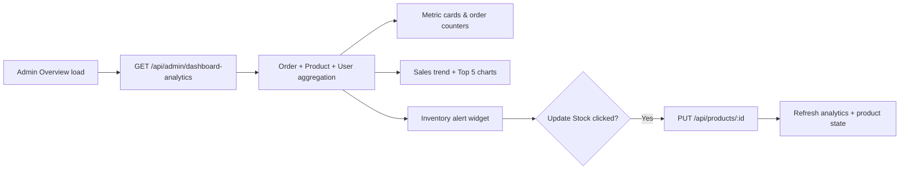
```mermaid
flowchart LR
    A[Admin Overview load] --> B[GET /api/admin/dashboard-analytics]
    B --> C[Order + Product + User aggregation]
    C --> D[Metric cards & order counters]
    C --> E[Sales trend + Top 5 charts]
    C --> F[Inventory alert widget]
    F --> G{Update Stock clicked?}
    G -->|Yes| H[PUT /api/products/:id]
    H --> I[Refresh analytics + product state]
```

### Related API Endpoints

| Method | Endpoint | Description | Auth |
|--------|----------|-------------|------|
| **`GET`** | **`/api/admin/dashboard-analytics`** | **Sales KPIs, order counters, revenue trends, top products & inventory alerts** | **Admin + `view_analytics`** |

**Response shape (`analytics` object):**

| Key | Contents |
|-----|----------|
| `revenue` | `{ daily, monthly, allTime }` — Delivered-order revenue totals |
| `orderCounts` | `{ total, pending, processing, delivered, returnRequests }` |
| `totalCustomers` | Registered user count |
| `topProducts` | Top 5 by units sold on Delivered orders (`name`, `quantity`, `productId`) |
| `salesTrend` | `{ daily: { labels, revenue }, monthly: { labels, revenue } }` — Chart.js series |
| `inventoryAlerts` | `{ outOfStock[], lowStock[] }` — products with `stock <= 5` |

> Refreshed automatically on Overview load, sidebar navigation to **Overview**, and via the header **Sync Data** button (`fetchDashboardData()` pipeline).

### Key Files

| File | Role |
|------|------|
| `controllers/adminController.js` | `getDashboardAnalytics()` — revenue, order counts, top products, trends & stock alerts |
| `routes/adminRoutes.js` | `GET /dashboard-analytics` route (`verifyAdmin` + `view_analytics`) |
| `client/admin.html` | Overview markup — sales metric cards, Chart.js canvases, inventory alert widget |
| `client/js/admin.js` | `fetchDashboardAnalytics()`, chart renderers, `quickUpdateStock()`, toggle handlers |
| `client/css/admin.css` | Responsive analytics grid, chart toggles, inventory alert badge styles |
| `models/order.js` | Order status, `grandTotal`, `items[]` — source for revenue & top-product aggregation |
| `models/product.js` | `stock` field — source for low/out-of-stock alert queries |

---

## ⚠️ Stock Out & Low Stock Automated Alert Engine

End-to-end **Automated Stock Alerting & Low Stock Notification System** spanning the Super Admin dashboard, **Manage Products** catalog table, and customer storefront — operators receive proactive restock signals with one-click fixes, while shoppers see real-time inventory urgency cues that drive purchasing conversion.

### Admin Dashboard Automated Alerts

#### Real-time Inventory Alerts Widget
- Live **`Inventory Alerts`** widget on the **Super Admin Dashboard → Overview** tab (`view-overview`), refreshed on Overview load, sidebar navigation, and via the header **Sync Data** action.
- Powered by **`GET /api/admin/dashboard-analytics`** (`verifyAdmin` + `view_analytics`) — backend aggregation flags products at **`stock <= 5`**, sorted ascending by stock level:
  - **`Out of Stock`** — zero inventory (`stock === 0`)
  - **`Low Stock`** — threshold under **5 units** (`1 ≤ stock ≤ 5`)
- Each alert row surfaces product thumbnail/icon, name, SKU/id, and category for fast operator triage.
- Dynamic alert counter (`#inventoryAlertCount`) displays **"All clear"** when every product is above the low-stock threshold.

#### Quick Action Update Stock Shortcuts
- Integrated **`Update Stock`** button on every alert element opens a SweetAlert2 quantity prompt.
- Persists via **`PUT /api/products/:id`** (reuses existing product-update auth) through `quickUpdateStock()` in `client/js/admin.js`.
- Analytics and alert list refresh in place after save — no full page reload required.

#### Visual Status Indicators — Manage Products Table
- Color-coded warning badges across the **Manage Products** table (`renderProductTable()` in `client/js/admin.js`):
  - **Red** — **`Out of Stock`** badge (`stock-status stock-out`) when `stock <= 0`
  - **Orange / Yellow** — **`Low: X`** badge (`stock-status stock-low`) when `1 ≤ stock ≤ 5`
  - **Green** — **`In Stock: X`** badge (`stock-status stock-normal`) when `stock > 5`
- Stock-status filter dropdown supports **Low Stock Alert** and **Out of Stock** views for targeted catalog triage.

### Frontend Urgency Indicators

#### Dynamic Stock Urgency Badges
- Shared **`StockAlert`** module (`client/js/stockAlert.js`) resolves **variant-aware** inventory against the live catalog (`productId` + `variantId` / SKU via `VariantUtils`).
- **Cart** (`/cart`) and **Product Details** (`/product-details`) — plus **Wishlist** mini-cards in the profile dashboard — render:
  - **`🔥 Only X left in stock - order soon!`** urgency badge (`stock-alert-badge stock-low`) when inventory **≤ 3**
  - **`Out of Stock`** badge (`stock-alert-badge stock-out`) with quantity **+** expansion blocked when inventory hits zero
- **Product Details** live stock badge updates on variant matrix selection — shows **`In Stock (X left)`** when remaining units **≤ 5**, or **`Out of Stock`** when zero; unavailable combination pills render dimmed with an **Out of Stock** tag.

> **Threshold summary:** Admin alerting (dashboard widget + Manage Products badges) uses **≤ 5** units. Storefront FOMO urgency badges on Cart, Wishlist, and Product pages fire at **≤ 3** units to maximize conversion without over-warning.

### Alert Data Flow

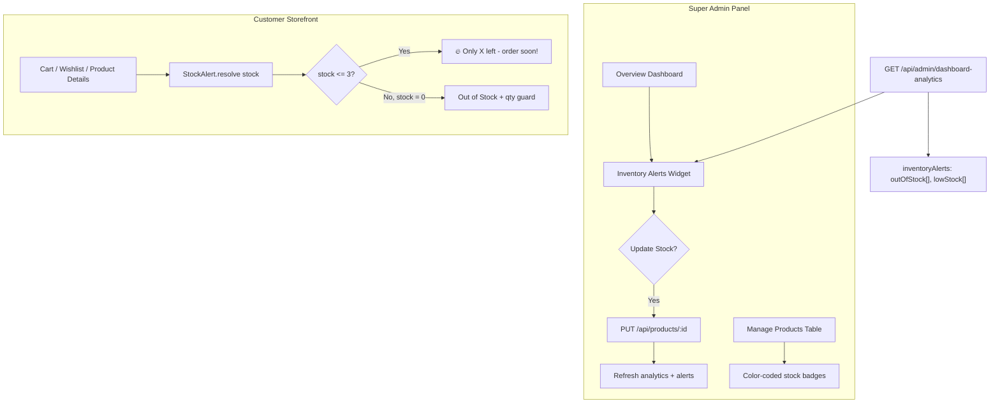
```mermaid
flowchart TB
    subgraph Admin["Super Admin Panel"]
        A[Overview Dashboard] --> B[Inventory Alerts Widget]
        B --> C{Update Stock?}
        C -->|Yes| D[PUT /api/products/:id]
        D --> E[Refresh analytics + alerts]
        F[Manage Products Table] --> G[Color-coded stock badges]
    end
    subgraph Storefront["Customer Storefront"]
        H[Cart / Wishlist / Product Details] --> I[StockAlert.resolve stock]
        I --> J{stock <= 3?}
        J -->|Yes| K["🔥 Only X left - order soon!"]
        J -->|No, stock = 0| L[Out of Stock + qty guard]
    end
    M[GET /api/admin/dashboard-analytics] --> B
    M --> N["inventoryAlerts: outOfStock[], lowStock[]"]
```

### Related API Endpoints

| Method | Endpoint | Description | Auth |
|--------|----------|-------------|------|
| **`GET`** | **`/api/admin/dashboard-analytics`** | Sales KPIs, revenue trends, top products & **`inventoryAlerts`** payload | **Admin + `view_analytics`** |
| **`PUT`** | **`/api/products/:id`** | Inline stock restock from alert **Update Stock** quick action | **Admin + `manage_inventory`** |

**`inventoryAlerts` response shape:**

| Key | Contents |
|-----|----------|
| `outOfStock[]` | Products with `stock === 0` |
| `lowStock[]` | Products with `1 ≤ stock ≤ 5` |

### Key Files

| File | Role |
|------|------|
| `controllers/adminController.js` | `getDashboardAnalytics()` — builds `inventoryAlerts { outOfStock[], lowStock[] }` |
| `routes/adminRoutes.js` | `GET /dashboard-analytics` route (`verifyAdmin` + `view_analytics`) |
| `client/admin.html` | Overview `#inventoryAlertsList` widget + Manage Products table markup |
| `client/js/admin.js` | `renderInventoryAlerts()`, `quickUpdateStock()`, Manage Products stock badge rendering |
| `client/css/admin.css` | `.inventory-alert-*`, `.stock-status.stock-out` / `.stock-low` / `.stock-normal` |
| `client/js/stockAlert.js` | Storefront urgency badge HTML, qty-cap logic, variant stock resolution |
| `client/js/cart.js` | Cart row stock badges, quantity guardrails, stock-exceeded toast feedback |
| `client/js/profile.js` | Wishlist mini-card stock badges, out-of-stock cart guard |
| `client/js/product-details.js` | Live variant stock status badge on Product Details |
| `client/css/cart.css` | `.stock-alert-badge`, `.stock-low`, `.stock-out` badge styles |
| `models/product.js` | `stock` / `stockQuantity` fields — source for alert queries |

---

## 🔐 Super Admin RBAC & Staff Management Architecture

A **production-grade Role-Based Access Control (RBAC) engine** that lets the Super Admin delegate operational work to staff accounts without sharing the owner password — while every sidebar item and API route is guarded by the same permission matrix on both the frontend and backend.

### 🛡️ Admin Security & Staff Management

#### Enterprise Staff & Role Access System *(v4.3.2)*

Staff Management has been redesigned into an **Enterprise Role & Staff Management** dashboard (`#view-staff` in `client/admin.html`, logic in `client/js/admin-staff.js`, styles in `client/css/admin.css`).

| UI Layer | Component | Description |
|----------|-----------|-------------|
| **Staff Overview KPIs** | `.staff-metrics-grid` / `.staff-metric-card` | Polished summary widgets — **Total Staff**, **Active**, **Suspended** — with `rounded-xl` borders, subtle slate elevation (`border-slate-200/80`, `shadow-sm`), and live counters from `GET /api/admin/staff` → `summary`. |
| **Dual-Column Layout** | `.staff-create-layout` | Responsive **12-column grid** (`grid-cols-1` → `lg:grid-cols-12 gap-6` equivalent): splits provisioning into two enterprise cards instead of a single stacked form. |
| **Credentials Card** | `.staff-credentials-col` | **Staff Account Credentials** — Full Name, Username, Email, Password (+ **Generate** button), **Active / Suspended** segment control, and **2FA** toggle switch. |
| **Permissions Matrix Card** | `.staff-permissions-col` | **Granular Role & Permissions Matrix** — server-driven toggles grouped under category cards aligned with `config/permissions.js` groups. |
| **Toggle Switches** | `.permission-toggle-row` + `.toggle-switch` | Interactive switches replace basic checkboxes; **emerald green when ON**, subtle **slate when OFF**; row highlights via `.is-on`. |
| **Quick Role Presets** | `.staff-presets-bar` | One-click assignment bar — **[ Full Admin ]** · **[ Inventory Manager ]** · **[ Customer Support ]** · **[ Reset / Clear ]** — calls `applyRolePreset()` to set toggles instantly. |
| **Staff Directory** | `.staff-table-card` | Scrollable table with **sticky `<thead>`**, compact **Active / Suspended** status badges, permission chips, and inline row actions. |
| **Edit Modal** | `#staffEditModal` | Mirrors the dual-column architecture — credentials left, permissions matrix + presets right; status changes sync via `PATCH /api/admin/staff/:id/status`. |

**Permission category cards**

| Category | Icon | Permissions |
|----------|------|-------------|
| **Insights** | 📊 | View Analytics (dashboard KPIs, revenue charts) |
| **Operations** | 🛒 | Manage Orders, Inventory, Catalog, Coupons, Customers |
| **Administration** | ⚙️ | System Settings, Security & Audit, Staff Roles |

**Quick Role Preset maps** (`client/js/admin-staff.js` → `ROLE_PRESETS`)

| Preset | Granted Permission Keys |
|--------|-------------------------|
| **Full Admin** | All keys from `GET /api/admin/permissions` catalog |
| **Inventory Manager** | `manage_inventory`, `manage_catalog` |
| **Customer Support** | `manage_orders`, `manage_customers` |
| **Reset / Clear** | *(none — clears all toggles)* |

> **Status terminology:** The UI labels suspended accounts as **Suspended**; the backend field remains `status: 'blocked'`. Creating a suspended account POSTs the staff record, then immediately calls `PATCH /api/admin/staff/:id/status` when needed.

#### Routing Cleanliness & Settings Finalization *(v4.3.0 – v4.3.1)*

The Super Admin SPA maintains a clean operational shell alongside the staff console:

| Concern | Implementation |
|---------|----------------|
| **Clean `/admin` URL** | Browser address bar stays strictly **`/admin`** — no `?section=`, `?page=`, or filter query strings during navigation or refresh; `ensureCleanAdminUrl()` strips legacy bookmarks via `history.replaceState()`. |
| **Reload → Overview** | F5 / hard refresh on `/admin` always defaults to the **Dashboard Overview** tab — deep-link section boot from query params removed. |
| **Modular Admin Settings** | **Admin Settings** (`view-settings`) — responsive **tabbed SaaS shell**: **Profile & Security** · **Store & Shipping Preferences** · **Store Branding**; uniform `.saas-settings-card` panels with **isolated per-section save buttons**; Store & Branding tabs RBAC-gated via `manage_settings`. |
| **Modular System Settings** | **System Settings** (`view-master-settings`) — **seven independent configuration cards** (Announcement & Free Shipping, SMS Gateway, Courier Booking, WhatsApp, Flash Sale, VIP Segmentation, Rewards & Refunds); each card POSTs a targeted partial payload to **`POST /api/admin/master-settings/update`**. |

> 📌 Deep dives: [Clean Admin Routing & Navigation Architecture](#-clean-admin-routing--navigation-architecture-v431) · [Admin & Platform Settings](#-admin--platform-settings).

### Feature Overview

#### Dynamic Staff Account Creation
From **Admin Panel → Enterprise Role & Staff Management** (`/admin` → **Staff Management**, Super Admin only), the owner manages the full staff lifecycle:

| Action | Behaviour |
|--------|-----------|
| **Create** | Dual-column form — credentials card (name, username, email, password with **Generate**, **Active / Suspended** status, optional 2FA toggle) + permissions matrix with **toggle switches** and **Quick Role Presets**; min 8-char password **bcrypt-hashed** on save |
| **Edit** | Modal mirrors create layout — update name, email, permissions (toggles + presets), 2FA requirement, and account status — changes apply on the staff member's **very next request** (no re-login) |
| **Suspend / Activate** | Toggle `status` between `active` and `blocked` (UI: **Active / Suspended**); suspending **instantly revokes every live session** across all devices |
| **Reset Password** | Set a custom password or auto-generate a strong one (shown once); all existing sessions are revoked |
| **Delete** | Permanently removes the account record and all associated access |

> Staff sign in at the same **`/admin/login`** page as the Super Admin. The `role` field is set server-side at creation — request bodies cannot escalate a staff account to `superadmin`.

#### Granular Permission Engine
Permissions are defined once in `config/permissions.js` and consumed by the middleware, staff API, and admin UI **toggle matrix** (rendered dynamically from the server catalog):

| Permission Key | Label | Typical Scope |
|----------------|-------|---------------|
| `view_analytics` | View Analytics | Dashboard Overview KPIs, Chart.js trends, Finance & Analytics panel |
| `manage_orders` | Manage Orders | Live Orders, order status updates, return approval, refund undo |
| `manage_inventory` | Manage Inventory | Add / edit / delete products, stock updates |
| `manage_catalog` | Manage Catalog | Categories, brands, attributes |
| `manage_coupons` | Manage Coupons | Coupon CRUD, toggle, expiry scheduling |
| `manage_customers` | Manage Customers | Customer list, edit, block/suspend, order history |
| `manage_settings` | Manage Settings | Master Settings, delivery charges, store branding, platform preferences |
| `manage_security` | Security & Audit | Security logs, login history, IP blacklist |
| `manage_staff` | Manage Staff | Staff Management panel *(Super Admin role gate applies in addition)* |

**Super Admin bypass:** Accounts with `role: 'superadmin'` skip every `checkPermission()` gate automatically — existing owner access is never restricted.

#### Secure Unified Login & Middleware Security
The existing JWT + `AdminSession` authentication pipeline is unchanged; RBAC layers on top:

```
POST /api/admin/login  →  credentials verified (bcrypt)  →  blocked? → 403
                        →  2FA challenge (optional)     →  JWT issued (role: 'admin' token type)
Every protected request →  verifyAdmin (JWT + session)  →  attachAdminAccount (live DB reload)
                        →  checkPermission('…')         →  superadmin? bypass : staff.permissions[]?
                        →  unauthorized                 →  403 JSON  |  redirect /admin/access-denied
```

Key security properties:
- **Live permission enforcement** — `verifyAdmin` reloads the account from MongoDB on every request; revoking a permission or blocking an account takes effect immediately.
- **Legacy password upgrade** — pre-RBAC plaintext owner passwords are transparently re-hashed to bcrypt on the next successful login.
- **Session revocation on block / password reset** — `AdminSession` records are deleted so stale JWTs cannot continue operating.
- **Finance panel gated** — admin JWT access to `/finance-analytics` now requires `view_analytics` (dedicated finance password flow unchanged).

#### Permission-Aware Admin UI
`client/js/admin-staff.js` fetches `GET /api/admin/me` and `GET /api/admin/permissions` on panel load, then:
- Hides sidebar items whose `data-target` maps to a permission the staff member lacks (`SECTION_PERMISSIONS` in `config/permissions.js`).
- Reveals **Staff Management** only when `role === 'superadmin'`.
- Hides Finance shortcut, platform settings cards, and any element tagged `data-permission="…"`.
- Redirects staff away from an active section they cannot access to the first allowed view.

### Admin Schema — RBAC Fields (`models/admin.js`)

| Field | Type | Values / Notes |
|-------|------|----------------|
| `role` | `String` | `'superadmin'` (owner, full bypass) · `'staff'` (permission-gated) |
| `permissions` | `[String]` | Subset of keys from `config/permissions.js`; ignored for bypass by superadmin |
| `status` | `String` | `'active'` · `'blocked'` — blocked accounts cannot log in or call APIs |
| `name` | `String` | Display name shown in staff table and sidebar profile |
| `createdBy` | `String` | Username of the Super Admin who created the account |
| `lastLoginAt` | `Date` | Updated on each successful login |
| `passwordChangedAt` | `Date` | Set when password is hashed or reset |

> On server boot, `Admin.ensureRbacDefaults()` backfills missing `role` / `status` fields on legacy documents as `superadmin` / `active` so existing owner accounts are never locked out.

### RBAC Workflow

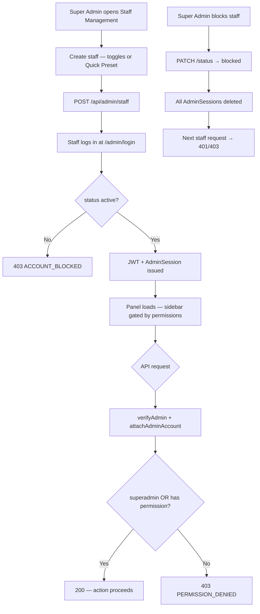
```mermaid
flowchart TD
    A[Super Admin opens Staff Management] --> B[Create staff — toggles or Quick Preset]
    B --> C[POST /api/admin/staff]
    C --> D[Staff logs in at /admin/login]
    D --> E{status active?}
    E -->|No| F[403 ACCOUNT_BLOCKED]
    E -->|Yes| G[JWT + AdminSession issued]
    G --> H[Panel loads — sidebar gated by permissions]
    H --> I{API request}
    I --> J[verifyAdmin + attachAdminAccount]
    J --> K{superadmin OR has permission?}
    K -->|Yes| L[200 — action proceeds]
    K -->|No| M[403 PERMISSION_DENIED]
    N[Super Admin blocks staff] --> O[PATCH /status → blocked]
    O --> P[All AdminSessions deleted]
    P --> Q[Next staff request → 401/403]
```

### Related API Endpoints

| Method | Endpoint | Description | Auth |
|--------|----------|-------------|------|
| **`GET`** | **`/api/admin/me`** | Current signed-in admin identity, role, permissions & status | **Admin** |
| **`GET`** | **`/api/admin/permissions`** | Permission catalog + sidebar section map for UI gating | **Admin** |
| **`GET`** | **`/api/admin/staff`** | List all staff accounts with summary counters | **Super Admin** |
| **`POST`** | **`/api/admin/staff`** | Create staff account `{ name, username, email, password, permissions[], requireTwoFactor? }` | **Super Admin** |
| **`PUT`** | **`/api/admin/staff/:id`** | Update name, email, permissions, 2FA requirement | **Super Admin** |
| **`PATCH`** | **`/api/admin/staff/:id/status`** | Toggle `active` ⇄ `blocked` (instant session revocation) | **Super Admin** |
| **`POST`** | **`/api/admin/staff/:id/reset-password`** | Reset password `{ newPassword? }` — auto-generates if omitted | **Super Admin** |
| **`DELETE`** | **`/api/admin/staff/:id`** | Permanently delete staff account + revoke sessions | **Super Admin** |

**Permission-protected admin routes (examples):**

| Route Group | Required Permission |
|-------------|---------------------|
| `GET /api/admin/dashboard-analytics` | `view_analytics` |
| `GET/PUT/DELETE /api/orders` (admin ops) | `manage_orders` |
| `POST/PUT/DELETE /api/products` | `manage_inventory` |
| `POST/PUT/DELETE /api/categories`, `/brands`, `/attributes` | `manage_catalog` |
| `GET/POST/PUT/DELETE /api/coupons` (admin CRUD) | `manage_coupons` |
| `GET/PUT/PATCH /api/admin/customers` | `manage_customers` |
| `PUT/POST /api/admin/master-settings`, branding upload | `manage_settings` |
| `GET /api/admin/logs`, `/blacklist`, `/login-history` | `manage_security` |

> **Auth legend for permission gates:** routes marked **Admin** require `verifyAdmin`; individual operations additionally require `checkPermission('…')`. Staff routes require **`requireSuperAdmin`** in addition to `manage_staff`.

**Access Denied page:** `GET /admin/access-denied` — served with **403** when a browser navigation hits a blocked route; API calls receive `{ success: false, reason: 'PERMISSION_DENIED', requiredPermission, redirect }`.

### Key Files

| File | Role |
|------|------|
| `config/permissions.js` | Single source of truth — permission keys, labels, groups, sidebar map, sanitizers |
| `models/admin.js` | RBAC schema fields, bcrypt pre-save hook, `verifyPassword()`, `hasPermission()`, `ensureRbacDefaults()` |
| `middlewares/rbac.js` | `checkPermission()`, `requireSuperAdmin`, `attachAdminAccount`, access-denied helpers |
| `middlewares/authMiddleware.js` | `verifyAdmin` — JWT + session validation + live account attach |
| `controllers/staffController.js` | Staff CRUD, status toggle, password reset, permission catalog API |
| `controllers/adminSecurityController.js` | Login with bcrypt verify, blocked-account gate, legacy password upgrade |
| `routes/staffRoutes.js` | `/api/admin/staff/*` mounted under admin routes |
| `routes/adminRoutes.js` | Permission gates on customers, analytics, settings, security routes |
| `routes/orderRoutes.js` | Hardened admin order list/update/delete (`manage_orders`) |
| `client/admin.html` | Enterprise Staff Management section (`#view-staff`), dual-column create form, edit modal, permission-aware `data-permission` attrs |
| `client/js/admin-staff.js` | Staff console UI, toggle matrix renderer, Quick Role Presets, sidebar gating, create/edit/suspend/reset/delete handlers |
| `client/css/admin.css` | Enterprise staff dashboard styles — KPI cards, toggle switches, category cards, sticky staff table |
| `client/access-denied.html` | Clean 403 page for unauthorized browser navigations |
| `server.js` | RBAC backfill on boot + `/admin/access-denied` page route |

---

## ⚙️ Master Settings & Dynamic Rewards

> **v3.4.0 update:** Master Settings is now part of the [Unified Store Settings Engine](#-dynamic-store-settings--admin-engine). The section below documents reward economics; announcement + free-shipping threshold details live in the dedicated sections above.

A centralized, admin-controlled rewards economics engine with global defaults, per-category cashback overrides, and zero-value toggles for instant platform-wide disable.

### Feature Overview

#### Global Master Settings Panel
From **Admin Panel → Master Settings**, admins configure the singleton `Setting` document (`models/Setting.js`):

| Setting | Default | Purpose |
|---------|---------|---------|
| `cashbackPercentage` | `1%` | Global wallet cashback on delivered orders |
| `takaToPointsRatio` | `100` | Taka spent per 1 loyalty point earned (e.g. ৳100 → 1 pt) |
| `pointsToTakaConversionRate` | `10` | Taka credited per 100 points converted |
| `refundUndoWindowHours` | `72` | Hours admins may undo an accidental wallet refund |
| `freeShippingThreshold` | mirrors delivery `Settings` | Canonical free-shipping waiver threshold (synced bidirectionally) |
| `announcementText` | `''` | Optional custom **Latest Announcement** copy on customer profiles |
| `isAnnouncementActive` | `true` | Show/hide the announcement card platform-wide |
| `flashSaleEnabled` | `false` | Master toggle for scheduled flash sale events |
| `flashSaleTitle` | `'Flash Sale'` | Homepage banner headline |
| `flashSaleEndDate` | `null` | ISO expiry timestamp (date + time composed in admin UI) |
| `flashSaleDiscountPercent` | `0` | Percentage discount applied to featured products |
| `flashSaleProductIds` | `[]` | Featured product `productId` / `_id` list |
| `vipMinTotalSpent` | `10000` | VIP segmentation — minimum lifetime spend (৳) |
| `vipMinOrderCount` | `5` | VIP segmentation — minimum order count |
| `frequentBuyerMinOrders` | `3` | Frequent Buyer segmentation — minimum order count |

Changes are persisted via **`POST /api/admin/master-settings/update`** (canonical) or legacy `PUT /api/admin/master-settings`, and logged to the **Security & Audit** trail.

#### Category-Specific Cashback Override
- Each category (`models/category.js`) may define `customCashbackPercentage` (0–100) or leave it `null`.
- `resolveCategoryCashbackRate()` in `utils/rewardSettings.js` uses the category override when set; otherwise falls back to the global `cashbackPercentage`.
- `calculateOrderCashbackFromItems()` sums per-line cashback at checkout reward credit time using the category map — enabling promotions like *"Electronics 5%, everything else 1%"*.

#### Dynamic Zero-Setting Toggle
- Setting **`cashbackPercentage` to `0`** disables all wallet cashback (category overrides with `0` also disable per-category).
- Setting **`takaToPointsRatio` to `0`** disables loyalty point earning (`isPointsEarningEnabled()`).
- Setting **`pointsToTakaConversionRate` to `0`** disables point-to-wallet conversion.
- Setting **`refundUndoWindowHours` to `0`** disables the admin Undo Refund button entirely.
- Rewards credit runs once on delivery via `creditOrderDeliveryRewards()` — respects disabled settings without double-crediting (`rewardsCredited` flag).

#### Live Preview
- The admin panel renders a real-time preview string: *"৳1,000 order → X% cashback + ~Y pts · 100 pts → ৳Z · Refund undo: Nh"* — updated as inputs change.

### Related API Endpoints

| Method | Endpoint | Description | Auth |
|--------|----------|-------------|------|
| `GET` | `/api/admin/master-settings` | Read unified reward, announcement & threshold settings | Admin |
| **`POST`** | **`/api/admin/master-settings/update`** | **Canonical unified save (announcement + threshold + rewards)** | **Admin** |
| `PUT` / `POST` | `/api/admin/master-settings` | Legacy save (rewards fields; partial writes) | Admin |
| `GET` / `POST` | `/api/admin/announcement-settings` | Legacy announcement-only read/save | Admin |
| `GET` / `POST` | `/api/admin/settings/announcement` | Legacy announcement alias | Admin |
| `POST` | `/api/categories` | Create category with optional `customCashbackPercentage` | Admin |
| `PUT` | `/api/categories/:id` | Update category cashback override | Admin |

### Key Files

| File | Role |
|------|------|
| `controllers/masterSettingsController.js` | Unified admin read/save, alias parsing, delivery threshold mirror |
| `utils/rewardSettings.js` | Normalization, cashback/points math, delivery reward credit, refund undo window |
| `utils/announcementSettings.js` | Announcement normalization, display text, highlight chips |
| `models/Setting.js` | Singleton master settings schema (rewards + threshold + announcement) |
| `models/category.js` | Per-category `customCashbackPercentage` field |
| `routes/categoryRoutes.js` | Category cashback parse & validation |

---

## 📩 Dynamic SMS Gateway & Email Notification System

A production-ready **customer notification layer** that pairs an admin-configurable Bangladeshi SMS gateway with automated **Gmail/SMTP order confirmation emails** — both wired into the checkout pipeline with fail-safe, non-blocking background dispatch so order creation never stalls on third-party delivery.

### Feature Overview

#### Admin-Configurable SMS Gateway Engine
From **Admin Panel → Master Settings → SMS Notifications** (`client/admin.html`), operators configure the full SMS stack through the unified **Save Master Settings** action — credentials are persisted to MongoDB and take precedence over any `.env` fallbacks:

| Setting | Schema / Document | Options / Type | Purpose |
|---------|-------------------|------------------|---------|
| Enable SMS | `Setting.enableSmsNotifications` | Boolean | Master toggle for customer order & status SMS |
| Gateway Provider | `Settings.smsGatewayProvider` | `Greenweb BD` · `BulkSMS BD` · `AlphaSMS` · `Generic API` | Selects built-in HTTP integration or custom endpoint |
| API Key / Token | `Settings.smsApiKey` | String | Gateway credential stored in DB — overrides `SMS_API_KEY` |
| Sender ID | `Settings.smsSenderId` | String | Approved sender label — overrides `SMS_SENDER_ID` |

**Built-in provider routing** (`utils/smsService.js`):

| Provider | Transport | Endpoint |
|----------|-----------|----------|
| **Greenweb BD** | GET query-string | `api.greenweb.com.bd/api.php` |
| **BulkSMS BD** | GET query-string | `bulksmsbd.net/api/smsapi` |
| **AlphaSMS** | POST JSON | `api.sms.net.bd/sendsms` |
| **Generic API** | POST/GET (via `SMS_API_METHOD`) | Custom `SMS_API_URL` from `.env` |

**Automated SMS dispatch triggers:**
- **Order placement** — confirmation text with order ID, amount (BDT), and track link after MongoDB save.
- **Admin status updates** — customer notified when order status changes via `updateOrderStatus`.
- **Fail-safe background processing** — `dispatchSmsNotification()` runs on `setImmediate`; errors are logged quietly and never roll back orders.

> **Admin/security OTP flows** (`utils/smsSender.js`) reuse the same transport but are **not** gated by the customer SMS toggle — console fallback ensures 2FA is never hard-blocked in dev.

#### Automated Order Confirmation Emails
On every successful checkout, `orderController.createOrder` resolves the customer's email (`req.body.customerEmail` → logged-in `User.email`) and fires **`notifyOrderConfirmationEmail()`** — an asynchronous Nodemailer hook that never blocks the HTTP response.

| Detail | Value |
|--------|-------|
| **Subject** | `Order Confirmed: #{orderId} - EonlineBazar` |
| **Transport** | Gmail/SMTP via `utils/mailer.js` (465 → 587 port failover) |
| **HTML body** | Branded responsive layout with **Order ID**, **item summary table**, **subtotal / discount / delivery / grand total (৳)**, and **shipping address** |
| **Logging** | `SUCCESS: Order email sent to <email>` on delivery · `EMAIL ERROR: <reason>` on failure |

Robust **try/catch** and deadline-bounded SMTP attempts guarantee smooth checkout performance regardless of mail-server status — a failed email is logged, not thrown.

### Architectural Workflow

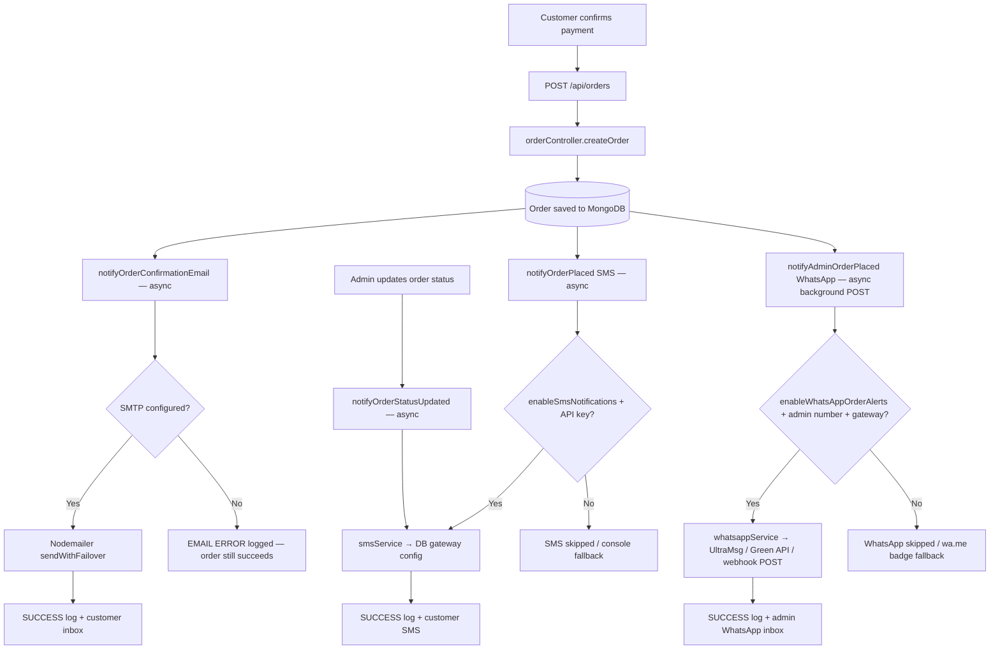
```mermaid
flowchart TD
    A[Customer confirms payment] --> B[POST /api/orders]
    B --> C[orderController.createOrder]
    C --> D[(Order saved to MongoDB)]
    D --> E[notifyOrderConfirmationEmail — async]
    D --> F[notifyOrderPlaced SMS — async]
    D --> W[notifyAdminOrderPlaced WhatsApp — async background POST]
    E --> G{SMTP configured?}
    G -->|Yes| H[Nodemailer sendWithFailover]
    G -->|No| I[EMAIL ERROR logged — order still succeeds]
    H --> J[SUCCESS log + customer inbox]
    F --> K{enableSmsNotifications + API key?}
    K -->|Yes| L[smsService → DB gateway config]
    K -->|No| M[SMS skipped / console fallback]
    L --> N[SUCCESS log + customer SMS]
    W --> X{enableWhatsAppOrderAlerts + admin number + gateway?}
    X -->|Yes| Y[whatsappService → UltraMsg / Green API / webhook POST]
    X -->|No| Z[WhatsApp skipped / wa.me badge fallback]
    Y --> AA[SUCCESS log + admin WhatsApp inbox]
    O[Admin updates order status] --> P[notifyOrderStatusUpdated — async]
    P --> L
```

### SMS Message Templates

| Event | Template |
|-------|----------|
| **Order Confirmation** | `Dear {name}, your order #{orderId} of BDT {amount} at EonlineBazar has been placed successfully! Track order: {link}` |
| **Status Update** | `Dear {name}, your order #{orderId} status has been updated to: {status}.` |
| **Verification OTP** *(optional)* | `Your EonlineBazar verification code is {otp}.` |

Track links resolve via optional `STORE_PUBLIC_URL` → `/order-track.html?orderId=…&phone=…`.

### Configuration Priority

```
MongoDB (Admin Master Settings)  →  .env fallbacks  →  dev console fallback
```

| Variable | Required | Purpose |
|----------|:--------:|---------|
| `SMTP_USER` / `SMTP_PASS` | ✅* | Gmail App Password for order confirmation + OTP emails |
| `Settings.smsApiKey` | ⛔ | Gateway token (Admin Panel preferred over `SMS_API_KEY`) |
| `Settings.smsSenderId` | ⛔ | Sender label (Admin Panel preferred over `SMS_SENDER_ID`) |
| `SMS_API_URL` | ⛔ | Endpoint for **Generic API** provider only |
| `SMS_API_METHOD` | ⛔ | `post` (default) or `get` |
| `STORE_PUBLIC_URL` | ⛔ | Public store URL for SMS track links |

> \* Without SMTP configured, order emails log `EMAIL ERROR` and checkout still completes successfully.

### Key Files

| File | Role |
|------|------|
| `models/Settings.js` | Global singleton — `smsGatewayProvider`, `smsApiKey`, `smsSenderId` |
| `models/Setting.js` | Master singleton — `enableSmsNotifications` toggle |
| `controllers/masterSettingsController.js` | Unified read/save for SMS fields + reward/announcement settings |
| `controllers/orderController.js` | Post-save hooks: `notifyOrderConfirmationEmail`, `notifyOrderPlaced`, `notifyAdminOrderPlaced`, `createManualOrder` |
| `utils/smsService.js` | DB-backed gateway routing, templates, async dispatch helpers |
| `utils/smsSender.js` | Admin/security OTP wrapper (delegates to `smsService`) |
| `utils/mailer.js` | SMTP transport, order confirmation HTML builder, port failover |
| `client/admin.html` | Master Settings → **SMS Notifications** card (provider dropdown + credentials) |
| `client/js/admin.js` | SMS form wiring, live preview, unified save payload |

---

## 🚚 Courier Logistics & Multi-Provider Dispatch Engine

An **isolated, future-ready multi-provider dispatch engine** (Steadfast, Pathao, RedX) wired directly into the admin **Live Orders** workflow and customer order views — plus a premium data-table redesign *(v4.4.1)* with dedicated **Courier Status** and **Actions** columns, optimized column alignment, and soft-green courier booking controls that keep long order queues scannable without breaking existing status, return, invoice, or delete actions.

#### One-Click Dispatch (Admin Panel)
- **Seamless `Send to Courier` action** in the **Live Orders** panel with automated provider selection (**Steadfast**, **Pathao**, **RedX**) driven by `Settings.defaultCourierProvider`.
- **Smart Hybrid Mode:** Supports authentic API parcel booking when API keys are configured in **Master Settings → Courier Booking**, with dynamic mock tracking code generation (`SF-PENDING-XXXXX`, `PT-PENDING-XXXXX`, `RX-PENDING-XXXXX`) when keys are absent — order records still persist `courierTrackingId` + `courierProvider` and advance to **`Shipped`** for safe testing.
- Admin confirm dialog and success toast clearly distinguish **live** vs **mock** bookings; security audit log records both paths.

#### Isolated Page Displays
- Preserves exact UI/UX templates across **Order Details** (`client/order-details.html`) and **Track Your Order** (`client/order-track.html`) — **no layout distortion, no admin/customer view merging**.
- Dynamically embeds a **Courier Provider + Tracking ID** badge via shared `client/js/courierBadge.js` + `client/css/courier-badge.css`:
  - **Order Details** — badge renders below the **Order Progress** timeline card.
  - **Track Your Order** — badge renders below the status message box inside the lookup result panel.
- Live tracking IDs link to provider tracking pages; mock `*-PENDING-*` IDs show a **(Pending)** label without external links.

#### Failsafe Tracking Architecture
- Progress timeline steps on **Order Details** and **Track Your Order** remain **strictly bounded to internal MongoDB order states** (`Pending` → `Processing` → `Shipped` → `Delivered`) — courier badge data is display-only and never drives stepper logic.
- Third-party courier API downtime or mock-mode operation **cannot crash customer pages**; booking failures return readable admin JSON toasts without affecting storefront rendering.

> **Note:** The admin panel is a static SPA (`client/admin.html` + `client/js/admin.js`) — there is no `views/admin/orders.ejs` template in this repository. Customer pages are static HTML/JS — not EJS views.

### Provider Registry & Admin-Configurable Credentials

From **Admin Panel → Master Settings → Courier Booking**, operators save courier credentials through the same unified **Save Master Settings** action used for SMS and rewards — no redeploy required to rotate keys or switch the default provider label:

| Setting | Schema / Document | Options / Type | Purpose |
|---------|-------------------|------------------|---------|
| Default Courier Provider | `Settings.defaultCourierProvider` | `Steadfast` · `Pathao` · `RedX` | Labels the booking button and mock ID prefix; **live API booking is live for Steadfast** |
| Courier API Key | `Settings.courierApiKey` | String | Sent as Steadfast `Api-Key` header — overrides `STEADFAST_API_KEY` / `COURIER_API_KEY` |
| Courier Secret Key | `Settings.courierSecretKey` | String | Sent as Steadfast `Secret-Key` header — overrides `STEADFAST_SECRET_KEY` / `COURIER_SECRET_KEY` |

| Provider | Live Booking | Tracking URL Base | Mock ID Prefix |
|----------|:------------:|-------------------|----------------|
| **Steadfast** | ✅ | `https://steadfast.com.bd/t/` | `SF-PENDING-` |
| **Pathao** | 🔜 | `https://merchant.pathao.com/tracking?consignment_id=` | `PT-PENDING-` |
| **RedX** | 🔜 | `https://redx.com.bd/track-global-parcel/?trackingId=` | `RX-PENDING-` |

> Pathao and RedX are fully registered in the provider engine with tracking URL templates and mock dispatch support; automated live API transport ships for **Steadfast** today — additional providers plug into `utils/courierService.js` without changing page templates.

### One-Click Parcel Booking (`POST /api/admin/orders/:id/send-courier`)

When an admin clicks **`🚚 Send to Courier`** on an unbooked order:

1. **`utils/courierService.js`** loads credentials from MongoDB (`.env` fallback).
2. Validates recipient name, 11-digit BD mobile, and delivery address **before** any HTTP call.
3. **Hybrid dispatch branch:**
   - **Credentials present** → POST to **`https://portal.steadfast.com.bd/api/v1/create_order`** (Steadfast) with:
     - `invoice` — order ID
     - `recipient_name`, `recipient_phone`, `recipient_address`
     - `cod_amount` — `grandTotal` for COD orders, **`0`** for prepaid methods
   - **Credentials absent (Mock Mode)** → generates a provider-prefixed pending tracking ID locally — **no external HTTP call**.
4. On success, **`controllers/courierController.js`** atomically:
   - Saves `courierTrackingId`, `courierConsignmentId`, `courierProvider`, `courierStatus`, `courierBookedAt`
   - Sets order **`status = 'Shipped'`** (unless already delivered/shipped)
   - Fires **`notifyOrderStatusUpdated`** when SMS notifications are enabled
   - Writes a **Security Log** audit entry (live or mock)

**Safety guards:**
- **Double-click protection** — atomic `courierStatus: 'booking'` claim prevents duplicate consignments; stale locks expire after 2 minutes.
- **409 Conflict** if the order is already booked or a booking is in progress.
- **Non-shippable statuses** (`Cancelled`, `Returned`, `Refunded`, `Return Requested`) are rejected before dispatch.
- Service **never throws** — all failures return readable `{ success: false, message }` JSON for admin toasts.

#### Order Schema — Courier Fields (`models/order.js`)

| Field | Type | Default | Description |
|-------|------|---------|-------------|
| `courierProvider` | `String` | `''` | Active courier (e.g. `Steadfast`, `Pathao`, `RedX`) |
| `courierTrackingId` | `String` | `''` | Public tracking code from API or mock generator |
| `courierConsignmentId` | `String` | `''` | Internal consignment ID (live bookings) |
| `courierStatus` | `String` | `'unbooked'` | Booking lifecycle state (`unbooked`, `booking`, `in_review`, `mock_pending`, `failed`, …) |
| `courierBookedAt` | `Date` | `null` | Successful booking timestamp |

### Premium Live Orders Data-Table UI

The **Live Orders** view (`#view-orders` in `client/admin.html`) received a scoped CSS + markup overhaul in `client/css/admin.css` and `client/js/admin.js` — with a **v4.4.1 column redesign** that separates courier booking from row actions and optimizes alignment for long-form address/product cells.

#### Table Column Architecture *(v4.4.1)*

| Column | Alignment | Width / Notes |
|--------|-----------|---------------|
| **Order ID** | Center | `max-width: 100px`; compact blue chip |
| **Date & Time** | Center | `max-width: 120px`; stacked date + clock icon |
| **Customer** | Center | Stacked name + phone |
| **Address** | **Left** (`text-left`) | Multi-line delivery text; hover-to-copy |
| **Products** | **Left** (`text-left`) | Compact `<ul>` item list |
| **Total** | Center | Bold green accent payable |
| **Status** | Center | `min-width: 130px` — expanded for full status `<select>` text |
| **Courier Status** | Center | Dedicated column — 100% full-width send button or sent badge |
| **Actions** | Center | Edit · View · Delete icon chips only |

#### Sticky Table Header (`<thead>` Lockdown)
- Table body scrolls inside **`.orders-table-scroll`** (`max-height: ~68vh`) while column headers stay pinned.
- `<th>` cells use **`position: sticky; top: 0; z-index: 10`** with a `#f8fafc` background, crisp `border-b`, and subtle shadow — headers remain visible during deep scrolling through large order queues.

#### Dedicated Courier Status Column *(v4.4.1)*
- **Courier Status** (`col-courier-head` / `order-courier-cell`) is isolated from the **Actions** column — admins can scan booking state independently of edit/view/delete controls.
- **Send to Courier** — soft-green pill button (`#d1fae5` background, `#065f46` text, `#6ee7b7` border) with mini truck icon 🚚 (`send-courier-icon`) and crisp label text; fills **100% cell width** (`width: 100%; max-width: 100%`) without horizontal overflow.
- **Sent badge** — green **`Sent · [tracking]`** pill linking to the provider tracking page (live IDs) or a static badge (mock pending IDs).
- Blocked statuses (cancelled/returned) show a centered em dash placeholder.

#### Re-architected Actions Column *(v4.4.1)*
- **Actions** (`col-actions-head` / `order-actions-cell`) holds icon-only controls in **`.order-actions-toolbar`** — `display: flex; align-items: center; justify-content: center; gap: 0.5rem`.
- **Edit Shipping** — soft gray rounded overlay (`order-action-icon`, `#f1f5f9` background, `rounded-full`) with pen icon.
- **View Invoice** — same pill chip styling with eye icon (`title="View Invoice"`).
- **Delete** — danger hover state (`order-action-delete:hover` → `#fee2e2` / `#dc2626`).
- **Status `<select>`** and **Approve Return** pill remain in the **Status** column — not mixed into Actions.

#### Compact Cell Spacing & Modern Aesthetics
- Uniform cell padding **`12px 16px`** for optimal density.
- Tighter **Order ID** (blue chip), **Customer** (stacked name + phone), and **Total** columns — reduced horizontal whitespace.
- **Total Payable** rendered as bold green accent (`#059669`, tabular nums).
- Row hover: **`#f8fafc`** background with smooth `0.15s` transition.
- Address and product columns use **`text-left`** alignment and line-clamp / compact list styling for readability without bloating row height.

### Courier Booking Workflow

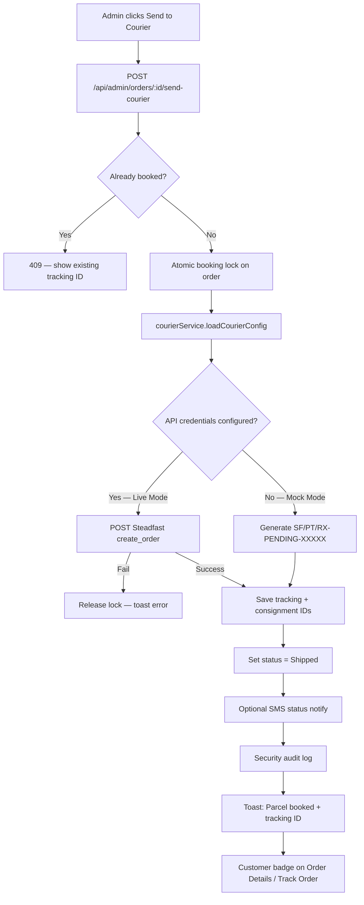
```mermaid
flowchart TD
    A[Admin clicks Send to Courier] --> B[POST /api/admin/orders/:id/send-courier]
    B --> C{Already booked?}
    C -->|Yes| D[409 — show existing tracking ID]
    C -->|No| E[Atomic booking lock on order]
    E --> F[courierService.loadCourierConfig]
    F --> G{API credentials configured?}
    G -->|No — Mock Mode| H[Generate SF/PT/RX-PENDING-XXXXX]
    G -->|Yes — Live Mode| I[POST Steadfast create_order]
    I -->|Fail| J[Release lock — toast error]
    I -->|Success| K[Save tracking + consignment IDs]
    H --> K
    K --> L[Set status = Shipped]
    L --> M[Optional SMS status notify]
    M --> N[Security audit log]
    N --> O[Toast: Parcel booked + tracking ID]
    O --> P[Customer badge on Order Details / Track Order]
```

### Related API Endpoints

| Method | Endpoint | Description | Auth |
|--------|----------|-------------|------|
| **`POST`** | **`/api/admin/orders/:id/send-courier`** | Book parcel (live Steadfast or mock); persist tracking IDs; mark order **Shipped** | **Admin + `manage_orders`** |
| **`GET`** | **`/api/admin/courier/status`** | Returns `{ provider, isConfigured, mockMode, supportsBooking }` without exposing secrets | **Admin** |

### Configuration Priority

```
MongoDB (Master Settings → Courier Booking)  →  .env fallbacks  →  Mock Mode (no keys required)
```

| Mode | Condition | Behaviour |
|------|-----------|-----------|
| **Live API** | Both `courierApiKey` + `courierSecretKey` present | Authentic Steadfast `create_order` HTTP dispatch |
| **Mock Mode** | Either credential missing | Local `{PREFIX}-PENDING-{5-char}` tracking ID; order saved & marked **Shipped** |
| **Unsupported live provider** | Keys present + `Pathao` / `RedX` selected | Clear 422 admin message — switch to Steadfast for live booking or use Mock Mode |

| Variable | Required | Purpose |
|----------|:--------:|---------|
| `Settings.courierApiKey` | ✅* | Steadfast `Api-Key` (Admin Panel preferred) |
| `Settings.courierSecretKey` | ✅* | Steadfast `Secret-Key` (Admin Panel preferred) |
| `STEADFAST_API_URL` | ⛔ | Override create-order endpoint (default: Steadfast portal URL) |
| `STEADFAST_API_KEY` / `COURIER_API_KEY` | ⛔ | `.env` fallback when DB fields are empty |
| `STEADFAST_SECRET_KEY` / `COURIER_SECRET_KEY` | ⛔ | `.env` fallback when DB fields are empty |
| `COURIER_API_TIMEOUT_MS` | ⛔ | HTTP timeout for courier API calls (default `20000`) |

> \* Automated booking requires both API key and secret key — configure them in **Master Settings** or `.env`.

### Key Files

| File | Role |
|------|------|
| `models/Settings.js` | Global singleton — `defaultCourierProvider`, `courierApiKey`, `courierSecretKey` |
| `models/order.js` | Courier tracking fields on each order document |
| `utils/courierService.js` | Multi-provider registry, Smart Hybrid Mode (live Steadfast + mock dispatch), phone/COD normalization, fail-safe result objects |
| `controllers/courierController.js` | Booking route handler, atomic lock, status update, mock/live audit logging |
| `controllers/masterSettingsController.js` | Read/save courier credentials alongside SMS & rewards |
| `routes/adminRoutes.js` | Registers `POST …/send-courier` and `GET /courier/status` |
| `client/admin.html` | Master Settings → **Courier Booking** card + Live Orders table shell |
| `client/js/admin.js` | `buildCourierActionHtml()`, `sendOrderToCourier()`, mock-aware confirm/toast, premium row renderer with dedicated courier/actions columns *(v4.4.1)* |
| `client/css/admin.css` | Scoped `#view-orders` sticky header, courier column full-width controls, action icon pill chips, column alignment & width balance *(v4.4.1)* |
| `client/js/courierBadge.js` | Shared customer-facing courier provider + tracking ID badge renderer |
| `client/css/courier-badge.css` | Isolated badge styles for Order Details & Track Your Order |
| `client/order-details.html` + `client/js/order-details.js` | Customer order detail view — badge below progress timeline |
| `client/order-track.html` + `client/js/order-track.js` | Public track-order view — badge below lookup result |

---

## 📊 Advanced Sales, Profit/Loss Analytics & Theme Engine

Enterprise-grade **Profit/Loss intelligence** for the Finance & Analytics panel (`/finance-analytics`) — dynamic itemized formulas, MongoDB-backed date-range aggregation, and a premium dashboard UI with persistent theming and Chart.js visual analytics.

### Feature Overview

#### Itemized Profit Calculation Engine
- Implemented dynamic itemized profit & loss formulas:

  **`Net Profit = Gross Revenue − COGS (Cost of Goods Sold) − Item Discounts − Coupon Savings − Loyalty Point Redemptions`**

- **Gross Revenue** is grossed-up from the charged order total so discounts already netted in `grandTotal` are not double-counted against profit.
- **COGS** is computed per line item as **`buyingPrice × quantity`**, preferring the **checkout snapshot** on each order line, then catalog `buyingPrice`, then `FINANCE_DEFAULT_COST_RATIO` fallback.
- **Discounts & redemptions** aggregate `discountAmount`, `couponDiscount`, `pointsRedeemed`, `walletApplied`, and post-order `rewardsCashbackAmount`.
- Built custom **MongoDB aggregation pipelines** (`computeFinanceMetricsAggregation`) plus a resilient **JS primary engine** (`computeFinanceMetricsJs`) supporting real-time filtering across any dynamic date range:
  - **`Today`** · **`Yesterday`** · **`Last 7 Days`** · **`This Month`** · **`All Time`** · **Custom Calendar Dates**
- Query parameters: `period` (`today` \| `yesterday` \| `7days` \| `thismonth` \| `all` \| `custom`) **or** paired `startDate` / `endDate` (YYYY-MM-DD).

#### Interactive Financial Dashboard UI
- Integrated a persistent **Dark/Light Theme Toggle** (**`🌙 Dark / ☀️ Light`**) storing user preference in **`localStorage`** (`financeTheme`); applied before first paint to prevent theme flash.
- Resolved UI/CSS **dropdown overlay issues** using high **`z-index`** layering (`z-index: 9999` on date-range panel, header controls, and preset menus in `finance-analytics.css`).
- Linked **real-time summary metrics** with dynamic **Chart.js** datasets for instant visual analytics:
  - **Gross Sales (Gross Revenue)** · **Net Profit** · **Total Orders** · **Profit Margin %** · **Discounts Total**
  - Secondary mini-stats: **Product Cost (COGS)**, **Discounts & Redemptions**, **Shipping Expenses**, **Orders in Range**
  - **Revenue vs Net Profit** line chart and **Top Selling Categories** pie chart refresh on every preset/custom range change — no full page reload.

### Analytics Data Flow

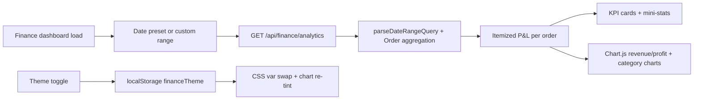
```mermaid
flowchart LR
    A[Finance dashboard load] --> B[Date preset or custom range]
    B --> C[GET /api/finance/analytics]
    C --> D[parseDateRangeQuery + Order aggregation]
    D --> E[Itemized P&L per order]
    E --> F[KPI cards + mini-stats]
    E --> G[Chart.js revenue/profit + category charts]
    H[Theme toggle] --> I[localStorage financeTheme]
    I --> J[CSS var swap + chart re-tint]
```

### Related API Endpoints

| Method | Endpoint | Description | Auth |
|--------|----------|-------------|------|
| **`GET`** | **`/api/finance/analytics`** | **Date-range P&L summary + Chart.js series** (`period` or `startDate`/`endDate`) | **Finance token** **or** Admin + `view_analytics` |
| **`GET`** | **`/api/finance/analytics/filter`** | Backward-compatible alias for the analytics engine | **Finance token** **or** Admin + `view_analytics` |
| **`GET`** | **`/api/admin/analytics`** | Same analytics payload for authenticated admin sessions | **Admin + `view_analytics`** |
| **`GET`** | **`/admin/api/analytics`** | Legacy finance-dashboard alias (finance token) | **Finance token** |

**Response shape (`summary` object):**

| Key | Contents |
|-----|----------|
| `grossRevenue` / `sales` | Gross revenue for the selected range |
| `netProfit` / `profit` | Itemized net profit after COGS & discount deductions |
| `cogs` | Total cost of goods sold |
| `discounts` | Combined item discounts, coupons, points & wallet redemptions |
| `orders` | Order count in range |
| `profitMargin` | `(netProfit / grossRevenue) × 100` |
| `avgOrderValue` | Average gross revenue per order |

> **`chartData`** returns time-bucketed `{ label, revenue, profit, cogs, orders }` arrays; **`categories`** returns top revenue share by product category for the pie chart.

### Key Files

| File | Role |
|------|------|
| `controllers/financeController.js` | `getFinanceAnalytics()`, `computeOrderFinance()`, date-range parser, JS + MongoDB aggregation engines |
| `routes/financeRoutes.js` | `GET /api/finance/analytics` and `/analytics/filter` |
| `routes/adminRoutes.js` | `GET /api/admin/analytics` (`verifyAdmin` + `view_analytics`) |
| `server.js` | Legacy alias `GET /admin/api/analytics` |
| `client/finance-analytics.html` | KPI grid, date-range presets, theme toggle, Chart.js canvases |
| `client/js/finance-analytics.js` | `loadAnalyticsData()`, theme persistence, Chart.js renderers, preset/custom handlers |
| `client/css/finance-analytics.css` | Dark/light CSS tokens, high-`z-index` dropdown layering, responsive KPI/chart grid |
| `models/order.js` | `items[].buyingPrice` snapshots, `grandTotal`, discount & redemption fields — P&L source data |

---

## 🆕 What's New — v3.2.0 (Time-Sensitive Coupon Automation)

This release upgrades the enterprise coupon engine with **precise datetime expiry**, **automated status transitions**, and **checkout-aware availability** — eliminating stale promo UI and closing client-side discount bypass vectors.

| Capability | Highlights |
|------------|------------|
| **⏱️ Precise Expiry Scheduling** | Admin panel uses paired **date + time** inputs (`<input type="date">` + `<input type="time">`) to compose an exact ISO expiry timestamp — ideal for flash sales and time-bound campaigns. |
| **🔄 Dynamic Status Engine** | Server evaluates `expiryDate` against system time and auto-flips `status` from `ACTIVE` → `EXPIRED` via Mongoose hooks, per-document saves, and bulk `updateMany` sweeps. |
| **👁️ Intelligent Checkout Visibility** | `/checkout` calls `GET /api/coupons/active-check` on load and before payment; the coupon input container **hides automatically** when no eligible coupons remain. |
| **🔒 Bulletproof Order Security** | `orderController.createOrder` re-validates coupon `status` and exact `expiryDate` on the backend — client-supplied discounts are never trusted. |

> 📌 See the dedicated [Time-Sensitive Coupon Automation](#-time-sensitive-coupon-automation-system) section below for schema fields, workflow diagrams, and API specifications.

---

## ⏱️ Time-Sensitive Coupon Automation System

A production-grade, time-aware discount pipeline that keeps coupon lifecycle state authoritative on the server and the storefront UI in sync with real availability.

### Feature Overview

#### Precise Expiry Integration
- The **Manage Coupons** admin form (`/admin` → Manage Coupons) captures expiry as **date + time** — not date-only.
- On submit, `admin.js` merges the fields into the platform timezone (`Admin.timezone`, same zone as the header clock) and persists a UTC ISO **`expiryDate`** in MongoDB.
- Admins can schedule campaigns down to the minute (e.g. a flash sale ending at 6:30 PM Dhaka time).

#### Dynamic Status Engine (`ACTIVE` vs `EXPIRED`)
- Every coupon document carries a string `status` enum: **`ACTIVE`** or **`EXPIRED`**.
- **On save:** a Mongoose `pre('save')` hook calls `syncStatusFromExpiry()` to derive status from `expiryDate` vs **`getApplicationNow()`** (server clock).
- **On read / availability checks:** `Coupon.expireDueCoupons(now)` runs a bulk `updateMany` using the same server `now` to mark all overdue `ACTIVE` coupons as `EXPIRED`.
- **On apply / order:** individual documents are re-checked; if past expiry but still marked `ACTIVE`, they are corrected before validation proceeds.

#### Intelligent Checkout Visibility
- `client/js/checkout.js` queries **`GET /api/coupons/active-check`** when the checkout page loads and again immediately before redirecting to payment.
- If `hasActiveCoupon` is `false`, the `#checkout-coupon-container` is hidden, any locally stored applied coupon is cleared, and apply/remove handlers are disabled.
- Prevents customers from seeing a coupon field when no valid promotions exist — reducing confusion and failed apply attempts.

#### Bulletproof Order Security
- `POST /api/orders` never trusts client discount amounts. The order controller:
  1. Runs the global expiry sweep (`runCouponAutoExpiry`).
  2. Loads the coupon by code and corrects stale `ACTIVE` records past `expiryDate`.
  3. Calls `assertCouponActiveAndUnexpired()` — enforcing both **string status** and **timestamp** gates.
  4. Re-runs full `validateCouponForCart()` (usage limits, min order, per-user caps).
  5. Atomically redeems via `redeemCoupon()` with a query filter that requires `status: 'ACTIVE'` and `expiryDate: { $gt: now }`.

Any expired or inactive coupon submitted from a tampered client payload is rejected with a clear error; totals are recalculated without the discount.

#### Centralized Server-Time Synchronization

Coupon expiration is **never** evaluated against a customer's local device clock. All automated invalidations (`ACTIVE` → `EXPIRED`), availability probes, apply validations, and order placements share one authoritative reference: the **application server time** exposed through `utils/applicationTime.js`.

| Concern | Implementation |
|---------|----------------|
| **Authoritative clock** | `getApplicationNow()` / `getApplicationTimeContext()` — Node.js system time (UTC epoch), the same instant rendered in the admin header live clock. |
| **Platform timezone** | Loaded from admin **Platform Settings** (`Admin.timezone`, default `Asia/Dhaka`) via `getStoreSettings()`. Admins schedule expiry in this zone; the header clock and coupon form use matching formatting. |
| **Expiry comparison** | `isExpiryReached(expiryDate, now)` — compares stored UTC `expiryDate` against the unified server `now`; used by model hooks, bulk sweeps, apply, and order controllers. |
| **Single tick per request** | Order placement captures one `now` instance and passes it through `runCouponAutoExpiry`, `assertCouponActiveAndUnexpired`, `validateCouponForCart`, and `redeemCoupon` — preventing race drift within a single checkout. |
| **Checkout isolation** | Storefront `/checkout` never reads `Date.now()` for coupon eligibility; it delegates to **`GET /api/coupons/active-check`**, which returns `{ hasActiveCoupon, serverTime, timezone }`. |

```javascript
// utils/applicationTime.js — single source of truth for coupon time gates
async function getApplicationTimeContext() {
    const now = new Date();                              // server clock (UTC instant)
    const timezone = (await getStoreSettings()).timezone; // e.g. Asia/Dhaka — admin header zone
    return { now, nowMs: now.getTime(), timezone, iso: now.toISOString() };
}
```

> **Why this matters:** A customer in a different timezone (e.g. local `01:51 PM` while the admin dashboard shows `04:51 PM` in `Asia/Dhaka`) cannot extend or revive an expired coupon by manipulating browser time. Expiry decisions are always made on the server using the same clock that powers the admin panel header.

#### Global "Sync Data" Integration

The admin header **Sync Data** button (`POST /api/admin/sync-data`) runs the coupon auto-expiry engine **before** any other dashboard refresh completes:

```javascript
// controllers/adminController.js — first step of every global sync
await Coupon.updateMany(
    { status: 'ACTIVE', expiryDate: { $lte: now } },
    { $set: { status: 'EXPIRED', isActive: false } }
);
const coupons = await Coupon.find().sort({ createdAt: -1 }).lean();
```

The response includes the **fresh coupon list** in `data.coupons`. The frontend (`runAdminDataSync()` in `admin.js`) immediately updates `globalCoupons` and re-renders the Manage Coupons table — no full browser reload required. Sync then continues in parallel for dashboard metrics, live orders, products, and catalog modules.

#### Admin Time Input Validation (12-Hour + AM/PM)

The coupon expiry row uses a **12-hour clock** with three side-by-side controls: date picker, manual `hh:mm` text input, and an **AM/PM** `<select>` dropdown. Live JavaScript validation runs before ISO conversion:

| Rule | Enforcement |
|------|-------------|
| **Format** | Manual entry must resolve to `hh:mm` (e.g. `05:50`) plus `AM` or `PM` |
| **Hours** | `01`–`12` — invalid hour values are blocked instantly |
| **Minutes** | `00`–`59` — values like `5:60` or `5:75` are rejected with inline feedback |
| **On save** | `convert12hTimeTo24h()` merges time + AM/PM (e.g. `05:50 PM` → `17:50`) before platform-local UTC conversion |

This ensures admin-entered expiry times align with the platform timezone clock and produce valid UTC `expiryDate` values in MongoDB.

#### Premium Coupon Form UI

The **Manage Coupons** onboarding panel uses a **sequential grid structure** optimized for clarity and responsiveness:

| UI goal | Implementation |
|---------|----------------|
| **Sequential grid layout** | **Row 1:** Code · Discount Type · Value · Min Order · **Row 2:** Max Discount · Global Usage Limit · Per-User Limit · **Row 3 (full width):** Expiry Date & Time |
| **12-hour expiry row** | Dedicated bottom row with calendar date picker, clock time input, and styled **AM/PM** dropdown — all sharing `42px` height and matching borders |
| **Unified field sizing** | All inputs share consistent padding, border-radius, and focus rings across the admin form |
| **Icon-enhanced inputs** | Calendar (`fa-calendar`) and clock (`fa-clock`) icons inside date/time wrappers for quick visual scanning |
| **Responsive collapse** | Graceful 2-column (tablet) and single-column (mobile) reflow with stacked expiry controls on small screens |
| **Inline time feedback** | `#couponExpiryTimeHint` shows live validation status; invalid minutes are blocked with a clear message |

---

### Database Schema — `Coupon` Model (`models/coupon.js`)

| Field | Type | Description |
|-------|------|-------------|
| `code` | `String` (unique, uppercase) | Promo code entered at checkout |
| `discountType` | `Enum: ['percentage', 'flat']` | Discount calculation mode |
| `discountValue` | `Number` | Percentage or flat amount |
| `minOrderAmount` | `Number` | Minimum cart subtotal required |
| `maxDiscountAmount` | `Number \| null` | Optional cap for percentage discounts |
| **`expiryDate`** | **`Date` (ISO Date-Time)** | **Exact expiration timestamp — hour & minute precision** |
| **`status`** | **`Enum: ['ACTIVE', 'EXPIRED']`** | **Authoritative lifecycle flag; auto-derived from `expiryDate`** |
| `usageLimit` | `Number` | Global redemption cap |
| `usedCount` | `Number` | Atomic usage counter (claimed on order placement) |
| `perUserLimit` | `Number` | Max redemptions per customer |
| `usedBy` | `[ObjectId]` | Per-user redemption audit trail |
| `isActive` | `Boolean` (deprecated) | Synced from `status` for legacy compatibility |

**Admin display status (`displayStatus`):** Not persisted — computed at read time by `Coupon.deriveDisplayStatus()` as **ACTIVE**, **EXPIRED**, or **EXHAUSTED** (usage limit met). Returned on admin list/detail responses and Sync Data payloads. *(See [Catalog & Marketing Features](#-catalog--marketing-features).)*

```javascript
{
  expiryDate: {
    type: Date,
    required: true
  },
  status: {
    type: String,
    enum: ['ACTIVE', 'EXPIRED'],
    default: 'ACTIVE'
  }
}
```

**Status derivation helpers** (via `utils/applicationTime.js`):

```javascript
// Instance method — called on every save (server clock)
couponSchema.methods.syncStatusFromExpiry = function (now = getApplicationNow()) {
    const expired = isExpiryReached(this.expiryDate, now);
    this.status = expired ? 'EXPIRED' : 'ACTIVE';
    this.isActive = this.status === 'ACTIVE';
};

// Static bulk sweep — idempotent, uses unified server time
couponSchema.statics.expireDueCoupons = async function (now = getApplicationNow()) {
    return this.updateMany(
        { expiryDate: { $lte: now }, status: 'ACTIVE' },
        { $set: { status: 'EXPIRED', isActive: false } }
    );
};
```

---

### Architectural Workflow

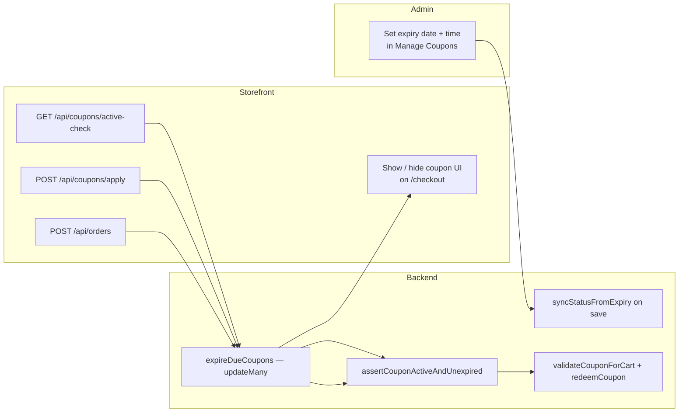
```mermaid
flowchart LR
    subgraph Admin
        A1[Set expiry date + time<br/>in Manage Coupons]
    end

    subgraph Storefront
        S1[GET /api/coupons/active-check]
        S2[Show / hide coupon UI<br/>on /checkout]
        S3[POST /api/coupons/apply]
        S4[POST /api/orders]
    end

    subgraph Backend
        B1[expireDueCoupons — updateMany]
        B2[syncStatusFromExpiry on save]
        B3[assertCouponActiveAndUnexpired]
        B4[validateCouponForCart + redeemCoupon]
    end

    A1 --> B2
    S1 --> B1 --> S2
    S3 --> B1 --> B3
    S4 --> B1 --> B3 --> B4
```

**End-to-end pipeline:**

1. **Admin schedules expiry** — Date + time fields compose `expiryDate`; status is set automatically on save.
2. **Storefront probes availability** — Checkout calls `active-check`; expired coupons are bulk-updated before the response.
3. **Customer applies coupon** — Apply endpoint sweeps, validates status + timestamp, returns server-computed discount breakdown.
4. **Order placement locks discount** — Order controller re-validates everything and atomically claims a usage slot only if the coupon is still `ACTIVE` and unexpired.

---

### Related API Endpoints

| Method | Endpoint | Description | Auth |
|--------|----------|-------------|------|
| **`GET`** | **`/api/coupons/active-check`** | **Runs bulk expiry sweep against server time; returns `{ hasActiveCoupon, serverTime, timezone }`** | **Public** |
| `POST` | `/api/coupons/apply` | Validate coupon & return price breakdown (runs expiry sweep first) | Public/User² |
| `GET` | `/api/coupons` | List coupons with **`displayStatus`** (auto-expires overdue records before response) | Admin |
| `GET` | `/api/coupons/:id` | Get single coupon with **`displayStatus`** | Admin |
| `POST` | `/api/coupons` | Create coupon with precise `expiryDate` | Admin |
| `PUT` | `/api/coupons/:id` | Update coupon (status re-derived on save) | Admin |
| `PATCH` | `/api/coupons/:id/toggle` | Toggle `ACTIVE` ↔ `EXPIRED` (blocked if past `expiryDate`) | Admin |
| `DELETE` | `/api/coupons/:id` | Delete coupon | Admin |
| **`POST`** | **`/api/admin/sync-data`** | **Global Sync Data — flush expired coupons, return fresh `data.coupons[]` with `displayStatus`** | **Admin** |
| `POST` | `/api/orders` | Place order — **re-validates coupon status + expiry server-side** | User |

**`GET /api/coupons/active-check` — handler validation flow:**

```javascript
const checkActiveCoupons = async (req, res) => {
    const { now, timezone, iso } = await getApplicationTimeContext();

    // 1. Bulk-expire all overdue ACTIVE coupons (server clock)
    await Coupon.expireDueCoupons(now);

    // 2. Verify at least one truly active, unexpired coupon exists
    const activeCoupon = await Coupon.findOne({
        status: 'ACTIVE',
        expiryDate: { $gt: now }
    }).select('_id');

    res.status(200).json({
        hasActiveCoupon: Boolean(activeCoupon),
        serverTime: iso,
        timezone
    });
};
```

**Sample response:**

```json
{
  "hasActiveCoupon": true,
  "serverTime": "2026-07-20T10:51:00.000Z",
  "timezone": "Asia/Dhaka"
}
```

---

## 🆕 What's New — v3.1.0 (Dynamic Delivery & Address Management)

This release introduces a fully automated, tamper-resistant shipping and address pipeline — no manual shipping-option pickers for customers.

| Capability | Highlights |
|------------|------------|
| **🚚 Automated Shipping Fees** | Delivery charge is computed from the customer's **district** vs. the admin's **Shop Home City** — inside-city vs. outside-city rates apply automatically. |
| **📍 Layered Profile Address** | Customers save **District → Upazila/Thana → Full Address** in their profile; checkout forms **auto-populate** from saved data. |
| **⚙️ Admin Delivery Control Panel** | Configure **Shop Home City**, **Inside/Outside City** rates, and a **Free Shipping** order threshold from the Super Admin panel. |
| **🔒 Server-Side Price Locking** | Subtotals, discounts, delivery fees, and grand totals are **re-calculated on the backend** from catalog prices + `Settings` before MongoDB write — client-supplied totals are never trusted. |

> 📌 See the dedicated [Dynamic Delivery & Address Management](#-dynamic-delivery-charge--address-management-system) section below for schema details, workflow diagrams, and API endpoints.

---

## 🚚 Dynamic Delivery Charge & Address Management System

A comprehensive, highly automated shipping and address pipeline built for Bangladesh e-commerce. Customers never pick a shipping tier manually — the platform derives the correct fee from structured location data and admin-defined rules, then **locks verified totals on the server** at order placement.

### Feature Overview

#### Automated Shipping Fee Calculation
- Shipping fees are **calculated dynamically** — there is no manual "Inside City / Outside City" selector for customers.
- The system compares the customer's **shipping district** against the admin-configured **Shop Home City**.
- **Inside-city rate** applies when districts match; **outside-city rate** applies otherwise.
- If the merchandise **subtotal meets or exceeds** the admin's **Free Shipping Threshold** (`Setting.freeShippingThreshold`, mirrored to `Settings.freeShippingMinAmount`), delivery charge is **৳0** (set threshold to `0` to always offer free shipping).
- **`getFreeShippingProgress()`** in `utils/deliveryChargeService.js` is the single waiver rule shared by cart, checkout, shipping quotes, and order placement.

#### Profile Address Auto-Fill
- Customers save a **layered address** on their profile:
  - **District** (64 Bangladesh districts)
  - **Upazila / Thana** (cascading dropdown, populated from `bd-upazilas.js`)
  - **Full Address** (street, house, landmark, etc.)
- On checkout, saved profile fields **automatically pre-populate** the shipping form — reducing friction and input errors.
- District selection drives **real-time delivery charge preview** in the order summary.

#### Dynamic Admin Control Panel
From **Admin Panel → Settings**, admins configure delivery rules without code changes:

| Setting | Purpose | Default |
|---------|---------|---------|
| `shopHomeCity` | The shop's home district (reference for inside/outside matching) | `Dhaka` |
| `deliveryInsideCity` | Shipping fee when customer district matches shop home city | `৳60` |
| `deliveryOutsideCity` | Shipping fee for all other districts | `৳120` |
| `freeShippingMinAmount` | Merchandise subtotal threshold for free delivery (mirrored from Master Settings) | `৳1000` |
| `freeShippingThreshold` | Resolved canonical threshold returned in public API payloads | same as above |

Changes are persisted in the singleton `Settings` document and exposed to the storefront via a public API.

#### Server-Side Security Validation
Client-side checkout previews are for UX only. On `POST /api/orders`, the backend:

1. **Re-fetches catalog prices** from MongoDB (never trusts client line-item prices).
2. **Re-validates coupons** — checks `status`, exact `expiryDate`, usage limits, and per-user caps — then applies discounts server-side.
3. **Re-computes delivery charge** via `utils/deliveryChargeService.js` using live `Settings`.
4. **Builds locked totals** (`subTotal`, `deliveryCharge`, `grandTotal`) and persists them on the order document.

Any tampered client payload (inflated discounts, zeroed shipping fees, etc.) is overwritten with verified server values before the order is written.

---

### Database Schema Extensions

#### `Settings` Model (`models/Settings.js`)

Singleton document (`key: 'global'`) storing platform-wide delivery rules:

```javascript
{
  key: { type: String, default: 'global', unique: true },  // Singleton guard

  shopHomeCity: {
    type: String,
    default: 'Dhaka',
    trim: true
  },
  deliveryInsideCity: {
    type: Number,
    default: 60,
    min: 0
  },
  deliveryOutsideCity: {
    type: Number,
    default: 120,
    min: 0
  },
  freeShippingMinAmount: {
    type: Number,
    default: 1000,
    min: 0
  }
}
```

#### `User` Model Updates (`models/user.js`)

Layered profile address fields for auto-fill at checkout:

```javascript
{
  district:   { type: String, trim: true, default: '' },  // Bangladesh district
  upazila:    { type: String, trim: true, default: '' },  // Upazila name
  thana:      { type: String, trim: true, default: '' },  // Thana (synced with upazila)
  fullAddress:{ type: String, trim: true, default: '' }   // Street / house / landmark
}
```

> **Note:** `thana` mirrors `upazila` when only one is supplied — preserving compatibility with both naming conventions used across Bangladesh.

#### `Order` Model Updates (`models/order.js`)

Locked financial and shipping fields written at checkout (server-authoritative):

```javascript
{
  subTotal:             { type: Number, required: true, default: 0, min: 0 },
  deliveryCharge:       { type: Number, required: true, default: 0, min: 0 },
  grandTotal:           { type: Number, required: true, default: 0, min: 0 },
  shippingDistrict:     { type: String, default: '', trim: true },
  shippingLocationType: { type: String, enum: ['Inside City', 'Outside City'], default: 'Inside City' }
}
```

Legacy fields (`subtotal`, `shippingFee`, `deliveryLocationType`, `totalAmount`) remain for backwards compatibility with older orders.

---

### Architectural Workflow

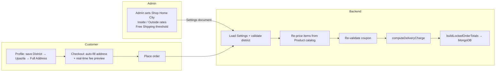
```mermaid
flowchart LR
    subgraph Admin
        A1[Admin sets Shop Home City<br/>Inside / Outside rates<br/>Free Shipping threshold]
    end

    subgraph Customer
        C1[Profile: save District → Upazila → Full Address]
        C2[Checkout: auto-fill address<br/>+ real-time fee preview]
        C3[Place order]
    end

    subgraph Backend
        B1[Load Settings + validate district]
        B2[Re-price items from Product catalog]
        B3[Re-validate coupon]
        B4[computeDeliveryCharge]
        B5[buildLockedOrderTotals → MongoDB]
    end

    A1 -->|Settings document| B1
    C1 --> C2
    C2 --> C3
    C3 --> B1
    B1 --> B2 --> B3 --> B4 --> B5
```

**End-to-end pipeline:**

1. **Admin sets rules** — Shop Home City, inside/outside rates, and free-shipping threshold saved via `PUT /api/admin/settings`.
2. **User saves profile address** — Cascading **District → Upazila/Thana** dropdowns on `/profile`; data stored on the `User` document.
3. **Checkout auto-fills & evaluates pricing** — `checkout.js` loads public delivery settings, pre-fills from profile, and recalculates shipping on every district/subtotal change.
4. **Backend interceptor locks records** — `orderController.createOrder` ignores client totals, recomputes everything, and writes immutable `subTotal`, `deliveryCharge`, `grandTotal`, and `shippingDistrict` to MongoDB.

#### Shared Delivery Logic (`utils/deliveryChargeService.js`)

Both checkout preview and order placement use the same helpers:

```javascript
getDeliverySettings()                              // resolves threshold from Setting + Settings
getFreeShippingProgress(settings, subtotal)        // { threshold, unlocked, remaining, progressPercent }
resolveDeliveryZone(settings, customerDistrict)    // 'inside' | 'outside'
computeDeliveryCharge(settings, { customerDistrict, subtotal })
buildLockedOrderTotals({ itemSubtotal, discountAmount, deliveryCharge })
```

District normalization and validation live in `utils/bangladeshDistricts.js`; upazila/thana data is served to the frontend via `client/js/bd-districts.js` and `client/js/bd-upazilas.js`.

---

### Related API Endpoints

| Method | Endpoint | Description | Auth |
|--------|----------|-------------|------|
| `GET` | `/api/store/delivery-settings` | Public delivery rules for checkout preview (includes resolved threshold) | Public |
| `GET` | `/api/store/shipping-quote` | District + subtotal → zone, fee, estimated delivery window, `freeShipping` progress | Public |
| `GET` | `/api/store/announcement` | Live announcement text, highlight chips, reward snapshot | Public |
| `GET` | `/api/store/districts` | List of valid Bangladesh districts | Public |
| `GET` | `/api/admin/settings` | Admin: read delivery settings | Admin |
| `PUT` | `/api/admin/settings` | Admin: update delivery settings | Admin |
| `POST` | `/api/orders` | Place order (server re-validates all totals) | User |

> **Profile update:** `PUT /api/customer/update-profile` accepts `district`, `upazila`, `thana`, and `fullAddress` for the layered address system.

---

## 🆕 What's New — v3.0.0 (The Fortified Security & Branding Release)

This release transforms the admin surface into an **enterprise IAM-grade** control plane and introduces full store personalization.

### 🔐 Multi-Layered Two-Factor Authentication (2FA)
| Method | How it works | Powered by |
|--------|--------------|------------|
| **📧 Email OTP** | Hashed 6-digit code emailed on login (5-min expiry) | `nodemailer` (SMTP) |
| **📱 Google Authenticator (TOTP)** | Scan a QR code once, then use time-based codes with ±30s drift tolerance | `speakeasy` + `qrcode` |
| **✉️ SMS OTP** | 6-digit code delivered through a pluggable SMS gateway (console fallback in dev) | `utils/smsSender.js` |

Admins pick and switch their preferred method from the settings panel; self-service **setup + verify** flows exist for both TOTP and SMS.

### 🌍 Admin Login Region Lock (Geo-Fencing)
- Resolves the login IP → ISO country code **offline** via `geoip-lite`.
- Rejects logins (**HTTP 403**) *before any credential check* if the origin country is not in the `ALLOWED_COUNTRIES` allow-list (e.g. `BD`, `SA`).
- Developer-friendly `GEO_ALLOW_PRIVATE` bypass for localhost / LAN.

### 🎨 Custom Store Branding & Platform Settings
- **Tabbed Admin Settings shell** *(v4.3.0)* — **Store Branding**, store info, delivery rules, and profile/security are organized under responsive tabs (**Profile & Security** · **Store & Shipping Preferences** · **Store Branding**) with isolated per-section save buttons.
- **Live server-side upload** of **Store Logo** and **Favicon** to Cloudinary with **instant dynamic previews** (old assets auto-purged) — drag-and-drop zones in the **Store Branding** tab.
- **Custom currency formatting** — configure a Currency **Code** (e.g. `BDT`) and **Symbol** (e.g. `৳`) applied across all admin price displays — editable in **Store & Shipping Preferences**.
- **Timezone Synchronization** — the admin dashboard header's **live digital clock** re-renders in the selected timezone in real time.

### 🔒 Session & Audit Hardening
- Full admin **session/device tracking** with "This Device" highlighting and remote logout.
- Secure **cookie handling** on logout (`adminToken` / `token` cleared server-side).
- Complete **login history**, **failed-attempt**, and **security event** audit feeds.

> 📌 See the full [Changelog](#-changelog) for a versioned breakdown.

---

## 🗺️ Feature Roadmap (Past & Present)

### 🛍️ Core E-Commerce Modules

#### Catalog Management Engine
- **📂 Categories** — Full CRUD with optional **`customCashbackPercentage`** override; renaming a category **syncs all linked products** automatically.
- **🏷️ Brands** — Full CRUD with a clean grid layout, automatic **slug generation** (Unicode/Bengali-aware), and strict product-to-brand **database references**.
- **🎛️ Product Attribute Library** — Master attribute management (**Color**, **Size**, **Material**…); duplicate name validation warnings; auto-populate saved global values into product create/edit forms on attribute selection *(v4.2.0)*.
- **🧩 Multi-Attribute Combination Matrix** — Amazon/Shopify-style **Size × Color × Weight** SKU engine with dynamic **`[ID]-[COLOR]-[SIZE]`** SKU auto-generation, per-row **sell/buy price, stock, SKU & image**, smart image URL auto-fill, Edit modal re-hydration, bordered responsive grid, and total-stock aggregation. *(See [Multi-Attribute Combination Matrix & Dynamic Stock Engine](#-multi-attribute-combination-matrix--dynamic-stock-engine).)*
- **🎟️ Coupons & Discounts** — Enterprise promo engine (Shopify/Daraz-style):
  - Percentage **or** flat discounts, optional **max-discount cap**.
  - **Min order amount**, **global usage limit**, **per-user limit**, and **precise expiry date-time** (hour & minute scheduling).
  - **Automated `ACTIVE` / `EXPIRED` status** — server-side bulk expiry sweeps and Mongoose save hooks keep lifecycle state authoritative.
  - **Tri-state admin `displayStatus`** — **Active · Expired · Exhausted** badges via `Coupon.deriveDisplayStatus()`; full historical directory with **All · Active · Expired** filter tabs *(v4.3.3)*.
  - **Checkout-aware visibility** — coupon UI on `/checkout` auto-hides when `GET /api/coupons/active-check` reports no eligible promotions.
  - Race-safe **atomic redemption** (`usedCount`) — usage is claimed on successful order placement, released on failure.
  - Storefront **apply / validate** endpoint with optional customer auth for per-user enforcement; order placement re-validates status + expiry on the backend.
  - *(See [Catalog & Marketing Features](#-catalog--marketing-features) and [Time-Sensitive Coupon Automation](#-time-sensitive-coupon-automation-system).)*

#### Product & Order Systems
- **🛍️ Product Catalog** — Up to 10 images, categories, brand, **simple or matrix variations**, highlights, **flexible stock**, **per-variant selling + buying price**, list-table **minimum sell/buy price** display for matrix products, **persistent pagination across edit/save**, **opaque sticky table headers** (incl. Actions), live profit preview, and detailed descriptions *(v4.2.0)*.
- **📦 Order Management & Tracking** — Place orders, responsive mobile card + compact desktop table views, **clickable order rows** (v3.4.0) with inline ID/date meta, **visual step-based order status timeline** on Order Details, customer **Cancel** / **Return Request** workflows with reason modals (actions on detail view only), dedicated cancelled/return status badges, public order tracking, `cancelledBy` audit field, per-item **buying-price snapshots** at checkout, **1-click PDF invoice download** from Order Details, **automated order confirmation emails** on every successful checkout, **background WhatsApp admin order alerts** (v4.0.0), **staff manual POS / phone order entry** with variant stock validation (v4.0.0), and **admin one-click multi-provider courier dispatch** (Steadfast / Pathao / RedX) with Smart Hybrid Mode, dedicated **Courier Status** + **Actions** Live Orders columns, and customer tracking badges (v3.7.0 · refined v4.4.1).
- **🔄 Admin Return & Refund Pipeline** — Approve returns with automatic wallet **`CREDIT`**, full **`walletApplied + grandTotal`** refund math, transaction history logging, and **Safe Undo Refund** within a configurable hour window (spent-funds safety check).
- **💳 Checkout Wallet Deduction** — Live wallet balance on checkout/payment, **Apply Wallet Balance** checkbox, dynamic payable recalculation, **Paid via Wallet** auto-selection, and atomic **`DEBIT`** ledger entries on order placement.
- **💳 Dynamic Payment Methods & Gateway Integration** — Database-backed **Manual** (bKash, Nagad, Rocket, Bank Transfer) and **Automated** (SSLCommerz, Aamarpay) catalog with **AES-256-GCM encrypted credentials**, flat/percentage processing fees, admin logo upload, checkout `sortOrder`, and **IPN callback readiness** — no hardcoded payment cards on `/payment`. *(See [Dynamic Payment Methods & Gateway Integration](#-dynamic-payment-methods--gateway-integration).)*
- **👑 VIP Customer Segmentation** — Configurable spend/order thresholds; admin filter tabs **[All] \| [VIP / Top Buyers] \| [Frequent Buyers]** with segment badges and lifetime spend column.
- **⚡ Flash Sale Engine** — Master Settings scheduling (title, end date-time, discount %, featured products); homepage **HH:MM:SS** countdown; server-side flash pricing on catalog and checkout.
- **🚚 Dynamic Delivery Charges** — Automated inside/outside-city fee calculation from admin `Settings`, **unified free-shipping threshold** (Master Settings ↔ Delivery Settings mirror), **real-time free-shipping progress** on cart/checkout, **real-time delivery date estimates** on checkout, **locked server-side totals** on every order, and district-aware invoices.
- **📍 Smart Checkout Address Integration** — Profile-first checkout pre-fill, toggleable saved-address radio cards (select / unselect / revert), manual override with **Save to profile** sync, and cascading Bangladesh location dropdowns.
- **🛒 Shopping Cart & Checkout Enhancements** — Server-synced cart with quantity updates, selection toggles, **real-time low-stock FOMO badges** and out-of-stock quantity guardrails, **checkout-only district & promo UI**, **AJAX coupon recalculation** (flat/percentage), **guest-cart merge** on login/OAuth (variant-aware quantity increment), post-order cleanup, a **full-width profile cart list** with inline Proceed-to-Order bar (no right-hand summary/promo blocks), **non-destructive wishlist heart toggles** on cart rows, and a **header slide-over mini cart drawer**.
- **⭐ Reviews & Ratings** — Star ratings and reviews with optional photo upload; averages update automatically.
- **📍 Address Book** — Manage multiple delivery addresses with **single Primary / Default** flag; default address auto-selects and pre-fills checkout; profile sync from checkout respects default promotion.
- **🔒 Profile Security** — `bcrypt` password change (current-password gated), **6-digit OTP** verification for email/phone updates, active session/device management on the Security tab.
- **💰 Wallet & Loyalty Points** — Admin-configurable cashback, points earning, and conversion rates; category-specific cashback overrides; **checkout wallet deduction** with full **CREDIT/DEBIT** ledger; convert points to wallet balance with transaction history.

#### ❤️ My Wishlist

A fully implemented customer favourites system with MongoDB-backed persistence and seamless AJAX interactions across the storefront and profile dashboard.

- **Persistent Storage** — Wishlist items are saved persistently in MongoDB as an embedded array on the user's account (`User.wishlist`), linked to their profile. Favourites remain intact after placing orders, logging out, or starting a new session — items are only removed when the customer explicitly deletes them.
- **AJAX-powered Toggle** — Storefront product grids (home, search, etc.) use a sleek client-side **Fetch API** integration: clicking the heart icon calls `POST /api/wishlist/toggle` to add or remove items dynamically, with instant visual feedback and the **global toast notification engine** — no hard page refreshes required.
- **Real-time Stock Awareness** — Wishlist mini-cards surface **low-stock FOMO badges** (`🔥 Only X left in stock`) and **Out of Stock** indicators with add-to-cart guardrails, synced against live catalog inventory.
- **Unified Profile Integration** — The **My Wishlist** panel is fully integrated into the Customer Profile dashboard (`/profile` → **My Cart & Wishlist** tab). Each mini-card ships with compact **icon-only Cart and Delete buttons** — add straight to the active cart via `/api/cart/add` or remove instantly from the DOM after a successful toggle, backed by global toast feedback.
- **Optimized Mini-Card UI** — Wishlist items render in a compact, scaled-down **premium mini-card grid** (`wishlist-grid` / `wishlist-card`) with responsive breakpoints, **icon-only action controls**, and tightened mobile spacing — designed for high visual consistency with the rest of the customer dashboard styling.
- **Profile Tab Navigation & Clean URLs** — Query-param deep links (`/profile?tab=orders`) activate the correct tab on load; sidebar navigation and header cart shortcuts maintain a **pristine `/profile` address bar** (no `#hash` artifacts) via `replaceState`; contextual back buttons on order details and reload-safe cleanup documented in [Smart Tab Navigation](#-smart-tab-navigation--contextual-routing-user-profile).

### 🛡️ Advanced Security Suite (Recent Updates)
- **Multi-layered Two-Factor Authentication** — Email OTP, Google Authenticator / TOTP, and SMS OTP (console gateway with Twilio/custom hooks ready).
- **Admin Login Region Lock (Geo-Fencing)** — permitted-country allow-list (`BD`, `SA`, …) enforced offline before credentials are checked.
- **Brute-Force Protection & Auto IP-Blacklisting** — `express-rate-limit` throttle + an Intrusion-Detection engine that bans an IP for 24h after 5 failed attempts in 15 minutes.
- **Manual IP Blacklist Manager** — list / block / unblock IPs (auto vs manual source, TTL-expiring).
- **Active Devices & Sessions** — IP, geo-location, OS/Browser/Device tracking with remote termination and **secure session/cookie logs**.
- **Security & Audit Dashboard** — login history, failed/blocked attempts, and a full security event trail.

### ⚙️ Admin & Platform Settings

#### 🗂️ Admin Settings — Tabbed SaaS Architecture *(v4.3.0)*

The **Admin Settings** view (`view-settings`) is rebuilt as a responsive, Shopify/SaaS-style tabbed shell (`.admin-settings-shell`) with ARIA-compliant tab panels and permission-aware navigation:

| Tab | Scope | Isolated Save Actions |
|-----|-------|----------------------|
| **Profile & Security** | Admin profile (display name, username, password), **Two-Factor Authentication** manager | **Save Profile** |
| **Store & Shipping Preferences** | Store name, currency code/symbol, timezone, delivery rules (home city, inside/outside rates, free-shipping threshold) | **Save Store Info** · **Save Delivery Rules** |
| **Store Branding** | Logo & favicon drag-and-drop upload with live Cloudinary previews | **Save Store Branding** |

- **Uniform card layout** — every section uses `.saas-settings-card` with consistent padding, `rounded-xl` borders, slate elevation, and a **dedicated footer save button** per form (no monolithic submit).
- **Compact 2FA controls** — Email OTP, Google Authenticator (TOTP), and SMS OTP render as a **horizontal 3-column grid** (`.twofa-methods--compact`) with inline **status badges** (`Ready`, `Not set up`, active checkmarks) instead of stacked vertical cards — fixes prior layout imbalance across security panels.
- **RBAC gating** — **Store & Shipping** and **Store Branding** tabs require `manage_settings`; Profile & Security remains accessible to all authenticated admins.

#### ⚙️ System Settings (Modular Store Configurations)

- **⚙️ System Settings** — rebranded from *Master Settings* to align with Shopify/SaaS conventions; **seven independent configuration cards** with section-level save actions:
  - **Announcement & Free Shipping** — dashboard banner copy, free-shipping threshold, visibility toggle; mirrors into Delivery Settings on save.
  - **SMS Gateway** — provider, API key, sender ID, and notification toggle (MongoDB overrides `.env`).
  - **Courier Booking** — Steadfast / Pathao / RedX credentials for one-click Live Orders dispatch.
  - **WhatsApp Configuration** — public customer chat line + private admin alert number with gateway fields.
  - **Flash Sale Engine** — schedule, discount %, featured product IDs, and live storefront preview.
  - **VIP Customer Segmentation** — `vipMinTotalSpent`, `vipMinOrderCount`, `frequentBuyerMinOrders` thresholds.
  - **Cashback / Loyalty & Refunds** — global cashback %, points earning ratio, points-to-taka conversion, refund-undo window with live economics preview.
  - **Accepted Payment Methods** — dynamic **Manual / Automated** gateway catalog with encrypted credentials, logo upload, processing fees, display ordering, and active/inactive toggles *(v4.4.0)*.
  - Each card POSTs an **isolated partial payload** to **`POST /api/admin/master-settings/update`**; per-section loading states and success toasts; premium card layout with color-coded headers and focus-ring inputs *(v4.3.0)*.
- **📩 Customer Notification Engine** — admin-configurable SMS gateway (Greenweb BD, BulkSMS BD, AlphaSMS, Generic API) with MongoDB-stored credentials; automated order confirmation emails via Nodemailer with fail-safe async dispatch.
- **🚚 Courier Parcel Booking** — Steadfast API integration from Live Orders; MongoDB-stored API key/secret; atomic booking lock; tracking ID + consignment ID saved on the order document.
- **Category Cashback Overrides** — per-category custom cashback percentages with seamless fallback to global defaults.

> 📌 **Store Branding**, **currency/timezone**, and **delivery rules** now live under the tabbed **Admin Settings** panels above; **System Settings** covers operational modules (SMS, courier, WhatsApp, flash sale, VIP, rewards).

### 🖥️ Super Admin Panel (`/admin`)

#### 🧭 Clean Admin Routing & Navigation Architecture *(v4.3.1)*

The admin SPA (`client/admin.html` + `client/js/admin.js`) uses **in-panel sidebar navigation** — not URL query parameters — to switch between Dashboard sections. Routing conventions align with standard SaaS admin dashboards and the existing `/profile` clean-URL pattern.

| Behavior | Implementation |
|----------|----------------|
| **Pristine address bar** | Browser URL stays strictly **`/admin`** — no `?section=`, `?page=`, or filter query strings appended during navigation, pagination, or product edit/save cycles. |
| **Legacy URL cleanup** | `ensureCleanAdminUrl()` runs on `DOMContentLoaded` and strips any bookmarked query params via `history.replaceState({}, document.title, window.location.pathname)`. |
| **Reload → Overview** | F5 / hard refresh on `/admin` always loads the **Dashboard Overview** tab first (HTML default + no URL-based section boot); deep-link section restoration removed from init. |
| **Pagination without URL pollution** | Manage Products page index, filters, and sort persist in **`sessionStorage`** (`eob_admin_products_pagination`) and in-memory (`savedProductPageBeforeAction`); `saveProductPaginationState()` before edit/save/delete + `filterAndRenderProducts(false)` after AJAX keep operators on the same catalog page. |
| **Sidebar re-entry** | Navigating back to **Manage Products** within the same browser session restores the last page/filters from `sessionStorage` via `readProductListSessionState()` — without touching the address bar. |

#### 🗂️ Tabbed Admin Settings & Variant Matrix *(v4.3.0)*

| Surface | Navigation & UX |
|---------|-----------------|
| **Admin Settings** (`view-settings`) | Responsive **tabbed SaaS shell** — **Profile & Security** · **Store & Shipping Preferences** · **Store Branding** — each panel uses `.saas-settings-card` layout with **isolated per-section save buttons**; Store tabs RBAC-gated via `manage_settings`. |
| **System Settings** (`view-master-settings`) | **Seven modular configuration cards** (Announcement, SMS, Courier, WhatsApp, Flash Sale, VIP, Rewards) — each card POSTs an isolated partial payload to `POST /api/admin/master-settings/update` with its own **Save [Section]** button. |
| **Manage Products table** | Bounded `.products-table-scroll` container with **fully opaque sticky headers** on every `<th>` — including **Actions** — using **`position: sticky; top: 0; z-index: 20`** and solid `#ffffff` backdrops; no header bleed-through during deep vertical scroll. |
| **Variant Matrix modals** | Add/Edit Product combination tables retain **sticky matrix headers** inside scrollable `.variant-matrix-wrap` panels for bulk SKU entry at scale. |

- **📊 Dashboard Overview** — **Sales & Business Analytics** (revenue daily/monthly/all-time, order counters, Chart.js sales trend + top-5 product charts) plus **Inventory Alerts** widget with inline stock updates; **Customer Insights** metrics (total/verified/pending/blocked users) and a **6-month registration growth chart** (Chart.js). *(Requires `view_analytics` for staff.)*
- **👥 Customer Management** — View, edit, block, suspend, reactivate; order-count badges; per-customer order history modal. *(Requires `manage_customers`.)*
- **🗂️ Admin Settings** — responsive **tabbed SaaS shell** (Profile & Security · Store & Shipping Preferences · Store Branding) with uniform card padding, isolated per-section saves, and compact horizontal **2FA status badges** *(v4.3.0)*.
- **⚙️ System Settings** — modular configuration hub for shipping, notifications, loyalty economics, courier/WhatsApp integrations, flash sales, VIP thresholds, **Footer Settings**, and **Page Content Manager**; independent card saves with toast feedback *(v4.3.0 · footer/CMS v4.5.0)*.
- **✉️ Messages / Inquiries** — **Outlook-style 2-column split inbox** at **`/admin/messages`** — left list (search, All/Unread/Replied tabs, avatar cards) + right reading pane (full message, email/phone copy, status badges, inline **Send Email Reply** via SMTP) *(v4.5.0 · requires `manage_settings`)*.
- **📦 Live Orders** — Premium sticky-header table with compact spacing, horizontal action toolbar (**Send to Courier**, Invoice, Delete), **Create Manual Order** POS modal (v4.0.0), distinct customer/admin cancellation badges, return approval, safe refund undo, reason visibility, invoice view/print, search, filter, and pagination. *(Requires `manage_orders`.)*
- **📱 WhatsApp Alert Badge** — Header badge surfaces pending wa.me fallback alerts when the background gateway cannot auto-deliver (v4.0.0).
- **🛍️ Product CRUD & Variant Matrix** — Add/edit with images, per-variant buying/selling price, live profit preview, **Simple Product / Variant Matrix** modes with **Attribute Library auto-fill**, dynamic SKU generation, bordered matrix grid with sticky modal headers, **session-based pagination retention** across edit/save workflows *(v4.3.1)*, **fully opaque sticky table headers** (`sticky top-0 z-20`), bulk delete, CSV export, and print-ready tables. *(Requires `manage_inventory`.)*
- **👤 Enterprise Role & Staff Management** — Dual-column credentials + permissions matrix, interactive toggle switches, **Quick Role Presets** (Full Admin · Inventory Manager · Customer Support), polished KPI widgets, sticky staff directory table, suspend/activate, reset password, and delete. *(Super Admin only.)*
- **🔔 Professional UX** — SweetAlert2 toasts + modal confirmations, asynchronous DOM re-rendering (instant UI sync, no manual refresh), permission-aware sidebar gating.

### 💹 Finance & Analytics (`/finance-analytics`)
- Secure password gate (`ADMIN_DASHBOARD_PASSWORD`) with a dedicated finance token (also accepts an admin JWT with **`view_analytics`** permission).
- **Advanced P/L engine** — itemized **`Net Profit = Gross Revenue − COGS − Item Discounts − Coupon Savings − Loyalty Point Redemptions`** with dynamic date-range presets (`Today`, `Yesterday`, `Last 7 Days`, `This Month`, `All Time`, Custom).
- KPIs: **Gross Sales**, **Net Profit**, **Total Orders**, **Profit Margin %**, **Discounts Total**, plus COGS / shipping mini-stats.
- Charts: **Revenue vs Net Profit** (line) and **Top Selling Categories** (pie) — Chart.js datasets refresh instantly on range change.
- Persistent **`🌙 Dark / ☀️ Light`** theme toggle with `localStorage` preference and flash-free first paint.

### 🌐 Platform
- **Clean URLs** — Automatic `.html` stripping and 301 redirects for SEO-friendly routes (`/about`, `/contact`, `/privacy-policy`, `/terms`, `/careers`, `/admin/messages`).
- **📄 Information Pages & CMS** — Premium Contact, About, Privacy, Terms, and Careers pages with Markdown **Page Content Manager**, publish toggles, and dynamic footer link filtering *(v4.5.0)*.
- **🦶 Dynamic Footer Engine** — Admin-managed columns, social links, copyright, and payment badges via **`FooterSettings`** + shared **`footerRenderer.js`**; **desktop** uniform **`md:grid-cols-4`** grid (**Company · Support · Quick Links · Follow Us**) on **`bg-slate-900`** with payment badges in **bottom copyright bar** (`flex-row justify-between`); **mobile** ultra-compact ≤ 3-line zero-margin strip (flex-wrap quick links · social tap states · 10px copyright, **`hidden md:flex`** payments) with WhatsApp float clearance at **`md+` (768px)** *(v4.5.0)*.
- **✉️ Contact Inbox & Direct Email Reply** — Storefront form submissions persisted to **`ContactMessage`**; admin **Outlook 2-column split inbox** at `/admin/messages` with SMTP-powered **`POST /api/inquiries/:id/reply`** *(v4.5.0)*.
- **Server-side page guards** for the finance dashboard and 2FA handoff page.
- **Global Toast Notifications** — Lightweight, non-blocking `#global-toast-stack` popups for cart, wishlist, and stock feedback across the customer storefront (auto-dismiss, mobile-responsive, max 4 visible).

---

## 🧰 Tech Stack

| Layer | Technologies |
|-------|--------------|
| **Frontend** | HTML5, CSS3, Vanilla JavaScript, Chart.js, Toastr, SweetAlert2 |
| **Backend** | Node.js, Express.js 5 |
| **Database** | MongoDB (Atlas) via Mongoose ODM |
| **Authentication** | JSON Web Tokens (`jsonwebtoken`), `bcryptjs` |
| **2FA** | `speakeasy` (TOTP), `qrcode` (QR generation), `nodemailer` (Email OTP), SMS gateway abstraction |
| **Security & Intelligence** | `express-rate-limit`, `geoip-lite` (geo-fencing + geo-location), `request-ip`, `ua-parser-js` |
| **File / Media** | `multer`, `sharp`, `cloudinary`, `streamifier`, `pdfkit` (order invoice PDFs) |
| **Config** | `dotenv` |

### Core Dependencies

```json
"bcryptjs"           "cloudinary"        "dotenv"        "express"
"express-rate-limit" "geoip-lite"        "jsonwebtoken"  "mongoose"
"multer"             "nodemailer"        "pdfkit"        "qrcode"        "request-ip"
"sharp"              "speakeasy"         "streamifier"   "ua-parser-js"
```

---

## 📁 Project Architecture & File Structure

A clean **MVC** backend paired with a static, Express-served frontend:

```
eonlinebazar-fullstack/
│
├── config/
│   ├── db.js                          # MongoDB (Atlas) connection
│   └── permissions.js                 # RBAC permission catalog, sidebar map & sanitizers
│
├── models/                            # Mongoose schemas (data layer)
│   ├── user.js                        # Customer + layered address, wishlist[], wallet; indexes: email, mobile
│   ├── wishlist.js                    # Wishlist item subdocument schema (productId, name, price, image…)
│   ├── userSession.js                 # Active customer device / login sessions
│   ├── admin.js                       # Admin account — RBAC fields, 2FA, bcrypt hashing & platform settings
│   ├── Settings.js                    # Singleton delivery + SMS + courier settings (key: global)
│   ├── Setting.js                     # Singleton master store settings (key: master — rewards, threshold, announcement)
│   ├── FooterSettings.js              # Singleton footer columns, social links, payment badges, copyright
│   ├── PageContent.js                 # CMS pages (about, contact, privacy-policy, terms, careers)
│   ├── ContactMessage.js              # Contact inquiries — status lifecycle + reply fields
│   ├── adminSession.js                # Active admin device / login sessions
│   ├── loginAttempt.js                # Login history & failed/blocked attempt audit
│   ├── blacklistedIp.js               # Auto + manual IP bans (TTL-expiring)
│   ├── securityLog.js                 # Admin/customer security & auth event log
│   ├── product.js                     # Products (variants[], stock); text + category + slug indexes
│   ├── category.js                    # Product categories (optional customCashbackPercentage)
│   ├── brand.js                       # Product brands (slug + product references)
│   ├── attribute.js                   # Master product attribute library (Color, Size, values[]) — auto-fill source
│   ├── coupon.js                      # Coupons & discounts (status ACTIVE/EXPIRED, precise expiryDate, usage limits)
│   ├── PaymentMethod.js               # Dynamic payment catalog — manual wallets + automated gateways, encrypted apiConfig
│   ├── order.js                       # Orders (lifecycle + courier fields); indexes: orderId, user, status, createdAt
│   ├── cart.js                        # Shopping cart
│   └── review.js                      # Product reviews & ratings
│
├── controllers/                       # Business logic (controller layer)
│   ├── authController.js              # Customer session list / revoke / logout-others
│   ├── userController.js              # Customer auth, profile, wishlist CRUD, addresses, wallet
│   ├── wishlistController.js          # Wishlist toggle (add/remove) with product snapshot enrichment
│   ├── adminController.js             # Admin customers, dashboard analytics, platform branding, logs, profile
│   ├── staffController.js             # Staff CRUD, permission catalog, status toggle & password reset
│   ├── settingsController.js          # Delivery charge & free-shipping settings (admin API)
│   ├── masterSettingsController.js    # Unified master settings — announcement, threshold, rewards, SMS & courier credentials
│   ├── courierController.js           # Admin courier booking API — Steadfast dispatch, atomic lock, status update
│   ├── storeController.js             # Public storefront branding, delivery settings, shipping quotes, footer & CMS pages
│   ├── footerSettingsController.js    # Footer admin CRUD + social/payment icon upload
│   ├── pageContentController.js       # CMS page admin + public read (Markdown → HTML)
│   ├── contactController.js           # Contact submit, inbox CRUD, SMTP inquiry reply
│   ├── adminSecurityController.js     # 2-step login, admin sessions, IP blacklist, login history
│   ├── twoFactorController.js         # Self-service 2FA manager (Email / TOTP / SMS)
│   ├── productController.js           # Product CRUD + reviews
│   ├── brandController.js             # Brand CRUD + slug generation
│   ├── attributeController.js         # Attribute / variant CRUD
│   ├── couponController.js            # Coupon CRUD + active-check + apply/validate/redeem + auto-expiry sweeps
│   ├── orderController.js             # Orders, cancel/return, return approval, refund undo, invoice PDF, order email/SMS hooks
│   ├── paymentMethodController.js     # Admin CRUD for dynamic payment method catalog (logo upload, reorder, toggle)
│   ├── paymentIpnController.js        # Public payment methods, gateway initiate, IPN/callback handler
│   ├── cartController.js              # Cart operations
│   ├── reviewController.js            # Review system
│   └── financeController.js           # Revenue, itemized P&L analytics & date-range aggregation engine
│
├── routes/                            # Express route definitions (routing layer)
│   ├── authRoutes.js                  # /api/auth
│   ├── userRoutes.js                  # /api/customer (+ wishlist GET/POST/DELETE)
│   ├── wishlistRoutes.js              # /api/wishlist (toggle endpoint)
│   ├── adminRoutes.js                 # /api/admin (+ 2FA, sessions, blacklist, RBAC staff, footer, pages, messages)
│   ├── staffRoutes.js                 # /api/admin/staff (Super Admin staff management)
│   ├── storeRoutes.js                 # /api/store (public branding, delivery settings, footer, CMS pages, districts)
│   ├── productRoutes.js               # /api/products
│   ├── categoryRoutes.js              # /api/categories (handler logic inline)
│   ├── brandRoutes.js                 # /api/brands
│   ├── attributeRoutes.js            # /api/attributes
│   ├── couponRoutes.js                # /api/coupons
│   ├── orderRoutes.js                 # /api/orders
│   ├── paymentRoutes.js               # /api/payments (public methods, initiate, IPN)
│   ├── contactRoutes.js               # POST /api/contact (rate-limited public submit)
│   ├── inquiryRoutes.js               # POST /api/inquiries/:id/reply (admin email reply)
│   ├── cartRoutes.js                  # /api/cart
│   ├── reviewRoutes.js                # /api/reviews
│   └── financeRoutes.js              # /api/finance
│
├── middlewares/                       # Cross-cutting request pipeline
│   ├── authMiddleware.js              # verifyUser (session-aware) & verifyAdmin (JWT + live account attach)
│   ├── rbac.js                          # checkPermission(), requireSuperAdmin, attachAdminAccount
│   ├── adminSecurity.js               # checkBlacklist gate, rate limiter, intrusion detection
│   ├── geoFencing.js                  # Admin login Region Lock (geoip-lite)
│   └── uploadMiddleware.js            # Multer + Cloudinary stream upload (5 MB images); payment logo disk upload (PNG/JPG/WEBP/SVG)
│
├── utils/                             # Shared helpers
│   ├── deviceParser.js                # Client IP + geo-location + User-Agent fingerprinting
│   ├── mailer.js                      # SMTP transport, admin 2FA OTP + order confirmation HTML emails
│   ├── smsService.js                  # DB-backed SMS gateway engine (order/status/OTP templates)
│   ├── smsSender.js                   # Admin/security SMS OTP wrapper (console fallback)
│   ├── courierService.js              # Multi-provider courier engine — hybrid live/mock dispatch, tracking URLs
│   ├── deliveryChargeService.js       # Shared delivery zone + fee + free-shipping progress + locked totals
│   ├── deliveryEstimateService.js     # Business-day delivery window estimates by shipping zone
│   ├── announcementSettings.js        # Live announcement text, highlight chips & public payload builder
│   ├── cartMergeService.js            # Variant-aware guest → user cart merge (login + API); selectedVariant normalization
│   ├── variantHelpers.js              # Combination variant parse, stock aggregation, order/cart line matching
│   ├── applicationTime.js             # Centralized server clock + platform timezone for coupon expiry
│   ├── rewardSettings.js              # Cashback/points math, category overrides, delivery rewards, refund undo window
│   ├── walletService.js               # Atomic wallet debit/credit/reversal + ledger entry builder
│   ├── flashSaleService.js            # Flash sale window, featured product pricing, public payload
│   ├── savedAddress.js                # Checkout address parsing, duplicate check, profile sync, default promotion
│   ├── invoicePdf.js                  # Branded PDF invoice generation (pdfkit) for customer order downloads
│   ├── cryptoVault.js                 # AES-256-GCM encryption vault for payment gateway credentials
│   ├── paymentMethodService.js        # Payment catalog cache, default seeding, webhook URL builder
│   ├── paymentGatewayService.js       # Gateway session orchestration for automated checkout
│   ├── paymentGatewayAdapters.js      # Provider-specific initiate/IPN adapter layer
│   ├── paymentLogoPaths.js            # Local payment logo path helpers and cleanup
│   ├── pagePublishService.js          # Footer link ↔ CMS slug publish filtering
│   ├── markdownToHtml.js              # Server-side Markdown → HTML for CMS pages
│   ├── footerIconPaths.js             # Footer social/payment icon upload paths
│   ├── bangladeshDistricts.js         # District list, normalization & inside/outside matching
│   └── securityLogger.js             # Fire-and-forget security event writer
│
├── client/                            # Static frontend (served by Express)
│   ├── index.html                     # Storefront home
│   ├── login.html / register.html     # Customer auth
│   ├── forgot-password.html           # OTP password reset
│   ├── product-details.html           # Product detail + reviews + smart variant matrix selector
│   ├── search.html                    # Search results (?q=)
│   ├── cart.html / checkout.html      # Cart & checkout flow
│   ├── payment.html                   # Payment page — dynamic method catalog (no hardcoded gateways)
│   ├── profile.html                   # Customer dashboard (cart, wishlist, wallet, addresses, security, sessions)
│   ├── order-track.html / order-details.html  # Order tracking + detail view with PDF invoice download
│   ├── about.html / contact.html / cms-page.html / footer.html
│   ├── admin-login.html               # Unified admin authentication (Super Admin + Staff)
│   ├── access-denied.html             # RBAC 403 page for unauthorized browser navigations
│   ├── verify-otp.html                # 2-Step Verification (Email / TOTP / SMS)
│   ├── admin.html                     # Super Admin panel (SPA — includes Staff Management)
│   ├── finance-login.html             # Finance password gate
│   ├── finance-analytics.html         # Finance & analytics dashboard (P/L KPIs, theme toggle, Chart.js)
│   ├── css/                           # Page-scoped stylesheets (admin.css, footer.css, info-page.css, contact.css…)
│   ├── js/                            # Page scripts (admin.js, footer.js, footerRenderer.js, contact.js…)
│   │   ├── footer.js                  # Storefront footer fetch + inject into #global-site-footer
│   │   ├── footerRenderer.js          # Shared footer HTML builder (storefront + admin preview)
│   │   ├── page-content-loader.js     # CMS page loader (404 when unpublished)
│   │   ├── contact.js                 # Contact form API submit + dynamic store info panel
│   │   ├── admin-staff.js             # RBAC sidebar gating + Enterprise Staff Management console (toggles, presets)
│   │   ├── shipping-estimator.js      # Client shipping quote + delivery estimate helpers
│   │   ├── coupon-ui.js               # Shared promo apply/remove + live total sync
│   │   ├── cart-merge.js              # Guest cart merge after login/OAuth
│   │   ├── mini-cart-drawer.js        # Site-wide header slide-over mini cart drawer
│   │   ├── cart.js                    # Shared cart renderer (profile preview, /cart page, drawer sync)
│   │   ├── invoiceDownload.js         # 1-click order PDF invoice fetch + browser download
│   │   ├── orderStatusTimeline.js     # Step-based order progress timeline + cancelled banner
│   │   ├── stockAlert.js              # Low-stock FOMO badges + out-of-stock qty guardrails
│   │   ├── variantUtils.js            # Client combination variant helpers (option state, cart meta)
│   │   ├── product-details.js         # Smart variant matrix selector + exact-variant add-to-cart
│   │   ├── payment.js                 # Dynamic payment method fetch, processing-fee totals, order submission
│   │   ├── paymentBrandLogos.js       # Default brand logo fallbacks for known providers
│   │   └── toast.js                   # Global non-blocking toast notification engine
│   └── images/                        # Static assets (favicon.png, payments/ brand logos…)
│
├── public/                            # Static public assets served at /
│   ├── images/payments/               # Default payment brand SVG/PNG assets
│   ├── uploads/payments/              # Admin-uploaded payment method logos (Multer)
│   └── uploads/footer/                # Admin-uploaded footer social/payment icons (Multer)
│
├── server.js                          # App entry: middleware, routes, clean URLs, page guards
├── seed.js                            # Database seeding
├── products.json                      # Sample product data
├── package.json
└── README.md
```

---

## 🔑 Environment Variables (.env)

Create a `.env` file in the project root. **Never commit this file** — add it to `.gitignore`.

```env
# ===============================================================
# 🌐 SERVER
# ===============================================================
PORT=3000

# ===============================================================
# 🗄️ DATABASE (MongoDB Atlas)
# ===============================================================
MONGO_URI=mongodb+srv://<user>:<pass>@<cluster>.mongodb.net/eonlinebazar?retryWrites=true&w=majority

# ===============================================================
# 🔐 AUTHENTICATION & ADMIN BOOTSTRAP
# ===============================================================
JWT_SECRET=your_strong_random_secret_key
# First login with username "admin" + this password auto-creates the admin account
ADMIN_PASSWORD=your_admin_password
# Password gate for the Finance & Analytics dashboard
ADMIN_DASHBOARD_PASSWORD=your_finance_dashboard_password
# Optional finance tuning:
# FINANCE_TOKEN_TTL=8h
# FINANCE_DEFAULT_COST_RATIO=0.70

# ===============================================================
# 🌍 GEO-FENCING (Admin Login Region Lock)
# Comma-separated ISO 3166-1 alpha-2 codes allowed to log in.
# BD = Bangladesh, SA = Saudi Arabia. Leave EMPTY to disable geo-fencing.
# ===============================================================
ALLOWED_COUNTRIES=BD,SA
# Allow logins from local/private IPs (dev machines) even when geo-fenced.
GEO_ALLOW_PRIVATE=true

# ===============================================================
# 📱 SMS GATEWAY (Admin Panel overrides these when saved in Master Settings)
# SMS_PROVIDER = console | twilio | custom   ← legacy; customer SMS now uses Master Settings
# SMS_GATEWAY_PROVIDER=Greenweb BD           ← fallback if not set in Admin Panel
# SMS_API_METHOD = post | get  (GET suits Greenweb-style query APIs)
# STORE_PUBLIC_URL = public store origin for order-tracking links in SMS
# Generic API provider uses SMS_API_URL from .env as its endpoint fallback.
# ===============================================================
SMS_PROVIDER=console
SMS_SENDER_ID=EOBAZAR
SMS_API_METHOD=post
# STORE_PUBLIC_URL=https://your-store-domain.com
# SMS_API_URL=https://your-custom-gateway.example/send
# SMS_API_KEY=

# ===============================================================
# 🚚 STEADFAST COURIER (optional .env fallbacks — Master Settings preferred)
# Credentials saved in Admin Panel override these at booking time.
# ===============================================================
# STEADFAST_API_URL=https://portal.steadfast.com.bd/api/v1/create_order
# STEADFAST_API_KEY=your_steadfast_api_key
# STEADFAST_SECRET_KEY=your_steadfast_secret_key

# 📱 WHATSAPP ORDER ALERTS (Master Settings preferred — background server-side dispatch)
# WHATSAPP_ALERT_PROVIDER=UltraMsg          # UltraMsg | Green API | CallMeBot | Generic
# WHATSAPP_ALERT_API_KEY=your_api_token
# WHATSAPP_ALERT_INSTANCE_ID=instance1150     # Required for UltraMsg / Green API
# WHATSAPP_ALERT_WEBHOOK_URL=https://your-webhook.example/send
# WHATSAPP_ALERT_TIMEOUT_MS=15000
# PUBLIC_SUPPORT_WHATSAPP=8801521377735       # Storefront chat fallback

# ===============================================================
# 💳 PAYMENT GATEWAY CREDENTIAL ENCRYPTION (v4.4.0)
# Seals storePassword / apiKey at rest in PaymentMethod documents.
# Prefer a dedicated 64-char hex key; JWT_SECRET is a dev fallback only.
# ===============================================================
# PAYMENT_ENCRYPTION_KEY=your_64_char_hex_or_passphrase
# ENCRYPTION_KEY=                         # Alias for PAYMENT_ENCRYPTION_KEY

# ===============================================================
# 🔑 GOOGLE AUTHENTICATOR (TOTP)
# Issuer label shown inside the authenticator app
# ===============================================================
TOTP_ISSUER=EonlineBazar Admin

# ===============================================================
# 📧 EMAIL / SMTP (Email OTP, order confirmations & inquiry replies)
# Use a Gmail App Password (not your normal password).
# SMTP_* takes priority; EMAIL_* is a backward-compatible fallback.
# Port 465 → implicit TLS · Port 587 → STARTTLS
# ===============================================================
SMTP_HOST=smtp.gmail.com
SMTP_PORT=465
SMTP_USER=your_email@gmail.com
SMTP_PASS=your_gmail_app_password
SMTP_FROM="EonlineBazar Support<your_email@gmail.com>"
EMAIL_USER=your_email@gmail.com
EMAIL_PASS=your_gmail_app_password

# ===============================================================
# ☁️ CLOUDINARY (image / branding uploads)
# ===============================================================
CLOUDINARY_CLOUD_NAME=your_cloud_name
CLOUDINARY_API_KEY=your_api_key
CLOUDINARY_API_SECRET=your_api_secret
```

### Variable Reference

| Variable | Required | Purpose |
|----------|:--------:|---------|
| `PORT` | ⛔ | Server port (defaults to `3000`) |
| `MONGO_URI` | ✅ | MongoDB Atlas connection string |
| `JWT_SECRET` | ✅ | Secret used to sign/verify all JWTs |
| `ADMIN_PASSWORD` | ✅ | Bootstraps the first `admin` account |
| `ADMIN_DASHBOARD_PASSWORD` | ✅ | Finance dashboard password gate |
| `ALLOWED_COUNTRIES` | ⛔ | Geo-fence allow-list (empty = disabled) |
| `GEO_ALLOW_PRIVATE` | ⛔ | Permit localhost/LAN through geo-fence (dev) |
| `SMS_PROVIDER` | ⛔ | `console` (default) / `twilio` / `custom` |
| `SMS_SENDER_ID` | ⛔ | Sender label used by the SMS gateway |
| `SMS_API_URL` | ⛔ | Custom gateway endpoint (BulksmsBD, Greenweb, AlphaSMS, etc.) |
| `SMS_API_KEY` | ⛔ | API token/key for the custom gateway |
| `SMS_API_METHOD` | ⛔ | `post` (JSON body, default) or `get` (query-string) |
| `STORE_PUBLIC_URL` | ⛔ | Public store URL for order-tracking links in confirmation SMS |
| `STEADFAST_API_KEY` / `COURIER_API_KEY` | ⛔ | Steadfast `Api-Key` fallback when not set in Master Settings |
| `STEADFAST_SECRET_KEY` / `COURIER_SECRET_KEY` | ⛔ | Steadfast `Secret-Key` fallback when not set in Master Settings |
| `STEADFAST_API_URL` | ⛔ | Override Steadfast create-order endpoint |
| `WHATSAPP_ALERT_PROVIDER` | ⛔ | `UltraMsg`, `Green API`, `CallMeBot`, or `Generic` (Master Settings preferred) |
| `WHATSAPP_ALERT_API_KEY` | ⛔ | Gateway token for background admin order alerts |
| `WHATSAPP_ALERT_INSTANCE_ID` | ⛔ | UltraMsg / Green API instance ID |
| `WHATSAPP_ALERT_WEBHOOK_URL` | ⛔ | Direct JSON POST fallback when primary API unavailable |
| `WHATSAPP_ALERT_TIMEOUT_MS` | ⛔ | HTTP timeout for WhatsApp dispatch (default `15000`) |
| `PUBLIC_SUPPORT_WHATSAPP` | ⛔ | Storefront customer chat number fallback |
| `PAYMENT_ENCRYPTION_KEY` | ⛔ | AES-256-GCM key for sealing gateway credentials in `PaymentMethod` documents *(v4.4.0)* |
| `ENCRYPTION_KEY` | ⛔ | Alias for `PAYMENT_ENCRYPTION_KEY` |
| `COURIER_API_TIMEOUT_MS` | ⛔ | Courier HTTP timeout in ms (default `20000`) |
| `TOTP_ISSUER` | ⛔ | Label shown in Google Authenticator |
| `SMTP_HOST/PORT/USER/PASS/FROM` | ✅* | Email OTP, order confirmations & **admin inquiry reply** delivery |
| `EMAIL_USER/EMAIL_PASS` | ⛔ | Legacy SMTP fallback |
| `CLOUDINARY_*` | ✅ | Image, avatar & branding uploads |

> \* Without SMTP configured, Email OTPs are printed to the server terminal so login is never blocked.

---

## 🚀 Installation & Production Readiness

### Prerequisites
- **Node.js** v18+ and npm
- **MongoDB** (Atlas recommended)
- **Cloudinary** account (image + branding uploads)
- **Gmail** with an App Password (email OTP / password reset)

### 1. Clone & install dependencies

```bash
git clone https://github.com/<your-username>/eonlinebazar-fullstack.git
cd eonlinebazar-fullstack
npm install
```

`npm install` pulls the full stack, including the security-suite packages:

```bash
# Installed automatically via package.json — listed here for clarity:
npm install express mongoose dotenv jsonwebtoken bcryptjs \
  geoip-lite speakeasy qrcode nodemailer express-rate-limit \
  request-ip ua-parser-js cloudinary multer sharp streamifier
```

### 2. Configure environment variables

Create your `.env` file using the [template above](#-environment-variables-env).

### 3. (Optional) Seed the database

```bash
node seed.js
```

### 4. Run the development server

```bash
node server.js
```

The app runs at **http://localhost:3000**.

> 💡 For auto-reload during development:
> ```bash
> npm i -D nodemon
> npx nodemon server.js
> ```

### 5. Production deployment checklist

- [ ] Set a strong, unique `JWT_SECRET` and rotate default admin passwords.
- [ ] Restrict `ALLOWED_COUNTRIES` and set `GEO_ALLOW_PRIVATE=false`.
- [ ] Configure a real SMS provider (`SMS_PROVIDER=twilio` or `custom`) if using SMS 2FA or customer order notifications.
- [ ] Enable **Master Settings → SMS Notifications** in the Admin Panel when the gateway is ready.
- [ ] Configure production SMTP credentials for reliable email OTP delivery.
- [ ] Ensure `trust proxy` works behind your CDN/reverse proxy (already enabled in `server.js`).
- [ ] Serve over **HTTPS** so secure cookies and 2FA flows behave correctly.
- [ ] Review staff permission assignments after creating accounts — grant only the minimum operational rights needed.
- [ ] Use a process manager (e.g. **PM2**) or containerize for zero-downtime restarts:
  ```bash
  npm i -g pm2
  pm2 start server.js --name eonlinebazar
  ```

| Page | URL |
|------|-----|
| Storefront | `/` |
| Customer login | `/login` |
| Admin login | `/admin-login` (alias `/admin/login`) |
| 2-Step Verification | `/admin/verify-otp` |
| Admin panel | `/admin` (alias `/admin/dashboard`) |
| Access Denied | `/admin/access-denied` |
| Finance dashboard | `/finance-analytics` (alias `/admin/finance`) |

---

## 🔌 API Documentation

Base URL: `http://localhost:3000`

> **Auth legend:** `Public` · `User` = customer Bearer JWT (`verifyUser`) · `Admin` = admin Bearer JWT (`verifyAdmin`) · `Finance` = finance session token · Permission-gated routes additionally require `checkPermission('…')` (Super Admin bypasses all checks)

### 🔑 Authentication & Sessions

| Method | Endpoint | Description | Auth |
|--------|----------|-------------|------|
| `POST` | `/api/customer/register` | Register & send verification email | Public |
| `POST` | `/api/customer/login` | Log in, create session & issue JWT | Public |
| `POST` | `/api/customer/forgot-password` | Send password-reset OTP | Public |
| `POST` | `/api/customer/reset-password` | Reset password with OTP | Public |
| `GET`  | `/api/auth/sessions` | List active devices (flags current) | User |
| `DELETE` | `/api/auth/sessions/:id` | Remotely log out a device | User |
| `POST` | `/api/auth/sessions/logout-others` | Log out all other devices | User |

### 👤 Profile, Wishlist & Addresses

| Method | Endpoint | Description | Auth |
|--------|----------|-------------|------|
| `GET`  | `/api/customer/profile` | Get profile | User |
| `PUT`  | `/api/customer/update-profile` | Update name / **district / upazila / thana / fullAddress** (email & phone via OTP Security flow) | User |
| `PUT`  | `/api/customer/change-password` | Change password (`bcrypt`; current + new + confirm) | User |
| `PUT`  | `/api/customer/profile/change-password` | Alias — change password from Security tab | User |
| **`POST`** | **`/api/customer/profile/request-contact-otp`** | **Request 6-digit OTP for email or mobile update** | **User** |
| **`POST`** | **`/api/customer/profile/verify-contact-otp`** | **Verify OTP and commit pending email/phone** | **User** |
| `POST` | `/api/customer/update-avatar` | Upload avatar (Cloudinary) | User |
| `POST` | `/api/customer/convert-points` | Convert loyalty points to wallet | User |
| `GET`  | `/api/customer/wishlist` | List saved wishlist items | User |
| `POST` | `/api/customer/wishlist` | Add item to wishlist | User |
| `DELETE` | `/api/customer/wishlist/:productId` | Remove item from wishlist | User |
| `POST` | `/api/wishlist/toggle` | AJAX heart-icon toggle (add/remove with product snapshot) | User |
| `GET/POST/PUT/DELETE` | `/api/customer/addresses` | Address book CRUD (**`isDefault`** single-primary enforcement) | User |

### 🛍️ Products & Reviews

| Method | Endpoint | Description | Auth |
|--------|----------|-------------|------|
| `GET`  | `/api/products` | List all products | Public |
| `GET`  | `/api/products/:id` | Get single product | Public |
| `POST` | `/api/products` | Create product (up to 10 images) | Admin + `manage_inventory` |
| `PUT`  | `/api/products/:id` | Update product | Admin + `manage_inventory` |
| `DELETE` | `/api/products/:id` | Delete product | Admin + `manage_inventory` |
| `GET`  | `/api/reviews/:productId` | Get product reviews | Public |
| `POST` | `/api/reviews` | Add/update review (with photo) | User |

### 🛒 Cart & 📦 Orders

| Method | Endpoint | Description | Auth |
|--------|----------|-------------|------|
| `GET`  | `/api/cart` | Get cart | User |
| `POST` | `/api/cart/add` | Add item | User |
| `PUT`  | `/api/cart/update-quantity` | Update quantity | User |
| `PUT`  | `/api/cart/toggle-selection` | Select / unselect item | User |
| `DELETE` | `/api/cart/remove/:productId` | Remove item | User |
| `POST` | `/api/cart/merge` | Merge guest cart | User |
| `DELETE` | `/api/cart/clear-ordered` | Clear checked-out items | User |
| `POST` | `/api/orders` | Place order (server re-prices items, re-validates coupon, **locks delivery charge & totals**, optional **`applyWallet`** atomic debit, optional address sync) | User |
| `GET`  | `/api/orders/my-orders` | User's order history | User |
| `GET`  | `/api/orders/track` | Public order tracking | Public |
| `GET`  | `/api/orders/:id` | Single order details | User |
| **`GET`** | **`/api/orders/:id/invoice`** | **Download branded PDF invoice (`Invoice-ORDER_ID.pdf`) — owner-only** | **User** |
| **`POST`** | **`/api/orders/:id/cancel`** | **Customer cancel with reason (`selectedReason`, `customReason`) — sets `cancelledBy: 'Customer'`** | **User** |
| **`POST`** | **`/api/orders/:id/return`** | **Customer return request with reason — 3–7-day post-delivery window validation** | **User** |
| `GET`  | `/api/orders` | All orders (admin panel) | Admin + `manage_orders` |
| `PUT`  | `/api/orders/:id` | Update order status (admin cancel sets `cancelledBy: 'Admin'`) | Admin + `manage_orders` |
| **`PUT`** | **`/api/admin/orders/:id/approve-return`** | **Approve return → credit exact paid amount to customer wallet** | **Admin + `manage_orders`** |
| **`POST`** | **`/api/admin/orders/:id/undo-refund`** | **Safe refund reversal within configured undo window** | **Admin + `manage_orders`** |
| **`POST`** | **`/api/admin/orders/:id/send-courier`** | **Book Steadfast parcel — save tracking IDs & set status to `Shipped`** | **Admin + `manage_orders`** |
| **`POST`** | **`/api/admin/orders/manual`** | **Staff manual / POS order with variant inventory deduction** | **Admin + `manage_orders`** |
| **`GET`** | **`/api/admin/whatsapp-alerts/pending`** | **Undelivered WhatsApp fallback alert queue** | **Admin + `manage_orders`** |
| **`DELETE`** | **`/api/admin/whatsapp-alerts/:id`** | **Dismiss a queued fallback alert** | **Admin + `manage_orders`** |
| **`GET`** | **`/api/admin/courier/status`** | **Courier config readiness (provider + credentials configured)** | **Admin** |
| `DELETE` | `/api/orders/:id` | Delete order | Admin + `manage_orders` |

### 💳 Payment Methods & Gateway Integration *(v4.4.0)*

| Method | Endpoint | Description | Auth |
|--------|----------|-------------|------|
| **`GET`** | **`/api/payments/methods`** | **Active payment methods in checkout display order (logos, fees, manual instructions — no secrets)** | **Public** |
| **`GET`** | **`/api/store/payment-methods`** | **Storefront alias for the public method list** | **Public** |
| **`POST`** | **`/api/payments/initiate`** | **Bootstrap hosted-checkout session for an automated gateway** | **User** |
| **`POST`** \| **`GET`** | **`/api/payments/ipn/:code`** | **IPN / success-callback target for gateway webhooks (resolved by method `code`)** | **Public** |
| **`GET`** | **`/api/admin/payment-methods`** | **Full admin catalog with masked gateway credentials** | **Admin + `manage_settings`** |
| **`POST`** | **`/api/admin/payment-methods`** | **Create payment method (multipart logo upload: PNG/JPG/JPEG/WEBP/SVG)** | **Admin + `manage_settings`** |
| **`GET`** | **`/api/admin/payment-methods/:id`** | **Single method detail** | **Admin + `manage_settings`** |
| **`PUT`** | **`/api/admin/payment-methods/:id`** | **Update method (partial fields + optional logo replace)** | **Admin + `manage_settings`** |
| **`PATCH`** | **`/api/admin/payment-methods/:id/toggle`** | **Flip `isActive` without deleting configuration** | **Admin + `manage_settings`** |
| **`PATCH`** | **`/api/admin/payment-methods/reorder`** | **Batch update `sortOrder` for checkout display sequence** | **Admin + `manage_settings`** |
| **`DELETE`** | **`/api/admin/payment-methods/:id`** | **Remove method and purge local logo file** | **Admin + `manage_settings`** |

### 🗂️ Catalog — Categories, Brands, Attributes

| Method | Endpoint | Description | Auth |
|--------|----------|-------------|------|
| `GET`  | `/api/categories` | List categories (includes `customCashbackPercentage` when set) | Public |
| `POST` | `/api/categories` | Create category (optional `customCashbackPercentage` override) | Admin + `manage_catalog` |
| `PUT`  | `/api/categories/:id` | Rename / update category cashback override (syncs linked products) | Admin + `manage_catalog` |
| `DELETE` | `/api/categories/:id` | Delete category | Admin + `manage_catalog` |
| `GET`  | `/api/brands` | List brands | Public |
| `POST` | `/api/brands` | Create brand (auto slug) | Admin + `manage_catalog` |
| `PUT`  | `/api/brands/:id` | Update brand | Admin + `manage_catalog` |
| `DELETE` | `/api/brands/:id` | Delete brand | Admin + `manage_catalog` |
| `GET`  | `/api/attributes` | List attributes (used by product form auto-fill) | Public |
| `POST` | `/api/attributes` | Create attribute (duplicate name rejected with warning) | Admin + `manage_catalog` |
| `PUT`  | `/api/attributes/:id` | Update attribute (duplicate name validation) | Admin + `manage_catalog` |
| `DELETE` | `/api/attributes/:id` | Delete attribute | Admin + `manage_catalog` |

### 🎟️ Coupons

| Method | Endpoint | Description | Auth |
|--------|----------|-------------|------|
| **`GET`** | **`/api/coupons/active-check`** | **Bulk-expire overdue coupons (server time); return `{ hasActiveCoupon, serverTime, timezone }`** | **Public** |
| `POST` | `/api/coupons/apply` | Validate coupon & return price breakdown (runs expiry sweep first) | Public/User² |
| `GET`  | `/api/coupons` | List coupons with **`displayStatus`** (auto-expires overdue records) | Admin + `manage_coupons` |
| `GET`  | `/api/coupons/:id` | Get single coupon with **`displayStatus`** | Admin + `manage_coupons` |
| `POST` | `/api/coupons` | Create coupon (precise `expiryDate` required) | Admin + `manage_coupons` |
| `PUT`  | `/api/coupons/:id` | Update coupon (status re-derived on save) | Admin + `manage_coupons` |
| `PATCH` | `/api/coupons/:id/toggle` | Toggle `ACTIVE` / `EXPIRED` (blocked if past expiry) | Admin + `manage_coupons` |
| `DELETE` | `/api/coupons/:id` | Delete coupon | Admin + `manage_coupons` |

### 🔐 Admin Authentication & 2FA

| Method | Endpoint | Description | Auth |
|--------|----------|-------------|------|
| `POST` | `/api/admin/login` | **Step 1** — verify credentials behind blacklist → geo-fence → rate-limit, then dispatch the selected 2FA challenge | Public |
| `POST` | `/api/admin/verify-otp` | **Step 2** — verify Email/SMS OTP or TOTP, issue 24h JWT + create `AdminSession` | Public |
| `GET`  | `/api/admin/verify-token` | Validate admin JWT on panel load | Admin |
| **`POST`** | **`/api/admin/sync-data`** | **Global Sync Data — auto-expire overdue coupons & return fresh `data.coupons[]` with `displayStatus`** | **Admin** |
| `GET`  | `/api/admin/2fa/status` | Current 2FA config (method, masked email/phone) | Admin |
| `POST` | `/api/admin/2fa/totp/setup` | Generate TOTP secret + QR code | Admin |
| `POST` | `/api/admin/2fa/totp/verify` | Confirm scan & activate Google Authenticator | Admin |
| `POST` | `/api/admin/2fa/totp/disable` | Remove TOTP (revert to Email OTP) | Admin |
| `POST` | `/api/admin/2fa/sms/send` | Save phone & send SMS setup code | Admin |
| `POST` | `/api/admin/2fa/sms/verify` | Confirm SMS code & activate SMS 2FA | Admin |
| `PUT`  | `/api/admin/2fa/method` | Choose active method (`email`/`totp`/`sms`) | Admin |
| `POST` | `/api/admin/logout` | Revoke current session + clear cookies | Admin |

### 👥 Staff Management & RBAC *(v3.5.0 · UI v4.3.2)*

| Method | Endpoint | Description | Auth |
|--------|----------|-------------|------|
| **`GET`** | **`/api/admin/me`** | Current signed-in admin identity, role, permissions & status | **Admin** |
| **`GET`** | **`/api/admin/permissions`** | Permission catalog + sidebar section map for UI gating (drives toggle matrix & Quick Presets) | **Admin** |
| **`GET`** | **`/api/admin/staff`** | List all staff accounts with summary counters (`total`, `active`, `blocked`) for KPI widgets | **Super Admin** |
| **`POST`** | **`/api/admin/staff`** | Create staff account `{ name, username, email, password, permissions[], requireTwoFactor? }` | **Super Admin** |
| **`PUT`** | **`/api/admin/staff/:id`** | Update name, email, permissions, 2FA requirement | **Super Admin** |
| **`PATCH`** | **`/api/admin/staff/:id/status`** | Toggle `active` ⇄ `blocked` (UI: Active / Suspended; instant session revocation) | **Super Admin** |
| **`POST`** | **`/api/admin/staff/:id/reset-password`** | Reset password `{ newPassword? }` — auto-generates if omitted | **Super Admin** |
| **`DELETE`** | **`/api/admin/staff/:id`** | Permanently delete staff account + revoke sessions | **Super Admin** |

> Staff routes require **`verifyAdmin` + `checkPermission('manage_staff')` + `requireSuperAdmin`**. Super Admin accounts cannot be managed via this API — the owner is managed from Admin Settings only. The enterprise UI creates suspended accounts via **POST + PATCH status** when the Suspended segment is selected on create.

### 🖥️ Admin Sessions, Blacklist & Audit

| Method | Endpoint | Description | Auth |
|--------|----------|-------------|------|
| `GET`  | `/api/admin/sessions` | List active admin devices (flags "This Device") | Admin + `manage_security` |
| `POST` | `/api/admin/sessions/logout/:id` | Remotely terminate a device session | Admin + `manage_security` |
| `POST` | `/api/admin/sessions/logout-others` | Log out all other admin devices | Admin + `manage_security` |
| `GET`  | `/api/admin/blacklist` | List blocked IPs (auto + manual) | Admin + `manage_security` |
| `POST` | `/api/admin/blacklist` | Manually blacklist an IP (`{ ip, reason, hours }`) | Admin + `manage_security` |
| `DELETE` | `/api/admin/blacklist/:id` | Unblock an IP (by id or address) | Admin + `manage_security` |
| `GET`  | `/api/admin/login-history` | Login history & failed/blocked attempts feed | Admin + `manage_security` |
| `GET`  | `/api/admin/logs` | Security & auth event logs | Admin + `manage_security` |

### 🛠️ Admin — Customers & Platform Settings

| Method | Endpoint | Description | Auth |
|--------|----------|-------------|------|
| `GET`  | `/api/admin/customers` | List customers (includes `orderCount`) | Admin + `manage_customers` |
| **`GET`** | **`/api/admin/dashboard-analytics`** | **Sales KPIs, order counters, revenue trends, top products & inventory alerts** | **Admin + `view_analytics`** |
| `GET`  | `/api/admin/customers/:id` | Customer profile | Admin + `manage_customers` |
| `PUT`  | `/api/admin/customers/:id` | Edit customer | Admin + `manage_customers` |
| `PATCH` | `/api/admin/customers/:id/status` | Block / suspend / activate | Admin + `manage_customers` |
| `GET`  | `/api/admin/customers/:id/orders` | Customer order history | Admin + `manage_customers` |
| `GET`  | `/api/admin/settings` | Delivery charge settings (shop home city, rates, free-shipping threshold) | Admin + `manage_settings` |
| `PUT`  | `/api/admin/settings` | Save delivery charge settings | Admin + `manage_settings` |
| **`GET`** | **`/api/admin/master-settings`** | **Unified cashback, points, conversion, refund window, announcement & free-shipping threshold** | **Admin + `manage_settings`** |
| **`POST`** | **`/api/admin/master-settings/update`** | **Canonical unified save — announcement + threshold + rewards** | **Admin + `manage_settings`** |
| **`PUT` / `POST`** | **`/api/admin/master-settings`** | **Legacy save (rewards fields; partial writes preserved)** | **Admin + `manage_settings`** |
| **`GET` / `POST`** | **`/api/admin/announcement-settings`** | **Legacy announcement-only read/save** | **Admin + `manage_settings`** |
| **`GET` / `POST`** | **`/api/admin/settings/announcement`** | **Legacy announcement alias** | **Admin + `manage_settings`** |
| `GET`  | `/api/admin/platform-settings` | Platform & profile settings (currency, timezone, branding…) | Admin + `manage_settings` |
| `PUT`  | `/api/admin/platform-settings` | Save platform settings (current-password gated) | Admin + `manage_settings` |
| `POST` | `/api/admin/upload-branding` | Upload store logo or favicon (`assetType`) | Admin + `manage_settings` |
| **`GET`** | **`/api/admin/footer-settings`** | **Footer columns, social links, payment badges, copyright** | **Admin + `manage_settings`** |
| **`PUT` / `POST`** | **`/api/admin/footer-settings`** | **Save footer configuration** | **Admin + `manage_settings`** |
| **`POST`** | **`/api/admin/footer-settings/upload-icon`** | **Upload social/payment footer icon (multipart `icon`)** | **Admin + `manage_settings`** |
| **`GET`** | **`/api/admin/pages`** | **List all CMS pages (admin catalog)** | **Admin + `manage_settings`** |
| **`PUT` / `POST`** | **`/api/admin/pages/:slug`** | **Save page Markdown, publish state, contact meta** | **Admin + `manage_settings`** |
| **`GET`** | **`/api/admin/messages`** | **List customer inquiries + unread count** | **Admin + `manage_settings`** |
| **`PATCH`** | **`/api/admin/messages/:id/read`** | **Mark inquiry as read** | **Admin + `manage_settings`** |
| **`PATCH`** | **`/api/admin/messages/:id/unread`** | **Mark inquiry as unread** | **Admin + `manage_settings`** |
| **`POST`** | **`/api/inquiries/:id/reply`** | **Send branded HTML email reply; set status to `replied`** | **Admin + `manage_settings`** |
| **`DELETE`** | **`/api/admin/messages/:id`** | **Delete inquiry** | **Admin + `manage_settings`** |
| `GET`  | `/api/admin/profile` | Admin profile image URL | Admin |
| `POST` | `/api/admin/update-profile-pic` | Upload admin avatar | Admin |

### 🏪 Storefront — Public Settings

| Method | Endpoint | Description | Auth |
|--------|----------|-------------|------|
| `GET`  | `/api/store/branding` | Store name, logo, favicon URLs & **`publicSupportWhatsApp`** | Public |
| `GET`  | `/api/store/delivery-settings` | Delivery rules for checkout (rates, home city, resolved free-shipping threshold) | Public |
| `GET`  | `/api/store/shipping-quote` | District + subtotal → zone, delivery charge, estimated delivery window, free-shipping progress | Public |
| **`GET`** | **`/api/store/announcement`** | **Live announcement text, highlight chips & reward snapshot** | **Public** |
| **`GET`** | **`/api/store/flash-sale`** | **Active flash sale config, countdown end time & featured product IDs** | **Public** |
| **`GET`** | **`/api/store/payment-methods`** | **Active payment methods for checkout (sorted by `sortOrder`)** | **Public** |
| **`GET`** | **`/api/store/footer-settings`** | **Dynamic footer columns, social links, payment badges (unpublished page links filtered)** | **Public** |
| **`GET`** | **`/api/store/pages/:slug`** | **Published CMS page (`about`, `contact`, `privacy-policy`, `terms`, `careers`) — 404 if unpublished** | **Public** |
| **`POST`** | **`/api/contact`** | **Submit contact form inquiry (persisted to `ContactMessage`)** | **Public** (rate-limited) |
| `GET`  | `/api/store/districts` | Valid Bangladesh district list | Public |

### 📊 Finance & Analytics

| Method | Endpoint | Description | Auth |
|--------|----------|-------------|------|
| `POST` | `/api/finance/admin-login` | Issue finance session token | Public |
| `GET`  | `/api/finance/overview` | Revenue, profit, margin KPIs (legacy) | Finance **or** Admin + `view_analytics` |
| `GET`  | `/api/finance/chart-data` | 12-month charts & category breakdown (legacy) | Finance **or** Admin + `view_analytics` |
| **`GET`** | **`/api/finance/analytics`** | **Date-range P&L summary + Chart.js series** (`period` or `startDate`/`endDate`) | **Finance** **or** Admin + `view_analytics` |
| **`GET`** | **`/api/finance/analytics/filter`** | Backward-compatible alias | **Finance** **or** Admin + `view_analytics` |
| **`GET`** | **`/api/admin/analytics`** | Same analytics payload for admin JWT sessions | **Admin + `view_analytics`** |
| **`GET`** | **`/admin/api/analytics`** | Legacy finance-dashboard alias | **Finance token** |

> ² `/api/coupons/apply` uses optional customer auth: a valid Bearer token enables per-user limit enforcement; guests can still preview.
> **Customer account status:** `active` · `suspended` · `blocked` — suspended/blocked users cannot log in.

---

## 🛡️ Security Architecture

### Customer sessions (stateful JWT)
1. Login verifies password → creates `UserSession` (IP, geo, device, browser) → JWT embeds `id` + `sid` (7 days).
2. `verifyUser` checks JWT signature **and** session existence; revoked sessions return **401**.
3. Remote logout deletes the session record — instant invalidation on the next request.

### Admin authentication pipeline (defense-in-depth)

The admin login route runs a layered gate **before** the controller executes:

```
POST /api/admin/login
   → checkBlacklist   (403 if IP is banned)
   → geoFence         (403 if origin country ∉ ALLOWED_COUNTRIES)
   → adminLoginLimiter (429 if rate-limited)
   → controller       (verify credentials → dispatch 2FA challenge)
```

1. **Step 1** — credentials verified, then a 2FA challenge is dispatched for the admin's chosen method:
   - **Email** → hashed 6-digit OTP emailed (5-min epoch-ms expiry).
   - **SMS** → 6-digit OTP sent via the configured gateway (console fallback in dev).
   - **TOTP** → no code sent; admin reads the current code from Google Authenticator.
   A short-lived signed `otpToken` carries the chosen method into Step 2.
2. **Step 2** — `POST /api/admin/verify-otp` validates the code (`speakeasy.totp.verify` for TOTP, timezone-safe epoch-ms compare for Email/SMS), issues a **24h JWT** embedding a session id (`sid`), and creates an `AdminSession`.
3. `verifyAdmin` rejects customer tokens **and** validates the `AdminSession` (remote logout ⇒ instant 401 on the device's next request).
4. **RBAC layer (v3.5.0)** — after JWT/session validation, `attachAdminAccount` reloads the live `Admin` document from MongoDB on every request (permissions, `status`, and `role` are never trusted from the JWT alone). Blocked accounts receive **403**; staff accounts pass through `checkPermission('…')` on protected routes — Super Admin (`role: 'superadmin'`) bypasses all permission gates automatically.

### 🔐 RBAC & Staff Account Security *(v3.5.0 · UI v4.3.2)*

```
Every protected admin request
   → verifyAdmin        (JWT signature + AdminSession exists)
   → attachAdminAccount (fresh MongoDB reload — status, role, permissions[])
   → checkPermission    (403 if staff lacks required key; superadmin bypasses)
   → requireSuperAdmin  (staff-management routes only)
```

- **Unified login** — Super Admin and staff share `POST /api/admin/login`; credentials are verified with **bcrypt** (legacy plaintext passwords are transparently upgraded on next successful login).
- **Suspended accounts** — `status: 'blocked'` rejects login and API access; suspending a staff member deletes all `AdminSession` records instantly (UI label: **Suspended**).
- **Live permission changes** — editing a staff member's permission toggles (or applying a Quick Role Preset) takes effect on their very next request without requiring re-login.
- **Enterprise staff console** — dual-column create/edit UI, interactive toggle switches, one-click presets, and sticky staff directory table (`client/admin.html`, `client/js/admin-staff.js`, `client/css/admin.css`).
- **Clean admin routing** — `/admin` URL stays pristine across refresh cycles; F5 defaults to **Dashboard Overview**; Admin Settings and System Settings use modular tabbed/card layouts *(v4.3.0–v4.3.1)*.
- **403 Access Denied** — unauthorized browser navigations redirect to `/admin/access-denied`; API calls return `{ success: false, reason: 'PERMISSION_DENIED', requiredPermission }`.
- **Order route hardening** — `GET/PUT/DELETE /api/orders` (admin operations) now require **`verifyAdmin` + `manage_orders`** (previously unauthenticated at the route layer).

### 🌍 Geo-Fencing (Region Lock)
- `geoip-lite` resolves the login IP → alpha-2 country code **offline** (no external API call).
- Origin countries outside `ALLOWED_COUNTRIES` are blocked with **403** and recorded in the audit feed.
- Private/localhost IPs bypass the fence when `GEO_ALLOW_PRIVATE=true`; the middleware **fails open** on geoip errors so a glitch never locks admins out.

### 🔐 Multi-Option 2FA
- **Email OTP** — via `utils/mailer.js` (branded HTML template; console fallback if SMTP is down).
- **Google Authenticator (TOTP)** — `speakeasy` secret with a "scan QR → verify once" activation flow; pending secrets are never active until proven.
- **SMS OTP** — `utils/smsSender.js` abstraction: `console` (dev), `twilio`, or `custom` HTTP gateway — swappable via a single function.
- Secrets (`totpSecret`, `otp`, `smsSetupOtp`) are stored with `select: false` and never returned in normal queries.

### 🚨 Brute-Force Protection & Auto IP-Blacklisting
- `express-rate-limit` throttles the auth routes per-IP.
- The Intrusion-Detection engine bans an IP for **24h** after **5 failed attempts in 15 minutes** (`BlacklistedIP`, TTL-expiring).
- `checkBlacklist` returns **403** before any controller runs. Admins can also **manually** block/unblock IPs.

### 📋 Security logging & audit
Events written to `SecurityLog` (via `utils/securityLogger.js`) and `LoginAttempt` include:
- Admin login success/failure, OTP requested/failed, geo-blocks, and 2FA method/config changes.
- Customer login success/failure/blocked/suspended attempts; **password changes** and **contact-update OTP** events.
- Admin customer edits & status changes; settings & branding updates; IP auto/manual bans.

Viewable in the admin panel under **Security & Audit** (Login History + IP Blacklist Manager) and **Security Logs**.

### Additional hardening
- Passwords: `bcryptjs` hashing for **customers and admin/staff accounts**. Trust-proxy enabled for accurate client IPs behind CDNs.
- Upload safety: images only, max 5 MB, memory storage → Cloudinary stream.
- Sensitive pages: `Cache-Control: no-store`; secure cookies cleared on logout.
- **Order pricing integrity:** `POST /api/orders` re-fetches catalog prices, re-validates coupons (**`status` + exact `expiryDate`**), and recomputes delivery charges from `Settings` — client-supplied totals are discarded before persistence.

---

## 💰 Buying Price & Profit Model

| Layer | Field | Purpose |
|-------|-------|---------|
| Product catalog | `buyingPrice` | Cost basis set by admin when creating/editing simple products |
| Variant matrix row | `variants[].buyingPrice` | Per-combination cost basis for multi-variant products *(v4.2.0)* |
| Product list (admin) | Min sell / buy price | Starting minimum **Sell Price** and **Buy Price** on the Manage Products dashboard for variant products — paired with server-side WAC for Finance analytics *(v4.2.0)* |
| Order line item | `buyingPrice` (snapshot) | Frozen at checkout — profit stays accurate even if catalog price changes |
| Order document | `totalBuyingPrice` | Sum of line-item buying costs |
| Finance module | Computed profit / WAC | `(sellingPrice − buyingPrice) × qty` with Weighted Average Cost fallbacks for inventory valuation |
| Admin UI | Profit preview | Live margin badge on Manage Products & edit modal |
| Admin UI | Edit Product modal | Wide responsive grid layout; per-variant sell/buy price columns; bordered Variant Matrix table *(v4.2.0)* |
| Admin UI | Manage Products table | Scrollable `.products-table-scroll` wrapper; sticky opaque headers on all `<th>` incl. Actions; pagination preserved across edit/save *(v4.2.0)* |

> **Net Profit logic (v3.8.0):** **`Net Profit = Gross Revenue − COGS − Item Discounts − Coupon Savings − Loyalty Point Redemptions`**. COGS uses the **buying-price snapshot** on each order line at checkout (`buyingPrice × quantity`), with fallbacks to catalog `buyingPrice`, variant-row `buyingPrice`, `costPrice`, then `FINANCE_DEFAULT_COST_RATIO` (default `0.70`). **Weighted Average Cost (WAC)** is retained on the backend for precise profit margin analytics and inventory valuation when variant-level costs differ across combinations. Gross revenue is grossed-up from the charged total so netted discounts are not applied twice. Legacy overview/chart endpoints (`/api/finance/overview`, `/api/finance/chart-data`) remain available for backward compatibility.

---

## 📜 Changelog

### `v4.5.0` — Information Pages Redesign, Admin Inbox & Footer Layout

**📄 Information Pages Redesign & Branding**
- Re-architected **`/contact`** into a high-converting **2-column grid** — modern floating-label form (Name, Email, Phone, Subject, Message), glowing **Send Message** CTA, dynamic store info cards, and embedded **Google Maps** iframe from CMS `contactMeta`.
- Applied consistent premium typography, gradient hero headers, and **`max-w-5xl` / `max-w-6xl`** container constraints across **About Us**, **Privacy Policy**, **Terms & Conditions**, and **Careers** via shared `info-page.css` + `cms-page.html` template.
- New clean URL routes: **`/privacy-policy`**, **`/terms`**, **`/careers`**; CMS content served through **`GET /api/store/pages/:slug`**.

**✉️ Admin Customer Messages Inbox — Direct Email Reply & Outlook Split Inbox**
- Extended **`ContactMessage`** schema — `phone`, tri-state **`status`** (`unread` / `read` / `replied`), **`replyMessage`**, **`repliedAt`**.
- **SMTP reply pipeline** — **`utils/mailer.js`** + **`SMTP_*`** env vars; **`POST /api/inquiries/:id/reply`** validates inquiry, sends branded responsive HTML email, updates DB on delivery.
- Admin inbox APIs — **`GET /api/admin/messages`**, **`PATCH …/read`**, **`PATCH …/unread`**, **`DELETE …/:id`**.
- **Outlook 2-column split UI** at **`/admin/messages`** — 35% scrollable list (search, All/Unread/Replied tabs, avatar cards, active highlight) + 65% reading pane (metadata with 1-click copy, uppercase status badges, fixed reply textarea with spinner + toasts).

**🦶 Complete Storefront Footer Redesign & Mobile Responsiveness Overhaul**

*Desktop footer architecture:*
- Applied app-style deep slate-grey theme — **`bg-slate-900`** (`#0f172a`) with subtle micro-border separator (**`border-t border-slate-800`**) from main content.
- Re-aligned **Company**, **Support**, **Quick Links**, and **Follow Us** across a uniform **4-column desktop grid** (`md:grid-cols-4`, `max-w-7xl`, `gap-8`, unified `<h4>` heading typography).
- **Column 4 (Follow Us)** — social media icons only; left-aligned to match columns 1–3 for balanced column heights.
- **Bottom copyright bar restructuring** — relocated payment gateway badges (bKash, Nagad, Visa, Mastercard, COD) to **bottom-right** in **`.footer-copyright-payments`**; copyright text on **bottom-left** via **`flex-row justify-between`** enterprise layout (no visible payment heading — `aria-label` only).

*Ultra-compact mobile footer overhaul:*
- **`FooterSettings`** singleton + **`footerRenderer.js`** shared renderer powers dynamic footer on storefront and admin live preview — **dual mobile/desktop HTML output**.
- **Streamlined 3-line mobile layout** — eliminated bulky vertical blocks and accordions; footer height strictly under **3 compact lines** on **`&lt; 768px`**.
- **Line 1:** bulletless inline quick links with **`flex-wrap justify-center gap-x-2.5`** to eliminate text clipping/overflow.
- **Line 2:** centered active social icons with smooth tap/hover states; **payment logos hidden** (`hidden md:flex` / `.footer-copyright-payments { display: none }`).
- **Line 3:** minimal **10px** copyright; **zero trailing bottom padding/margin** (`mb-0`, `pb-1`) to remove black whitespace beneath footer.
- **Floating action safety:** right-side safe-area buffer on `.footer-mobile-compact` so the fixed WhatsApp icon never obscures link text.
- Responsive isolation via **`footer-mobile-compact`** / **`footer-desktop`** CSS — full **4-column grid** + **copyright bar payment row** strictly on desktop (`≥ 768px`).
- **Page Content Manager** — removed redundant live preview; clarified publish toggle — **`isPublished: false`** hides footer links and blocks public page access (404 unavailable).
- **`pagePublishService.js`** filters footer column links against published CMS page slugs.

**Key files:** `models/ContactMessage.js`, `models/FooterSettings.js`, `models/PageContent.js`, `controllers/contactController.js`, `controllers/footerSettingsController.js`, `controllers/pageContentController.js`, `routes/contactRoutes.js`, `routes/inquiryRoutes.js`, `utils/mailer.js`, `utils/pagePublishService.js`, `utils/markdownToHtml.js`, `client/contact.html`, `client/css/contact.css`, `client/css/info-page.css`, `client/css/admin.css`, `client/js/contact.js`, `client/js/footer.js`, `client/js/footerRenderer.js`, `client/js/page-content-loader.js`, `client/admin.html`, `client/js/admin.js`, `client/css/footer.css`

### `v4.4.1` — Admin Live Orders Table Redesign & Checkout Polish

**📋 Admin Live Orders Table Redesign**
- Added dedicated **Courier Status** and **Actions** columns to the Live Orders table — courier booking state separated from edit/view/delete icon controls.
- Set **`text-left`** alignment on multi-line columns (**Address**, **Products**); all other data columns (**Order ID**, **Date & Time**, **Customer**, **Total**, **Status**, **Courier Status**, **Actions**) remain strictly **center-aligned**.
- Rebalanced column widths — expanded **Status** (`min-width: 130px`) for complete dropdown visibility; tightened **Order ID** (`max-width: 100px`) and **Date & Time** (`max-width: 120px`); **Courier Status** badges/buttons fill **100% cell width** without horizontal overflow.
- Redesigned **Send to Courier** button — light soft-green background (`#d1fae5`), crisp emerald text, mini truck icon 🚚.
- Added soft gray rounded background overlays for **edit**, **view**, and **delete** action icons (`.order-action-icon` pill chips).

**🛒 Checkout & Cart Summary Optimizations**
- Shortened free-shipping progress message to *"Add ৳{remainingAmount} more for FREE shipping"* with reduced font weight (`font-weight: 400`) for slim styling.
- Guaranteed **single-line fit** across smartphone breakpoints (**360px, 390px, 460px, 568px, 668px+**) via `white-space: nowrap` and responsive font scaling on `/cart` and `/checkout`.

**✅ Checkout & Profile Form Flexibility**
- Relaxed validation for **Name** and **Delivery Address** fields — minimum **one word** (non-empty trimmed input).
- Preserved strict **11-digit Bangladeshi mobile** validation (`/^01[3-9]\d{8}$/`) on checkout proceed and profile saves.

**Key files:** `client/admin.html`, `client/js/admin.js`, `client/css/admin.css`, `client/js/checkout.js`, `client/js/shipping-estimator.js`, `client/js/cart.js`, `client/css/cart.css`, `client/css/checkout.css`, `client/js/profile.js`

### `v4.4.0` — Dynamic Payment Methods & Gateway Architecture

**💳 Dynamic & Enterprise Payment Gateway Architecture**
- Introduced dedicated **`models/PaymentMethod.js`** Mongoose schema supporting **Manual** (bKash, Nagad, Rocket, Bank Transfer) and **Automated** (SSLCommerz, Aamarpay, ShurjoPay, Stripe, Custom) gateway configurations.
- Built dynamic API configuration storage with **AES-256-GCM** database-level encryption for sensitive credentials (`storePassword`, `apiKey`, `storeId`, `isSandbox`) via `utils/cryptoVault.js`.
- Implemented dynamic **Flat (৳)** / **Percentage (%)** processing fee calculations and customizable checkout display ordering (`sortOrder`).
- Prepared **IPN callback readiness** — `POST|GET /api/payments/ipn/:code` and `utils/paymentGatewayAdapters.js` for future aggregator webhooks.

**🎨 Admin Management Panel UI/UX Enhancements**
- Redesigned **Accepted Payment Methods** section into a modern, high-contrast Tailwind grid interface (`#paymentMethodsGrid`).
- Added dynamic modal forms with conditional inputs tailored to **Manual vs. Automated** payment types.
- Integrated **Multi-Format Logo Upload** (PNG, JPG, JPEG, WEBP, SVG) powered by Multer with real-time client-side **FileReader** image previews.
- Enhanced UI controls with high-contrast **active/inactive toggle switch** and accessible **top-right modal close** button.

**🛒 Storefront & Checkout Dynamic Rendering**
- Refactored `client/payment.html` + `client/js/payment.js` to completely eliminate hardcoded payment options.
- Payment choices and instructions now dynamically render from active database entries, sorted by `sortOrder`.
- Added real-time frontend calculations to adjust cart totals based on gateway-specific processing fees.

**🔧 Database & System Stability Fixes**
- Refactored Mongoose pre-save middleware (`sealApiCredentials`) to strictly follow modern patterns without callback conflicts; manual methods auto-purge stale gateway fields.
- Streamlined administrative action buttons to ensure a clean, duplicate-free interface.

**Key files:** `models/PaymentMethod.js`, `controllers/paymentMethodController.js`, `controllers/paymentIpnController.js`, `utils/cryptoVault.js`, `utils/paymentMethodService.js`, `utils/paymentGatewayService.js`, `utils/paymentGatewayAdapters.js`, `routes/paymentRoutes.js`, `middlewares/uploadMiddleware.js`, `client/admin.html`, `client/js/admin.js`, `client/payment.html`, `client/js/payment.js`, `client/css/payment.css`

### User Cart & Wishlist UI Simplification *(profile dashboard)*

**👤 User Dashboard Layout Streamlining**
- Simplified profile **My Cart** tab — removed right-hand **Order Summary** and **Promo Code** blocks for a **full-width** cart list (`.profile-cart-full-width`); retained slim inline **Proceed to Order** summary bar.
- Added **non-destructive Wishlist heart toggle** on profile cart rows (`.cart-wishlist-heart-btn`) — saves favourites via `POST /api/wishlist/toggle` without removing items from the cart.
- Restored **icon-only Cart & Delete buttons** on wishlist mini-cards (`.wishlist-cart-btn`, `.wishlist-remove-btn`) for a minimal dashboard experience.

**🧭 Header & Routing Enhancements**
- Maintained **clean `/profile` URL routing** — sidebar and header cart navigation use `history.replaceState` to strip `#hash` and `?tab=` artifacts after tab activation.
- Optimized **header slide-over Mini Cart Drawer** (`mini-cart-drawer.js`) — shared `renderCartDrawerItems()` sync, backdrop/Escape close, and profile **View My Cart** deep-link.

**Key files:** `client/profile.html`, `client/js/profile.js`, `client/js/cart.js`, `client/js/mini-cart-drawer.js`, `client/css/cart.css`, `client/css/profile.css`, `client/css/mini-cart-drawer.css`

### `v4.3.3` — Coupon Management Engine & Admin Settings Polish

**🎟️ Coupon Engine & Expiry Management**
- Hardened **`GET /api/coupons`** and **`GET /api/coupons/:id`** exception handling — structured error responses; auto-expiry sweep before every admin read.
- Introduced **`displayStatus`** derivation (**ACTIVE** · **EXPIRED** · **EXHAUSTED**) via `Coupon.deriveDisplayStatus()` — restored full historical coupon visibility in Manage Coupons.
- Admin **status filter tabs** — **All Coupons · Active · Expired** — with ARIA tab roles and client-side `filterCouponsByStatus()`.
- Standardized **Created** and **Expiry** column formatting via `formatCouponDateTime()` (platform timezone, `en-GB`, 12-hour AM/PM).
- **`POST /api/admin/sync-data`** returns fresh `data.coupons[]` with `displayStatus` for instant table re-render.

**👥 Staff & System Settings Polish** *(v4.3.2 reaffirmed)*
- Dual-column **Enterprise Role & Staff Access** console with toggle-switch permission matrix and Quick Role Presets.
- Clean **`/admin`** routing preservation and modular **Admin Settings** / **System Settings** tabbed interfaces.

**Key files:** `controllers/couponController.js`, `models/coupon.js`, `controllers/adminController.js`, `client/js/admin.js`, `client/admin.html`

### `v4.3.2` — Enterprise Staff & Role Management Redesign

**🏢 Enterprise Staff & Role Access System**
- Redesigned **Staff Management** (`#view-staff`) into a dual-column **Enterprise Role & Staff Management** dashboard — **Staff Account Credentials** (5 cols) separated from **Granular Role & Permissions Matrix** (7 cols) via `.staff-create-layout`.
- Replaced basic permission checkboxes with interactive **toggle switches** (emerald ON / slate OFF) and category cards — **Insights** 📊 · **Operations** 🛒 · **Administration** ⚙️ — rendered from `GET /api/admin/permissions`.
- Added **Quick Role Presets** bar — **Full Admin**, **Inventory Manager**, **Customer Support**, **Reset / Clear** — wired through `applyRolePreset()` / `ROLE_PRESETS` in `client/js/admin-staff.js`.
- Polished **Staff Overview KPI** widgets (Total Staff, Active, Suspended) with `rounded-xl` borders and subtle elevation; staff directory table uses **sticky headers** and compact **Active / Suspended** status badges.
- Edit modal mirrors the dual-column layout; **Active / Suspended** segment control syncs via existing `PATCH /api/admin/staff/:id/status`.

**🧭 Routing Cleanliness & Settings Finalization** *(documented alongside v4.3.0–v4.3.1)*
- Pristine **`/admin`** URL across refresh cycles; F5 defaults to **Dashboard Overview**.
- Modular **Admin Settings** tabbed shell and **System Settings** card grid with isolated per-section save buttons.

**Key files:** `client/admin.html`, `client/js/admin-staff.js`, `client/css/admin.css`

### `v4.3.1` — Clean Admin Routing & URL Optimization

**🧭 Clean Admin Routing & Navigation Architecture**
- Removed URL query pollution from the Super Admin SPA — the address bar no longer appends `?section=manage-products`, `?page=X`, or filter params during navigation, pagination, or product edit/save cycles.
- Added **`ensureCleanAdminUrl()`** in `client/js/admin.js` — strips legacy query strings and hashes on boot via `history.replaceState()` so `/admin` stays pristine (aligned with the `/profile` clean-URL pattern).
- Standardized **F5 reload → Dashboard Overview** — removed `DOMContentLoaded` deep-link boot logic that previously restored Manage Products from `?section=`; refresh always lands on the default Overview tab.
- Refactored **Manage Products pagination preservation** to **sessionStorage-only**:
  - **`readProductListSessionState()`** — restores page, filters, and sort from `sessionStorage` when entering Manage Products.
  - **`persistProductListSessionState()`** — writes active catalog state while Manage Products is visible.
  - **`saveProductPaginationState()`** — captures page + filters before edit/save/delete; in-memory `savedProductPageBeforeAction` bridges modal workflows.
  - Post-AJAX **`filterAndRenderProducts(false)`** retains catalog depth without URL mutation.
- Retired **`syncProductListUrlState()`** and URL-based **`readProductListUrlState()`**.

**🗂️ Tabbed Admin Settings & Variant Matrix** *(carried from v4.3.0)*
- **Admin Settings** — modular tabbed shell (Profile & Security · Store & Shipping Preferences · Store Branding) with `.saas-settings-card` panels and isolated per-section save buttons.
- **System Settings** — seven independent configuration cards with targeted **`POST /api/admin/master-settings/update`** partial saves.
- **Manage Products + Variant Matrix** — fully opaque sticky table headers (`position: sticky; top: 0; z-index: 20`) on every `<th>` inside `.products-table-scroll` and scrollable matrix modal panels.

**Key files:** `client/js/admin.js`, `client/admin.html`, `client/css/admin.css`

### `v4.3.0` — Super Admin UI/UX Overhaul

**🗂️ Admin Settings Tabbed SaaS Architecture**
- Converted the monolithic **Admin Settings** view into a **responsive tabbed navigation system** (`.admin-settings-tabs` / `.admin-settings-panel`) with three ARIA-compliant panels:
  - **Profile & Security** — Admin Profile form + Two-Factor Authentication manager (stacked `.admin-settings-stack`).
  - **Store & Shipping Preferences** — Store Information + Delivery Rules in a responsive duo grid (`.admin-settings-duo-grid`).
  - **Store Branding** — Logo/favicon drag-and-drop upload with live Cloudinary previews.
- New `.saas-settings-card` component system — uniform padding, `rounded-xl` borders, slate elevation, color-coded headers, and **isolated footer save buttons** per form (`Save Profile`, `Save Store Info`, `Save Delivery Rules`, `Save Store Branding`) — eliminates vertical layout imbalance from the prior single-page settings stack.
- `setupAdminSettingsTabs()` in `client/js/admin.js` wires tab activation, `aria-selected` / `hidden` panel toggling, and RBAC visibility (`data-permission="manage_settings"` on Store & Branding tabs).

**🔐 Compact Two-Factor Authentication (2FA) Controls**
- Redesigned 2FA method selector into a **horizontal 3-column compact grid** (`.twofa-methods--compact`) — Email OTP, Google Authenticator (TOTP), and SMS OTP render as equal-height row cards.
- Each method exposes an inline **horizontal status badge** (`.twofa-badge` — `Ready`, `Not set up`, active-state indicators) plus a corner checkmark on the selected method — replaces the previous vertically stacked card layout that caused uneven section heights.
- TOTP QR setup, SMS phone verify, and compact action buttons (`.btn-compact`, `.twofa-inline--compact`) remain nested inside the active method panel without breaking the balanced card grid.

**⚙️ System Settings Re-architecture**
- Rebranded sidebar nav, page header, and view metadata from **Master Settings** to **System Settings** — aligned with Shopify/SaaS e-commerce admin conventions.
- Replaced the monolithic unified form with **seven modular `<form>` cards**, each scoped to a single configuration domain:
  - **Announcement & Free Shipping** · **SMS Notifications** · **Courier Booking** · **WhatsApp Configuration** · **Flash Sale Engine** · **VIP Customer Segmentation** · **Rewards & Refund Engine**
- Each card exposes a dedicated **Save [Section Name]** button (bottom-right footer) that POSTs an **isolated partial payload** to **`POST /api/admin/master-settings/update`** — backend field-level partial writes unchanged; no full-page reload required.
- Announcement saves still mirror `freeShippingThreshold` into Delivery Settings via `fetchAdminSettings()` refresh.
- New `bindSystemSettingsSectionForm()` / `setupSystemSettingsSectionForms()` helpers in `client/js/admin.js` wire per-section submit handlers, loading spinners, and targeted success toasts.

**🎨 Premium System Settings Card UI**
- New `.system-settings-card` component system in `client/css/admin.css` — white elevated cards (`rounded-xl`, `border-slate-200`, `shadow-sm`), color-coded gradient icon badges (blue / teal / amber / green / orange / indigo / purple), refined label typography, placeholder styling, and **`focus:ring-2`-equivalent focus states** on inputs, selects, and textareas.
- Live preview panels retained for announcement, SMS, courier, WhatsApp, flash sale, and rewards economics.

**📌 System Settings & Table Matrix Standards**

*Sticky table headers (product catalogs)*
- **Manage Products** sticky header layout finalized across the full catalog matrix — every `<th>` (checkbox, sortable columns, **Actions**) applies **`position: sticky; top: 0; z-index: 20`** with a solid **`#ffffff`** fully opaque backdrop inside `.products-table-scroll`; Actions header remains `display: table-cell` (flex scoped to `td.col-actions` only) — no header bleed-through during deep vertical scroll.
- Variant Matrix modal tables retain sticky combination headers inside scrollable `.variant-matrix-wrap` panels.

*Saved page index persistence (sessionStorage)*
- **Pagination index retention** confirmed across product **edit → save → delete** workflows — active page and filter state preserved via `saveProductPaginationState()`, `persistProductListSessionState()`, and post-AJAX `filterAndRenderProducts(false)` so catalog operators stay on the current page after saving edits instead of snapping back to page 1.
- State held in **`sessionStorage`** for same-session sidebar navigation recovery; address bar remains clean `/admin` *(routing refined in v4.3.1)*.

**Key files:** `client/admin.html`, `client/js/admin.js`, `client/css/admin.css`, `controllers/masterSettingsController.js`

### `v4.2.0` — Super Admin Table & Variant Management Engine

**🎛️ Product Attribute Library & Auto-Fill**
- Master attribute management system for global types such as **`Color`**, **`Size`**, and custom labels — CRUD via **Manage Attributes** (`models/attribute.js`, `controllers/attributeController.js`).
- Duplicate attribute name validation with inline warnings on the attributes admin page when a conflicting name is entered.
- Product create/edit forms auto-populate saved global attribute values when an attribute type is selected from the library.

**🧩 Dynamic Variant Matrix System**
- Per-variant **Selling Price (৳)** and **Buying Price (৳)** inputs on every matrix combination row.
- Dynamic SKU auto-generation on matrix creation — format **`[PRODUCT_ID]-[COLOR]-[SIZE]`** with normalized attribute tokens.
- Smart product **image URL auto-fill** across all generated variant rows; per-row overrides remain editable.
- Fixed **Edit Product** modal re-hydration — saved matrix combinations, stock, pricing, SKUs, and images pre-fill correctly without table reset.

**🖥️ Responsive Variant Matrix Grid UI**
- Strictly aligned, bordered combination table with full text visibility for long labels (e.g. **`Color: Navy Blue | Size: XL`**).
- Centered table headers and numerical input fields (price, stock, SKU) for professional bulk data entry.
- Sticky matrix headers inside scrollable Add/Edit modal panels (`client/css/admin.css` → `.variant-matrix-table`).

**💰 Multi-Pricing & Weighted Average Accounting**
- **Manage Products** list table displays starting **minimum Sell Price** and **Buy Price** for variant products (lowest combination row).
- Backend **Weighted Average Cost (WAC)** calculations retained for Finance dashboard profit margin analytics and inventory valuation.
- Checkout snapshots per-line `buyingPrice` so historical COGS remains accurate when catalog costs change.

**📄 UX & Navigation — Pagination State Preservation**
- `saveProductPaginationState()` stores active page + filter params before edit/save/delete actions.
- Post-AJAX refresh uses `filterAndRenderProducts(false)` and `upsertProductInState()` so admins remain on the current page (e.g. page 2) instead of resetting to page 1.
- State held in **`sessionStorage`** for same-session sidebar navigation recovery *(v4.3.1 — URL query sync removed; see `v4.3.1` changelog)*.

**📌 UX & Navigation — Opaque Sticky Table Headers**
- Manage Products table wrapper (`.products-table-scroll`) uses `overflow-y: auto` with `max-height: min(68vh, 720px)`.
- Every `<th>` — including **Actions** — applies `position: sticky; top: 0; z-index: 20` with solid `#ffffff` background.
- Flex layout scoped to `td.col-actions` only; Actions header uses `display: table-cell` to prevent overlap bleed-through during scroll.

**Key files:** `client/admin.html`, `client/js/admin.js`, `client/css/admin.css`

### `v4.1.0` — Wallet Checkout, VIP Segmentation & Flash Sale Engine

**💳 Store Wallet & Dynamic Checkout Deduction**
- Checkout summary and payment step show live **wallet balance** with **Apply Wallet Balance (Available: ৳XXX)** checkbox.
- Client-side **Grand Total** and **Amount to Pay** recalculate instantly for full or partial wallet coverage; payment step auto-selects **Paid via Wallet** when payable is ৳0.
- `orderController.createOrder` accepts `applyWallet`; server computes `walletApplied`, persists on order, adjusts `grandTotal`, and atomically debits via `utils/walletService.js`.
- Ledger entries use standardized **`DEBIT`** / **`CREDIT`** types with `referenceOrder` on `User.walletHistory[]`.

**🔄 Admin Refund Workflow**
- `approveOrderReturn()` credits wallet with **`CREDIT`** entries (`Refund for returned items`); refund amount = **`grandTotal + walletApplied`**.
- `undoOrderRefund()` uses shared `reverseWalletCredit()` with balance guard and **`DEBIT`** reversal logging.

**👑 VIP Customer Segmentation**
- New Master Settings fields: `vipMinTotalSpent`, `vipMinOrderCount`, `frequentBuyerMinOrders`.
- `getAllCustomers()` aggregates lifetime spend and order count; enriches `isVip`, `isFrequentBuyer`, `segment`.
- Admin customer table: filter tabs **[All] \| [👑 VIP / Top Buyers] \| [Frequent Buyers]**, **Total Spent** column, segment badges.

**⚡ Flash Sale & Bulk Coupon Engine**
- Master Settings **Flash Sale Engine** card — enable, title, end date/time, discount %, featured product IDs.
- Public **`GET /api/store/flash-sale`**; `utils/flashSaleService.js` applies discounted prices on product APIs and order placement.
- Homepage **⚡ Flash Sale** banner with live **Hours : Minutes : Seconds** countdown; prices revert automatically on expiry.

### `v4.0.0` — Automated Background WhatsApp Alerts & Staff Manual Order Engine

**📱 Dual-WhatsApp Routing**
- Extended `models/Settings.js` with **`publicSupportWhatsApp`**, **`privateAdminAlertWhatsApp`**, **`enableWhatsAppOrderAlerts`**, and gateway fields (`whatsAppAlertProvider`, `whatsAppAlertApiKey`, `whatsAppAlertInstanceId`, `whatsAppAlertWebhookUrl`).
- Storefront **`wa.me`** links update live from Master Settings via `storeSettingsMiddleware`, `brandingHtml.js`, and `client/js/whatsapp.js` — no redeploy required.
- Private admin number is **never exposed** on public store APIs.

**🔔 Background WhatsApp Order Alert Engine**
- New `utils/whatsappService.js` — non-blocking **`setImmediate`** dispatch on every checkout and manual order save; **HTTP POST** to **UltraMsg**, **Green API**, **CallMeBot**, generic webhook, or direct webhook fallback with **15 s timeout**.
- Structured alert template: Order ID, customer name/phone, address, item list with variants, total (৳), payment method.
- Phone auto-normalization (`+880 …` → `880…`); `dispatchAdminWhatsAppAlertSafely()` in `orderController.js` ensures API failures never interrupt order placement.
- Pending **wa.me fallback queue** + admin header badge via **`GET /api/admin/whatsapp-alerts/pending`**.

**➕ Staff Manual Order Creation (POS Engine)**
- New **`POST /api/admin/orders/manual`** — staff phone/chat order entry with customer info, Inside/Outside Dhaka area, manual discount & shipping, COD/Paid status.
- **Create Manual Order** modal in **Live Orders** — searchable product picker, Size/Color variant selector, live stock validation, line-item cart.
- Exact **variant-row stock deduction** via shared `findVariantIndex()` / `deductOrderStock()`; orders tagged `orderSource: 'manual'`.
- **`buyingPrice` snapshots** and locked totals feed **Finance & Analytics** (`computeFinanceMetricsJs`) immediately.

**⚙️ Master Settings UI**
- New **WhatsApp Configuration** card in `client/admin.html` — public/private numbers, alert toggle, provider dropdown, API key, instance ID; unified save via **`POST /api/admin/master-settings/update`**.

### `v3.9.0` — Multi-Attribute Variant Matrix & Dynamic Stock Engine

**🧩 Amazon/Shopify-Standard Combination Matrix**
- Overhauled `models/product.js` with **`hasVariants`**, **`stockQuantity`**, and combination **`variants[]`** rows (`attributes` Map, `sku`, `price`, `stock`, `image`).
- New admin **Simple Product / Variant Matrix** toggle with attribute-type builder, Cartesian combination generator, and per-row **Price / Stock / SKU / Image URL** editing in `client/admin.html` + `client/js/admin.js`.
- New `utils/variantHelpers.js` — shared parse/normalize, **`applyProductStockFields()`** total-stock aggregation, and **`findVariantIndex()`** for exact order-line matching.

**📦 Flexible Stock Control**
- Simple products: direct **`stockQuantity`** editing with empty `variants[]`.
- Matrix products: independent per-combination stock; aggregate **`stock`** / **`stockQuantity`** auto-calculated on save; admin Stock Qty field read-only with live sum preview.

**🎯 Smart Storefront Variant Selector**
- `client/js/product-details.js` matrix engine — dynamic pill filtering by partial combination + stock state (`in-stock` / `oos` / `unavailable`).
- Live updates for **price (৳)**, **stock badge**, **SKU**, **combination label**, and **variant image** on full attribute match.
- New `client/js/variantUtils.js` — `getOptionState()`, `findVariantBySelection()`, `buildVariantCartMeta()`.

**🛒 Exact-Variant Cart & Inventory**
- Add-to-cart attaches **`selectedVariant`** metadata; `utils/cartMergeService.js` normalizes combination payloads for DB cart lines.
- `controllers/orderController.js` decrements the **exact combination row's stock** (not flat product inventory) at checkout.

### `v3.8.0` — Advanced Finance Analytics & Theme Engine

**📈 Itemized Profit Calculation Engine**
- New dynamic P&L formula: **`Net Profit = Gross Revenue − COGS − Item Discounts − Coupon Savings − Loyalty Point Redemptions`** in `controllers/financeController.js` (`computeOrderFinance`, `computeItemFinance`).
- Custom **MongoDB aggregation pipelines** plus resilient **JS primary engine** for date-filtered order analytics — handles legacy/incomplete documents safely.
- Dynamic date-range presets: **`Today`**, **`Yesterday`**, **`Last 7 Days`**, **`This Month`**, **`All Time`**, and **Custom Calendar Dates** via `parseDateRangeQuery()`.
- New protected endpoints: **`GET /api/finance/analytics`**, **`GET /api/finance/analytics/filter`**, **`GET /api/admin/analytics`**, and legacy alias **`GET /admin/api/analytics`**.

**🎨 Interactive Financial Dashboard UI**
- Premium Finance dashboard overhaul in `client/finance-analytics.html`, `client/js/finance-analytics.js`, and `client/css/finance-analytics.css`.
- Persistent **Dark/Light Theme Toggle** (**`🌙 Dark / ☀️ Light`**) with `localStorage` key `financeTheme` and pre-paint theme application (no flash).
- Resolved **dropdown overlay z-index** issues (`z-index: 9999`) on date-range preset panel and header controls.
- Real-time KPI cards — **Gross Sales**, **Net Profit**, **Total Orders**, **Profit Margin %**, **Discounts Total** — linked to **Chart.js** Revenue vs Profit line chart and Top Categories pie chart; instant refresh on preset/custom range change.

### `v3.7.0` — Courier Logistics & Multi-Provider Dispatch Engine

**🚚 Multi-Provider Courier Dispatch Engine**
- New **Courier Booking** card in **Master Settings** — configure `defaultCourierProvider` (`Steadfast` / `Pathao` / `RedX`), API key, and secret key without code changes.
- Extended `models/Settings.js` with `courierApiKey`, `courierSecretKey`, and `defaultCourierProvider`; credentials saved to MongoDB override `.env` at booking time.
- Extended `models/order.js` with `courierTrackingId`, `courierConsignmentId`, `courierProvider`, `courierStatus` (default `'unbooked'`), and `courierBookedAt`.
- New `utils/courierService.js` — multi-provider registry, **Smart Hybrid Mode** (live Steadfast API when credentials present; mock `{PREFIX}-PENDING-XXXXX` IDs when absent), BD phone normalization, COD vs prepaid resolution, and fail-safe result objects (never throws).
- New `controllers/courierController.js` — `POST /api/admin/orders/:id/send-courier` with atomic booking lock, duplicate-booking guards, **`Shipped`** status update, optional SMS notify, and live/mock security audit logging.
- New `GET /api/admin/courier/status` — reports `{ provider, isConfigured, mockMode, supportsBooking }` without exposing secrets.

**🛍️ Isolated Customer Courier Displays**
- New `client/js/courierBadge.js` + `client/css/courier-badge.css` — shared badge renderer for **Order Details** and **Track Your Order**.
- Courier provider name + tracking ID embedded below existing progress UI — timelines remain strictly MongoDB status-driven; no admin/customer view merging.

**📌 Premium Live Orders Data-Table UI**
- Scoped redesign of `#view-orders` in `client/admin.html`, `client/js/admin.js`, and `client/css/admin.css`.
- **Sticky `<thead>`** — `position: sticky; top: 0; z-index: 10` inside a bounded `.orders-table-scroll` container for seamless deep-scroll triage.
- **Re-architected Actions column** — horizontal `.order-actions-toolbar` with primary **`🚚 Send to Courier`** / green **`🚚 Sent`** badge, sleek Invoice icon button, and danger-styled Delete icon — status `<select>`, return approval, and refund undo preserved.
- **Compact table aesthetics** — `12px 16px` cell padding, tighter Order ID / Customer / Total columns, bold green **Total Payable** accent, and `#f8fafc` row hover transitions.

### `v3.6.0` — Dynamic SMS Gateway & Order Email Notifications

**📩 Dynamic SMS Gateway Engine**
- New **SMS Notifications** card in **Master Settings** — configure provider (`Greenweb BD`, `BulkSMS BD`, `AlphaSMS`, `Generic API`), API key, and sender ID without code changes.
- Extended `models/Settings.js` with `smsGatewayProvider`, `smsApiKey`, and `smsSenderId`; credentials saved to MongoDB override `.env` at send time.
- Added `enableSmsNotifications` toggle on `models/Setting.js` for customer order/status SMS dispatch.
- New `utils/smsService.js` — DB-backed gateway routing, message templates, and fail-safe `dispatchSmsNotification()` background processing.
- Automated SMS on order placement and admin status updates; failures logged silently — never block checkout.

**📧 Automated Order Confirmation Emails**
- New `sendOrderConfirmationEmail()` / `notifyOrderConfirmationEmail()` in `utils/mailer.js` — responsive HTML with Order ID, item summary, totals (৳), and delivery address.
- Wired into `orderController.createOrder` immediately after MongoDB save; resolves email from request body or logged-in user profile.
- Robust async try/catch with `SUCCESS:` / `EMAIL ERROR:` console logging; SMTP port failover (465 → 587) inherited from existing mailer infrastructure.

### `v3.5.0` — Super Admin RBAC & Staff Management

**🔐 Role-Based Access Control Engine**
- Extended `models/admin.js` with `role`, `permissions[]`, `status`, `name`, `createdBy`, and `lastLoginAt`; bcrypt pre-save hook with legacy plaintext upgrade on login.
- Central permission catalog in `config/permissions.js` — nine operational keys (`view_analytics`, `manage_orders`, `manage_inventory`, `manage_catalog`, `manage_coupons`, `manage_customers`, `manage_settings`, `manage_security`, `manage_staff`).
- New `middlewares/rbac.js` — `checkPermission()`, `requireSuperAdmin`, `attachAdminAccount`, and access-denied helpers layered on existing `verifyAdmin`.

**👥 Dynamic Staff Management** *(UI elevated in v4.3.2)*
- Super Admin console at **Admin Panel → Staff Management** — create, edit, suspend/activate, reset password, and delete staff accounts with a dynamic permission matrix *(v4.3.2: dual-column layout, toggle switches, Quick Role Presets)*.
- Staff API at `/api/admin/staff/*` (list, create, update, status toggle, password reset, delete) plus `/api/admin/me` and `/api/admin/permissions` for UI gating.
- Staff sign in at the same `/admin/login` endpoint; sidebar sections and platform settings cards hide automatically based on assigned permissions.

**🛡️ Route Hardening & Access Control**
- Permission gates applied across admin routes (customers, analytics, settings, security, catalog, coupons, products).
- **Security fix:** `GET/PUT/DELETE /api/orders` admin operations now require **`verifyAdmin` + `manage_orders`**.
- Finance panel admin JWT access requires **`view_analytics`**; dedicated finance password flow unchanged.
- New **`/admin/access-denied`** page (403) for unauthorized browser navigations.

**🔄 Boot & Legacy Compatibility**
- `Admin.ensureRbacDefaults()` backfills missing `role`/`status` on server boot so existing owner accounts remain `superadmin` / `active`.
- Store branding lookup scoped to `role: 'superadmin'` — staff documents no longer affect storefront branding resolution.

### `v3.4.0` — Unified Store Settings, Free Shipping & Orders UX

**⚙️ Dynamic Store Settings & Admin Engine**
- Merged **Announcement & Banner** and **Rewards & Refund** forms into one **Master Settings** panel with a single **Save Master Settings** action.
- Extended `models/Setting.js` with `freeShippingThreshold`, `announcementText`, and `isAnnouncementActive`; accepts API aliases (`orderCashbackPercent`, `pointsPerTaka`, `pointsConversionRate`, `refundUndoWindow`).
- Fixed and registered missing admin routes — canonical **`POST /api/admin/master-settings/update`** plus legacy aliases (`/announcement-settings`, `/settings/announcement`).
- Field-level partial saves preserve untouched settings when legacy endpoints are used.

**🚚 Dynamic Free Shipping Threshold & Announcements**
- Connected admin **`freeShippingThreshold`** directly to cart, checkout, and server-side order totals via shared **`getFreeShippingProgress()`**.
- Subtotal ≥ threshold ⇒ **`shippingFee = 0`**, **`🎉 Free Shipping Unlocked!`** badge, and green progress track; below threshold shows remaining spend hint on cart and checkout.
- Bidirectional mirror between Master Settings and Delivery Settings keeps `Setting.freeShippingThreshold` and `Settings.freeShippingMinAmount` in sync.
- **Latest Announcement** on `/profile` (`client/profile.html`) pulls live DB values — custom text or auto-generated copy from threshold + reward rates; live highlight chips for free shipping, cashback, and points.
- New public endpoint **`GET /api/store/announcement`**; profile API includes `announcement` + `deliverySettings` payloads.

**📱 UI/UX & Responsive Orders List Refactoring**
- Refactored **My Orders** for ultra-compact mobile/desktop layouts — Order ID and date inline (`#EOB… • Date`).
- Removed cluttered list-level action buttons (Invoice, Cancel, View Details); **entire order row/card is clickable** to open Order Details.
- Invoice download and order cancellation/return controls retained strictly inside **`/order-details`**.

### `v3.3.0` — Checkout, Orders, Rewards & Admin Controls

**📍 Smart Checkout Address Integration**
- Checkout now **prioritizes Profile Settings address** on initial page load before any saved-address card is selected.
- Toggleable **saved delivery address radio cards** — first click selects; second click on the same card unchecks and **reverts to profile settings**.
- Manual field edits auto-clear saved-address selection; **"Save this address to my profile"** checkbox syncs one-off addresses via `utils/savedAddress.js`.

**📦 Advanced Order Management & Tracking**
- Mobile-responsive **order card views** (`orders-table--responsive`) and optimized compact desktop table layouts in the customer profile.
- **Customer Order Cancellation** — reason modal with predefined dropdown options and dynamic **Other** free-text field; persists `cancelReason` and `cancelledBy: 'Customer'`.
- **Return Request Workflow** — 3–7-day post-delivery window validation (server: `RETURN_WINDOW_MS` = 7 days from `deliveredAt`); dual client/server enforcement.

**🛡️ Admin Panel & Security Controls**
- Enhanced live order tracking with **distinct badges** for customer vs admin cancellations and full cancellation/return reason visibility.
- **Return Approval & Wallet Integration** — admins approve returns; system refunds the **full order value** (`grandTotal + walletApplied`) to wallet with **`CREDIT`** `walletHistory` logging and `referenceOrder` traceability.
- **Safe Refund Reversal ("Undo Refund")** — configurable undo window (`refundUndoWindowHours`); blocks reversal if customer has already spent refunded funds.

**📊 Admin Analytics & Inventory Management Controls**
- **Interactive Sales & Business Analytics Dashboard** — dynamic metric cards for real-time Revenue (Daily, Monthly, All-time), Total Orders, Pending, Processing, Delivered, and Return Requests; Chart.js **Sales Trend** line charts (daily/monthly toggle) and **Top 5 Selling Products** bar/pie charts driven by live DB aggregation on Delivered orders.
- **Automated Low-Stock & Inventory Alert System** — Overview widget flags **`🔥 Low Stock: X left`** and **`⚠️ Out of Stock`** items with color-coded badges; inline **Update Stock** quick actions persist via existing product update API and refresh alerts asynchronously.

**⚙️ Master Settings & Dynamic Rewards**
- New **Master Settings Panel** — global cashback %, points earning ratio, points-to-taka conversion rate, and refund undo window hours.
- **Category-Specific Cashback Override** — `customCashbackPercentage` per category with seamless fallback to global defaults.
- **Dynamic zero-setting toggle** — set any rate to `0` to instantly disable that reward type platform-wide.

**🔄 Smart Tab Navigation & Contextual Routing (User Profile)**
- Search query-based tab activation (`/profile?tab=orders`) ensures smooth navigation when transitioning between **order-details** and **profile** sub-views.
- **Dynamic contextual back button** on order details — `← Back to Dashboard` when opened from Recent Activity; `← Back to My Orders` when opened from the orders tab.
- Profile sub-tabs show **`← Back to Dashboard`** (in-page switch) instead of kicking the user to the home page.
- HTML5 **`history.replaceState()`** strips temporary URL query parameters after init — F5 reload defaults to the Dashboard overview on clean `/profile`.

**📱 Mobile & Desktop UI/UX Polish (Cart & Wishlist)**
- Replaced heavy per-item card wrappers with a **compact divider layout** (`border-bottom`) in the profile cart summary.
- Optimized vertical padding and grid gaps in **My Cart Summary** and **My Wishlist** for ultra-compact, space-efficient mobile layouts.

**🛒 Checkout Experience & Cart Enhancements**
- **Dynamic Shipping & Delivery Calculation (Checkout)** — integrated inside/outside Dhaka rates and **business-day delivery date ranges** into `/checkout`; district selection and promo codes moved off `/cart` for a cleaner cart view.
- **Instant Coupon & Promo Code Engine** — shared `coupon-ui.js` supports **flat** and **percentage** discounts; subtotal/grand total recalculate via Fetch without full-page reloads.
- **Seamless Cart Persistence & Merge (Guest → Auth)** — `cartMergeService.js` + `cart-merge.js` merge `localStorage` guest carts on login/OAuth; duplicate `productId` + `variantId` lines auto-increment quantity.
- New public endpoint **`GET /api/store/shipping-quote`** for server-authoritative shipping + delivery estimate previews.

**🔒 Profile Security & Order Invoice Enhancements**
- **Multi-Factor OTP Verification & Security** — secure password change with **`bcrypt`** hashing and current-password validation; **6-digit OTP** flow for email and phone updates via Security tab (`request-contact-otp` / `verify-contact-otp`).
- **Primary / Default Address Management** — single **`isDefault`** flag per address book; default card **auto-selects on checkout load** and syncs profile pre-fill for faster purchases.
- **1-Click PDF Invoice Generation & Download** — dynamic **`pdfkit`** invoices from **My Orders** and **Order Details**; branded **`Invoice-ORDER_ID.pdf`** with itemized billing, shipping info, fees, discounts, and payment status; owner-only **`GET /api/orders/:id/invoice`**.

**⚡ Performance & Engagement Enhancements**
- **Visual Order Status Timeline Tracker** — interactive step-based timeline on Order Details (**Placed ➔ Processing ➔ Shipped ➔ Out for Delivery ➔ Delivered**); dynamically highlights progress from live DB status; responsive mobile layout; dedicated **Order Cancelled** banner and status badges for cancelled/returned orders.
- **Real-time Inventory & Low Stock Alerts (FOMO Engine)** — automated stock alerting across admin dashboard and storefront; **`🔥 Only X left in stock - order soon!`** urgency badges on Cart and Product pages (≤ 3 units); admin **Inventory Alerts** widget and Manage Products color-coded badges (≤ 5 units); quantity expansion blocked and **`Out of Stock`** indicators when inventory hits zero (variant-aware). *(See [Stock Out & Low Stock Automated Alert Engine](#️-stock-out--low-stock-automated-alert-engine).)*
- **Global Non-Blocking Toast Notification System** — lightweight `#global-toast-stack` engine with auto-dismissing popups for cart additions, wishlist updates, and stock errors — no full-page reloads.

**🗄️ Database Indexing Optimization**
- **Mongoose schema-level indexes** on `User`, `Order`, and `Product` — auto-built on MongoDB connection via `schema.index()`.
- **User:** `email` and `mobile` (phone number) indexes for instant authentication and profile lookups.
- **Order:** `orderId`, `user`, `status`, and `createdAt` (`-1`) indexes for high-speed admin order management, status filtering, and recent-first sorting.
- **Product:** `slug` (sparse), `category`, and weighted **`ProductTextIndex`** on `name`, `description`, and related catalog fields for lightning-fast product search. *(See [Database Indexing Optimization](#️-database-indexing-optimization).)*

### Admin UX — Wide Edit Product Modal
**🖥️ Desktop-first product editing**
- The **Manage Products → Edit Product Details** modal now uses a wide responsive grid layout (`~896px` max width on desktop) so core fields, variation rows, and image previews breathe on laptop and monitor screens.
- Side-by-side field pairing (ID/emoji, selling/buying price, category/brand), expanded variation matrix columns, and cleaned thumbnail spacing improve data-entry ergonomics and UI density.

### `v3.2.0` — Time-Sensitive Coupon Automation
**⏱️ Precise Expiry Scheduling**
- Admin **Manage Coupons** form upgraded with paired **date + time** inputs for exact ISO `expiryDate` timestamps.
- Flash-sale and time-bound campaigns can be scheduled down to the minute.

**🔄 Dynamic Status Engine**
- New `status` enum field: **`ACTIVE`** | **`EXPIRED`**, auto-derived from `expiryDate` via `syncStatusFromExpiry()`.
- Bulk `Coupon.expireDueCoupons()` (`updateMany`) runs before availability checks, admin reads, apply, and order placement.

**👁️ Intelligent Checkout Visibility**
- New public endpoint **`GET /api/coupons/active-check`** — sweeps expired coupons, returns `{ hasActiveCoupon }`.
- `/checkout` hides the coupon input container when no eligible promotions exist; stale localStorage coupons are cleared.

**🔒 Bulletproof Order Security**
- `orderController.createOrder` enforces `assertCouponActiveAndUnexpired()` — validates string `status` and exact `expiryDate` before discount application.
- Atomic `redeemCoupon()` query requires `status: 'ACTIVE'` and `expiryDate: { $gt: now }`.
- Single `getApplicationNow()` instance per order request — shared across sweep, validation, and redemption (no client timezone influence).

**🕐 Centralized Server-Time Synchronization**
- New `utils/applicationTime.js` — `getApplicationNow()`, `getApplicationTimeContext()`, and `isExpiryReached()` unify coupon expiry against the application server clock (same instant as the admin header live clock).
- Admin coupon form interprets date/time in the configured platform timezone (`Admin.timezone`); checkout and orders never trust customer device time.
- `GET /api/coupons/active-check` now returns `serverTime` and `timezone` alongside `hasActiveCoupon`.

**🔄 Global Sync Data + Time Input Guards**
- New **`POST /api/admin/sync-data`** — runs coupon bulk expiry at the start of every admin Sync Data action and returns a fresh `data.coupons` array for instant table re-render.
- Admin expiry controls use a **12-hour clock** with validated `hh:mm` text input, dedicated **AM/PM** dropdown, and `convert12hTimeTo24h()` before ISO persistence (minutes strictly `00–59`).
- **Premium coupon form UI** — sequential 3-row grid (limits grouped on row 2, full-width expiry row 3), unified input sizing, calendar/clock icon wrappers, and inline validation hints.

### `v3.1.0` — Dynamic Delivery & Address Management
**🚚 Automated Shipping**
- New singleton `Settings` model for **Shop Home City**, **Inside/Outside City** rates, and **Free Shipping** threshold.
- Shared `deliveryChargeService.js` powers both checkout preview and order placement.
- Public `/api/store/delivery-settings` and `/api/store/districts` endpoints for the storefront.

**📍 Layered Address System**
- User profile fields: `district`, `upazila`, `thana`, `fullAddress` with cascading Bangladesh dropdowns.
- Checkout auto-fill from saved profile; real-time delivery charge preview on district/subtotal change.

**🔒 Server-Side Price Locking**
- Orders persist locked `subTotal`, `deliveryCharge`, `grandTotal`, and `shippingDistrict`.
- Backend ignores client-supplied prices/totals — re-prices from catalog, re-validates coupons, recomputes shipping.

**🛠️ Admin Panel**
- Delivery settings UI in Super Admin panel with district picker and rate/threshold inputs.
- Security audit log entry on delivery settings updates.

### `v3.0.0` — The Fortified Security & Branding Release
**🔐 Multi-Layered 2FA**
- Added **Google Authenticator / TOTP** (`speakeasy` + `qrcode`) with a scan-QR → verify activation flow.
- Added **SMS OTP** delivery via a pluggable gateway abstraction (`console` / Twilio / custom).
- Self-service 2FA manager: choose and switch between Email, TOTP, and SMS.

**🌍 Access Control & Hardening**
- **Geo-Fencing (Admin Region Lock)** via `geoip-lite` with an `ALLOWED_COUNTRIES` allow-list.
- **Auto IP-blacklisting** (intrusion detection) + manual IP blacklist manager.
- Full admin **session/device tracking**, remote logout, and secure cookie handling.
- **Login history**, failed-attempt, and security-audit dashboards.

**🎨 Branding & Platform Settings**
- Live **Store Logo & Favicon** upload with instant previews (Cloudinary).
- **Custom currency** (code + symbol) applied across the admin panel.
- **Timezone synchronization** driving the header's live digital clock.

**🎟️ Catalog**
- Enterprise **Coupon & Discount** engine with usage limits, per-user tracking, race-safe redemption, and **time-sensitive ACTIVE / EXPIRED automation** (v3.2.0).

### `v2.0.0` — Admin Panel Enterprise Release
- Fixed the Finance panel infinite-loading loop; added asynchronous state/DOM re-rendering for instant UI updates.
- Integrated SweetAlert2 toasts & confirmations across all admin actions.
- New modules: **Manage Brands** (CRUD + slug + references) and **Manage Attributes/Variants** (per-variant SKU/price/stock).
- Add/Edit Product upgrades: brand dropdown + dynamic variation arrays.

### `v1.0.0` — Initial Release
- Full-stack storefront with JWT auth, session/device tracking, cart, orders, reviews, wallet, and profile dashboard.
- Super Admin Panel with dashboard metrics, customer management, live orders, product CRUD, and security logs.
- Finance & Analytics dashboard with revenue/profit KPIs and charts.

---

## 👤 Author

**Abdul Karim Sheikh**

---

<div align="center">

*Built with ❤️ using Node.js, Express & MongoDB.*

</div>


